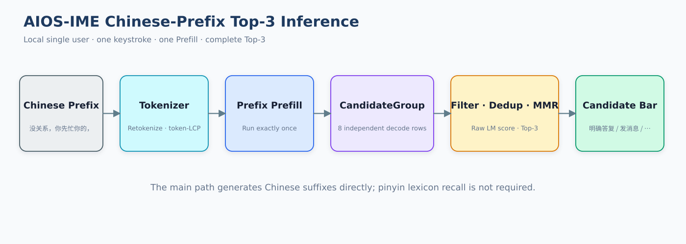
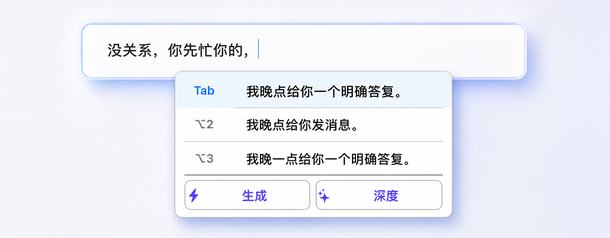
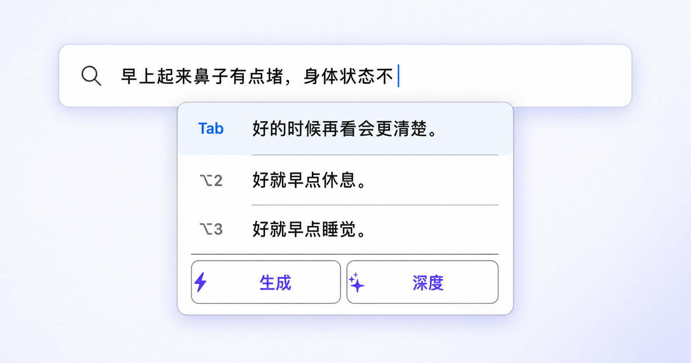
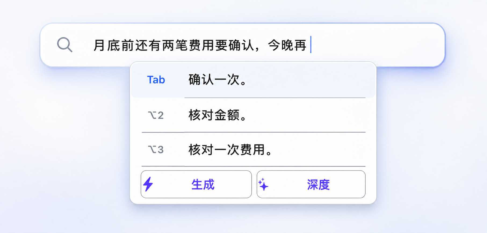
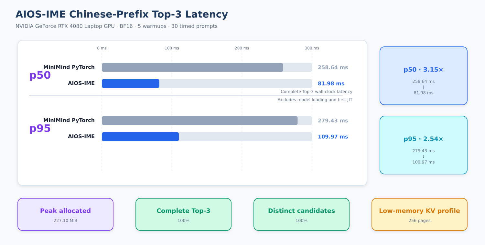
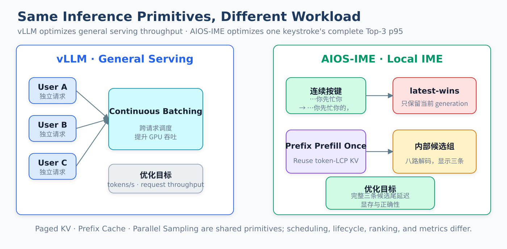
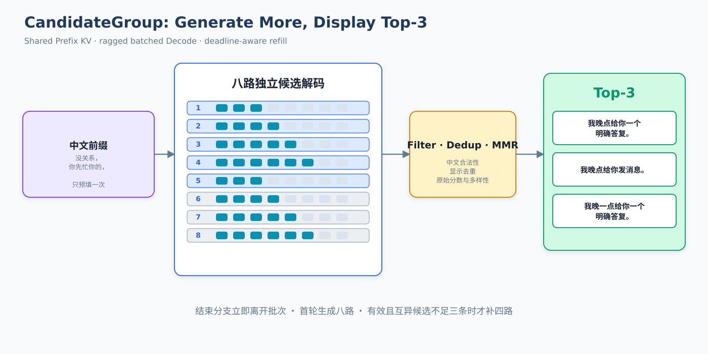
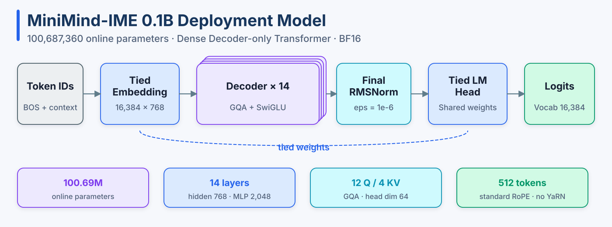
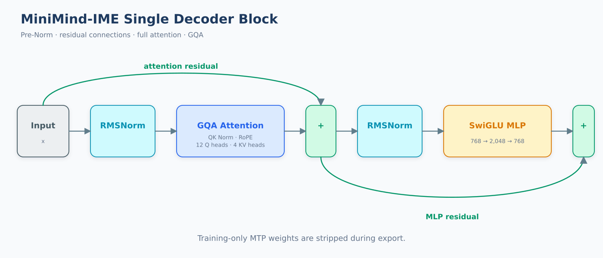
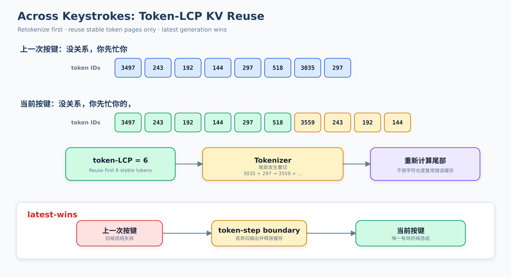

# AIOS-IME：面向中文输入法的低延迟 LLM 推理引擎

AIOS-IME 是面向本地单用户中文输入法的 CUDA LLM 推理系统。它加载 MiniMind-IME 0.1B
模型，在一次按键请求内并行生成多路候选，经过过滤、去重和排序后返回 Top-3。

项目主路径是中文前缀补全，重点优化短前缀、短输出、单用户和低显存场景，支持共享
Prefix KV、候选组批量 Decode、跨按键 Prefix 复用、latest-wins 取消以及 Top-3 多样性选择。
同拼音候选的语境重排序作为可选扩展，不是模型直接读取拼音生成中文。

## 项目来源

本仓库基于 [wyann22/aios](https://github.com/wyann22/aios) 继续开发。上游项目以课程形式
从零实现 Qwen3 推理引擎，涵盖权重加载、Prefill/Decode、KV Cache、Paged Cache、批处理、
Continuous Batching、融合层、CUDA Graph、采样和 Prefix Caching。

本仓库在其推理引擎基础上新增 MiniMind-IME 模型适配、单前缀 CandidateGroup、组内共享
Prefix KV、跨按键 token-LCP 复用、latest-wins 取消、中文候选后处理以及输入法专项评测。
原始代码的版权与授权以 [上游仓库](https://github.com/wyann22/aios) 及各文件声明为准。



## 中文前缀 Top-3 补全

主路径直接接收用户已经输入的中文前缀，在一个按键请求内生成并返回三条可选后缀：

```text
输入前缀：没关系，你先忙你的，

Top 1：我晚点给你一个明确答复。
Top 2：我晚点给你发消息。
Top 3：我晚一点给你一个明确答复。
```

<p><strong>日常沟通</strong></p>


<p><strong>健康提醒</strong></p>


<p><strong>工作安排</strong></p>


三张演示图沿用真实输入法界面。底部“生成 / 深度”是原有的在线功能入口，这里只替换
上方中文补全候选。候选内容使用当前部署模型、`seed=7` 和默认 8 路配置实际推理得到。
一次 Prefix Prefill 后，多路后缀共享 Prefix KV；最终结果经过中文过滤、显示去重、原始
logprob 排序和字符 bigram MMR 选择。

### 多场景补全示例

以下结果均由当前部署模型和默认推理配置实际生成。除购物示例使用 `seed=13` 外，其余
示例均使用 `seed=7`。

#### 通勤与日常沟通

```text
输入前缀：公交还有两站才到，我先沿着导航慢慢走，等我走近

Top 1：再给你发消息。
Top 2：再联系。
Top 3：一点再给你发消息。
```

```text
输入前缀：我刚从公司楼里出来，我改走地铁会更稳妥

Top 1：一点，下班后直接过去。
Top 2：，你不用一直等我。
Top 3：，下班路上顺便买杯咖啡。
```

#### 健康与运动

```text
输入前缀：最近跑步时总是开始得太快，前十分钟容易把自己累到，前面刻意把速度放慢，后面会更

Top 1：容易坚持。
Top 2：自然。
Top 3：好。
```

```text
输入前缀：我把瑜伽垫重新铺出来了，先把肩膀和后背放松一下，动作

Top 1：轻一点再放慢一点。
Top 2：轻一点也更容易坚持。
Top 3：轻一点不要硬撑。
```

```text
输入前缀：早上起来鼻子有点堵，把不着急的事情放到明天，身体状态不

Top 1：好的时候再看会更清楚。
Top 2：好就早点休息。
Top 3：好就早点睡觉。
```

#### 工作与生活安排

```text
输入前缀：月底前还有两笔费用要确认，金额不大但最好及时处理，今晚再

Top 1：确认一次。
Top 2：核对金额。
Top 3：核对一次费用。
```

```text
输入前缀：这几天晚上总忍不住看手机，屏幕看久了脑子更清醒，我把明天要带的东西先准备好，出门时

Top 1：直接放进包里。
Top 2：直接拿，不用临时找东西。
Top 3：不用再找东西。
```

```text
输入前缀：这次买东西前最好看一下预算，先放两天再决定，真正需要

Top 1：时再下单。
Top 2：的东西先放两天。
Top 3：的那件先放进购物车。
```

#### 回忆与内容整理

```text
输入前缀：刚才我翻到我们以前一起拍的照片，有几张现在看还是挺有意思

Top 1：，下次见面的时候一起看看。
Top 2：，下次见面一起看看。
Top 3：，下次见面时一起看看。
```

```text
输入前缀：刚才我整理完去年拍的旅行照片，很多画面现在看还是很有意思，按时间和地点分成几个文件夹，之后找

Top 1：起来会方便很多。
Top 2：回来会更容易找到。
Top 3：回来会方便很多。
```

## 性能



测试环境：NVIDIA GeForce RTX 4080 Laptop GPU、BF16、5 次预热、30 条完整 Top-3
计时样本。

| Runtime | Top-3 p50 | Top-3 p95 | Peak allocated | 满三条 | 三条互异 |
|---|---:|---:|---:|---:|---:|
| MiniMind PyTorch | 258.64 ms | 279.43 ms | 216.44 MiB | — | — |
| AIOS-IME | **81.98 ms** | **109.97 ms** | **227.10 MiB** | 100% | 100% |

AIOS-IME 的 p50 为原 PyTorch 路径的 3.15 倍，p95 为 2.54 倍。计时范围包括 Prefix
Prefill、候选组 Decode、原始 logprob、解码、过滤、去重和 Top-3 排序，不包括模型加载
和首次 JIT 编译。

低显存配置使用 256 个 KV token page 和 1 MiB FlashInfer workspace。需要更长上下文时，
可以提高 `kv_cache_max_tokens` 和 workspace 大小。

详细结果：

- [最终性能报告](reports/aios_ime_benchmark_final_20260814.md)
- [冻结评测](reports/aios_ime_frozen_eval_v2_20260814.md)
- [采样与导出优化 A/B](reports/aios_ime_runtime_hardening_20260815.md)
- [Prefix KV 复用测试](reports/aios_ime_prefix_reuse_long_20260814.md)

## 输入法推理的特殊性

输入法不是缩短版聊天服务。一次按键只服务本地当前用户，输出不是一段长回答，而是必须
同时可见、互不重复且能立即选择的三条短候选。因此优化目标是单次按键的完整 Top-3
尾延迟，而不是跨用户吞吐。

| 输入法约束 | 推理设计 |
|---|---|
| 本地单用户，没有用户 B 等待合批 | 只批处理当前前缀内部的候选分支，不把跨请求 Continuous Batching 计入收益 |
| 候选栏必须稳定显示三条 | 首轮独立生成 8 路；过滤后不足三条时再补 4 路 |
| 用户继续输入后旧结果立即失效 | latest-wins generation ID；当前 token step 后丢弃旧组并释放 suffix KV |
| 相邻按键共享大部分前缀 | 重新分词后计算 token-LCP，只复用稳定 token 的 Prefix KV |
| 多条候选拥有同一个中文前缀 | Prefix 只 Prefill 一次；候选 row 共享物理 Paged KV page |
| 候选长度短且结束时间不同 | Ragged batched Decode；EOS/句末结束的 row 立即移出 active rows |

主路径只处理中文前缀的开放生成。若上游输入法已经通过拼音词典召回一组中文词，运行时
还可以复用同一个模型对候选执行条件概率重排序；该接口不参与上述中文前缀 Top-3 延迟。

## 面向输入法场景的推理设计

vLLM 面向通用大模型服务，通过跨请求调度、PagedAttention、Prefix Caching 和并行采样
提高服务器吞吐与 GPU 利用率。本项目聚焦本地单用户候选栏，将优化目标收敛到一次按键的
完整 Top-3 尾延迟、候选完整率、跨按键缓存复用和峰值显存。



| 维度 | vLLM 通用服务 | AIOS-IME 输入法路径 |
|---|---|---|
| 优化目标 | 多请求吞吐、GPU 利用率和通用请求延迟 | 一次按键的完整 Top-3 p50/p95、候选完整率和峰值显存 |
| 调度对象 | 多个独立请求/sequence | 当前按键内部的一个 CandidateGroup；不存在等待合批的用户 B |
| 请求生命周期 | 通用请求排队、运行、结束或 abort | latest-wins；新按键使旧 generation 失效，token-step 结束后丢弃旧输出并释放 suffix KV |
| 多候选生成 | `n` 路并行采样属于通用请求参数 | 首轮独立生成 8 路；过滤后不足三条且仍在 deadline 内才补 4 路 |
| Prefix 复用 | APC 对可复用的完整 token block 做哈希缓存 | 每次按键重新分词，计算相邻输入的精确 token-LCP，只保留稳定 token page |
| 候选 KV | 通用 PagedAttention 管理 sequence block | 同组候选借用同一组物理 Prefix page；后缀页独占，结束 row 立即压缩并释放 |
| 采样与评分 | 通用 Temperature、Top-k、Top-p 和输出序列 | 采样前保留原始模型 logprob，随后执行中文过滤、显示去重、软惩罚和 MMR Top-3 |
| 输出契约 | 通用文本生成、流式输出或批量结果 | 固定 `[BOS] + 裸中文前缀`，输出三条可直接进入候选栏的短后缀 |
| 显存策略 | 面向不同模型和并发规模配置 cache | 0.1B 本地模型使用 256 个 token page 和 1 MiB workspace 的低显存 profile |
| 评测 | 通用吞吐、token latency 和服务指标 | 完整 Top-3 墙钟延迟、满三条率、互异率、冻结排序质量和取消后的 KV 回收 |

这些目标落实为 CandidateGroup 组内调度、latest-wins 生命周期、精确 token-LCP 缓存复用、
共享 Prefix page、中文候选后处理和完整 Top-3 评测基准。

## 推理设计

- 裸中文上下文输入，固定使用 `[BOS] + context tokens`，不套 Chat Template。
- 适配 MiniMind-IME 0.1B dense GQA 权重、BF16 推理和 FlashInfer Attention。
- 同一前缀只执行一次 Prefill，8 条候选共享 Prefix Paged KV。
- 候选随机流由 `(candidate_seed, token_step)` 唯一确定，row 压缩不改变其余分支结果。
- `min_new_tokens` 前在采样副本屏蔽 EOS/stop token，排序仍使用原始模型 logprob。
- 统一执行中文合法性过滤、显示归一化去重、软惩罚和字符 bigram MMR Top-3。
- 低显存配置限制 KV token page 和 FlashInfer workspace，不按剩余显存无限预分配。
- 导出器校验模型结构、权重形状、tied embedding 和 MTP 剥离，拒绝静默错误加载。

## 关键取舍

| 方案 | Top-3 p50 / p95 | 满三条 | 结论 |
|---|---:|---:|---|
| 固定 8 路、12-token | 87.72 / 140.90 ms | 93.33% | 两组不足三条 |
| 8 路 + 按需补 4 路、12-token | **81.98 / 109.97 ms** | **100%** | 当前默认 |
| 8 路 + 按需补 4 路、16-token | 115.55 / 225.71 ms | 86.67% | 长病句和截断增加，弃用 |

- **不直接只生成 3 路**：任意一路被过滤后，候选栏就少于三条；8 路首轮在质量、完整率和
  显存之间更稳定。
- **不为补候选无条件生成 12 路**：大多数请求 8 路已经足够，只有不足三条时才承担 refill
  成本。
- **不把 Continuous Batching 当作单用户收益**：当前产品只有一个有效候选组，核心并行性
  来自同一前缀的候选分支。
- **不盲目延长 Decode**：16-token A/B 同时恶化 p50、p95 和候选完整率，默认保持 12-token
  上限。
- **Prefix KV 复用按 token 而非字符判断**：Tokenizer 可能重切尾部；字符前缀相同不代表
  token IDs 可安全复用。

## 推理流程

输入经过裸中文分词与 token-LCP 匹配后只执行一次 Prefix Prefill。8 条候选共享
Prefix Paged KV，只为各自生成的后缀分配新页；完成分支会立即移出 active rows。解码结果
依次经过合法性过滤、显示归一化、去重和 MMR 排序，有效候选不足三条时再补采样 4 路。



## 部署模型

| 项目 | 值 |
|---|---:|
| 在线参数 | 100,687,360 |
| Decoder layers | 14 |
| Hidden / Intermediate | 768 / 2,048 |
| Q heads / KV heads | 12 / 4 |
| Head dim | 64 |
| Vocabulary | 16,384 |
| Context limit | 512 tokens |
| Precision | BF16 |
| 权重大小 | 192.05 MiB |
| KV 大小 | 14 KiB/token |

模型使用 GQA、RMSNorm、QK Norm、普通 RoPE 和 SwiGLU，不启用 YaRN。LM Head 与 Token
Embedding 共享权重，训练期 MTP 模块不进入部署模型。模型训练、数据清洗、Tokenizer、
Teacher 数据和偏好优化由独立的 MiniMind-IME 训练仓库维护；本仓库负责 checkpoint 校验、
部署导出和推理评测。





## 评测结果

冻结评测分为三类：

| Lane | 样本数 | 指标 |
|---|---:|---:|
| 中文前缀开放生成（主路径） | 15 | 满三条 100% |
| 中文候选集语境重排序（辅助回归） | 145 | Acceptable Top-1 76.55%，Pairwise 71.31% |
| 同拼音候选语境重排序（可选扩展） | 40 | Acceptable Top-1 87.50%，Pairwise 94.35% |

### 可选扩展：同拼音候选语境重排序

<details>
<summary>查看三组同拼音候选的语境排序结果</summary>

```text
示例 1 · 工作会议
中文上下文：项目经理通知大家，下午有个
用户拼音：huiyi
词典召回：会议 / 会意 / 悔意 / 回忆
模型排序：会议 > 会意 > 悔意 > 回忆
最终结果：项目经理通知大家，下午有个会议

示例 2 · 旧照片
中文上下文：整理旧照片时，很多童年
用户拼音：huiyi
词典召回：会议 / 会意 / 悔意 / 回忆
模型排序：回忆 > 悔意 > 会议 > 会意
最终结果：整理旧照片时，很多童年回忆

示例 3 · 情绪表达
中文上下文：想到刚才说的话，我心里满是
用户拼音：huiyi
词典召回：会议 / 会意 / 悔意 / 回忆
模型排序：悔意 > 会意 > 回忆 > 会议
最终结果：想到刚才说的话，我心里满是悔意
```

拼音字符串不直接输入语言模型。上游词典负责召回中文候选，AIOS-IME 使用中文上下文对
候选进行条件概率排序。以上三组均来自同一冻结评测集，使用同一组 `huiyi` 候选，模型
仅根据不同中文上下文改变排序。

</details>

## 安装

当前实现需要 CUDA、PyTorch、Transformers 和 FlashInfer。仓库提供了 WSL 环境初始化
脚本：

```bash
git clone https://github.com/7155/aios.git
cd aios
git switch feat/aios-ime

source scripts/activate_aios.sh
python -m pip install --no-deps -e .
```

## 导出 MiniMind-IME 模型

```bash
python scripts/export_minimind_ime.py \
  --checkpoint /path/to/best_validation.pt \
  --config /path/to/ime_100m_v1.json \
  --tokenizer-dir /path/to/tokenizer_dir \
  --output-dir /path/to/minimind-ime-0.1b-aios
```

导出器会执行以下检查：

- Dense/MoE 和 YaRN 配置。
- Decoder layer 编号与必要权重是否完整。
- Q/K/V、QK Norm、MLP 和 RMSNorm 权重。
- Attention heads、KV heads 和 head dim 是否与权重形状一致。
- SiLU/SwiGLU 激活函数支持。
- Tied/untied LM Head 与 Embedding 是否一致。
- MTP 训练辅助权重是否被移除。

默认导出 BF16 权重。输出目录非空时需要显式添加 `--force`。

部署目录包含：

```text
model.safetensors
config.json
tokenizer.json
tokenizer_config.json
aios_manifest.json
```

## 运行 Top-3

命令行：

```bash
python scripts/run_aios_ime.py \
  --model /path/to/minimind-ime-0.1b-aios \
  --seed 7 \
  --prefix '没关系，你先忙你的，'
```

Python API：

```python
from aios import ImeCompletionEngine, ImeGenerationConfig, LLM

llm = LLM(
    "/path/to/minimind-ime-0.1b-aios",
    kv_cache_max_tokens=256,
    attention_workspace_size=1 * 2**20,
)
engine = ImeCompletionEngine(llm)

result = engine.complete(
    "没关系，你先忙你的，",
    ImeGenerationConfig(seed=7),
)
for candidate in result.candidates:
    print(candidate.text, candidate.average_logprob)
```

可选的中文候选集语境重排序：

```python
result = engine.score_candidates(
    "项目经理通知大家，下午有个",
    ["会议", "会意", "悔意", "回忆"],
    mode="stable",
)
print([candidate.text for candidate in result.candidates])
```

`mode="stable"` 使用整序列 varlen Prefill 复评分，减少 BF16 Prefill/Decode kernel 在
近平局候选上的排序波动。这里传给模型的是词典召回后的中文候选，不是拼音字符串。

## 候选生成与排序

默认生成参数：

| 参数 | 首轮 | 补采样 |
|---|---:|---:|
| 候选数 | 8 | 4 |
| Temperature | 0.35 | 0.55 |
| Top-k | 50 | 80 |
| Top-p | 0.9 | 0.9 |
| 最大输出 | 12 tokens | 12 tokens |

采样参数用于扩大候选覆盖，排序使用未经过 temperature、Top-k、Top-p 和 stop mask 修改的
原始模型 logprob：

```text
average_logprob(c) = (1 / |c|) × Σ log P(c_t | prefix, c_<t)
base_score(c)       = average_logprob(c) - soft_penalty(c)
MMR(c)              = base_score(c) - λ × max similarity(c, selected)
```

候选处理顺序：

1. 过滤空串、助手模板、重复 n-gram、未完成虚词、边界重复和过长候选。
2. 归一化空白和尾标点，合并显示等价候选。
3. 对不自然叠词和过短候选应用软惩罚。
4. 使用字符 bigram Jaccard 相似度执行 MMR Top-3。
5. 有效候选不足三条时执行一次补采样。

## Prefix KV 与候选 KV

MiniMind-IME 0.1B 每个 token 的 KV 大小为：

```text
2(K/V) × 14 layers × 4 KV heads × 64 head_dim × 2 bytes = 14 KiB
```

同一候选组的所有 page-table row 指向同一组 Prefix page，只有生成后的 suffix page 独占。
候选组完成后立即释放 suffix page，持久 Prefix page 用于下一次按键的 token-LCP 复用。



跨按键实测：

| 输入序列 | 完整 Prefill | 增量 Prefill | 累计加速 |
|---|---:|---:|---:|
| 22 字日常短输入 | 7.69 ms/键 | 7.71 ms/键 | 1.00x |
| 95 字长上下文 | 7.96 ms/键 | 7.53 ms/键 | 1.056x |

## 测试

CPU 与 GPU 测试：

```bash
AIOS_IME_MODEL=/path/to/minimind-ime-0.1b-aios \
  pytest -q tests/test_ime.py tests/test_ime_export.py tests/test_ime_gpu.py
```

当前测试结果：`19 passed`。

性能测试：

```bash
python benchmark/bench_ime.py \
  --model /path/to/minimind-ime-0.1b-aios
```

冻结评测：

```bash
python scripts/eval_aios_ime_frozen.py \
  --model /path/to/minimind-ime-0.1b-aios \
  --eval-dir /path/to/ime_eval_v2_frozen
```

重建 README 技术图：

```bash
python scripts/render_aios_ime_figures.py
```

逐条评测 JSON 可能包含真实输入，默认由 `.gitignore` 排除。公开仓库只保留聚合报告。

## 项目结构

```text
python/aios/
├── ime.py                   # CandidateGroup、Top-3、Prefix KV、取消与稳定评分
├── engine/sample.py         # Top-k/Top-p、原始 logprob、候选独立随机流
├── models/minimind_ime.py   # MiniMind-IME 模型适配器
├── attention/flashinfer.py  # varlen Prefill 与 Paged Decode
├── scheduler/               # 通用 AIOS 调度器
├── kvcache/                 # KV Cache 存储与分配
└── layers/                  # Linear、RMSNorm、RoPE、Embedding

scripts/
├── export_minimind_ime.py   # 部署模型导出
├── run_aios_ime.py          # Top-3 推理入口
├── eval_aios_ime_frozen.py  # 冻结评测
└── render_aios_ime_figures.py # 可重复生成 README 技术图

benchmark/
├── bench_ime.py
└── bench_ime_prefix_reuse.py

tests/
├── test_ime.py
├── test_ime_export.py
└── test_ime_gpu.py

docs/images/
├── aios-ime-runtime-architecture.svg
├── aios-ime-candidate-group.svg
├── aios-ime-prefix-kv.svg
├── aios-ime-vllm-comparison.svg
├── aios-ime-performance.svg
├── chinese-prefix-demo-chat-clean.png
├── chinese-prefix-demo-health-clean.png
├── chinese-prefix-demo-work-clean.png
├── minimind-ime-model-architecture.svg
└── minimind-ime-decoder-block.svg
```

## 平台支持

- 运行时仅支持 CUDA。
- 同拼音候选重排序是可选扩展；项目不包含拼音词典，拼音到中文候选的召回由上游负责。
- 当前 `Context` 为进程级单实例。
- CacheManager 尚未实现 KV eviction。
- CUDA Graph、量化、Tensor Parallel 和 Speculative Decoding尚未接入当前 IME 路径。

## 相关项目

- [MiniMind](https://github.com/jingyaogong/minimind)
- [ChatLM-mini-Chinese](https://github.com/charent/ChatLM-mini-Chinese)
