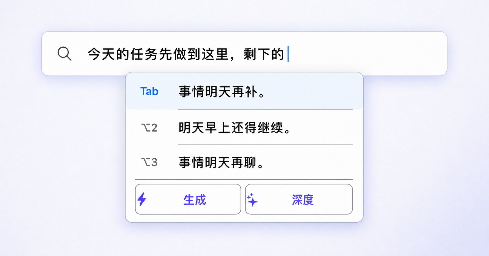
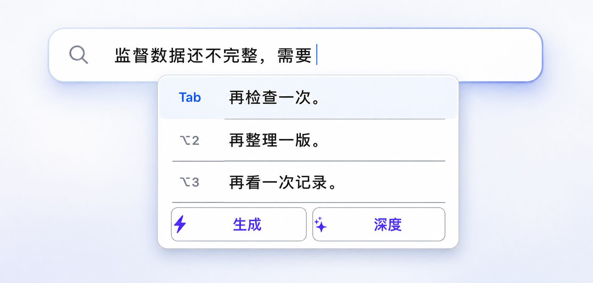

# AIOS-IME：面向中文输入法的低延迟 LLM 推理引擎

AIOS-IME 是面向本地单用户中文输入法的 CUDA LLM 推理系统。它支持 MiniMind-IME 0.06B、
0.1B 标准残差模型与 0.214B Block AttnRes 模型，在一次按键请求内并行生成多路候选，
经过过滤、去重和排序后返回 Top-3。

项目主路径是中文前缀补全，重点优化短前缀、短输出、单用户和低显存场景，支持共享
Prefix KV、候选组批量 Decode、跨按键 Prefix 复用、latest-wins 取消、AttnRes Triton 融合
以及无效候选自适应补采样。
同拼音候选的语境重排序作为可选扩展，不是模型直接读取拼音生成中文。

## 项目来源

本仓库基于 [wyann22/aios](https://github.com/wyann22/aios) 继续开发。上游项目以课程形式
从零实现 Qwen3 推理引擎，涵盖权重加载、Prefill/Decode、KV Cache、Paged Cache、批处理、
Continuous Batching、融合层、CUDA Graph、采样和 Prefix Caching。

本仓库在其推理引擎基础上新增 MiniMind-IME 模型适配、单前缀 CandidateGroup、组内共享
Prefix KV、跨按键 token-LCP 复用、latest-wins 取消、中文候选后处理以及输入法专项评测。
原始代码的版权与授权以 [上游仓库](https://github.com/wyann22/aios) 及各文件声明为准。


## 中文前缀 Top-3 补全

主路径直接接收用户已经输入的中文前缀，在一个按键请求内生成并返回三条可选后缀：

```text
输入前缀：没关系，你先忙你的，

Top 1：我晚点给你一个明确答复。
Top 2：我晚点给你发消息。
Top 3：我晚一点给你一个明确答复。
```

<p><strong>日常沟通</strong></p>


<p><strong>阶段收尾</strong></p>


<p><strong>数据质检</strong></p>


三张演示图沿用真实输入法界面。底部“生成 / 深度”是原有的在线功能入口，这里只替换
上方中文补全候选。日常沟通和阶段收尾使用 `seed=7`，数据质检使用 `seed=42`；其余参数
均为默认 8 路配置。一次 Prefix Prefill 后，多路后缀共享 Prefix KV；最终结果经过中文
过滤、显示去重、原始 logprob 排序和字符 bigram MMR 选择。

### 推理效果示例

以下 Top-3 均由当前部署的 MiniMind-IME 0.1B 和默认推理配置实际生成，候选文字保持原样。
固定配置与逐条结果见[推理记录](reports/aios_ime_readme_examples_20260815.md)。

#### 阶段收尾（`seed=7`）

```text
输入前缀：今天的任务先做到这里，剩下的

Top 1：事情明天再补。
Top 2：明天早上还得继续。
Top 3：事情明天再聊。
```

#### 数据质检（`seed=42`）

```text
输入前缀：监督数据还不完整，需要

Top 1：再检查一次。
Top 2：再整理一版。
Top 3：再看一次记录。
```

#### 去重检查（`seed=1`）

```text
输入前缀：先把重复数据删掉，再

Top 1：重新对照原始记录做一次检查。
Top 2：把结果保存下来。
Top 3：补一句简单说明。
```

#### 问题跟踪（`seed=20260814`）

```text
输入前缀：这个问题我先记录下来，

Top 1：明天再看一眼有没有变化。
Top 2：明天再看一眼是否稳定。
Top 3：明天再看一次。
```

#### 工作沟通（`seed=1`）

```text
输入前缀：没关系，你先忙你的，

Top 1：我晚一点给你一个明确答复。
Top 2：我明天再给你发消息。
Top 3：我回去以后再认真回复你。
```

#### 朋友回忆（`seed=1`）

```text
输入前缀：刚才我翻到我们以前一起拍的照片，有几张现在看还是挺有意思

Top 1：，下次见面的时候一起看看。
Top 2：，下次见面一起看看。
Top 3：，下次见面时一起看看。
```

## 性能

### 五模型 BF16 短前缀统一对比

短前缀最接近真实按键场景，也最容易暴露“中文续写”和“通用问答”的任务差异。以下模型
使用同一块 RTX 4080 Laptop GPU、同一批 40 条冻结 `short_prefix`、`[BOS] + 裸中文前缀`、
同一 seed 和同一 CandidateGroup 合同。默认先生成 8 路，不足三条时最多补到 24 路：

| 模型 | 参数量 | 架构 | 完整 Top-3 p50 / p95 | 满三条且互异 | 明确契约违规 | 平均路数 | 峰值 allocated |
|---|---:|---|---:|---:|---:|---:|---:|
| **MiniMind-IME 0.06B** | **63.91M** | 8L · Standard | **47.62 / 61.16 ms** | 100% | 0/120 | 8.00 | **177.47 MiB** |
| **MiniMind-IME 0.1B 极速版** | **100.69M** | 14L · Standard | **86.34 / 99.06 ms** | **100%** | **0/120** | **8.00** | **238.60 MiB** |
| MiniMind-IME 0.214B | 214.06M | 32L · Block AttnRes | 269.80 / 539.95 ms | 100% | 0/120 | 9.10 | 468.19 MiB |
| Qwen3-0.6B | 596.05M | 28L · Standard | 171.74 / 331.36 ms | 100% | 85/120 | 9.30 | 1,284.00 MiB |
| Qwen3-4B | 4.02B | 36L · Standard | 308.07 / 313.11 ms | 100% | 14/120 | 8.00 | 7,889.50 MiB |

0.1B 极速版相对 Qwen3-0.6B，完整 Top-3 p50 快 `1.99×`、p95 快 `3.34×`，峰值
allocated 低 `81.42%`；相对 Qwen3-4B，p50/p95 快 `3.57×/3.16×`，峰值 allocated
低 `96.98%`。0.06B 进一步把 p50 压到 `47.62 ms`，但实际句子自然度明显弱于 0.1B，
因此它是极致资源档，不是默认质量档。0.214B 用于验证更深的 Block AttnRes 架构；它的
32 层和补采样让延迟高于 0.1B，不能包装成速度升级。

“明确契约违规”只统计冻结禁词、Question/Answer/摘要等元文本或指令、重度拉丁字符、
韩文或日文脚本。`0/120` 只表示没有命中这些确定性错误，不表示 120 条候选都通过了人工
自然度判断。固定只生成 8 路时，五个模型满三条且互异的前缀比例依次为
`95% / 100% / 85% / 85% / 100%`；自适应补采样可以补齐数量，不能修复语义或任务合同。

同一批次、同一前缀中的实际候选（每个模型各取一条，不改写）：

```text
前缀：那我
MiniMind-IME 0.06B： 那我先把手头的事做一下
MiniMind-IME 0.1B：  那我把垃圾袋放到一边，等你回来
MiniMind-IME 0.214B：那我去找你了。
Qwen3-0.6B：          那我之前在做实验的时候，发现了一个有趣的现象……
Qwen3-4B：            那我是不是应该先学习一些基础的编程语言，比如 Python……
```

这组结果比较的是**裸中文短前缀输入法补全**，不代表通用问答能力排名。输入法若套聊天
模板，会把“续写当前句子”改成“回答用户”，不再是同一个任务。完整五模型表、固定 8 路
与自适应 24 路结果、六组同前缀输出和复现脚本见
[五模型短前缀统一对比报告](reports/aios_ime_short_prefix_matrix_20260821.md)。历史双模型基准仍
保留在[0.1B vs Qwen3-0.6B 报告](reports/aios_ime_short_prefix_compare_20260821.md)。

### 0.214B Block AttnRes

最新部署模型包含 32 个 Transformer layers、8 个 AttnRes blocks。每层在 Attention 和 MLP
前各执行一次 depth mix，最终输出前再执行一次，共 65 次 Mixer。AIOS 使用两段 Triton
kernel 完成 RMS score 与 depth-softmax/value aggregation，不生成完整 normalized bank，也
不在每层物化 `cat(bank, partial)`。

固定 `N=8, D=768, 65 mixers` 的 CUDA profiler：

| AttnRes backend | Pipeline | Active tokens/s | Peak allocated |
|---|---:|---:|---:|
| Direct Eager（训练语义） | 17.34 ms | 461.47 | 9.48 MiB |
| `torch.compile` hot path | 15.87 ms | 504.12 | 9.27 MiB |
| Triton two-kernel | **4.02 ms** | **1,989.46** | **0.94 MiB** |

在完整固定 8 路 CandidateGroup 上，Triton 相对物化-bank Reference 将 p50/p95 从
`389.47/422.43 ms` 降到 `254.99/261.44 ms`，active tokens/s 从 `237.35` 提高到
`366.70`。相同 seed 下 Top-1/3/10/50 token 集合和 8 路候选文本全部一致。

无效候选恢复使用“首轮 8 路 + 按过滤后 unique-valid yield 自适应补到最多 24 路”。在
30 条 DS Daily validation 上：

| 候选策略 | 满三条 | 三条互异 | 平均路数 | Top-3 exact | p50 / p95 |
|---|---:|---:|---:|---:|---:|
| 固定 8 路 | 23.33% | 23.33% | 8.0 | 30.00% | 251.70 / 285.78 ms |
| 自适应最多 24 路 | **100%** | **100%** | 13.6 | **33.33%** | 505.54 / 557.24 ms |

补采样只在首轮过滤、去重后不足三条时触发；每轮旧 suffix KV 先释放，因此峰值 allocated
保持在约 468 MiB。完整实现、数值合同、CUDA profiler 和复现命令见
[0.214B AttnRes 与补采样报告](reports/aios_ime_attnres_refill_20260821.md)。

### 0.1B 标准残差基线


测试环境：NVIDIA GeForce RTX 4080 Laptop GPU、BF16、5 次预热、30 条完整 Top-3
计时样本。

| Runtime | Top-3 p50 | Top-3 p95 | Peak allocated | 满三条 | 三条互异 |
|---|---:|---:|---:|---:|---:|
| MiniMind PyTorch | 258.64 ms | 279.43 ms | 216.44 MiB | — | — |
| AIOS-IME | **81.98 ms** | **109.97 ms** | **227.10 MiB** | 100% | 100% |

AIOS-IME 的 p50 为原 PyTorch 路径的 3.15 倍，p95 为 2.54 倍。计时范围包括 Prefix
Prefill、候选组 Decode、原始 logprob、解码、过滤、去重和 Top-3 排序，不包括模型加载
和首次 JIT 编译。

低显存配置使用 256 个 KV token page 和 1 MiB FlashInfer workspace。需要更长上下文时，
可以提高 `kv_cache_max_tokens` 和 workspace 大小。

详细结果：

- [0.214B AttnRes 与自适应补采样](reports/aios_ime_attnres_refill_20260821.md)
- [最终性能报告](reports/aios_ime_benchmark_final_20260814.md)
- [冻结评测](reports/aios_ime_frozen_eval_v2_20260814.md)
- [采样与导出优化 A/B](reports/aios_ime_runtime_hardening_20260815.md)
- [Prefix KV 复用测试](reports/aios_ime_prefix_reuse_long_20260814.md)

## 输入法推理的特殊性

输入法不是缩短版聊天服务。一次按键只服务本地当前用户，输出不是一段长回答，而是必须
同时可见、互不重复且能立即选择的三条短候选。因此优化目标是单次按键的完整 Top-3
尾延迟，而不是跨用户吞吐。

| 输入法约束 | 推理设计 |
|---|---|
| 本地单用户，没有用户 B 等待合批 | 只批处理当前前缀内部的候选分支，不把跨请求 Continuous Batching 计入收益 |
| 候选栏必须稳定显示三条 | 首轮独立生成 8 路；按 unique-valid yield 分轮补采样，总预算最多 24 路 |
| 用户继续输入后旧结果立即失效 | latest-wins generation ID；当前 token step 后丢弃旧组并释放 suffix KV |
| 相邻按键共享大部分前缀 | 重新分词后计算 token-LCP，只复用稳定 token 的 Prefix KV |
| 多条候选拥有同一个中文前缀 | Prefix 只 Prefill 一次；候选 row 共享物理 Paged KV page |
| 候选长度短且结束时间不同 | Ragged batched Decode；EOS/句末结束的 row 立即移出 active rows |

主路径只处理中文前缀的开放生成。若上游输入法已经通过拼音词典召回一组中文词，运行时
还可以复用同一个模型对候选执行条件概率重排序；该接口不参与上述中文前缀 Top-3 延迟。

## 面向输入法场景的推理设计

vLLM 面向通用大模型服务，通过跨请求调度、PagedAttention、Prefix Caching 和并行采样
提高服务器吞吐与 GPU 利用率。本项目聚焦本地单用户候选栏，将优化目标收敛到一次按键的
完整 Top-3 尾延迟、候选完整率、跨按键缓存复用和峰值显存。


| 维度 | vLLM 通用服务 | AIOS-IME 输入法路径 |
|---|---|---|
| 优化目标 | 多请求吞吐、GPU 利用率和通用请求延迟 | 一次按键的完整 Top-3 p50/p95、候选完整率和峰值显存 |
| 调度对象 | 多个独立请求/sequence | 当前按键内部的一个 CandidateGroup；不存在等待合批的用户 B |
| 请求生命周期 | 通用请求排队、运行、结束或 abort | latest-wins；新按键使旧 generation 失效，token-step 结束后丢弃旧输出并释放 suffix KV |
| 多候选生成 | `n` 路并行采样属于通用请求参数 | 首轮独立生成 8 路；过滤后按缺口与有效产出规划 2～8 路 refill |
| Prefix 复用 | APC 对可复用的完整 token block 做哈希缓存 | 每次按键重新分词，计算相邻输入的精确 token-LCP，只保留稳定 token page |
| 候选 KV | 通用 PagedAttention 管理 sequence block | 同组候选借用同一组物理 Prefix page；后缀页独占，结束 row 立即压缩并释放 |
| 采样与评分 | 通用 Temperature、Top-k、Top-p 和输出序列 | 采样前保留原始模型 logprob，随后执行中文过滤、显示去重、软惩罚和 MMR Top-3 |
| 输出契约 | 通用文本生成、流式输出或批量结果 | 固定 `[BOS] + 裸中文前缀`，输出三条可直接进入候选栏的短后缀 |
| 显存策略 | 面向不同模型和并发规模配置 cache | 候选轮次串行复用 suffix KV；0.1B/0.214B 均使用显式有界 KV 与 workspace |
| 评测 | 通用吞吐、token latency 和服务指标 | 完整 Top-3 墙钟延迟、满三条率、互异率、冻结排序质量和取消后的 KV 回收 |

这些目标落实为 CandidateGroup 组内调度、latest-wins 生命周期、精确 token-LCP 缓存复用、
共享 Prefix page、中文候选后处理和完整 Top-3 评测基准。

## 推理设计

- 裸中文上下文输入，固定使用 `[BOS] + context tokens`，不套 Chat Template。
- 适配 MiniMind-IME 0.1B standard residual 与 0.214B Block AttnRes 权重、BF16 和 FlashInfer Attention。
- Block AttnRes 使用共享 Triton hot path；训练期迁移 alpha 不进入部署，运行时只接受 `alpha=1`。
- 同一前缀只执行一次 Prefill，8 条候选共享 Prefix Paged KV。
- 候选随机流由 `(candidate_seed, token_step)` 唯一确定，row 压缩不改变其余分支结果。
- `min_new_tokens` 前在采样副本屏蔽 EOS/stop token，排序仍使用原始模型 logprob。
- 统一执行中文合法性过滤、显示归一化去重、软惩罚和字符 bigram MMR Top-3。
- 首轮不足三条时按有效候选率规划 refill，并用新 seed、渐进温度与精确序列禁采避免重复失败。
- 低显存配置限制 KV token page 和 FlashInfer workspace，不按剩余显存无限预分配。
- 导出器校验模型结构、权重形状、tied embedding 和 MTP 剥离，拒绝静默错误加载。

## 关键取舍

以下是 0.1B 阶段用于确定 12-token 首轮预算的历史消融；0.214B 当前默认使用自适应
`8 → 最多 24` 路恢复策略。

| 方案 | Top-3 p50 / p95 | 满三条 | 结论 |
|---|---:|---:|---|
| 固定 8 路、12-token | 87.72 / 140.90 ms | 93.33% | 两组不足三条 |
| 8 路 + 按需补 4 路、12-token | **81.98 / 109.97 ms** | **100%** | 0.1B 入选方案 |
| 8 路 + 按需补 4 路、16-token | 115.55 / 225.71 ms | 86.67% | 长病句和截断增加，弃用 |

- **不直接只生成 3 路**：任意一路被过滤后，候选栏就少于三条；8 路首轮在质量、完整率和
  显存之间更稳定。
- **不为补候选无条件生成 24 路**：先统计过滤后的 unique-valid yield，再按 Top-3 缺口
  规划 2～8 路；达到三条、deadline 或总预算任一条件即停止。
- **不把 Continuous Batching 当作单用户收益**：当前产品只有一个有效候选组，核心并行性
  来自同一前缀的候选分支。
- **不盲目延长 Decode**：16-token A/B 同时恶化 p50、p95 和候选完整率，默认保持 12-token
  上限。
- **Prefix KV 复用按 token 而非字符判断**：Tokenizer 可能重切尾部；字符前缀相同不代表
  token IDs 可安全复用。

## 推理流程

输入经过裸中文分词与 token-LCP 匹配后只执行一次 Prefix Prefill。8 条候选共享
Prefix Paged KV，只为各自生成的后缀分配新页；完成分支会立即移出 active rows。解码结果
依次经过合法性过滤、显示归一化、去重和 MMR 排序，有效候选不足三条时按当前有效产出
自适应补采样，最多使用 24 路总预算。


## 部署模型

| 项目 | 0.1B Standard | 0.214B Block AttnRes |
|---|---:|---:|
| 在线参数 | 100,687,360 | 214,063,360 |
| Decoder layers | 14 | 32 |
| AttnRes blocks | — | 8 × 4 layers |
| Hidden / Intermediate | 768 / 2,048 | 768 / 2,048 |
| Q heads / KV heads | 12 / 4 | 12 / 4 |
| Head dim | 64 | 64 |
| Vocabulary | 16,384 | 16,384 |
| Context limit | 512 tokens | 512 tokens |
| Precision | BF16 | BF16 |
| 权重大小 | 192.05 MiB | 408.29 MiB |
| KV 大小 | 14 KiB/token | 32 KiB/token |

两个模型都使用 GQA、RMSNorm、QK Norm、普通 RoPE 和 SwiGLU，不启用 YaRN。0.214B 在
这些相同算子外增加 block-local residual delta bank 与 depth routing。LM Head 与 Token
Embedding 共享权重，训练期 MTP 模块不进入部署模型。模型训练、数据清洗、Tokenizer、
Teacher 数据和偏好优化由独立的 MiniMind-IME 训练仓库维护；本仓库负责 checkpoint 校验、
部署导出和推理评测。


## 评测结果

0.1B 标准残差模型的冻结评测分为三类；0.214B 的推理与补采样结果见上方性能表和专项报告：

| Lane | 样本数 | 指标 |
|---|---:|---:|
| 中文前缀开放生成（主路径） | 15 | 满三条 100% |
| 中文候选集语境重排序（辅助回归） | 145 | Acceptable Top-1 76.55%，Pairwise 71.31% |
| 同拼音候选语境重排序（可选扩展） | 40 | Acceptable Top-1 87.50%，Pairwise 94.35% |

### 可选扩展：同拼音候选语境重排序

<details>
<summary>查看三组同拼音候选的语境排序结果</summary>

```text
示例 1 · 工作会议
中文上下文：项目经理通知大家，下午有个
用户拼音：huiyi
词典召回：会议 / 会意 / 悔意 / 回忆
模型排序：会议 > 会意 > 悔意 > 回忆
最终结果：项目经理通知大家，下午有个会议

示例 2 · 旧照片
中文上下文：整理旧照片时，很多童年
用户拼音：huiyi
词典召回：会议 / 会意 / 悔意 / 回忆
模型排序：回忆 > 悔意 > 会议 > 会意
最终结果：整理旧照片时，很多童年回忆

示例 3 · 情绪表达
中文上下文：想到刚才说的话，我心里满是
用户拼音：huiyi
词典召回：会议 / 会意 / 悔意 / 回忆
模型排序：悔意 > 会意 > 回忆 > 会议
最终结果：想到刚才说的话，我心里满是悔意
```

拼音字符串不直接输入语言模型。上游词典负责召回中文候选，AIOS-IME 使用中文上下文对
候选进行条件概率排序。以上三组均来自同一冻结评测集，使用同一组 `huiyi` 候选，模型
仅根据不同中文上下文改变排序。

</details>

## 安装

当前实现需要 CUDA、PyTorch、Transformers 和 FlashInfer。仓库提供了 WSL 环境初始化
脚本：

```bash
git clone https://github.com/7155/aios.git
cd aios
git switch main

source scripts/activate_aios.sh
python -m pip install --no-deps -e .
```

## 导出 MiniMind-IME 模型

```bash
python scripts/export_minimind_ime.py \
  --checkpoint /path/to/best_validation.pt \
  --config /path/to/model_config.json \
  --tokenizer-dir /path/to/tokenizer_dir \
  --output-dir /path/to/minimind-ime-aios
```

导出器会执行以下检查：

- Dense/MoE 和 YaRN 配置。
- Decoder layer 编号与必要权重是否完整。
- Q/K/V、QK Norm、MLP 和 RMSNorm 权重。
- Attention heads、KV heads 和 head dim 是否与权重形状一致。
- SiLU/SwiGLU 激活函数支持。
- Tied/untied LM Head 与 Embedding 是否一致。
- MTP 训练辅助权重是否被移除。
- Block AttnRes 的 block 划分、`alpha=1`、每层两个 Mixer 与 final Mixer 权重是否完整。

默认导出 BF16 权重。输出目录非空时需要显式添加 `--force`。

部署目录包含：

```text
model.safetensors
config.json
tokenizer.json
tokenizer_config.json
aios_manifest.json
```

## 运行 Top-3

命令行：

```bash
python scripts/run_aios_ime.py \
  --model /path/to/minimind-ime-aios \
  --seed 7 \
  --prefix '没关系，你先忙你的，'
```

Python API：

```python
from aios import ImeCompletionEngine, ImeGenerationConfig, LLM

llm = LLM(
    "/path/to/minimind-ime-aios",
    kv_cache_max_tokens=512,
    attention_workspace_size=8 * 2**20,
)
engine = ImeCompletionEngine(llm)

result = engine.complete(
    "没关系，你先忙你的，",
    ImeGenerationConfig(seed=7),
)
for candidate in result.candidates:
    print(candidate.text, candidate.average_logprob)
```

可选的中文候选集语境重排序：

```python
result = engine.score_candidates(
    "项目经理通知大家，下午有个",
    ["会议", "会意", "悔意", "回忆"],
    mode="stable",
)
print([candidate.text for candidate in result.candidates])
```

`mode="stable"` 使用整序列 varlen Prefill 复评分，减少 BF16 Prefill/Decode kernel 在
近平局候选上的排序波动。这里传给模型的是词典召回后的中文候选，不是拼音字符串。

## 推理对比前端

仓库提供本地双栏推理对比台。同一个中文前缀会依次送入 A、B 两个模型，页面并排展示
Top-3 和全部原始候选，并记录完整 CandidateGroup 延迟、GPU 事件延迟、active tokens/s、
实际采样路数、补采样轮次、Prefix KV 复用量与峰值显存。

默认比较 MiniMind-IME 0.1B 极速版与 Qwen3-0.6B；0.06B 资源档、0.214B Block AttnRes
架构实验版和 Qwen3-4B 保留在快速选择框中：

```bash
source scripts/activate_aios.sh

python scripts/run_ime_compare_frontend.py \
  --model-a /path/to/minimind-ime-0.1b-aios \
  --label-a 'MiniMind-IME 0.1B 极速版' \
  --backend-a default \
  --model-b /path/to/Qwen3-0.6B \
  --label-b 'Qwen3-0.6B' \
  --backend-b default \
  --profile 'MiniMind-IME 0.06B=/path/to/minimind-ime-0.06b-aios' \
  --profile '0.214B AttnRes 质量版=/path/to/minimind-ime-0.214b-aios' \
  --profile 'Qwen3-4B=/path/to/Qwen3-4B'
```

浏览器打开：

```text
http://127.0.0.1:7860
```

`--profile NAME=LOCAL_PATH` 会把其他本地模型加入 A/B 两侧的快速选择框。0.1B Standard
承担默认低延迟展示，0.06B 是更小但语言能力更弱的资源档，0.214B Block AttnRes 是
质量/架构实验模型；运行时统一使用 BF16，页面会在模型名与实测架构信息中显示精度。
也可以让 A、B 指向同一个 0.214B 模型，只改变
`--backend-a` 和 `--backend-b`，对比 `triton`、`compiled`、`eager` 或 `reference`。

每个栏位使用独立子进程持有 AIOS 全局 CUDA Context；A/B 默认在同一 GPU 上串行推理，
不用并发争抢后的延迟作比较。输入框、运行按钮和 Top-3 结果连续排列；模型目录与生成参数
默认折叠在结果下方，需要更换比较对象时再展开。

页面支持三种使用方式：

- “运行 A / B 对比”：同一前缀、相同 seed 和采样配置依次运行两侧。
- “只运行 A / B”：快速查看单侧结果，不重跑另一侧。
- “每次运行前清空 Prefix KV”：开启后测独立前缀；关闭后保留相邻按键 token-LCP 复用。

每个模型 worker 在接受首个计时请求前先执行一次 2-token CUDA 预热，模型加载与一次性
JIT 耗时单独记录，不计入 `ImeCompletionEngine.latency_ms`。点击“释放模型显存”会关闭
两个 worker。人工选择的“A 更好 / B 更好 / 差不多 / 都不好”只保存在当前浏览器，可导出
为 JSONL，便于后续整理真实偏好数据。

不加载 CUDA 权重时可以先预览完整交互：

```bash
python scripts/run_ime_compare_frontend.py --demo --open-browser
```

## 候选生成与排序

默认生成参数：

| 参数 | 首轮 | 补采样 |
|---|---:|---:|
| 候选数 | 8 | 每轮 2～8，总预算最多 24 |
| Temperature | 0.35 | 0.75 → 0.95 |
| Top-k | 50 | 96 → 160 |
| Top-p | 0.9 | 0.95 |
| 最大输出 | 12 tokens | 12 tokens |

采样参数用于扩大候选覆盖，排序使用未经过 temperature、Top-k、Top-p 和 stop mask 修改的
原始模型 logprob：

```text
average_logprob(c) = (1 / |c|) × Σ log P(c_t | prefix, c_<t)
base_score(c)       = average_logprob(c) - soft_penalty(c)
MMR(c)              = base_score(c) - λ × max similarity(c, selected)
```

候选处理顺序：

1. 过滤空串、助手模板、重复 n-gram、未完成虚词、边界重复和过长候选。
2. 归一化空白和尾标点，合并显示等价候选。
3. 对不自然叠词和过短候选应用软惩罚。
4. 使用字符 bigram Jaccard 相似度执行 MMR Top-3。
5. 统计过滤后的 unique-valid yield，按 Top-3 缺口估算下一轮 2～8 个新分支。
6. 补采样使用新 seed，并阻止候选在共享至少两个 token 后完整复现已见序列。
7. 满三条、到达 deadline 或用完 24 路预算时停止。

## Prefix KV 与候选 KV

MiniMind-IME 的每 token KV 只由层数、KV heads、head dim 和 dtype 决定：

```text
0.1B： 2(K/V) × 14 layers × 4 KV heads × 64 head_dim × 2 bytes = 14 KiB
0.214B：2(K/V) × 32 layers × 4 KV heads × 64 head_dim × 2 bytes = 32 KiB
```

同一候选组的所有 page-table row 指向同一组 Prefix page，只有生成后的 suffix page 独占。
候选组完成后立即释放 suffix page，持久 Prefix page 用于下一次按键的 token-LCP 复用。


跨按键实测：

| 输入序列 | 完整 Prefill | 增量 Prefill | 累计加速 |
|---|---:|---:|---:|
| 22 字日常短输入 | 7.69 ms/键 | 7.71 ms/键 | 1.00x |
| 95 字长上下文 | 7.96 ms/键 | 7.53 ms/键 | 1.056x |

## 测试

CPU 与 GPU 测试：

```bash
pytest -q

AIOS_IME_MODEL=/path/to/minimind-ime-aios \
  pytest -q tests/test_ime_gpu.py
```

当前回归结果：`46 passed, 4 skipped`；0.06B 的 BF16 Prefill/Decode、有限 logprob 与
增量 Prefix LCP 已完成真实 GPU smoke；旧 0.1B GPU 兼容测试 `4 passed`；0.214B
CandidateGroup、Prefix LCP 与 latest-wins GPU smoke `3 passed`。

性能测试：

```bash
python benchmark/bench_ime.py \
  --model /path/to/minimind-ime-aios \
  --attnres-backend triton

python benchmark/profile_attnres.py \
  --backend triton \
  --active-tokens 8 \
  --hidden-size 768

python scripts/check_attnres_runtime_equivalence.py \
  --model /path/to/minimind-ime-0.214b-aios
```

冻结评测：

```bash
python scripts/eval_aios_ime_frozen.py \
  --model /path/to/minimind-ime-aios \
  --eval-dir /path/to/ime_eval_v2_frozen
```

重建 README 技术图：

```bash
python scripts/render_aios_ime_figures.py
```

逐条评测 JSON 可能包含真实输入，默认由 `.gitignore` 排除。公开仓库只保留聚合报告。

## 项目结构

```text
python/aios/
├── ime.py                   # CandidateGroup、Top-3、Prefix KV、取消与稳定评分
├── ime_compare.py           # 双模型子进程、A/B 请求校验与比较指标
├── engine/sample.py         # Top-k/Top-p、原始 logprob、候选独立随机流
├── models/minimind_ime.py   # MiniMind-IME 模型适配器
├── attention/flashinfer.py  # varlen Prefill 与 Paged Decode
├── scheduler/               # 通用 AIOS 调度器
├── kvcache/                 # KV Cache 存储与分配
└── layers/                  # Linear、RMSNorm、RoPE、Embedding

scripts/
├── export_minimind_ime.py   # 部署模型导出
├── run_aios_ime.py          # Top-3 推理入口
├── run_ime_compare_frontend.py # 本地双栏推理对比台
├── eval_aios_ime_frozen.py  # 冻结评测
└── render_aios_ime_figures.py # 可重复生成 README 技术图

web/ime_compare/             # 对比台 HTML、CSS 与浏览器交互

benchmark/
├── bench_ime.py
└── bench_ime_prefix_reuse.py

tests/
├── test_ime.py
├── test_ime_compare.py
├── test_ime_export.py
└── test_ime_gpu.py

docs/images/
├── aios-ime-runtime-architecture.svg
├── aios-ime-candidate-group.svg
├── aios-ime-prefix-kv.svg
├── aios-ime-vllm-comparison.svg
├── aios-ime-performance.svg
├── chinese-prefix-demo-chat-clean.png
├── chinese-prefix-demo-wrapup-v2.png
├── chinese-prefix-demo-data-quality-v2.png
├── minimind-ime-model-architecture.svg
└── minimind-ime-decoder-block.svg
```

## 平台支持

- 运行时仅支持 CUDA。
- 同拼音候选重排序是可选扩展；项目不包含拼音词典，拼音到中文候选的召回由上游负责。
- 当前 `Context` 为进程级单实例。
- CacheManager 尚未实现 KV eviction。
- CUDA Graph、量化、Tensor Parallel 和 Speculative Decoding尚未接入当前 IME 路径。

## 相关项目

- [MiniMind](https://github.com/jingyaogong/minimind)
- [ChatLM-mini-Chinese](https://github.com/charent/ChatLM-mini-Chinese)
