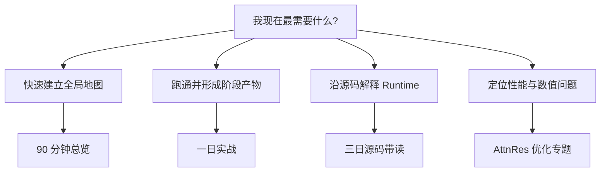

# 学习路径与起点诊断

> 课程版本：`v5.1`
>
> 源码固定点：`9f53740753de36899aa7694cf7dcb5304e58ea54`
>
> 目标：不要按目录机械通读。先确定当前最需要交付的结果，再选择最短路线。

## 先做起点诊断

不用查资料，先独立回答下面八个问题：

| 编号 | 问题 | 能稳定回答时 |
|---|---|---|
| D1 | 为什么显示 Top-3，却默认先采 8 路？ | 可跳过 P01 的概念铺垫 |
| D2 | Prefix Page 与候选 suffix Page 的 Owner 分别是谁？ | 可直接进入 M04/M05 |
| D3 | active row 压缩后，随机数为什么不能绑定当前行号？ | 可缩短 M04 |
| D4 | `new_text.startswith(old_text)` 为什么不足以复用 KV？ | 可缩短 M06 |
| D5 | latest-wins 除了丢弃旧结果，还必须完成什么？ | 可缩短 M07 |
| D6 | 0.214B 的 65 次 Mixer 从哪里来？ | 可直接进入 M10 |
| D7 | Triton 的数值误差很小，为什么仍要比较候选文本？ | 可缩短 M10 |
| D8 | 满三条率 100% 为什么不能替代人工接受度？ | 可缩短 M11 |

判断规则：

```text
0～2 题稳定回答
→ 从 P01 开始，实战与源码交替

3～5 题稳定回答
→ 先做 P02/P03，再进入对应机制课

6～8 题稳定回答
→ 直接按当前任务选择专题路线，但仍要完成 P06/M11
```

这里的“稳定回答”不是记住一句结论，而是能补充：

```text
输入
→ 状态变化
→ Owner
→ 失败路径
→ 验证证据
```

## 四条推荐路线



### 路线 A：90 分钟建立全局地图

适合：今天先弄清项目到底解决了什么，不立即运行 GPU。

```text
README            15 分钟
→ VISUAL_ATLAS    20 分钟
→ M01             25 分钟
→ M03             15 分钟
→ M07             10 分钟
→ M11              5 分钟
```

必须留下一个产物：

```text
一张 A4 Runtime Map
```

至少包含：

```text
Prefix
CandidateGroup
persistent Prefix KV
branch suffix KV
generation
governance
Top-3
```

停止条件：能从一次按键开始，沿 Owner 和失败路径讲到完整 Top-3。

### 路线 B：一日实战闭环

适合：有 CUDA 和导出模型，需要先形成可演示、可比较的结果。


建议顺序：

| 阶段 | 课程 | 必须保存的产物 |
|---|---|---|
| 上午 1 | P01 | 原始 `ImeCompletionResult` JSON |
| 上午 2 | P02 | 3 / 8 / 8→24 对照表 |
| 下午 1 | P03 | generation 与 token-LCP Trace |
| 下午 2 | P04 | 三档模型决策记录 |
| 收尾 | P06 | release / experimental / reject 表 |

P05 可在 0.214B 与目标 GPU 都准备好后再做，不应为了“课程完整”强行跑空壳 Profile。

停止条件：每个结论都能追到命令、配置、原始结果和源码 revision。

### 路线 C：三日源码带读

适合：需要真正理解运行链，而不是只会调用脚本。

#### 第一天：组级 Runtime 与 KV

```text
M01
→ M03
→ M04
→ M05
```

阶段产物：

```text
CandidateGroup State Table
Page Ownership Table
Ragged Row Trace
Refill 手算
```

#### 第二天：连续输入与候选治理

```text
M06
→ M07
→ M08
```

阶段产物：

```text
四类 Prefix 状态转移
latest-wins 时间线
Raw Candidate → Top-3 手算
```

#### 第三天：模型主干、Kernel 与证据

```text
M02
→ M09
→ M10
→ M11
```

阶段产物：

```text
模型部署合同
Bank / Partial Shape Ledger
Score / Value Kernel Grid
多 Lane 发布判断
```

停止条件：能从 `ImeCompletionEngine.complete()` 沿符号索引定位关键函数，并说明每个临时 Tensor 或 Page 的生命周期。

### 路线 D：AttnRes 优化专题

适合：问题已经明确集中在 0.214B 与 AttnRes 热路径。

不要直接从 M10 开始。最短正确顺序是：

```text
P04
→ M02
→ M09
→ P05
→ M10
→ M11
```

原因：

```text
不知道部署合同
→ 无法确认跑的是哪条 residual trunk

不知道 Block AttnRes 语义
→ 无法判断 Kernel 是否保持 source depth 与 partial 语义

没有 Profile
→ 可能优化了并非主要瓶颈的算子

没有证据分层
→ 可能用微内核加速掩盖端到端或候选质量退化
```

必须同时保存：

```text
65-Mixer Pipeline
固定 8 路端到端
数值等价性
离散候选行为
目标设备显存
```

## 双轨怎样交替

实践课提出问题，机制课负责把黑盒打开：

| 实践观察 | 立即进入 | 回到实践时要多带回什么 |
|---|---|---|
| 候选不足或重复 | M03、M04、M05 | Page 预算、RNG 身份、Refill 停止原因 |
| 连续输入仍重复算 Prefix | M06 | Token IDs 与 `reused_prefix_tokens` |
| 旧候选闪回 | M07 | generation、取消检查点与 Page 回收 |
| 模型能加载但输出异常 | M02 | Config、Tokenizer、LM Head、Residual Type |
| 0.214B 明显慢 | M09、M10 | Mixer 调用模式、Scratch 与 Kernel Grid |
| 数字都好但候选不自然 | M08、M11 | 结构规则与人工语义 Lane |

## 每节课的最小闭环

无论走哪条路线，每节课都按下面五步完成：


### 1. 先写问题

不要先写“今天学习 CandidateGroup”。应写：

```text
为什么显示三条，却不能只生成三路？
```

### 2. 再确定观测

例如：

```text
valid_unique_candidates
invalid_candidates
duplicate_candidates
sampling_attempts
refill_rounds
refill_stop_reason
```

### 3. 打开最少源码

只打开回答当前问题所需的 canonical owner。其他实现先记为 black-box debt，不在一节课里无限展开。

### 4. 保存产物

使用 [阶段产物工作簿](WORKBOOK.md)，不要只在终端看一眼。

### 5. 用反例验收

例如：

```text
满三条但三条语义都差
→ 结构 Lane 通过，语义 Lane 失败
```

能处理反例，才算真正理解。

## 建议的完成标记

网页入口会把完成状态保存在浏览器 `localStorage`，它只表示“本页已完成自己的验收”，不表示“点开过”。

建议只有在满足下面条件后才标记完成：

```text
读完关键代码
完成至少一个手算或运行
保存阶段产物
独立回答练习题
说明一个失败路径
```

## 最终能力检查

课程完成后，随机抽一个 Prefix，你应能回答：

1. 本次按键创建了哪些状态，哪些状态会跨按键保留？
2. 首轮、补采样轮和最终显示数分别是多少？
3. 分支行退出后，候选身份、随机流和 Page Table row 怎样保持一致？
4. 新 Prefix 到来时，旧 CandidateGroup 与旧 Prefix Page 分别怎样处理？
5. 模型结构、Runtime、候选治理和发布证据分别由哪些文件负责？
6. 哪些结论来自当前源码，哪些只是冻结报告，哪些仍需要目标设备复测？

若其中任何一题只能回答“应该是”，回到对应机制课，不要继续堆新优化。
