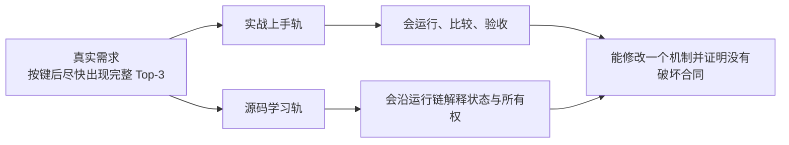

# AIOS-IME 双轨课程

> 课程版本：`v5.1`
>
> 源码固定点：`7155/aios@9f53740753de36899aa7694cf7dcb5304e58ea54`
>
> 课程对象：AIOS 中的本地中文输入法推理 Runtime，而不是通用聊天服务的缩短版。
>
> 证据口径：代码行为以固定 revision 为准；性能数字只引用仓库中已经冻结的报告，不冒充本次重新跑出的结果。

## 现在从哪里开始

### 网页阅读

从仓库根目录运行：

```bash
python -m http.server --directory course/aios-ime 8000
```

打开：

```text
http://localhost:8000/
```

网页提供：

```text
双轨目录
课程搜索
上一篇 / 下一篇
Mermaid 与公式渲染
代码复制
浏览器本地进度
移动端阅读
```

不要直接双击 `index.html`。浏览器在 `file://` 下通常不允许页面 `fetch()` 相邻 Markdown。

### Markdown 阅读

先进入 [学习路径与起点诊断](LEARNING_PATHS.md)，根据当前任务选择：

```text
90 分钟总览
一日实战闭环
三日源码带读
AttnRes 优化专题
```

这套课程不要求机械通读 17 课。

## 课程思想

课程有两条可以独立阅读、又通过同一批概念 ID、源码锚点和证据相互连接的路线：



- **需求驱动**：课程从候选不足、连续输入、模型选择、热路径和发布判断推进，不从名词目录推进。
- **实战上手轨**：先形成可运行产物，再用观测字段定位下一步。
- **源码学习轨**：沿 `prefix → CandidateGroup → KV → decode → governance → Top-3` 打开黑盒。
- **渐进披露**：第一次只建立够用模型；后续才进入状态、所有权、数值与 Kernel 细节。
- **README 即教材**：关键代码、Shape、状态变化、命令、验收和练习题直接写在课内。
- **证据先于结论**：源码事实、冻结报告、本次运行和人工判断明确分层。
- **阶段产物**：每一实践课都留下可追踪文件，不以“看过”作为完成标准。

## 为什么需要当前课程

原 `resources/lesson-10`～`lesson-17` 是优秀的专项教材，但它们固定在旧 revision `bfc72896bbadab5c897672506d237c070900412e`。当前源码已经加入：

- 首轮 8 路、最多 24 路的**自适应补采样**；
- 过滤后有效产出率、重复数、补采样轮数和停止原因等可观测字段；
- 0.06B、0.1B、0.214B 三套 MiniMind-IME 运行档位；
- 0.214B 的 32 层、8 Block `Block AttnRes` 主干；
- AttnRes `reference/eager/compiled/triton` 四种执行后端；
- 五模型短前缀统一矩阵与完整 Top-3 证据。

旧课继续作为历史切片保留；本课程把当前主线重新组织为双轨，而不是覆盖历史演进。

## 三种基础阅读方式

### 1. 实战优先

```text
P01 跑出第一组 Top-3
→ P02 比较 3 路、8 路、8→24 自适应
→ P03 模拟连续输入与 Prefix 复用
→ P04 用统一矩阵选择模型档位
→ P05 Profile AttnRes 热路径
→ P06 建立发布证据
```

入口：[实战上手轨](tracks/practice/README.md)

### 2. 源码优先

```text
M01 Runtime 地图
→ M02 模型包与架构选择
→ M03 CandidateGroup 与物理 Prefix KV
→ M04 Ragged Decode 与独立随机流
→ M05 自适应补采样
→ M06 token-LCP Prefix 复用
→ M07 latest-wins 与资源回收
→ M08 候选治理
→ M09 Block AttnRes
→ M10 Triton 热路径与数值合同
→ M11 证据分层
```

入口：[源码学习轨](tracks/mechanism/README.md)

### 3. 两轨交替

| 阶段 | 实战课 | 紧接的源码课 | 此时打开的黑盒 |
|---|---|---|---|
| 第一次可用 | P01 | M01 | 一次按键经过哪些组件 |
| 候选不足 | P02 | M03、M04、M05 | 为什么一次 Prefix 要生成多路 |
| 连续输入 | P03 | M06、M07 | Cache 与 generation 谁拥有 |
| 模型选择 | P04 | M02、M09、M11 | 小模型、标准残差、AttnRes 的边界 |
| 性能优化 | P05 | M09、M10 | 65 次 Mixer 与两段 Triton Kernel |
| 发布决策 | P06 | M08、M11 | 速度、结构质量、语义质量不能混为一谈 |

## 当前项目合同

一次按键的交付单位是**完整 Top-3 候选栏**：

```text
裸中文 Prefix
→ Tokenize + 可选 BOS
→ token-LCP 处理持久 Prefix KV
→ Prefix Prefill 一次
→ 首轮 8 路独立随机流
→ Ragged Decode
→ 文本截断、硬过滤、显示去重、软惩罚、MMR
→ 不足三条时按有效产出率自适应补采样
→ 只有最新 generation 可以交付
→ Top-3
```

默认关键值来自当前 `ImeGenerationConfig`：

| 参数 | 默认值 | 作用 |
|---|---:|---|
| `display_candidates` | 3 | 最终显示数量 |
| `sampling_attempts` | 8 | 首轮候选分支 |
| `max_sampling_attempts` | 24 | 单次按键总探索上限 |
| `refill_batch_size` | 8 | 单轮最多补多少分支 |
| `min_refill_batch_size` | 2 | 单轮补采样下限 |
| `max_new_tokens` | 12 | 每条短补全上限 |
| `temperature` | 0.35 | 首轮稳定探索 |
| `refill_temperature` | 0.75 | 补采样起始探索强度 |
| `max_refill_temperature` | 0.95 | 补采样温度上限 |
| `refill_top_k` | 96 | 补采样起始 Top-k |
| `max_refill_top_k` | 160 | 补采样 Top-k 上限 |

## 课程工具箱

| 工具 | 解决什么问题 |
|---|---|
| [学习路径](LEARNING_PATHS.md) | 不通读时怎样选择最短路线 |
| [机制图谱](VISUAL_ATLAS.md) | 用聚焦图串起复杂机制 |
| [源码索引](SOURCE_MAP.md) | 按问题、Owner 和 Symbol 定位代码 |
| [阶段产物工作簿](WORKBOOK.md) | 保存命令、原始结果、判断和下一步 |
| [故障诊断手册](TROUBLESHOOTING.md) | 从症状进入字段、机制和最小修复 |
| [课程状态](COURSE_STATE.md) | 查看源码固定点、冻结决策与更新动作 |
| [证据账本](evidence.jsonl) | 区分源码事实、报告与未复测结论 |

网页导航由 [`site-manifest.json`](site-manifest.json) 驱动；源码锚点由 [`source-symbols.json`](source-symbols.json) 驱动。两者都会被课程校验器检查，减少课程改名、移动或源码演进后的静默漂移。

## 阶段产物

实战轨不是六篇独立文章，而是一条可累积产物链：


建议统一保存在：

```text
course-work/aios-ime/
```

具体模板见 [WORKBOOK.md](WORKBOOK.md)。

## 冻结结果怎样使用

仓库报告给出两类重要证据：

1. `reports/aios_ime_short_prefix_matrix_20260821.md`：五模型在同一 40 条短前缀合同下的完整 Top-3 对比。
2. `reports/aios_ime_attnres_refill_20260821.md`：0.214B AttnRes 的算子、端到端、自适应补采样和部署包证据。

这些数字用于学习怎样读证据。重新修改源码后，必须重跑对应命令，不能继续沿用旧数字。

## 课程目录

```text
course/aios-ime/
├── index.html
├── assets/
│   ├── course.css
│   ├── course.js
│   ├── course-render.js
│   └── course-utils.js
├── site-manifest.json
├── README.md
├── LEARNING_PATHS.md
├── VISUAL_ATLAS.md
├── SOURCE_MAP.md
├── WORKBOOK.md
├── TROUBLESHOOTING.md
├── curriculum.yaml
├── COURSE_STATE.md
├── evidence.jsonl
├── source-symbols.json
├── bridge-matrix.yaml
├── CHANGELOG.md
├── tracks/
│   ├── practice/
│   │   ├── README.md
│   │   └── lessons/P01...P06/
│   └── mechanism/
│       ├── README.md
│       └── lessons/M01...M11/
├── scripts/
│   ├── run_top3.py
│   ├── compare_candidate_budget.py
│   ├── trace_typing.py
│   └── validate_course.py
└── snapshots/README.md
```

## 验证课程包

结构、源码锚点、网页 Manifest 与内容合同不需要 GPU：

```bash
python course/aios-ime/scripts/validate_course.py
node --check course/aios-ime/assets/course.js
```

运行 AIOS-IME 需要 CUDA：

```bash
python course/aios-ime/scripts/run_top3.py \
  --model /path/to/minimind-ime-aios \
  --prefix "没关系，你先忙你的，"
```

课程验证只证明：

```text
课程结构
相对链接
YAML / JSON / JSONL
Python 与 JavaScript 基础语法
17 课完整性
源码路径与 canonical symbols
网页导航 Manifest
问题区与图示合同
```

它不证明目标 GPU 上的延迟、模型自然度或发布可用性。

## 完成标准

学完后，你应能不看源码讲清：

1. 为什么输入法调度单位是 `CandidateGroup`，而不是八个互不相关的 request；
2. 为什么首 token 不需要先为每个分支分配 suffix KV；
3. 为什么 active row 压缩后随机数必须绑定候选身份与 token step；
4. 为什么补采样数量要由过滤后的 unique-valid yield 决定；
5. 为什么字符前缀相同不能直接复用 KV；
6. 为什么 latest-wins 同时包含交付资格、计算止损和 Page 回收；
7. 为什么 0.214B 需要 Block AttnRes 路径，又为什么 Triton 仍不能宣称 bitwise 等价；
8. 为什么完整 Top-3 p95、满三条率、契约违规、冻结排序和人工接受度必须分开报告；
9. 哪些状态跨按键保留，哪些状态必须在单轮或单次 complete 后终结；
10. 修改一个机制后，怎样找到必须重跑的课程、测试和证据 Lane。

真正完成课程的标志不是网页进度 17/17，而是 [最终复盘文件](WORKBOOK.md#最终复盘文件) 能独立成立。
