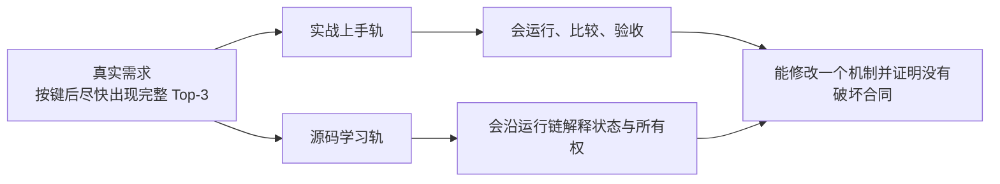

# AIOS-IME 双轨课程

> 课程版本：`v5.0`
>
> 源码固定点：`7155/aios@9f53740753de36899aa7694cf7dcb5304e58ea54`
>
> 课程对象：AIOS 中的本地中文输入法推理 Runtime，而不是通用聊天服务的缩短版。
>
> 证据口径：代码行为以固定 revision 为准；性能数字只引用仓库中已经冻结的报告，不冒充本次重新跑出的结果。

这套课程不再把所有内容排成一条很长的目录。它有两条可以独立阅读、又通过同一批概念 ID 和证据相互连接的路线：



- **实战上手轨**：先跑出结果，再用一次次可观察问题推动配置、调度、模型选择和发布验收。
- **源码学习轨**：先建立 Runtime 地图，再沿 `prefix → CandidateGroup → KV → decode → governance → Top-3` 打开黑盒。
- **渐进披露**：第一次只建立够用模型；同一概念在后续课中才进入状态、所有权、数值与内核细节。
- **README 即教材**：关键代码、Shape、状态变化、验证命令和练习题都直接写在课内。

## 为什么需要重建课程

原 `resources/lesson-10`～`lesson-17` 是优秀的专项教材，但它们固定在旧 revision `bfc72896bbadab5c897672506d237c070900412e`。当前源码已经加入：

- 首轮 8 路、最多 24 路的**自适应补采样**；
- 过滤后有效产出率、重复数、补采样轮数和停止原因等可观测字段；
- 0.06B、0.1B、0.214B 三套 MiniMind-IME 运行档位；
- 0.214B 的 32 层、8 Block `Block AttnRes` 主干；
- AttnRes `reference/eager/compiled/triton` 四种执行后端；
- 五模型短前缀统一矩阵与完整 Top-3 证据。

旧课继续作为历史切片保留；本课程把当前主线重新组织为双轨，而不是覆盖掉历史演进。

## 三种阅读方式

### 1. 实战优先

```text
P01 跑出第一组 Top-3
→ P02 比较 3 路、8 路、8→24 自适应
→ P03 模拟连续输入与 Prefix 复用
→ P04 用统一矩阵选择模型档位
→ P05 Profile AttnRes 热路径
→ P06 建立发布证据
```

入口：[实战上手轨](tracks/practice/README.md)

### 2. 源码优先

```text
M01 Runtime 地图
→ M02 模型包与架构选择
→ M03 CandidateGroup 与物理 Prefix KV
→ M04 Ragged Decode 与独立随机流
→ M05 自适应补采样
→ M06 token-LCP Prefix 复用
→ M07 latest-wins 与资源回收
→ M08 候选治理
→ M09 Block AttnRes
→ M10 Triton 热路径与数值合同
→ M11 证据分层
```

入口：[源码学习轨](tracks/mechanism/README.md)

### 3. 交替阅读

| 阶段 | 实战课 | 紧接的源码课 | 此时打开的黑盒 |
|---|---|---|---|
| 第一次可用 | P01 | M01 | 一次按键经过哪些组件 |
| 候选不足 | P02 | M03、M04、M05 | 为什么一次 Prefix 要生成多路 |
| 连续输入 | P03 | M06、M07 | Cache 与 generation 谁拥有 |
| 模型选择 | P04 | M02、M09 | 小模型、标准残差、AttnRes 的边界 |
| 性能优化 | P05 | M10 | 为什么两段 Triton Kernel 更合适 |
| 发布决策 | P06 | M08、M11 | 速度、结构质量、语义质量不能混为一谈 |

## 当前项目合同

一次按键的交付单位是**完整 Top-3 候选栏**：

```text
裸中文 Prefix
→ Tokenize + 可选 BOS
→ token-LCP 处理持久 Prefix KV
→ Prefix Prefill 一次
→ 首轮 8 路独立随机流
→ Ragged Decode
→ 文本截断、硬过滤、显示去重、软惩罚、MMR
→ 不足三条时按有效产出率自适应补采样
→ 只有最新 generation 可以交付
→ Top-3
```

默认关键值来自当前 `ImeGenerationConfig`：

| 参数 | 默认值 | 作用 |
|---|---:|---|
| `display_candidates` | 3 | 最终显示数量 |
| `sampling_attempts` | 8 | 首轮候选分支 |
| `max_sampling_attempts` | 24 | 单次按键总探索上限 |
| `refill_batch_size` | 8 | 单轮最多补多少分支 |
| `min_refill_batch_size` | 2 | 单轮补采样下限 |
| `max_new_tokens` | 12 | 每条短补全上限 |
| `temperature` | 0.35 | 首轮稳定探索 |
| `refill_temperature` | 0.75 | 补采样起始探索强度 |
| `max_refill_temperature` | 0.95 | 补采样温度上限 |
| `refill_top_k` | 96 | 补采样起始 Top-k |
| `max_refill_top_k` | 160 | 补采样 Top-k 上限 |

## 冻结结果怎样使用

仓库报告给出了两类重要证据：

1. `reports/aios_ime_short_prefix_matrix_20260821.md`：五模型在同一 40 条短前缀合同下的完整 Top-3 对比。
2. `reports/aios_ime_attnres_refill_20260821.md`：0.214B AttnRes 的算子、端到端、自适应补采样和部署包证据。

这些数字用于学习怎样读证据。重新修改源码后，必须重新跑对应命令，不能继续沿用旧数字。

## 课程目录

```text
course/aios-ime/
├── README.md
├── curriculum.yaml
├── COURSE_STATE.md
├── evidence.jsonl
├── bridge-matrix.yaml
├── CHANGELOG.md
├── tracks/
│   ├── practice/
│   │   ├── README.md
│   │   └── lessons/P01...P06/
│   └── mechanism/
│       ├── README.md
│       └── lessons/M01...M11/
├── scripts/
│   ├── run_top3.py
│   ├── compare_candidate_budget.py
│   ├── trace_typing.py
│   └── validate_course.py
└── snapshots/README.md
```

## 验证课程包

结构与内容检查不需要 GPU：

```bash
python course/aios-ime/scripts/validate_course.py
```

运行 AIOS-IME 需要 CUDA：

```bash
python course/aios-ime/scripts/run_top3.py \
  --model /path/to/minimind-ime-aios \
  --prefix "没关系，你先忙你的，"
```

课程验证只证明教材结构、链接、YAML/JSONL 和 Python 语法成立；它不证明目标 GPU 上的延迟或模型质量。

## 完成标准

学完后，你应能不看源码讲清：

1. 为什么输入法调度单位是 `CandidateGroup`，而不是八个互不相关的 request；
2. 为什么首 token 不需要先为每个分支分配 suffix KV；
3. 为什么 active row 压缩后随机数必须绑定候选身份与 token step；
4. 为什么补采样数量要由过滤后的 unique-valid yield 决定；
5. 为什么字符前缀相同不能直接复用 KV；
6. 为什么 latest-wins 同时包含交付资格、计算止损和 Page 回收；
7. 为什么 0.214B 需要 Block AttnRes 路径，又为什么 Triton 仍不能宣称 bitwise 等价；
8. 为什么完整 Top-3 p95、满三条率、契约违规、冻结排序和人工接受度必须分开报告。
