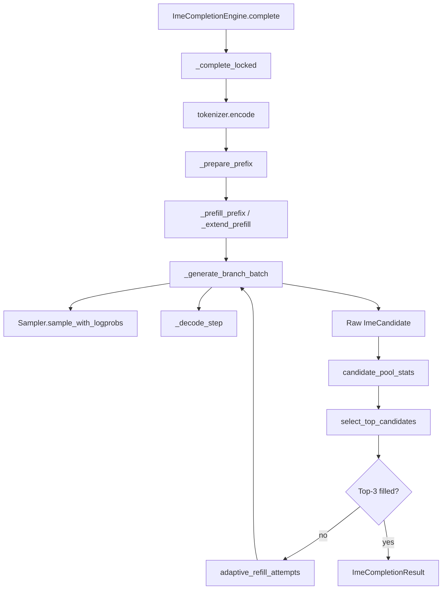
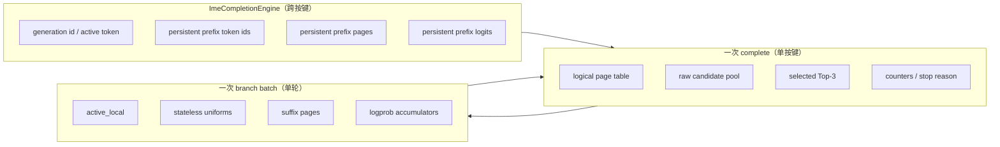

# AIOS-IME 源码索引

> 课程版本：`v5.1`
>
> 源码固定点：`9f53740753de36899aa7694cf7dcb5304e58ea54`
>
> 使用原则：先按问题定位 canonical symbol，再读相邻调用；不要从仓库目录第一行开始漫游。

## 一次按键的 Runtime Spine



建议先在本地执行：

```bash
rg -n \
  "class ImeCompletionEngine|def complete|def _complete_locked|def _prepare_prefix|def _generate_branch_batch|def adaptive_refill_attempts" \
  python/aios/ime.py
```

这条命令得到的是定位入口，不是阅读顺序。阅读顺序仍按上图。

## 按问题定位源码

| 现在的问题 | 首先打开 | 关键符号 | 对应课程 |
|---|---|---|---|
| 一次按键到底经过哪些层？ | `python/aios/ime.py` | `ImeCompletionEngine.complete`、`_complete_locked` | M01 |
| 模型为什么被选成标准残差或 AttnRes？ | `python/aios/models/config.py`、`minimind_ime.py` | `ModelConfig`、`MiniMindIMEForCausalLM` | M02 |
| 八路怎样只保留一份物理 Prefix KV？ | `python/aios/ime.py` | `_prepare_prefix`、`_generate_branch_batch` | M03 |
| active rows 收缩后为何仍可复现？ | `python/aios/ime.py`、`engine/sample.py` | `active_local`、`stateless_uniforms`、`sample_with_logprobs` | M04 |
| 每轮补多少路？ | `python/aios/ime.py` | `candidate_pool_stats`、`adaptive_refill_attempts` | M05 |
| 连续输入怎样复用稳定历史？ | `python/aios/ime.py` | `token_longest_common_prefix`、`_prepare_prefix`、`_extend_prefill` | M06 |
| 新按键怎样取消旧候选组？ | `python/aios/ime.py` | `CancellationToken`、`new_generation`、`complete` | M07 |
| Raw Branch 怎样变成 Top-3？ | `python/aios/ime.py` | `invalid_reasons`、`candidate_key`、`select_top_candidates` | M08 |
| 65 次 Mixer 怎样组织？ | `python/aios/models/minimind_ime.py` | `BlockAttnResMixer`、`MiniMindBlockAttnResModel` | M09 |
| Triton 热路径怎样读？ | `python/aios/kernel/attnres.py` | `_attnres_score_kernel`、`_attnres_value_kernel`、`triton_attnres_mix` | M10 |
| Benchmark 的结论边界是什么？ | `benchmark/bench_ime.py`、`reports/` | 完整 Top-3 行级结果与聚合报告 | M11 |

机器可校验版本位于 [`source-symbols.json`](source-symbols.json)。课程校验器会确认路径存在、符号未漂移、M01～M11 都有 canonical source anchor。

## 状态与 Owner 索引



| 状态 | 主要变量 | Owner | 终止点 |
|---|---|---|---|
| generation 身份 | `_generation_id`、`_active_token` | Engine | 下一 generation 使旧 token 单向取消 |
| 持久 Prefix Token | `_prefix_token_ids` | Engine | 新 token-LCP 重切或 reset |
| 持久 Prefix Page | `_prefix_pages` | Engine | 新 token-LCP 释放旧尾或 reset |
| 末位 Prefix Logits | `_prefix_logits` | Engine | Prefix 改变或 reset |
| 逻辑 Page Table | `page_table` | 当前 complete | 本次按键结束 |
| Active Row 身份 | `active_local` | 当前 branch batch | 本轮结束 |
| Suffix Page | `allocated_pages` | 当前 branch batch | `finally` 统一释放 |
| Raw Candidate Pool | `raw_candidates` | 当前 complete | 返回结果后丢弃 |
| Top-3 | `selected` | 候选治理 | 当前结果交付 |
| 冻结报告 | `reports/*.md/json` | 评测流程 | 源码、模型或环境变化后失效 |

## Shape Ledger

以首轮 `attempts=8`、Prefix 长度 `P`、词表 `V`、Hidden `D` 为例：

| 阶段 | Tensor / 结构 | Shape | 读写语义 |
|---|---|---|---|
| Tokenize | `token_ids` | `[P]` | 裸中文 Prefix + 可选 BOS |
| Prefix Page | `prefix_pages` | `[P]` | 每个 Token 一个物理 Page |
| Page Table | `page_table` | `[max_attempts, P + max_new_tokens]` | 逻辑 row → 物理 Page ID |
| Prefix Logits | `prefix_logits` | `[1, V]` | 预测每条分支的首 token |
| 首轮 Logits | `expand(prefix_logits)` | `[8, V]` | 共享 storage 视图，独立采样 |
| RNG | `candidate_uniforms` | `[8, max_new_tokens]` | 绑定候选身份与 token step |
| Active Index | `active_local` | `[A_t]` | `A_t` 随分支结束逐步收缩 |
| Decode Token | `decode_tokens` | `[A_t]` | 仅存活候选进入下一步 |
| AttnRes Bank | `bank` | `[S, N, D]` | `S≤9`，`N` 为当前 active tokens |
| AttnRes Score | `scores` | `[S_total, N]` FP32 | 沿 Hidden 归约，沿 Source Softmax |
| AttnRes Output | `mixed` | `[N, D]` | 回到模型 dtype |

Shape 不应脱离 Owner。相同 `[N,D]` 可能是：

```text
模型 Hidden State
Block-local partial
AttnRes mixed output
```

它们的生命周期和可写性完全不同。

## 四条读码路线

### 路线 1：从公开 API 向内

```text
ImeCompletionEngine.complete
→ _complete_locked
→ _prepare_prefix
→ _generate_branch_batch
→ select_top_candidates
```

适合第一次建立主链。遇到 Attention、Sampler 或 Cache Manager 时先记录调用边界，不立即横向展开。

### 路线 2：从资源回收向上

先搜索：

```bash
rg -n "finally|_free|reset_prefix_cache|available_size" \
  python/aios tests
```

然后回答：

```text
谁分配？
谁保存句柄？
正常路径在哪里释放？
取消路径是否走同一 finally？
异常路径是否也收敛？
```

这条路线最容易发现“功能正常但多轮后 Page 耗尽”的问题。

### 路线 3：从结果字段向前追

以 `refill_stop_reason` 为例：

```text
ImeCompletionResult 字段
← _complete_locked 何时赋值
← filled / max_attempts / deadline / cancelled
← 哪个观测触发停止
← 哪条测试或报告覆盖
```

结果字段是调试入口，也是课程与 Runtime 的合同接口。

### 路线 4：从 Profile 反向定位

```text
端到端 p95
→ 每样本 attempts / active_model_tokens
→ 模型 Forward
→ 65 次 BlockAttnResMixer
→ triton_attnres_mix
→ score / value kernel
```

不要看到一个 CUDA Kernel 很慢就直接修改。先确认它在完整 Top-3 路径中的调用次数与占比。

## 关键文件边界

### `python/aios/ime.py`

负责：

```text
输入法工作负载合同
CandidateGroup
Prefix KV
Ragged Decode
Refill
latest-wins
候选治理
结果可观测字段
```

不负责：

```text
模型权重导出语义
通用多请求 Scheduler
AttnRes Kernel 内部实现
人工语义标注
```

### `python/aios/models/minimind_ime.py`

负责：

```text
标准残差 / Block AttnRes 主干选择
Bank / Partial 组织
65 次 Mixer 调用
Scratch 生命周期
```

不负责 CandidateGroup 或候选治理。

### `python/aios/kernel/attnres.py`

负责：

```text
Score Kernel
Value Kernel
Scratch Shape / dtype / contiguous 合同
Triton 发射配置
```

不负责决定哪个模型应该使用 AttnRes。

### `benchmark/` 与 `reports/`

负责把运行结果变成证据，但二者角色不同：

```text
benchmark/*.py
→ 如何采样、计时和记录

reports/*
→ 某次固定环境的结果快照
```

课程中的性能数字必须指向报告；报告不能反过来覆盖当前源码事实。

## 修改源码前的最小追踪表

| 项目 | 修改前先写清 |
|---|---|
| 入口 | 哪个公开 API 或结果字段可观察？ |
| Canonical owner | 哪个函数真正拥有规则？ |
| 状态 | 新增或改变哪些可变状态？ |
| 生命周期 | 创建、共享、取消、释放分别在哪里？ |
| Shape | 哪些维度可动态变化？ |
| 数值 | 哪些 dtype、归约顺序或离散边界会变？ |
| 证据 | 哪些 CPU/GPU Test、Benchmark、人工样本必须重跑？ |
| 课程影响 | 哪个 concept owner、bridge 与工作簿模板需要更新？ |

这张表填不完整时，先不要改 Kernel 或候选规则。
