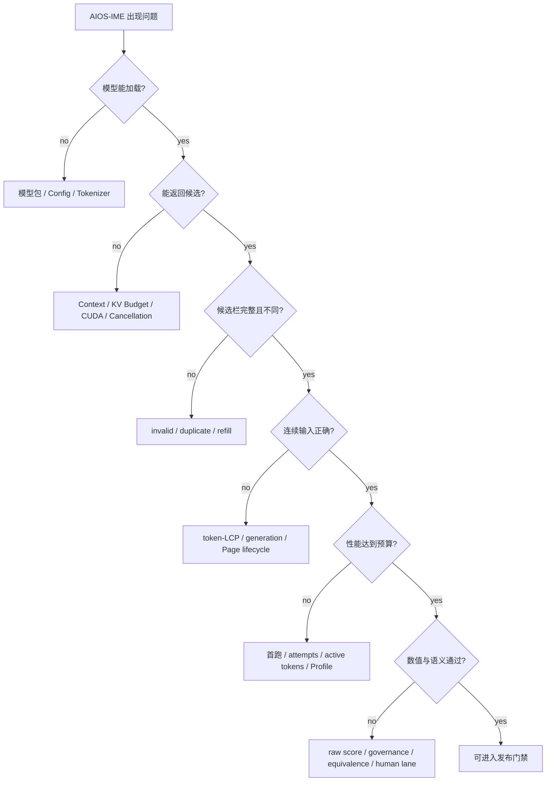
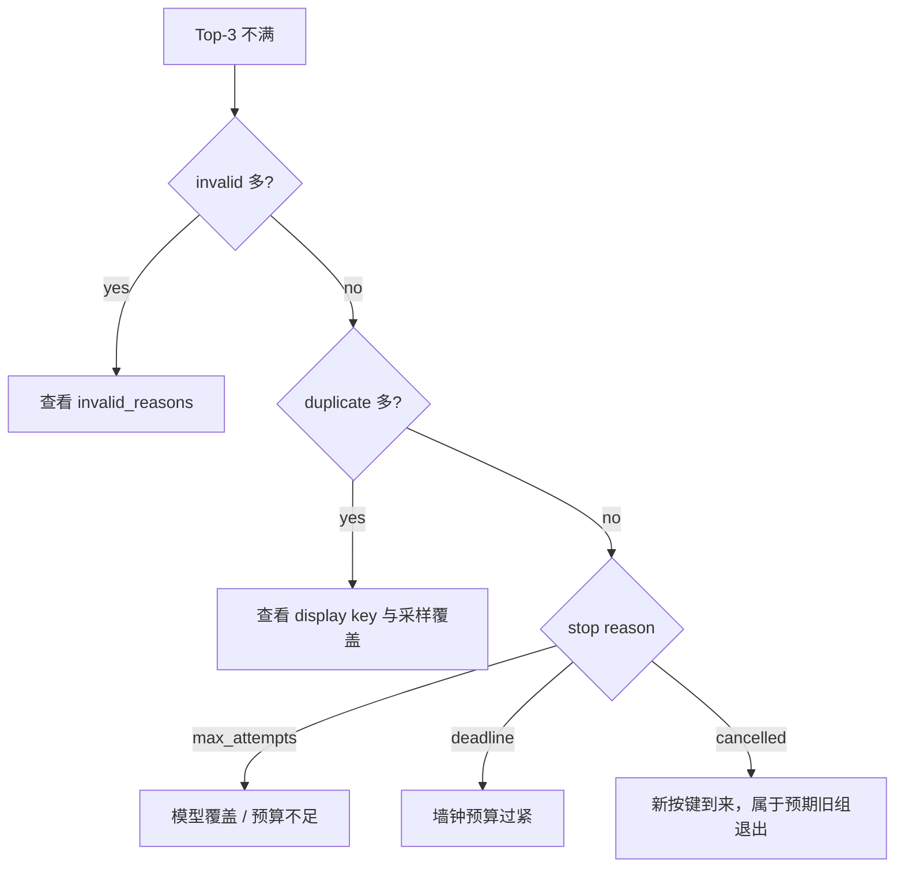

# AIOS-IME 故障诊断手册

> 课程版本：`v5.1`
>
> 源码固定点：`9f53740753de36899aa7694cf7dcb5304e58ea54`
>
> 原则：先按症状收集观测，再进入 canonical owner。不要一遇到异常就同时改模型、采样、过滤和 Kernel。

## 总诊断树



## 先保存最小诊断包

任何问题至少保存：

```text
Source SHA
Model / Tokenizer SHA
GPU 与依赖版本
完整 ImeGenerationConfig
输入 Prefix
ImeCompletionResult.to_dict()
是否首跑
是否同一 Engine 连续调用
原始异常栈
```

没有这组身份信息，后续很容易在不同模型或不同配置之间追错问题。

## 症状索引

| 症状 | 先看字段或命令 | 第一机制入口 |
|---|---|---|
| 无 CUDA 或 Runtime 拒绝启动 | `torch.cuda.is_available()` | P01、M01 |
| 模型加载失败 | Config、权重、Tokenizer、Manifest | M02 |
| 能加载但输出乱码或异常元文本 | Tokenizer 身份、模型合同、裸 Prefix | M02、P04 |
| 最终不足三条 | unique-valid、invalid、duplicate、stop reason | P02、M05、M08 |
| 三条高度重复 | display key、MMR、raw pool | M08 |
| 首次运行特别慢 | 是否混入加载/JIT/规划 | P01、P05、M11 |
| p50 正常但 p95 很高 | attempts、refill rounds、active tokens | P02、M05、M11 |
| 连续输入复用始终为零 | 同一 Engine、Token IDs、Backspace | P03、M06 |
| 旧候选闪回 | generation id、cancelled | P03、M07 |
| 多轮后 KV Page 耗尽 | `available_size`、finally、reset | M03、M07 |
| Triton 快但候选改变 | logits、Top-k、固定 seed 文本 | P05、M10 |
| 网页不显示正文 | HTTP Server、CDN、浏览器控制台 | 本手册末节 |

## 1. `AIOS only supports CUDA execution`

### 先确认

```bash
python - <<'PY'
import torch
print("cuda_available =", torch.cuda.is_available())
print("torch_cuda =", torch.version.cuda)
print("device_count =", torch.cuda.device_count())
if torch.cuda.is_available():
    print("device =", torch.cuda.get_device_name(0))
PY
```

### 判断

```text
cuda_available=False
→ 当前机器不能运行真实 AIOS-IME

cuda_available=True，但 LLM 初始化失败
→ 继续检查依赖、模型 Shape 或显存
```

CPU 仍可完成：

```text
课程阅读
公式手算
CandidateGroup / Page Table 模型
结构校验
```

但不能把 CPU 模拟写成真实 GPU 性能。

## 2. 模型包加载失败

### 收集

```bash
find /path/to/model -maxdepth 2 -type f -printf '%f\n' | sort
```

至少检查：

```text
config.json
model.safetensors 或受支持权重文件
Tokenizer 文件
导出 manifest
```

### 常见原因

| 原因 | 表现 | 正确动作 |
|---|---|---|
| 训练 checkpoint 直接当部署包 | 缺配置映射或权重名不匹配 | 使用 exporter |
| Head Shape 不变量不成立 | reshape / load error | 拒绝，不自动取整 |
| tied/untied LM Head 不一致 | 可加载或加载时缺权重，但语义危险 | 按合同重新导出 |
| Tokenizer 与模型不是同一版本 | Shape 全部通过但输出异常 | 对比 Tokenizer Hash |
| AttnRes 权重不完整 | 0.214B trunk 无法建立 | 拒绝静默回退 |

进入 M02，不要先调 Temperature。

## 3. 模型能加载，但输出乱码、跨语种或助手元文本

### 先验证输入合同

AIOS-IME 使用：

```text
裸中文 Prefix
→ 直接 continuation
```

不要加入聊天模板或角色指令。

### 再看模型身份

```text
专用 MiniMind-IME
通用 Qwen 对照
Tokenizer Hash
Residual Type
Attention Backend
```

通用聊天模型即使更大，也可能把裸 Prefix 解释为题目、指令或对话片段。

### 最小定位

固定一条 Prefix、固定 seed、固定 8 路：

```bash
python benchmark/bench_ime.py \
  --model /path/to/model \
  --eval-data /path/to/one_prefix.jsonl \
  --samples 1 \
  --sampling-attempts 8 \
  --max-sampling-attempts 8 \
  --seed 20260814
```

若八条 Raw Candidate 都异常，优先查模型合同；若 Raw Pool 有自然候选但最终选错，再进入 M08。

## 4. 最终候选不足三条

先打印：

```text
valid_unique_candidates
invalid_candidates
duplicate_candidates
sampling_attempts
refill_rounds
refill_stop_reason
```

### 快速分类



### 不要直接做

```text
把 max_sampling_attempts 无限提高
放宽所有 hard filter
关闭 display dedup
```

这些动作可能只把低质量或重复文本塞满候选栏，并显著增加 p95。

## 5. 三条候选高度重复

区分两种重复：

### 显示等价

```text
我晚点回复
我晚点回复。
 我晚点回复！
```

应由 `candidate_key` 合并。

### 语义高度相似

```text
我晚点给你发消息
我晚一点给你发消息
我稍后给你发消息
```

文本 key 不同，需要 MMR 或更好的候选覆盖。

诊断顺序：

```text
先看 raw candidate pool 是否本来就同质
→ 再看 display-key dedup
→ 再看 diversity_lambda
→ 最后考虑采样与模型训练
```

MMR 不能创造候选。池中没有不同表达时，继续堆相似性规则只会选更差文本。

## 6. 第一次特别慢，后面正常

可能混入：

```text
模型加载
Triton JIT
FlashInfer 初始化 / plan
Allocator 预热
CUDA Context 建立
```

正式比较必须：

```text
逐方案重新加载或严格控制复用
固定 warmup
固定样本顺序
固定计时边界
记录是否包含首跑
```

不要拿第一次的墙钟与已经预热的另一个 Backend 比较。

## 7. p50 正常，但 p95 很高

按每 Prefix 排序检查：

```text
sampling_attempts
refill_rounds
active_model_tokens
invalid_candidates
duplicate_candidates
prefix_tokens
generated_tokens
```

常见模式：

| 模式 | 根因方向 |
|---|---|
| attempts 接近 24 | unique-valid yield 低 |
| invalid 很多 | 模型输出或 hard rule |
| duplicate 很多 | 候选覆盖 / display key |
| Prefix 特别长 | Prefill 与 KV |
| generated tokens 很长 | 停止边界 / `max_new_tokens` |
| 只有 0.214B 尾部高 | AttnRes、更多层或 refill 触发差异 |

先钻取尾部样本，不要只改全局 p95 聚合脚本。

## 8. `reused_prefix_tokens` 始终为零

### 先确认 Engine 生命周期

错误：

```python
for prefix in prefixes:
    engine = ImeCompletionEngine(llm)
    engine.complete(prefix)
```

正确：

```python
engine = ImeCompletionEngine(llm)
for prefix in prefixes:
    engine.complete(prefix)
```

### 再检查 Token IDs

字符追加可能发生 Tokenizer 尾部重切。记录：

```python
old_ids = llm.tokenizer.encode(old_prefix, add_special_tokens=False)
new_ids = llm.tokenizer.encode(new_prefix, add_special_tokens=False)
print(old_ids)
print(new_ids)
```

严格 Backspace 当前也可能为了精确末位 Logits 重新 Prefill。复用为零不自动等于 Bug。

## 9. 旧候选闪回

正确结果必须满足：

```text
只有最新 generation 有交付资格
```

检查：

```text
旧 result.generation_id
新 result.generation_id
旧 result.cancelled
UI 是否在显示前再核验当前 generation
```

若只在 UI 丢弃旧结果，但旧 GPU 仍完整运行，还缺：

```text
step 边界取消
suffix Page 回收
新组进入 Runtime
```

运行仓库 GPU Test，而不是只靠肉眼看候选栏。

## 10. 多轮后 KV Page 耗尽

典型表现：

```text
前几次正常
→ 一段时间后 required pages 超预算
→ reset 或重启后恢复
```

诊断：

```text
每轮 branch suffix Pages 是否在 finally 释放
尾部重切是否释放旧 Prefix 尾页
异常路径是否与正常路径汇合
reset_prefix_cache 后 available_size 是否回到 num_pages
```

资源不变量应直接断言：

```python
assert llm.cache_manager.available_size == llm.cache_manager.num_pages
```

具体字段以当前 Cache Manager 接口为准。不要只观察 `nvidia-smi`，PyTorch reserved memory 与逻辑 Page 泄漏不是同一概念。

## 11. Triton Backend 更快，但候选文本变化

先区分：

```text
数值近似误差
采样边界翻转
Top-k 集合变化
停止原因变化
过滤规则变化
```

至少比较：

```text
完整词表 logits max / mean abs diff
cosine similarity
Top-1/3/10/50 token set
固定 8 路、固定 seed 候选文本
Token 数与 stop reason
invalid reasons
average logprob
```

若只在自适应模式文本变化，先用固定 8 路隔离 Backend；细微候选差异可能触发不同 refill 路数，把问题放大。

还要覆盖动态 Shape：

```text
active N = 1...8
source depth = 1...9
partial = None / present
Prefill 的更大 N
```

## 12. 满三条、速度也快，但候选仍不好用

这不是矛盾。

```text
满三条
→ 结构完整

契约违规为零
→ 没触发已编码禁区

固定排序持平
→ 给定候选集合下条件概率未明显退化

人工不接受
→ 开放生成的贴合度、语气或信息价值仍不足
```

进入 M11，把自动结构 Lane 与人工语义 Lane 分开。不要继续用更多 hard rule 假装解决自然度。

## 13. 网页入口无法打开

### 正确启动方式

从仓库根目录运行：

```bash
python -m http.server --directory course/aios-ime 8000
```

打开：

```text
http://localhost:8000/
```

不要直接双击 `index.html`。`file://` 下浏览器通常不允许 `fetch()` 读取相邻 Markdown。

### 页面框架打开，但正文空白

检查浏览器控制台和 Network：

```text
site-manifest.json 是否 200
README.md 是否 200
marked / mermaid / katex CDN 是否可访问
```

网页首次加载需要从 CDN 取得渲染库；教材 Markdown、导航 Manifest 和进度逻辑仍在仓库内。

### Mermaid 或公式失败

网页会保留错误块，而不是静默空白。先运行：

```bash
python course/aios-ime/scripts/validate_course.py
```

它会检查 Markdown 链接、代码围栏、Manifest 和课程文件；运行时渲染错误再看浏览器控制台。

## 诊断结束标准

一次诊断不是“改完好像可以”，而应留下：

```text
复现 Prefix
最小配置
原始结果
主要失败 Lane
canonical owner
最小修改
修改后同条件对照
未覆盖风险
```

一次只改变一个主要变量。模型、Runtime、治理规则和 Benchmark 同时变化时，几乎无法归因。
