# AIOS-IME 机制图谱

> 课程版本：`v5.1`
>
> 源码固定点：`9f53740753de36899aa7694cf7dcb5304e58ea54`
>
> 用法：先看一张图回答图下的问题，再进入对应课程读代码。图谱负责建立关系，不替代 README 中的源码、公式和验收。

## 图 1：输入法不是缩短版聊天生成

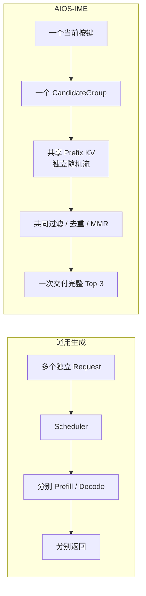

看图时回答：

```text
为什么“同时生成八条”仍不足以定义 CandidateGroup？
```

关键是八条分支还共享 generation、取消边界、候选池与最终交付。

对应：P01、M01。

## 图 2：逻辑八行，物理一份 Prefix KV

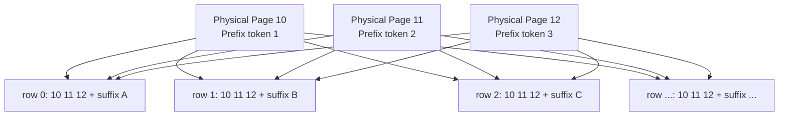

看图时回答：

```text
Page Table 里 Prefix Page ID 出现八次，为什么显存里仍只有一份 K/V？
```

Page Table 复制的是物理 Page ID，不是 K/V Tensor。

对应：P02、M03。

## 图 3：首 token 的真实分叉点

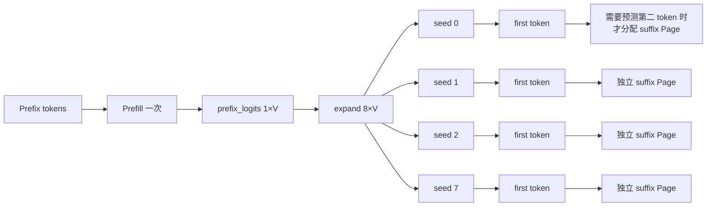

看图时回答：

```text
为什么首 token 若立即 EOS，可以不分配任何 suffix Page？
```

首 token 直接从 Prefix 最后位置 Logits 采样；只有继续预测下一 token 时才需要保存它的 K/V。

对应：M03。

## 图 4：Ragged Row 收缩，但候选身份不漂移

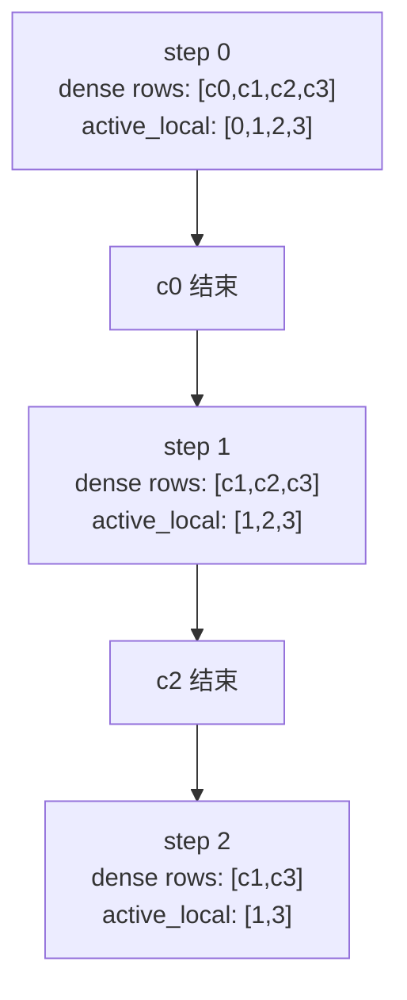

同时保留：

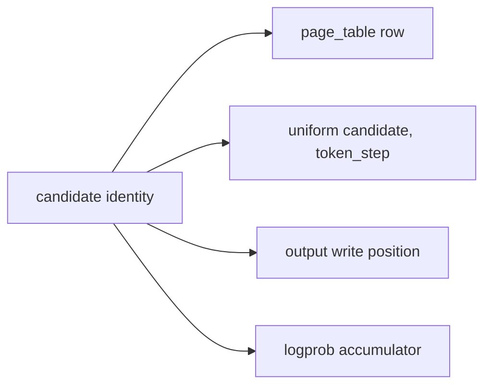

看图时回答：

```text
如果 RNG 绑定当前 Dense Row，c1 在 c0 结束后会发生什么？
```

c1 会拿到本属于另一行的随机数，优化改变候选文本。

对应：P02、M04。

## 图 5：自适应补采样是反馈控制

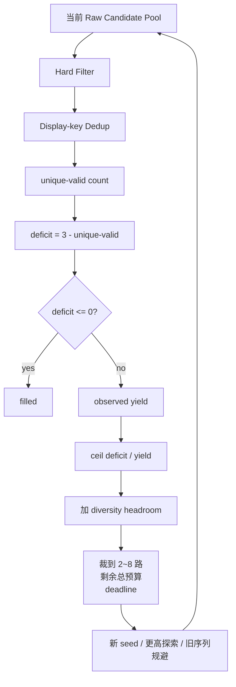

看图时回答：

```text
为什么不能用 raw valid count 规划 refill？
```

最终缺口发生在显示去重之后；合法但显示重复的候选不能填满 Top-3。

对应：P02、M05。

## 图 6：token-LCP 决定 Page 去留

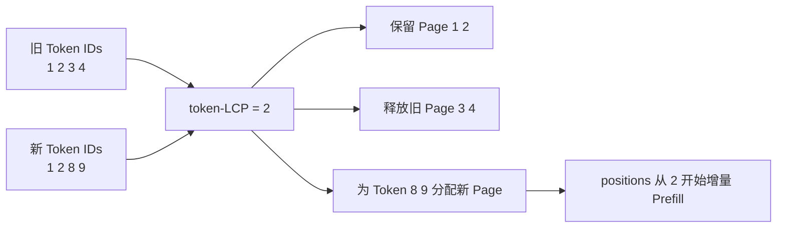

四种变化：

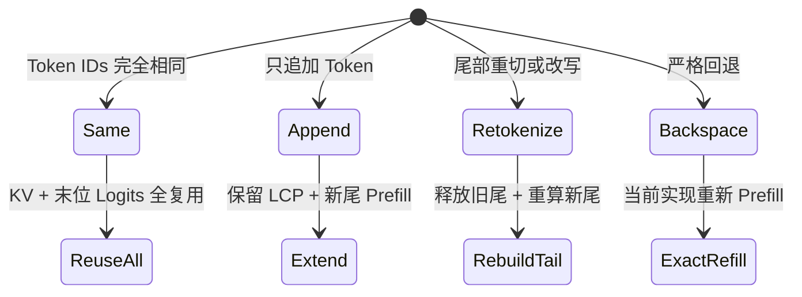

看图时回答：

```text
为什么严格 Backspace 不能只截断 Page Table？
```

旧 Cache 保存 K/V 与旧完整 Prefix 的末位 Logits，没有保存任意历史位置重新成为末位时的最终 Logits。

对应：P03、M06。

## 图 7：latest-wins 的三个层次

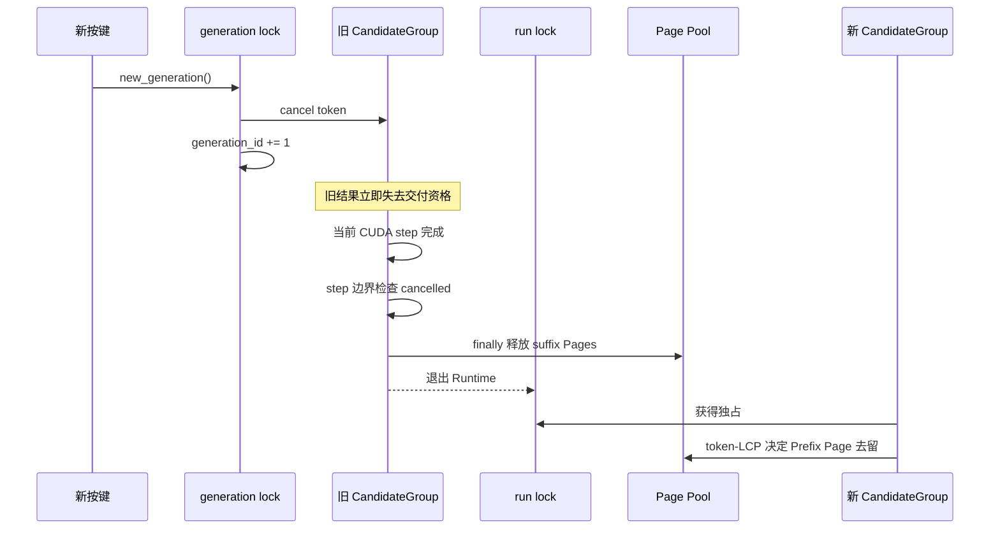

三个层次：

```text
交付资格：旧结果不能显示
计算止损：旧组不再发射下一 token step
资源终结：临时 suffix Page 在 finally 归还
```

对应：P03、M07。

## 图 8：候选治理不能混淆三种分数

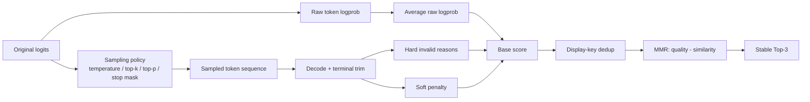

看图时回答：

```text
为什么 refill 每轮温度不同，候选仍能在同一池里排序？
```

排序保存修改前的 raw model logprob；Temperature 只改变探索分布。

对应：P06、M08。

## 图 9：Block AttnRes 的 Bank 与 Partial

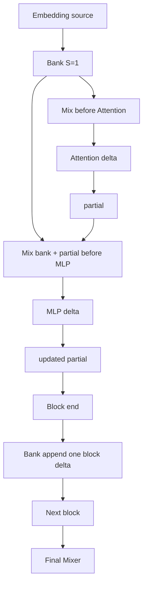

调用次数：

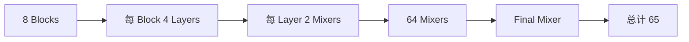

看图时回答：

```text
为什么不能把 65 次 Mixer 合成一次？
```

每次后续 Mixer 的输入依赖刚产生的 Attention 或 MLP delta，存在真实数据依赖。

对应：P04、P05、M09。

## 图 10：两段 Triton Kernel 与证据回路

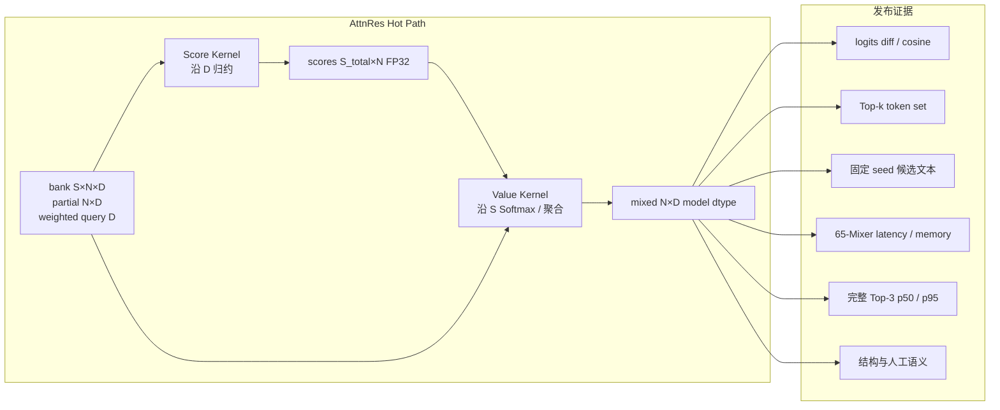

看图时回答：

```text
为什么“Kernel 快且 max diff 小”仍不足以上线？
```

离散 token、候选排序、动态 active-row Shape、Page 生命周期和人工语义仍可能退化。

对应：P05、P06、M10、M11。

## 一张总图：从按键到证据

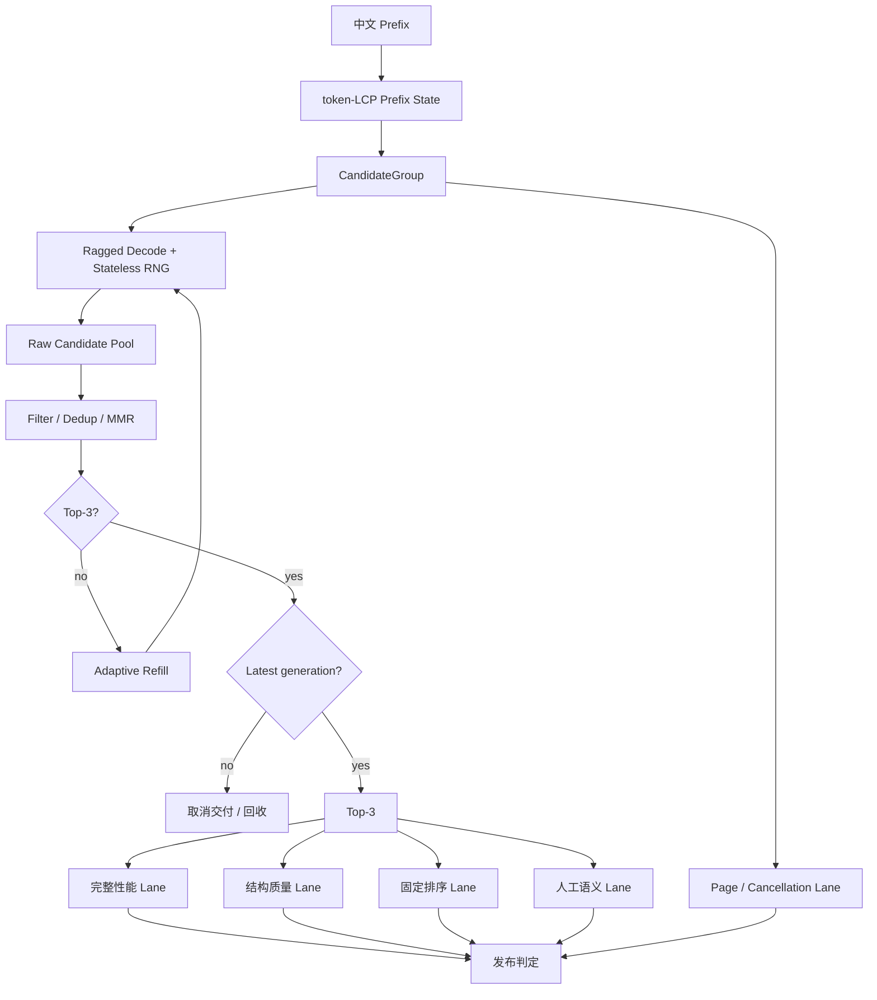

能独立解释这张总图，并指出每个节点的 canonical source owner，才算真正建立了项目地图。
