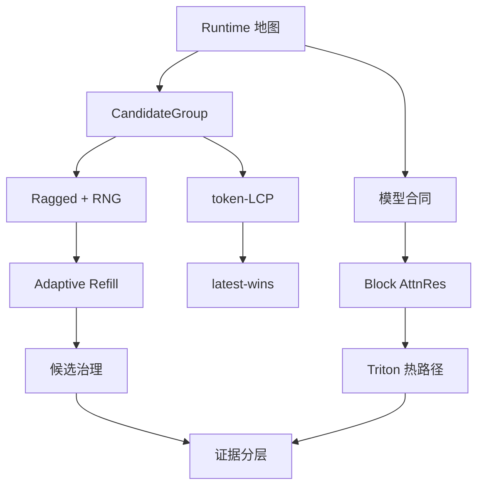

# 源码学习轨

这一轨不按文件夹浏览，而沿一次按键的真实运行链打开黑盒。

| 课次 | Canonical concept | 核心源码 |
|---|---|---|
| [M01](lessons/M01-runtime-map/README.md) | C01 workload contract | `python/aios/ime.py` |
| [M02](lessons/M02-model-contract/README.md) | C02 model contract | `models/config.py`, `models/minimind_ime.py`, exporter |
| [M03](lessons/M03-candidate-group-kv/README.md) | C03 CandidateGroup | `_complete_locked`, page table |
| [M04](lessons/M04-ragged-rng/README.md) | C04/C05 ragged + RNG | `_generate_branch_batch`, sampler |
| [M05](lessons/M05-adaptive-refill/README.md) | C06 adaptive refill | `adaptive_refill_attempts` |
| [M06](lessons/M06-token-lcp/README.md) | C07 token-LCP | `_prepare_prefix` |
| [M07](lessons/M07-latest-wins/README.md) | C08 lifecycle | `new_generation`, locks, `finally` |
| [M08](lessons/M08-candidate-governance/README.md) | C09 governance | filter, dedup, MMR, stable scoring |
| [M09](lessons/M09-block-attnres/README.md) | C10 Block AttnRes | `MiniMindBlockAttnResModel` |
| [M10](lessons/M10-triton-attnres/README.md) | C11 Triton hot path | `kernel/attnres.py` |
| [M11](lessons/M11-evidence-lanes/README.md) | C12 evidence lanes | benchmarks, reports, tests |

源码路径是证据，不是作业。每课 README 已包含理解该机制所需的关键代码。
