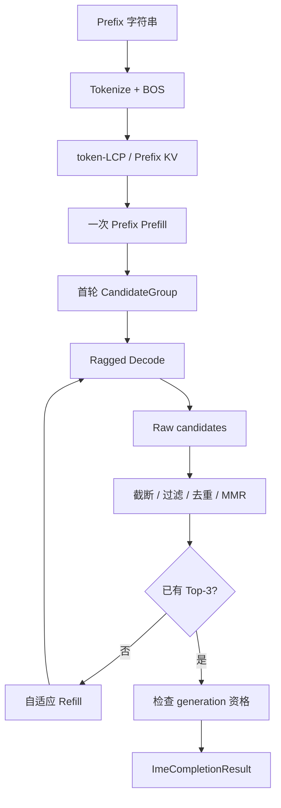

# M01：一次按键的 Runtime 地图

> 源码固定点：`9f53740753de36899aa7694cf7dcb5304e58ea54`
>
> Canonical concept：C01
>
> 对应实战课：[P01](../../../practice/lessons/P01-first-top3/README.md)
>
> 核心源码：`python/aios/ime.py::ImeCompletionEngine.complete`

## 先建立边界

AIOS 同时有通用 `LLM.generate()` 和输入法 `ImeCompletionEngine.complete()`。

```text
LLM.generate()
→ 多个普通 request
→ Scheduler / Prefill / Decode
→ 每个 request 各自返回

ImeCompletionEngine.complete()
→ 一个当前按键
→ 一个 CandidateGroup
→ 多路共享 Prefix、共同取消、共同治理
→ 一次返回完整 Top-3
```

输入法不是把 `max_tokens` 改小，而是改变了调度单位、正确性和交付对象。



## 1. 外层调用只有两行，内部却有完整生命周期

当前入口：

```python
@torch.inference_mode()
def complete(self, prefix, config=None, cancellation=None):
    cancellation = cancellation or self.new_generation()
    with self._run_lock:
        return self._complete_locked(prefix, config, cancellation)
```

这几行已经透露三个重要事实：

1. 没有传 token 时，本次调用会创建新 generation，并取消旧 generation；
2. `_run_lock` 让单用户 GPU Runtime 与持久 Prefix 状态串行收敛；
3. 真正的候选组流程在 `_complete_locked` 中，而不是通用 Scheduler。

## 2. `_complete_locked` 的运行脊柱

可以把实现压缩成下面的教学伪代码：

```python
def _complete_locked(prefix, config, cancellation):
    token_ids = tokenize_raw_prefix(prefix)
    validate_context_and_kv_budget()

    page_table = allocate_logical_table(
        rows=config.max_sampling_attempts,
        columns=len(token_ids) + config.max_new_tokens,
    )

    prefix_logits, prefix_pages, reused = prepare_prefix(token_ids, page_table)

    raw_candidates = []
    while attempts_used < config.max_sampling_attempts:
        plan_this_round()
        batch = generate_branch_batch(
            prefix_logits=prefix_logits,
            page_table=page_table,
            row_offset=attempts_used,
        )
        raw_candidates.extend(batch.candidates)
        free_branch_suffix_pages(batch)

        selected = select_top_candidates(raw_candidates)
        if cancelled or len(selected) == config.display_candidates:
            break

    return build_result(selected, raw_candidates, counters)
```

它的关键不是函数数量，而是**状态接收者**：

| 状态 | Owner | 何时创建 | 何时终止 |
|---|---|---|---|
| `generation_id` / cancel token | Engine | 新按键 | 被下一 generation 取消 |
| 持久 Prefix Token/Page/Logits | Engine | `_prepare_prefix` | 重切尾部、reset、Engine 结束 |
| Candidate Page Table | 当前 complete | 每次按键 | complete 结束 |
| 分支 suffix Page | 当前 refill batch | Decode step | 文本与分数物化后立即释放 |
| Raw candidate pool | 当前 complete | 首轮开始 | 结果返回 |
| Top-3 | 治理函数 | 每轮后重算 | 返回给调用方 |

## 3. 为什么输入是裸中文 Prefix

`ImeCompletionEngine` 直接：

```python
token_ids = tokenizer.encode(prefix, add_special_tokens=False)
if tokenizer.bos_token_id is not None:
    token_ids = [tokenizer.bos_token_id, *token_ids]
```

它没有套聊天模板。因为任务是：

```text
已有中文前缀
→ 续写紧接其后的短语
```

聊天模板会把 Prefix 包装成角色与指令，改变训练合同和输出分布。

## 4. 计时边界

`latency_ms` 从 `_complete_locked` 开始计时，覆盖：

```text
Tokenize
Prefix 处理
多轮生成
GPU 同步
CPU Decode
治理
```

不覆盖 `LLM(...)` 模型加载，因为模型在 Engine 之前创建。

`gpu_latency_ms` 用 CUDA Event 包住 CandidateGroup 主区间。两者不同：

```math
T_{wall} = T_{CPU} + T_{GPU} + T_{sync} + T_{overlap/overhead}
```

不要把 GPU Event 时间直接当用户等待时间。

## 5. 失败路径也是运行图的一部分

在发射 GPU 工作前，代码会检查：

```text
Prefix 是否为空
Prefix + 输出是否超过 context
CandidateGroup 最坏并发 Page 是否超过 KV Pool
Cancellation 是否已发生
```

运行中：

```text
每个 token step 检查 cancellation
任何退出路径 finally 释放临时 suffix Page
```

所以运行图必须包含拒绝、取消与回收，不能只画成功路径。

## 6. 与通用 Continuous Batching 的关系

AIOS 通用 Runtime 仍有 Continuous Batching、Flat Varlen Prefill 和 Paged KV。输入法专项复用这些底层能力，但当前单用户主要并行来源是：

```text
同一 Prefix 的多条候选分支
```

不是等待其他用户来合批。为了吞吐故意排队会损害按键延迟。

## 验收

不看源码，按顺序说清：

```text
prefix
→ token ids
→ persistent prefix state
→ page table
→ prefix logits
→ branch batches
→ raw candidate pool
→ governance
→ generation eligibility
→ result
```

并为每一步说出 Owner、输入、输出和至少一个失败路径。

## 练习题

### 1. 为什么 `complete()` 要先拿短期 generation lock，再在另一个位置使用 run lock？

<details>
<summary>参考答案</summary>

新按键需要立即宣布旧 generation 失效，不能等待旧 GPU 组完全结束；但持久 Prefix、Page Table 和单实例 Context 又必须串行修改。因此 generation 身份切换与长时间 Runtime 执行使用不同锁。
</details>

### 2. 为什么 Page Table 属于一次 complete，而 Prefix Page 可以跨 complete 存活？

<details>
<summary>参考答案</summary>

Page Table 的行表示本次 CandidateGroup 的逻辑序列；下一次按键会创建新的候选组。Prefix Page 存的是当前用户稳定历史 Token 的物理 KV，可能被下一次按键复用。
</details>

### 3. 哪些字段最适合定位“候选不足”？

<details>
<summary>参考答案</summary>

`valid_unique_candidates`、`invalid_candidates`、`duplicate_candidates`、`sampling_attempts`、`refill_rounds` 与 `refill_stop_reason`。它们区分过滤、重复、预算和取消。
</details>

### 4. 为什么 Runtime 地图必须画 CPU 候选治理？

<details>
<summary>参考答案</summary>

用户等待的是最终 Top-3，不是 GPU 最后一个 token。CPU Decode、截断、过滤、去重与 MMR 都可能改变结果和是否触发 refill，也属于端到端关键路径。
</details>
