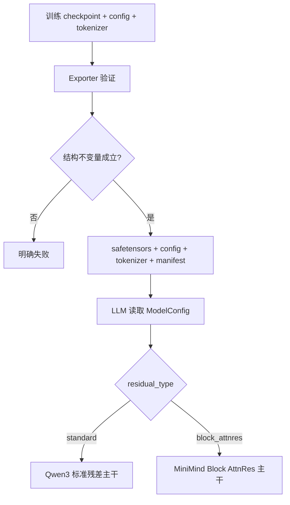

# M02：模型包、配置门禁与架构选择

> 源码固定点：`9f53740753de36899aa7694cf7dcb5304e58ea54`
>
> Canonical concept：C02
>
> 对应实战课：[P04](../../../practice/lessons/P04-model-matrix/README.md)
>
> 核心源码：`python/aios/llm/llm.py`、`python/aios/models/config.py`、`python/aios/models/minimind_ime.py`、`scripts/export_minimind_ime.py`

## 问题不是“能不能 load”

训练 checkpoint 可以 Shape 合法、甚至能输出中文，却仍然与 Runtime 的结构语义不兼容。模型接入需要一个可拒绝错误输入的部署合同。



## 1. `LLM` 的真实加载顺序

```python
model_path = resolve_local_or_snapshot(model_path)
config = ModelConfig.from_hf_or_json(model_path)

with torch.device("meta"):
    model = create_model(model_path, config)

load_weights(model, model_path, device, dtype)
model.model._rotary_emb.set_device(device)
tokenizer = AutoTokenizer.from_pretrained(model_path)

num_pages = determine_num_pages(config, memory_budget)
kv_cache = MHAKVCache(..., page_size=1)
cache_manager = CacheManager(device, num_pages)
context = Context(page_size=1)
```

`meta` device 只建立模块和 Shape，不先分配一份完整随机权重再覆盖，减少加载峰值。

## 2. 结构不变量

以 dense decoder 为例，至少检查：

```math
hidden\_size = num\_attention\_heads \times head\_dim
```

```math
k\_proj.rows = v\_proj.rows = num\_kv\_heads \times head\_dim
```

还要验证：

```text
层号连续
Q/K/V/O 权重齐全
RMSNorm 与 QK Norm 存在
激活为受支持的 SiLU/SwiGLU
tied/untied LM Head 声明与权重一致
Tokenizer 与词表一致
训练期 MTP 已剥离
MoE、YaRN 或未知残差结构不被静默解释
```

## 3. 当前架构选择不是按参数量猜

关键代码：

```python
class MiniMindIMEForCausalLM(Qwen3ForCausalLM):
    def __init__(self, config):
        if config.residual_type == "standard":
            super().__init__(config)
            return

        self.model = MiniMindBlockAttnResModel(config)
        self.attn_backend = self.model.attn_backend
        self.lm_head = LMHead(
            config.vocab_size,
            config.hidden_size,
            tie_word_embeddings=config.tie_word_embeddings,
            tied_embedding=(
                self.model.embed_tokens
                if config.tie_word_embeddings
                else None
            ),
        )
```

含义：

```text
0.06B / 0.1B 旧包
→ residual_type=standard 或缺省兼容
→ 标准 Qwen3 residual path

0.214B 新包
→ residual_type=block_attnres
→ 原生 32 层 Block AttnRes path
```

Attention、RoPE、SwiGLU、Paged KV 与 LM Head 格式仍复用；变化集中在 residual trunk。

## 4. 为什么 tied embedding 不能靠猜

危险路径：

```text
config 写 untied
checkpoint 缺 lm_head
Runtime 自动拿 embedding 代替
```

Shape 可能完全匹配，但输出语义错误。正确门禁：

```text
tied：若两份权重都存在，必须逐值验证一致
untied：必须真的存在独立 lm_head
无法证明：导出失败
```

## 5. 为什么 Tokenizer 是模型包的一部分

两个 Tokenizer 都可能有 16,384 个 Token，但 ID 与 Piece 映射不同：

```text
模型训练时 ID 1234 = “回来”
部署时 ID 1234 = “项目”
```

所有 Tensor Shape 都能通过，语义仍彻底错位。因此 manifest 要记录 Tokenizer 文件与 Hash。

## 6. KV Page 大小来自模型配置

当前 `page_size=1`。每 Token 的 K/V 字节：

```math
B_{token}
= 2 \times L \times H_{kv} \times D_h \times bytes(dtype)
```

其中 `2` 表示 K 和 V。模型层数或 KV Head 数增加，单 Page 成本也增加。`kv_cache_max_tokens` 控制 Page 数上限，不是 MiB。

## 7. 不同 Attention 后端也属于合同

冻结五模型报告记录：旧 0.06B 的 `head_dim=96` 在当前 FlashInfer 组合下使用 PyTorch SDPA Prefill + FlashInfer Decode，而其他受支持 Shape 使用 FA2 快路径。

正确做法是把 fallback 记录进证据，而不是让 NaN 或空输出混进质量比较。

## 验收

给任意模型包，能列出：

```text
config 中决定架构的字段
权重 Shape 不变量
tied/untied 规则
Tokenizer 身份
训练辅助权重边界
Attention backend 实际路径
每 Token KV 成本
manifest 中必须保存的 Hash
```

## 练习题

### 1. 为什么 Adapter 类很薄，不代表模型接入工作很少？

<details>
<summary>参考答案</summary>

Adapter 只选择运行时算子路径；Exporter 和 Config 必须证明 checkpoint 与该路径在层数、Shape、Norm、激活、LM Head、Tokenizer、残差类型等方面兼容。错误通常发生在边界合同，而不是继承语句。
</details>

### 2. 为什么 `hidden_size` 与 Head 乘积不一致时不能自动修正？

<details>
<summary>参考答案</summary>

Q/K/V 的 reshape 是精确 Tensor 布局，不是近似超参数。自动取整或改 Head 数会让权重语义错位，应直接拒绝。
</details>

### 3. Manifest Hash 能证明什么，不能证明什么？

<details>
<summary>参考答案</summary>

它能证明当前加载字节与记录身份一致，不能证明模型自然度、许可证、数据质量或目标设备性能。
</details>

### 4. 为什么标准残差模型不能直接走 AttnRes trunk？

<details>
<summary>参考答案</summary>

AttnRes 需要额外 query、key-norm、block 划分和深度 bank 语义。缺少这些权重时，不能凭架构名字合成；标准残差与深度路由是不同计算图。
</details>
