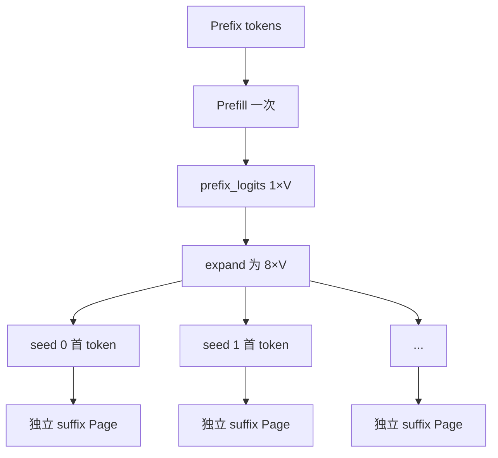

# M03：CandidateGroup 与物理 Prefix KV

> 源码固定点：`9f53740753de36899aa7694cf7dcb5304e58ea54`
>
> Canonical concept：C03
>
> 对应实战课：[P02](../../../practice/lessons/P02-candidate-budget/README.md)
>
> 核心源码：`python/aios/ime.py::_complete_locked`、`_generate_branch_batch`

## 从最浪费的实现开始

要显示三条候选，首轮生成八条。最直接的循环：

```python
for seed in range(8):
    generate(prefix, seed)
```

会把完全相同的 Prefix Forward 与 K/V 写入重复八次。真正分叉点是 Prefix 最后位置的 Logits。



## 1. Page Table 表示逻辑到物理

教学例子：

```text
Prefix 长度 = 4
候选数 = 3
物理 Prefix Page = [10, 11, 12, 13]
```

Page Table：

```text
row 0: [10,11,12,13, ...suffix...]
row 1: [10,11,12,13, ...suffix...]
row 2: [10,11,12,13, ...suffix...]
```

三行相同的是很小的 Page ID，不是三份 K/V Tensor。

```text
逻辑 Prefix 引用 = 3 × 4
物理唯一 Prefix Page = 4
```

## 2. 当前源码怎样建立共享

```python
page_table = torch.zeros(
    (max_attempts, max_total_len),
    dtype=torch.int32,
    device=device,
)

page_table[:, :len(token_ids)] = prefix_pages.unsqueeze(0)
```

Shape：

```text
prefix_pages                         [prefix_len]
prefix_pages.unsqueeze(0)            [1, prefix_len]
page_table prefix slice              [max_attempts, prefix_len]
```

广播复制的是 Page ID。物理 K/V 在全局 `MHAKVCache` 中。

## 3. 首 token 为什么不需要 suffix Page

Prefix Forward 已经给出：

```math
P(x_1 \mid prefix)
```

所以：

```python
logits = prefix_logits.expand(attempts, -1)
first_token = sample(logits, independent_uniforms)
```

只有为了预测第二个 token，才需要把第一 token 送入 Decode 并写入它的 K/V。

因此一轮并发最坏 Page：

```math
pages
= prefix\_len
+ concurrent\_attempts \times (max\_new\_tokens - 1)
```

## 4. 当前公式为什么使用“最大并发路数”，不是 24

当前总探索上限是 24，但补采样分轮执行。每轮候选文本和分数物化后，suffix Page 立即释放，再开始下一轮。

源码先算：

```python
max_concurrent_attempts = max(
    config.sampling_attempts,
    config.refill_batch_size,
)
required_pages = len(token_ids) + max_concurrent_attempts * max(
    0, config.max_new_tokens - 1
)
```

默认：

```text
首轮 = 8
单轮 refill 上限 = 8
总预算 = 24
```

KV Pool 需要容纳 Prefix + 同时活跃的最多 8 路 suffix，而不是三轮 suffix 同时常驻。

这是新版课程相对旧固定 8+4 描述的重要更新。

## 5. Prefix 与 Suffix 所有权

| Page | 读取者 | 写入者 | 生命周期 |
|---|---|---|---|
| Prefix Page | 所有分支 | Prefix Prefill | 跨候选组保留，按 token-LCP 更新 |
| Suffix Page | 单一分支 | 该分支 Decode | 本轮文本/分数物化后释放 |
| Page Table row | 单一逻辑候选 | 当前 complete | 当前按键结束 |

共享 Prefix 不需要 Copy-on-write，因为后续 Decode 只读历史 K/V，并把新 K/V 写入新 Page。

## 6. 为什么 CandidateGroup 不只是 Static Batch

Static Batch 只描述“一起算”。CandidateGroup 还拥有：

```text
共同 Prefix 身份
共同 generation 与取消边界
独立 seed / token-step 随机流
Ragged row 退出
共同候选池治理
按结果触发 refill
共同 Top-3 交付
```

因此不能把八路当八个无关系 request 后再在外层拼起来。

## 7. Page Size=1 的取舍

优点：

```text
token-LCP 可精确到单 Token
分支每步只领一个 Page
没有半满 Block
所有权直观
```

代价：

```text
Page Table 更长
分配元数据更多
大模型长上下文下未必最优
```

它是当前短上下文、本地单用户工作负载的选择，不是所有 Paged KV 的通用最佳值。

## 验收

用 Prefix=20、并发 8、`max_new_tokens=12` 手算：

```math
20 + 8 \times 11 = 108\ pages
```

并解释为什么总预算 24 路时仍不需要：

```math
20 + 24 \times 11
```

## 练习题

### 1. 为什么 Page Table 三行相同不等于 KV 被复制三份？

<details>
<summary>参考答案</summary>

表中保存的是物理 Page ID；相同 ID 表示多个逻辑序列读取同一物理资源。真正 K/V 只存在全局 Cache 对应 Page 中。
</details>

### 2. 为什么首 token 采样后，若它立即 EOS，就不需要任何 suffix Page？

<details>
<summary>参考答案</summary>

首 token 来自 Prefix 最后位置 Logits。它若已经结束，就不会再作为输入执行下一步 Decode，因此无需保存该 token 的 K/V。
</details>

### 3. 若把 `refill_batch_size` 从 8 提到 16，哪个预算会变化？

<details>
<summary>参考答案</summary>

最大并发 attempts 变成 16，因此最坏 suffix Page 预算翻倍；即使总 `max_sampling_attempts` 不变，KV Pool 需求也会增加。
</details>

### 4. 为什么 suffix Page 可以在每轮后释放，但候选文本仍能参与下一轮 MMR？

<details>
<summary>参考答案</summary>

候选的文本、token 数、原始 logprob、停止原因和 invalid reasons 已经物化到 CPU/Python 对象。后续治理不再需要分支历史 K/V。
</details>
