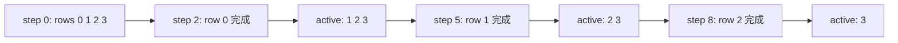

# M04：Ragged Decode 与独立随机流

> 源码固定点：`9f53740753de36899aa7694cf7dcb5304e58ea54`
>
> Canonical concepts：C04、C05
>
> 对应实战课：[P02](../../../practice/lessons/P02-candidate-budget/README.md)
>
> 核心源码：`python/aios/ime.py::_generate_branch_batch`、`python/aios/engine/sample.py`

## 为什么分支不会同时结束

八条候选可能分别在 2、4、7、12 个 token 后停止。若始终保持 Batch=8，已完成行还会继续占 QKV、Attention 和 MLP 计算。



## 1. `active_local` 保存候选身份

初始化：

```python
active_local = torch.arange(attempts, device=device)
row_indices = torch.arange(
    row_offset,
    row_offset + attempts,
    device=device,
)
```

每步后：

```python
branch_finished = is_eos | terminal
survivors = ~branch_finished
active_local = active_local[survivors]

logits, pages = self._decode_step(
    decode_tokens,
    page_table,
    cached_len=prefix_len + step,
    row_indices=row_indices[active_local],
)
```

区分两个索引：

```text
active_local
→ 当前 Dense Tensor 行对应本轮原始候选编号

row_indices[active_local]
→ 该候选在完整 Page Table 中的全局 row
```

所以物理 Batch 可以收缩，资源身份仍稳定。

## 2. 行压缩会怎样破坏普通 RNG

若每步从一个全局 RNG 按当前行顺序取数：

```text
step 0:
candidate 0 ← u0
candidate 1 ← u1
candidate 2 ← u2

candidate 0 结束
step 1 压缩后:
candidate 1 ← u3
candidate 2 ← u4
```

若不压缩：

```text
step 1:
candidate 0 ← u3
candidate 1 ← u4
candidate 2 ← u5
```

candidate 1 的随机数从 `u4` 变成 `u3`。于是“别的行是否结束”改变了它的文本。

## 3. 当前用 Stateless Random Stream

```python
candidate_uniforms = stateless_uniforms(
    [seed + index for index in range(attempts)],
    config.max_new_tokens,
    device,
)

token, raw_logprob = sampler.sample_with_logprobs(
    logits,
    uniforms=candidate_uniforms[active_local, step],
    ...
)
```

随机数身份是：

```text
(candidate seed, token step)
```

不是：

```text
当前压缩 Batch 的行号
```

因此 Ragged 优化前后，同一候选的随机轨迹可重放。

## 4. 终止条件

本轮会识别：

```text
EOS
单 Token 句末标点：。！？；!?;
达到 max_new_tokens
解码后发现一个 Token 内包含句号和下一句开头
```

最后一种无法仅靠 token-id stop set 完成。CPU Decode 后会截到第一个句末，并重新计算实际保留 Token 前缀的平均 logprob。

逗号不作为终止，因为中文输入法补全常需要在逗号后继续形成短句。

## 5. Sampling 分布与 Raw Score 分开

采样需要：

```text
temperature
Top-k
Top-p
min_new_tokens 前禁止 EOS/句末
逐行禁止重复完整 token sequence
```

但排序要保留模型原始概率。正确顺序：

```python
raw_log_probs = log_softmax(original_logits)

sampling_logits = apply_stop_mask(original_logits)
sampling_logits = apply_temperature_topk_topp(sampling_logits)

token = sample(sampling_logits, supplied_uniform)
score = raw_log_probs[token]
```

否则同一候选的最终分数会随着探索温度改变，不能跨轮比较。

## 6. `active_model_tokens` 比生成 Token 数更接近工作量

假设四路长度是 2、5、8、12：

```math
generated\ tokens = 27
```

真正送入后续 Decode 的 token 少一层首 token KV 写入边界，并且只统计活跃行。当前结果同时暴露：

```text
generated_tokens
active_model_tokens
```

Benchmark 应明确使用哪个作为吞吐分母。

## 7. 最小不变量

Ragged Decode 合法需要同时保持：

```text
候选身份
Page Table row
随机流
输出写回位置
累计 logprob
停止原因
```

只压缩 logits，不同步这些状态，会产生静默错误。

## 验收

画出三条候选长度 `[2, 4, 6]` 的 active rows，并为 candidate 2 标出：

```text
step 0 使用哪个 uniform
step 3 位于当前 Dense Batch 哪一行
Page Table 仍使用哪个 row
```

## 练习题

### 1. 为什么 Ragged Decode 不是纯性能优化？

<details>
<summary>参考答案</summary>

若随机数或 Page 身份绑定当前行位置，行压缩会改变候选内容或读错 KV。只有保持语义不变量后，它才是正确的性能优化。
</details>

### 2. 每个候选维护独立 `torch.Generator` 与 stateless RNG 有何取舍？

<details>
<summary>参考答案</summary>

独立 Generator 保存可变状态，生命周期更复杂；stateless RNG 由候选身份和 step 直接派生，便于重放、压缩和并行，但需要稳定的伪随机映射。
</details>

### 3. 为什么 `min_new_tokens` 屏蔽 EOS 时不应把 raw EOS logprob 改成负无穷？

<details>
<summary>参考答案</summary>

最短长度是采样策略，不是模型原始分布。排序分数应继续表达模型本来认为各 token 多可能。
</details>

### 4. 为什么一个 Token 内含“。下一句”需要 CPU 后处理？

<details>
<summary>参考答案</summary>

停止表只能在采样前按 Token ID 判断整个 Token，无法只保留 Token 字符串中的前半段。解码后才能找到第一个句末字符并截断显示文本。
</details>
