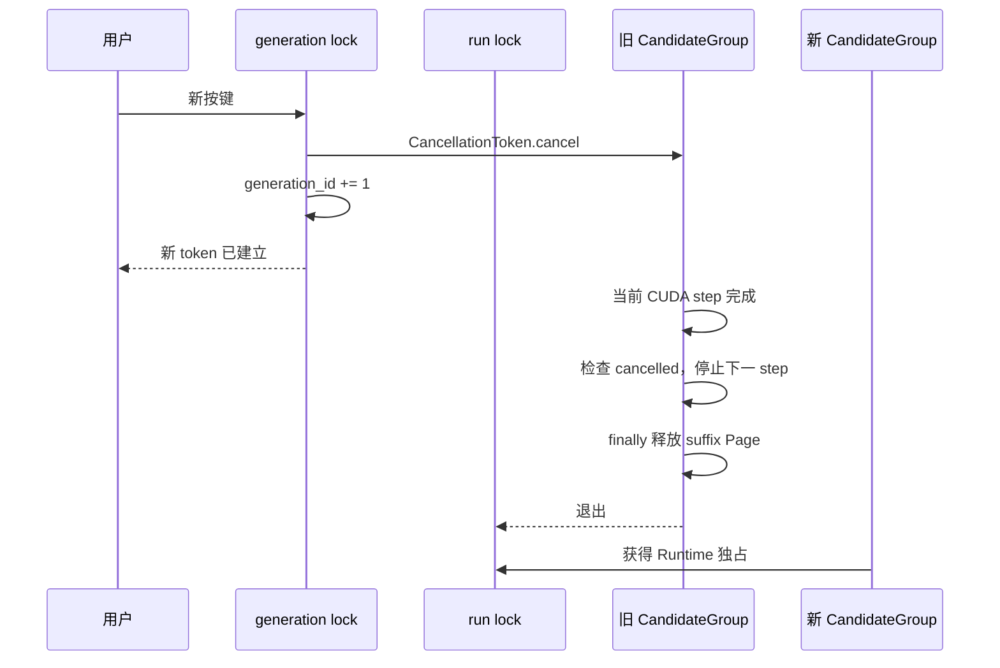

# M07：latest-wins、锁与 Page 生命周期

> 源码固定点：`9f53740753de36899aa7694cf7dcb5304e58ea54`
>
> Canonical concept：C08
>
> 对应实战课：[P03](../../../practice/lessons/P03-continuous-typing/README.md)
>
> 核心源码：`python/aios/ime.py::CancellationToken`、`new_generation`、`complete`、`_generate_branch_batch`

## FIFO 为什么是错误语义

连续按键：

```text
t0: 没关系
t1: 没关系，你
t2: 没关系，你先忙
```

若旧请求依次返回，候选栏会闪回到过时 Prefix。正确合同：

```math
returned\ generation\_id = latest\ generation\_id
```



## 1. `new_generation()` 的原子状态切换

```python
def new_generation(self):
    with self._generation_lock:
        if self._active_token is not None:
            self._active_token.cancel()
        self._generation_id += 1
        self._active_token = CancellationToken(
            self._generation_id
        )
        return self._active_token
```

`CancellationToken` 内部使用 `threading.Event`：

```text
not cancelled → cancelled
```

状态单向变化，旧 token 不会恢复。

## 2. 两把锁解决不同问题

### `_generation_lock`

保护：

```text
取消旧 token
generation_id 递增
安装新 active token
```

持有时间应很短，让新按键快速宣布旧组失效。

### `_run_lock`

保护：

```text
当前 CUDA CandidateGroup
持久 Prefix Cache
单实例 Context
Page Table 与相关可变状态
```

持有时间较长，保证单用户 Runtime 状态不被并发修改。

若合成一把锁，新按键可能必须等旧组完整结束后才能取消它，latest-wins 失去计算止损意义。

## 3. 为什么不能在 Kernel 中途取消

每个 token step 开头：

```python
for step in range(config.max_new_tokens):
    if cancellation.cancelled:
        cancelled = True
        break
    ...
    logits, pages = self._decode_step(...)
```

已经发射的 CUDA Kernel 通常要完成到可控边界，Python 才能检查 Event。当前取消粒度：

```text
当前 step 完成
→ Python 恢复控制
→ 检查 token
→ 不再发射下一 step
```

这不是“瞬时抢占”，但比等整条候选生成完更早止损。

## 4. 丢弃结果不是完整取消

最弱方案：

```text
旧组完整生成
→ 最后发现 ID 过期
→ 不显示
```

只保护 UI，不保护 GPU 与 KV。

当前方案还要求：

```text
step 边界尽快退出
分支 suffix Page 回收
返回 cancelled=True
新组能继续使用 Runtime
```

## 5. 三类 Page 的生命周期

| Page | 取消时怎样处理 | 原因 |
|---|---|---|
| 持久 Prefix Page | 不盲目清空 | 新 Prefix 可能复用 |
| 当前分支 suffix Page | 立即在 `finally` 释放 | 旧候选已无价值 |
| 已物化候选对象 | 不交付 | generation 资格失效 |

核心资源模式：

```python
allocated_pages = []
try:
    # decode steps allocate suffix pages
    ...
finally:
    if allocated_pages:
        cache_manager._free(torch.cat(allocated_pages))
```

正常、取消、异常三条路径必须汇合到同一回收点。

## 6. 为什么旧 Prefix 由下一输入决定去留

取消发生时，新 Prefix Token IDs 可能尚未准备完。不能提前猜哪些 Page 稳定。

正确顺序：

```text
取消旧 CandidateGroup
→ 新 complete 获得 run lock
→ Tokenize 新 Prefix
→ token-LCP 决定 keep/free/extend
```

这把 generation 生命周期与 Prefix Cache 生命周期分开。

## 7. 最重要的测试不变量

GPU 测试应覆盖：

```text
旧组在运行中
→ 新 generation 到来
→ 旧结果 cancelled
→ 旧 suffix Page 不泄漏
→ 新 Prefix 正常生成
→ reset_prefix_cache
→ available_size == num_pages
```

最后一个断言能抓到“功能看似成功但多轮后耗尽 Page”的泄漏。

## 验收

给出一次旧组取消的时间线，明确：

```text
什么时候旧结果失去资格？
什么时候 GPU 真正停止继续发射？
谁释放 suffix Page？
谁决定 Prefix Page 去留？
新组何时能进入 Runtime？
```

## 练习题

### 1. 为什么最后比较 generation ID 不够？

<details>
<summary>参考答案</summary>

它只能阻止旧结果展示，不能停止剩余 Decode，也不能保证临时 KV 及时回收。完整取消还要包含计算止损和资源终结。
</details>

### 2. 为什么 `_generation_lock` 不保护 Prefix Cache？

<details>
<summary>参考答案</summary>

它应保持短小，只负责 generation 身份。Prefix Cache 与 GPU Context 的修改持续时间长且需要与整个 CandidateGroup 串行，由 `_run_lock` 保护。
</details>

### 3. 取消粒度为什么与 token step 相关？

<details>
<summary>参考答案</summary>

Python 只能在已发射 CUDA 工作返回控制后检查 Event。当前设计在每个 token step 间形成可控检查点。
</details>

### 4. 若异常发生在 Page 分配后、候选物化前，什么保证不泄漏？

<details>
<summary>参考答案</summary>

`try/finally` 中由分配者保存所有临时 Page Tensor，并在任何退出路径统一释放。
</details>
