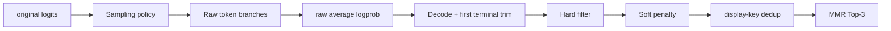

# M08：从 Raw Branch 到稳定 Top-3

> 源码固定点：`9f53740753de36899aa7694cf7dcb5304e58ea54`
>
> Canonical concept：C09
>
> 对应实战课：[P06](../../../practice/lessons/P06-release-gate/README.md)
>
> 核心源码：`python/aios/ime.py::invalid_reasons`、`soft_penalty`、`candidate_key`、`select_top_candidates`、`score_candidates`

## 模型输出不是候选栏

模型只产生 Token 序列和概率。产品还要判断：

```text
能否显示
是否重复
是否自然结束
三条是否过于相似
固定候选排序是否稳定
```



## 1. Sampling Policy 与 Model Score 分离

探索分布会执行：

```text
temperature
Top-k
Top-p
最短长度 stop mask
逐行重复序列 ban
```

最终排序保存修改前的：

```math
\log P_{raw}(token \mid context)
```

候选基础分：

```math
base(c)
=
\frac{1}{|c|}
\sum_t \log P_{raw}(c_t \mid prefix,c_{<t})
-
soft\_penalty(c)
```

若有 hard invalid reason，则 `base=-∞`。

## 2. 当前硬过滤

`invalid_reasons` 主要检查：

```text
empty
too_short
too_long
assistant_template
repeated_ngram
unfinished_fragment
boundary_repeat
```

新版 `boundary_repeat` 不再拒绝所有首尾同字。比如：

```text
Prefix: 今天
Completion: 天气很好
```

是自然连接。当前只在候选以 Prefix 末字的连续重复开头时硬拒绝，例如：

```text
你好 + 好好好……
```

这体现一个原则：硬规则应尽量只覆盖确定禁区，避免误杀自然中文。

## 3. 显示去重

```python
def candidate_key(text):
    return (
        normalize_candidate(text)
        .rstrip("，。！？；：,.!?;:")
        .casefold()
    )
```

以下可归为同一显示项：

```text
我晚点回复。
 我晚点回复
我晚点回复！
```

每个 key 只保留 base score 最高者。

这不是语义去重；不同措辞仍可能高度相似。

## 4. MMR 同时看质量和新增价值

先选 base score 最高候选。之后：

```math
selection(c)
=
base(c)
-
\lambda
\max_{s \in selected}
similarity(c,s)
```

当前 `similarity` 使用字符 bigram Jaccard。

```text
A: 我晚点给你发消息
B: 我晚一点给你发消息
C: 等我回来再联系你
```

B 的模型分可能稍高，但与 A 很像；C 可能为候选栏提供更多新增信息。

`diversity_lambda` 太小会三条同质，太大会为了差异选低质量文本。

## 5. 为什么平均 Logprob 仍不完美

Sum Logprob 天然惩罚更长候选；平均值减少直接长度偏差。但：

```text
长句可用多个高频 Token 稀释一个关键低概率位置
Tokenizer 粒度影响 token 数
标点与常见功能词可能抬高平均分
```

所以仍需要字符上限、硬边界和真实评测。

## 6. 固定候选排序的两条路径

### `shared_decode`

```text
Prefix Prefill 一次
→ 多候选 teacher-forced Decode
→ 共享 Prefix KV
```

节省 Prefix 工作，适合诊断。

### `stable`

```text
每个 prefix+candidate 构成完整序列
→ Flat Varlen Prefill
→ return_all_logits=True
→ gather 每个 candidate token 的 raw logprob
```

更耗 KV，但避免 Prefill/Decode 不同 BF16 Kernel 在极近平局上翻转名次。当前默认固定候选排序使用 `stable`。

## 7. 治理为何会反向影响 Runtime

过滤或去重规则改变：

```text
unique-valid yield
→ adaptive refill 路数
→ active_model_tokens
→ p95
→ Page 使用
```

因此候选治理不是“模型跑完后的免费装饰”。改规则要重跑完整 Top-3 Benchmark。

## 8. 治理不能创造候选

MMR、Filter、Rerank 只能从候选池选择：

```text
池中没有自然候选
→ 治理无法凭空生成
```

若候选长期不足，应检查模型训练、输入合同、采样覆盖和停止边界，而不是不断堆规则。

## 验收

给 8 条自造 Raw Candidate，至少包含：

```text
空串
助手模板
未完句
显示重复
高度相似改写
一条较低分但不同的自然候选
```

手算 hard filter、dedup 和 MMR 的 Top-3。

## 练习题

### 1. 为什么用 temperature 后的概率排序会出问题？

<details>
<summary>参考答案</summary>

Temperature 改变概率尺度，不同 refill 轮使用不同温度时分数不可比。排序应保存模型原始分布对已采 Token 的 logprob。
</details>

### 2. 为什么 display-key dedup 不能替代 MMR？

<details>
<summary>参考答案</summary>

Dedup 只合并空白或标点差异等显示等价项；不同文本仍可能是同一句的轻微改写，需要相似性惩罚控制整体多样性。
</details>

### 3. 为什么 `stable` 评分更耗 KV？

<details>
<summary>参考答案</summary>

它为每个完整 prefix+candidate 序列分别分配 Page 并一次 Prefill，不能像 shared decode 那样只保存一份 Prefix KV。
</details>

### 4. 修改 `max_candidate_chars` 后要重跑哪些 Lane？

<details>
<summary>参考答案</summary>

至少重跑候选结构、adaptive refill、完整 Top-3 性能和人工语义。它会改变过滤率、路数、尾延迟与可读性。
</details>
