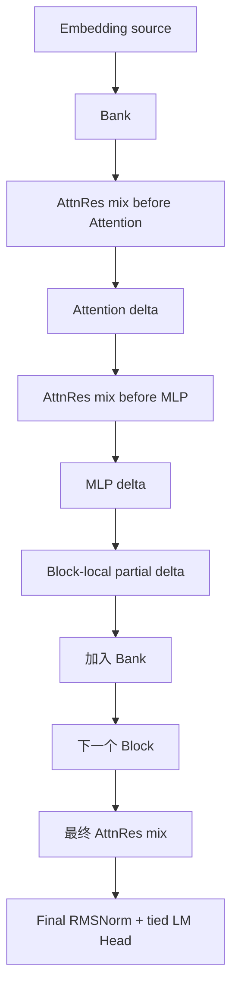

# M09：0.214B Block AttnRes 主干

> 源码固定点：`9f53740753de36899aa7694cf7dcb5304e58ea54`
>
> Canonical concept：C10
>
> 对应实战课：[P04](../../../practice/lessons/P04-model-matrix/README.md)、[P05](../../../practice/lessons/P05-profile-attnres/README.md)
>
> 核心源码：`python/aios/models/minimind_ime.py`

## 标准残差与深度路由的差别

标准 Transformer 常写：

```text
h = h + Attention(Norm(h))
h = h + MLP(Norm(h))
```

Block AttnRes 不只保留单一累计 `h`，而维护一个跨 Block 的 source bank，并在每次子层前按 Token 动态混合深度来源。



## 1. 当前架构

0.214B 路径：

```text
32 Transformer layers
8 blocks
每 block 4 layers
每 layer 2 次 Mixer
最后 1 次 Mixer
```

总数：

```math
8 \times 4 \times 2 + 1 = 65
```

Bank 最多保留：

```text
Embedding
+ 8 个 Block delta
= 9 sources
```

## 2. Mixer 数学

对 source bank：

```text
bank shape = [S, N, D]
S: depth sources
N: active tokens
D: hidden size
```

每个 source 的路由分数：

```math
score_{s,n}
=
q^\top RMSNorm(x_{s,n})
```

沿 source depth 做 Softmax：

```math
w_{s,n}
=
\frac{\exp(score_{s,n})}
{\sum_j \exp(score_{j,n})}
```

混合：

```math
mixed_n
=
\sum_s w_{s,n} x_{s,n}
```

权重随 Token 改变，不是一个全局固定层权重。

## 3. `bank` 与 `partial`

一个 Block 内，完成的历史 Block delta 已进入 `bank`。当前 Block 中正在累积的 Attention/MLP delta 使用 `partial [N,D]` 单独传入。

```python
hidden_states = attn_res_mixer(
    bank,
    partial,
)
attention_delta = self_attn(
    input_layernorm(hidden_states),
    ...
)
partial = attention_delta if partial is None else partial + attention_delta

hidden_states = mlp_res_mixer(
    bank,
    partial,
)
mlp_delta = mlp(
    post_attention_layernorm(hidden_states)
)
return partial + mlp_delta
```

若每次把 `partial` 与 `bank` 做大 `torch.cat`，65 次调用会反复分配和复制 `[S,N,D]` Tensor。当前接口让热路径直接接受两块输入。

## 4. 为什么 `alpha=1` 是部署门禁

当前实现明确是 inference-only `alpha=1` 路径：

```text
只计算 AttnRes 混合
不再构造无效 standard residual sum
```

若训练快照使用其他 alpha 或混合公式，不能由当前 Runtime 静默近似。Exporter 应拒绝。

## 5. Bank Scratch 预分配

模型 Forward 开始时：

```python
bank_storage = torch.empty(
    (num_blocks + 1, *hidden_states.shape),
    dtype=hidden_states.dtype,
    device=hidden_states.device,
)
score_storage = torch.empty(
    (num_blocks + 1, hidden_states.shape[0]),
    dtype=torch.float32,
    device=hidden_states.device,
)
mixed_storage = torch.empty_like(hidden_states)
```

好处：

```text
Forward 内不反复增长 bank
Mixer 复用 score/output scratch
减少 allocator 抖动
明确最大 source 容量
```

## 6. 不能跨层合并 65 次 Mixer

每次 Mixer 的输入依赖刚产生的 Attention 或 MLP delta：

```text
mix
→ Attention delta
→ 更新 partial
→ mix
→ MLP delta
→ 更新 partial
```

后一次路由权重依赖新的 source 内容，不能提前把所有 Mixer 合成一次矩阵运算。优化空间在单个 Mixer 的中间张量、Kernel 和 Scratch，而不是删除语义依赖。

## 7. 与其他模型组件的边界

Block AttnRes 改变：

```text
Residual trunk
Depth source selection
```

保留：

```text
Qwen3 Attention
RoPE
QK Norm
SwiGLU
Paged KV
Tokenizer
LM Head 格式
CandidateGroup Runtime
```

因此可以复用已有推理基础设施，又必须单独验证 residual weights 与 block 配置。

## 8. 为什么架构能力不能直接等于候选质量

0.214B 有更多参数与深度路由，但是否值得默认使用取决于：

```text
人工接受度增益
完整 Top-3 p95
显存
首轮有效产出
目标设备
```

架构课解释“怎样算”，不替代 P04/M11 的产品证据。

## 验收

对 `S=3,N=2,D=4` 的小 Bank，写出：

```text
每个 Token 的 3 个 score
Softmax 轴
输出 Shape
partial 加入后 total_sources
为什么不同 Token 可选不同深度
```

## 练习题

### 1. 为什么 Softmax 沿 source depth，而不是 hidden 维？

<details>
<summary>参考答案</summary>

路由选择的是不同深度来源的权重；hidden 维是每个 source 的特征通道。沿 hidden Softmax 会改变向量内部语义，而不是选择 source。
</details>

### 2. 为什么 Bank 只在每个 Block 结束后增加一个 source？

<details>
<summary>参考答案</summary>

当前设计把 Block 内四层的增量累计为一个 block-local delta，控制 source depth 最多为 embedding + 8 blocks；若每层都入 Bank，容量与路由语义都会改变。
</details>

### 3. 为什么 `partial` 不直接写入 Bank 最后一格？

<details>
<summary>参考答案</summary>

Block 内 partial 每层都变化，尚未成为稳定 Block source。独立传入避免频繁复制/覆盖 Bank，并明确历史 source 与当前增量的所有权。
</details>

### 4. 哪些权重证明一个 checkpoint 真的是 AttnRes？

<details>
<summary>参考答案</summary>

除标准层权重外，还要有各 Mixer 的 query、key norm、正确 block/layer 划分与 residual 配置；缺失时不能仅凭模型名推断。
</details>
