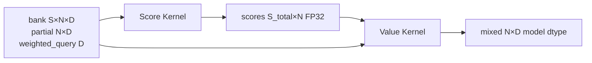

# M10：两段 Triton Kernel 与数值合同

> 源码固定点：`9f53740753de36899aa7694cf7dcb5304e58ea54`
>
> Canonical concept：C11
>
> 对应实战课：[P05](../../../practice/lessons/P05-profile-attnres/README.md)
>
> 核心源码：`python/aios/kernel/attnres.py`、`python/aios/models/minimind_ime.py::BlockAttnResMixer`

## 优化对象

朴素实现容易物化：

```text
normalized_bank [S,N,D]
logits          [S,N]
weights         [S,N]
mixed           [N,D]
```

65 次 Mixer、短 active rows 下，临时 Tensor、Python 调用与 Kernel launch 会成为显著成本。

当前 Triton 路径拆为两个职责清晰的 Kernel：



## 1. 为什么先合并 Query 与 Key-Norm 权重

原分数：

```math
q^\top \left(RMS(x) \odot \gamma\right)
```

可以改写为：

```math
(q \odot \gamma)^\top RMS(x)
```

`weighted_query = query * key_norm.weight` 可缓存，避免每个 source 物化完整 normalized bank。

```python
cached = (
    self.query.float()
    * self.key_norm.weight.float()
).contiguous()
```

只要 query/weight device 或 Shape 不变即可复用。

## 2. Score Kernel

Grid：

```text
program_id(0) = source_index
program_id(1) = token_index
```

每个 Program 读取一个 `source[token]` 的全部 hidden 通道：

```python
source = load(bank[source, token, :]).float()
weighted_query = load(query[:]).float()

square_sum = sum(source * source)
numerator = sum(source * weighted_query)
inverse_rms = rsqrt(square_sum / hidden_size + eps)

score[source, token] = numerator * inverse_rms
```

输出只有 `[S_total,N]` FP32，不生成 `[S,N,D]` normalized bank。

## 3. `partial` 怎样进入同一逻辑 source 轴

Kernel 使用：

```text
bank_sources
total_sources = bank_sources + has_partial
```

当 `source_index == bank_sources` 时，从独立 `partial_ptr` 读取；否则从连续 Bank 读取。

这让语义上是 `[bank; partial]`，物理上不需要 `torch.cat`。

## 4. Value Kernel

Grid：

```text
program_id(0) = token_index
program_id(1) = hidden block
```

每个 Program：

1. 读取该 Token 的所有 source score；
2. 沿 source 轴做稳定 Softmax；
3. 读取各 source 对应 hidden tile；
4. 加权求和并写 `output[token, hidden_tile]`。

```python
scores -= max(scores)
exp_scores = exp(scores)
weights = exp_scores / sum(exp_scores)
mixed = sum(values * weights[:, None], axis=0)
```

hidden tile 当前为 128，source block 为 `next_power_of_2(total_sources)`。

## 5. 为什么 Softmax 权重要转回模型 dtype

源码明确：

```python
weights = (
    exponentials / tl.sum(exponentials, axis=0)
).to(bank_ptr.dtype.element_ty)
```

训练语义会把深度 Softmax 权重转回 BF16/FP16 再聚合。若推理保持 FP32 weights，单次误差可能更小，但 65 次 Mixer 后近似路径与训练不一致，可能改变近平局 Logits。

数值合同不是“越高精度越正确”，而是“与目标训练/参考路径在明确容差下保持行为一致”。

## 6. Scratch Buffer 合同

`triton_attnres_mix` 可以接受：

```text
score_buffer  [capacity_sources, N] FP32 CUDA contiguous
output_buffer [N,D] 与 bank dtype/device 一致
```

若不传则临时分配。模型主干预分配并复用，减少 65 次 allocator 开销。

所有 Shape、dtype、device、contiguous 条件都在 Python wrapper 中显式验证，避免 Kernel 读取错误布局。

## 7. 为什么 `num_tokens` 不参与 Specialization

装饰器：

```python
@triton.jit(do_not_specialize=["num_tokens"])
```

输入法 Ragged Decode 的 active row 会频繁从 8 收缩到 7、4、1。若每个 N 都生成新 specialized Kernel，运行时可能出现 JIT 抖动。

不 specialize N 用一些编译期常量机会换取动态短 Shape 稳定性。是否值得仍需实际 Profile。

## 8. 为什么不是一个 Kernel

Score 阶段沿 hidden 归约产生小 `[S,N]`；Value 阶段沿 source 归约并覆盖 hidden tiles。二者的并行轴和数据复用不同。

强行合成一个 Kernel 可能：

```text
重复计算 score
增加寄存器压力
需要跨 Program 同步
降低 occupancy
```

“两 Kernel”并不等于没有融合价值；它是在当前 Shape 下选择更清晰的中间边界。

## 9. 数值等价门禁

冻结报告不宣称 bitwise 等价，而记录：

```text
完整词表 logits max/mean absolute diff
cosine similarity
Top-1/3/10/50 token 集合
固定 8 路候选文本
Token 数、停止原因、过滤结果
average logprob 最大差
```

优先级：

```text
离散产品行为一致
→ 排序与 Top-k 一致
→ 数值误差在明确阈值
→ 性能与显存有收益
```

## 10. 需要补测的 Shape

课程冻结 Profile 使用 `N=8,D=768`，但真实 Runtime 还会出现：

```text
N = 1,2,3,4,5,6,7,8
source depth = 1...9
有/无 partial
Prefill 的更大 N
```

内核验证必须覆盖边界，而不是只测最快的一个 Shape。

## 验收

画出：

```text
Score Kernel 的 program grid 与每个 Program 读写范围
Value Kernel 的 program grid 与每个 Program 读写范围
score/output scratch 的生命周期
```

并解释为什么中间 `[S,N]` 是可接受的，而 `[S,N,D]` normalized bank 是主要应避免对象。

## 练习题

### 1. 为什么 Score Kernel 使用 FP32 reduction？

<details>
<summary>参考答案</summary>

RMS 平方和与点积沿 hidden 维累加，BF16 容易产生较大累计误差。FP32 reduction 提供稳定分数，再按训练合同把 Softmax 权重转换回模型 dtype。
</details>

### 2. 为什么 wrapper 要求 Bank contiguous？

<details>
<summary>参考答案</summary>

Kernel 的指针偏移假设 `[S,N,D]` 连续布局。非连续 Tensor 的逻辑索引与物理 stride 不符，若不拒绝会静默读错。
</details>

### 3. `do_not_specialize(num_tokens)` 可能有什么代价？

<details>
<summary>参考答案</summary>

编译器不能针对固定 N 完全展开或裁剪某些逻辑，单个 Shape 的峰值性能可能略低；收益是减少动态 active rows 下的编译版本与 JIT 抖动。
</details>

### 4. 为什么数值 max diff 很小仍要比较候选文本？

<details>
<summary>参考答案</summary>

采样、Top-k 和近平局排序是离散操作，小误差也可能跨过边界改变 Token 或候选。产品行为比平均误差更直接。
</details>
