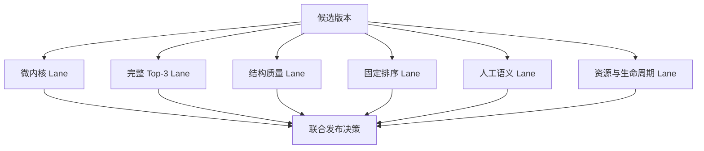

# M11：性能、结构、排序与语义证据分层

> 源码固定点：`9f53740753de36899aa7694cf7dcb5304e58ea54`
>
> Canonical concept：C12
>
> 对应实战课：[P04](../../../practice/lessons/P04-model-matrix/README.md)、[P06](../../../practice/lessons/P06-release-gate/README.md)
>
> 核心证据：`benchmark/bench_ime.py`、`reports/aios_ime_attnres_refill_20260821.md`、`reports/aios_ime_short_prefix_matrix_20260821.md`

## 一条数字为什么不够

同一个版本可能：

```text
Mixer 快 4×
完整 Top-3 只快 1.5×
满三条 100%
人工候选仍不自然
固定排序持平
开放生成却出现新违规
```

这些结论不冲突，因为评测对象不同。



## 1. 微内核 Lane

对象：

```text
65 次 AttnRes Mixer
固定 N、D、source depth 模式
```

指标：

```text
pipeline latency
CUDA self time
active tokens/s
临时 peak allocated
Kernel 数
```

它回答“这个算子实现怎样”，不能直接回答“用户多久看到 Top-3”。

## 2. 完整 Top-3 Lane

`bench_ime.py` 计时覆盖：

```text
Prefix 处理
CandidateGroup 多步 Decode
CPU Decode
截断、过滤、去重、MMR
必要时 refill
```

不包含：

```text
模型加载
第一次 JIT/初始化
```

核心指标：

```text
wall p50 / p95
GPU p50 / p95
active_model_tokens/s
实际 sampling attempts
refill rounds
peak allocated
```

输入法对尾延迟敏感，p50 不能替代 p95。

## 3. 固定 8 路与自适应 8→24

### 固定 8 路

回答：

```text
模型首轮候选有效率
固定工作量下的后端 A/B
```

### 自适应

回答：

```text
产品恢复后候选栏是否完整
困难样本支付多少额外路数与尾延迟
```

必须同时报告，避免用恢复策略掩盖模型首轮问题，或用固定预算低估产品可用性。

## 4. 结构质量 Lane

可自动统计：

```text
满三条率
三条互异率
invalid reasons
duplicate 数
契约违规
候选长度
stop reason
```

这些指标回答“候选栏结构是否符合规则”，不回答“建议是否贴心、自然、有用”。

## 5. 固定候选排序 Lane

给定同一组候选，比较：

```text
acceptable Top-1
pairwise
same-pinyin ranking
逐 Token raw logprob
```

它能隔离 Runtime 数值路径是否破坏已知排序，但不覆盖开放采样、候选覆盖与停止。

## 6. 人工语义 Lane

需要固定标注规则，例如：

```text
可直接接受
轻微编辑可接受
不贴合上下文
语气不自然
重复或信息增量不足
元文本/指令污染
事实或安全问题
```

最好保存逐候选理由，而不是只留一个总分。规则变化也要版本化。

## 7. 资源与生命周期 Lane

测试：

```text
Candidate suffix Page 每轮释放
Prefix Page 只保留当前上下文
latest-wins 旧组停止
异常路径 finally 回收
reset 后 available pages 全部归还
```

泄漏可能在单次功能测试中不出现，必须多轮或直接断言资源不变量。

## 8. 当前冻结数字怎样读

### AttnRes 报告

仓库报告记录：

```text
Eager 65-Mixer: 17.34 ms
Triton 65-Mixer: 4.02 ms
固定 8 路 Top-3 p50: 389.47 → 254.99 ms
固定 8 路 Top-3 p95: 422.43 → 261.44 ms
```

这说明热路径收益传递到端到端，但比例变小。

### 自适应补采样报告

在报告所用 DS validation 上：

```text
固定 8 路满三条且互异: 23.33%
自适应最多 24 路: 100%
平均实际路数: 13.60
p50/p95: 251.70/285.78 → 505.54/557.24 ms
```

结论是完整率与尾延迟发生明确交换，不是“自适应全面更快”。

### 五模型矩阵

专用模型在冻结短 Prefix 合同下没有规则定义的契约违规；通用模型出现不同程度元文本/跨脚本污染。它说明训练合同与 Prompt 适配重要，不说明通用模型在其他任务无能力。

以上均是仓库冻结报告；源码或环境变化后必须重跑。

## 9. 证据的最小可复现记录

每次报告至少保存：

```text
source SHA
model/tokenizer SHA
GPU
PyTorch/CUDA/Triton/FlashInfer
dtype
eval data SHA 与样本数
warmup
seed
完整 ImeGenerationConfig
计时边界
原始逐样本 JSON
聚合脚本版本
```

没有这些元数据，同名 p95 无法可信比较。

## 10. 推断与事实分开

事实：

```text
在某设备、某数据、某配置下测得 p95=...
```

推断：

```text
因此目标用户可能感到更顺滑
```

后者需要产品预算或用户实验支持。报告中应显式标注推断，不把它写成测量事实。

## 验收

拿一个“p50 降低 20%，满三条率下降 5%，显存增加 50 MiB”的虚构版本，写出：

```text
哪些 Lane 通过
哪些 Lane 失败
还缺哪些证据
最终是 release / experimental / reject
```

## 练习题

### 1. 为什么 tokens/s 高不能代表输入法体验好？

<details>
<summary>参考答案</summary>

用户等待的是一次按键的完整候选栏。吞吐可能高，但某些分支过长、补采样或治理导致 p95 很高，体验仍卡顿。
</details>

### 2. 为什么固定排序持平不能证明开放生成持平？

<details>
<summary>参考答案</summary>

固定排序控制候选集合，只测条件概率排序；开放生成还包含采样、停止、候选覆盖、过滤、去重与 refill。
</details>

### 3. 为什么逐样本结果比只留 Markdown 表重要？

<details>
<summary>参考答案</summary>

逐样本数据可以定位尾部 Prefix、过滤原因、补采样轮数和契约违规；聚合表无法支持后续根因分析或规则重算。
</details>

### 4. 什么时候旧 Benchmark 仍可引用？

<details>
<summary>参考答案</summary>

可以作为明确标注的历史基线；若要声称当前版本表现，则源码、模型、数据、配置、设备和计时边界都必须仍一致，或重新运行。
</details>
