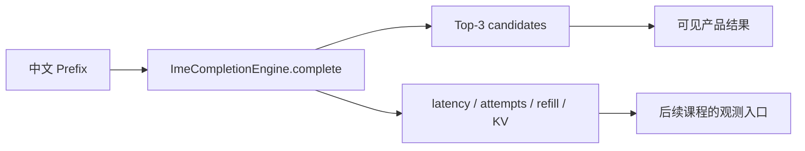

# P01：十分钟跑出第一组 Top-3

> 源码固定点：`9f53740753de36899aa7694cf7dcb5304e58ea54`
>
> 本课产物：一个可复现的 `prefix → Top-3 JSON`。
>
> 对应概念：C01；下一步源码课：[M01 Runtime 地图](../../../mechanism/lessons/M01-runtime-map/README.md)。

## 这次先解决什么

先不讲 Page Table、Ragged Decode 或 AttnRes。第一步只回答：

> 给定一个裸中文前缀，AIOS-IME 能否返回三条可直接进入候选栏的结果，并把耗时、采样路数和资源状态一起暴露出来？



## 1. 环境准备

项目要求 Python 3.10+、CUDA、PyTorch、FlashInfer 和 Triton。先在仓库根目录安装：

```bash
python -m pip install -e .
```

模型目录至少应包含：

```text
model.safetensors
config.json
tokenizer.json 或可被 AutoTokenizer 读取的 tokenizer 文件
```

模型包必须是 AIOS 能识别的导出包；不要直接把训练 checkpoint 路径当作部署目录。

## 2. 最小运行命令

课程自带脚本：

```bash
python course/aios-ime/scripts/run_top3.py \
  --model /path/to/minimind-ime-aios \
  --prefix "没关系，你先忙你的，" \
  --seed 20260814
```

第一次运行可能包含模型加载、Kernel 初始化或 JIT。它适合证明功能，不适合直接当正式性能结果。

## 3. README 内的完整最小代码

```python
from aios import ImeCompletionEngine, ImeGenerationConfig, LLM

llm = LLM(
    "/path/to/minimind-ime-aios",
    kv_cache_max_tokens=256,
    attention_workspace_size=1 * 2**20,
    attnres_backend="triton",
)
engine = ImeCompletionEngine(llm)

config = ImeGenerationConfig(
    display_candidates=3,
    sampling_attempts=8,
    max_sampling_attempts=24,
    max_new_tokens=12,
    seed=20260814,
)

result = engine.complete("没关系，你先忙你的，", config)

for index, candidate in enumerate(result.candidates, start=1):
    print(index, candidate.text, candidate.average_logprob)

print("latency_ms =", result.latency_ms)
print("sampling_attempts =", result.sampling_attempts)
print("refill_rounds =", result.refill_rounds)
print("reused_prefix_tokens =", result.reused_prefix_tokens)
print("refill_stop_reason =", result.refill_stop_reason)

engine.reset_prefix_cache()
```

这段代码的关键不是 `print`，而是三个对象的职责：

| 对象 | 输入 | 负责的状态 | 输出 |
|---|---|---|---|
| `LLM` | 模型包、显存预算、后端 | 模型、Tokenizer、KV Pool、Context | 可执行 Runtime |
| `ImeGenerationConfig` | 候选合同 | 显示数、探索预算、停止与采样参数 | 一次按键的配置 |
| `ImeCompletionEngine` | Prefix + Config | 持久 Prefix Cache、generation、候选组 | `ImeCompletionResult` |

## 4. 先读结果，不急着读内部实现

`ImeCompletionResult` 至少要观察这些字段：

```text
candidates                最终显示候选
raw_candidates            治理前的原始候选池
sampling_attempts          实际生成了多少路
refill_rounds              是否补采样、补了几轮
valid_unique_candidates    过滤和显示去重后的有效数量
invalid_candidates         被硬规则拒绝的数量
duplicate_candidates       显示等价的重复数量
latency_ms                 完整墙钟
gpu_latency_ms             GPU 区间
unique_kv_pages            本轮峰值唯一 Page 数
reused_prefix_tokens       跨按键复用 Token 数
refill_stop_reason         filled / max_attempts / deadline / cancelled
```

不要把 `raw_candidates` 直接显示给用户。它们还可能包含重复、未完成片段或助手模板。

## 5. 正常输出怎样判断

本课不固定具体中文，因为模型包与随机 seed 会影响文本。验收的是合同：

```text
result.cancelled == False
1 <= len(result.candidates) <= 3
每个 candidate.text 非空
最终候选之间显示 key 不重复
sampling_attempts <= max_sampling_attempts
reset_prefix_cache 后没有异常
```

若不足三条，先记录 `invalid_candidates`、`duplicate_candidates` 和 `refill_stop_reason`，不要立即把问题归因于“模型太小”。

## 6. 常见失败

### `AIOS only supports CUDA execution`

当前 Runtime 只接受 CUDA device。CPU 课程实验可以解释机制，但不能运行真实模型。

### 模型能加载，却输出异常文本

优先检查模型导出包与 Tokenizer 是否属于同一份部署合同，而不是先改采样参数。

### 首次运行特别慢

可能包含模型加载、Kernel 规划或 JIT。正式性能必须使用预热、固定数据和统一计时边界。

### 结果只有一两条

这是 P02 的触发问题。先保留完整 JSON，不要手工补齐候选。

## 验收

在自己的模型上保存一份结果 JSON，并能回答：

```text
输入 Prefix 是什么？
最终显示几条？
实际生成几路？
是否发生 refill？
候选不足来自 invalid、duplicate，还是达到预算？
本次数字包含模型加载吗？
```

## 练习题

### 1. 为什么本课直接使用 `ImeCompletionEngine.complete()`，而不是 `LLM.generate()`？

<details>
<summary>参考答案</summary>

`LLM.generate()` 表达通用请求生成；`complete()` 表达一次输入法按键的组级语义，包括共享 Prefix、多路候选、治理、补采样、latest-wins 和 Top-3 结果。只调用通用生成接口会丢掉候选组合同。
</details>

### 2. 为什么第一次运行的 `latency_ms` 不能直接放进性能表？

<details>
<summary>参考答案</summary>

第一次运行可能混入模型加载、Kernel 初始化、JIT、allocator 预热等一次性成本。正式比较必须先预热，并让所有方案使用相同数据、设备、配置和计时边界。
</details>

### 3. `sampling_attempts=8` 是否意味着一定会显示八条？

<details>
<summary>参考答案</summary>

不会。八路是首轮探索池；候选还要经过截断、硬过滤、显示去重和 MMR，最终只返回 `display_candidates=3` 条。
</details>

### 4. 为什么最后要调用 `reset_prefix_cache()`？

<details>
<summary>参考答案</summary>

`ImeCompletionEngine` 会跨按键保留当前用户的 Prefix KV。脚本退出前显式释放可以验证生命周期，也避免交互式进程长期持有上一上下文。
</details>
