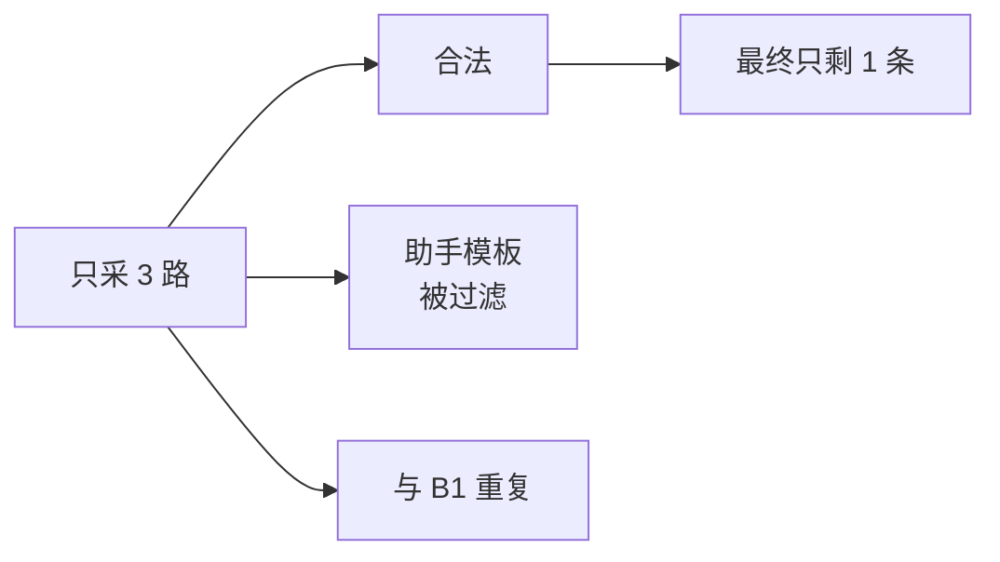
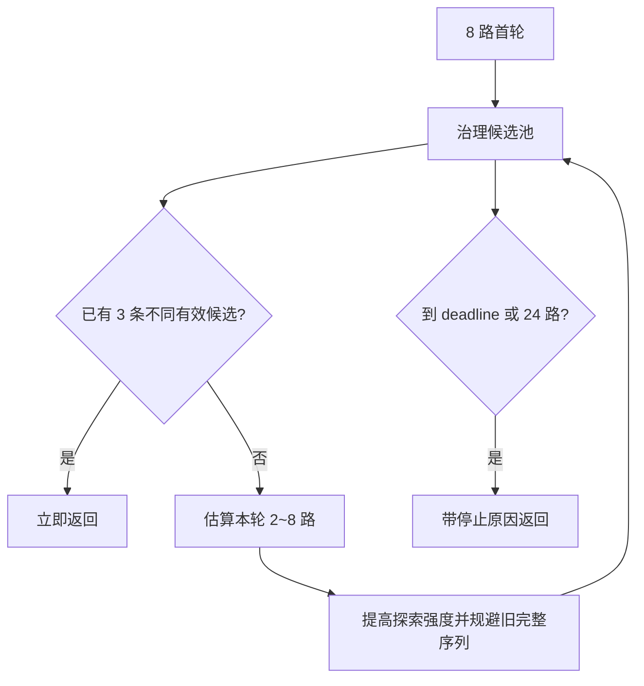

# P02：从固定三路到自适应候选池

> 源码固定点：`9f53740753de36899aa7694cf7dcb5304e58ea54`
>
> 上一阶段：P01 已能返回 Top-3。
>
> 本课产物：同一 Prefix、同一 seed 下的 `3 路 / 8 路 / 8→24 自适应` 对比记录。
>
> 深入机制：[M03](../../../mechanism/lessons/M03-candidate-group-kv/README.md)、[M04](../../../mechanism/lessons/M04-ragged-rng/README.md)、[M05](../../../mechanism/lessons/M05-adaptive-refill/README.md)。

## 观察到的问题

候选栏只显示三条，很容易写出：

```python
ImeGenerationConfig(
    display_candidates=3,
    sampling_attempts=3,
    max_sampling_attempts=3,
)
```

但三条原始分支中，只要一条非法或两条显示等价，最终候选栏就不完整。



本课不先假设“多生成越好”，而是做三个可运行阶段。

## 1. 三种配置

```python
fixed_3 = ImeGenerationConfig(
    display_candidates=3,
    sampling_attempts=3,
    max_sampling_attempts=3,
    refill_batch_size=3,
    max_new_tokens=12,
    seed=20260814,
)

fixed_8 = ImeGenerationConfig(
    display_candidates=3,
    sampling_attempts=8,
    max_sampling_attempts=8,
    refill_batch_size=8,
    max_new_tokens=12,
    seed=20260814,
)

adaptive = ImeGenerationConfig(
    display_candidates=3,
    sampling_attempts=8,
    max_sampling_attempts=24,
    refill_batch_size=8,
    min_refill_batch_size=2,
    max_new_tokens=12,
    seed=20260814,
)
```

运行课程脚本：

```bash
python course/aios-ime/scripts/compare_candidate_budget.py \
  --model /path/to/minimind-ime-aios \
  --prefix "回头"
```

脚本会在每个方案前清空持久 Prefix Cache，避免后运行的方案因为 token-LCP 复用获得不公平优势。它仍是单样例观察，不是正式 Benchmark。

## 2. 比较什么

不要只比较最终候选文本。至少记录：

| 字段 | 回答的问题 |
|---|---|
| `len(candidates)` | 候选栏是否完整 |
| `valid_unique_candidates` | 过滤后真正有多少条不同候选 |
| `invalid_candidates` | 模型输出有多少被硬拒绝 |
| `duplicate_candidates` | 候选池是否浪费在显示重复上 |
| `sampling_attempts` | 为本次结果实际支付多少分支 |
| `refill_rounds` | 是否进入恢复路径 |
| `refill_stop_reason` | 为什么停止继续探索 |
| `latency_ms` | 完整 Top-3 墙钟 |
| `active_model_tokens` | 实际模型工作量 |

## 3. 自适应方案解决了什么

当前逻辑不是固定补到 24 路：

```text
首轮 8 路
→ 过滤 + 显示去重
→ 计算 Top-3 deficit
→ 根据当前 unique-valid yield 估算下一轮
→ 每轮补 2～8 路
→ 满三条 / deadline / 24 路预算时停止
```



关键点是：**显示缺口由治理后的候选池决定，不由原始分支数决定。**

## 4. 为什么不无条件生成 24 路

无条件 24 路会让所有按键支付最坏成本，即使首轮已经有三条好候选。

自适应方案保留：

```text
简单样例：8 路后直接返回
困难样例：按缺口追加少量分支
极端样例：受 24 路或 deadline 约束
```

这是按结果触发的恢复路径，而不是默认主路径。

## 5. 一次实验不能得出什么

单个 Prefix 不能证明：

- 8 路一定优于 3 路；
- 自适应一定降低延迟；
- 满三条率高就代表语义好；
- 某个模型在全部输入上更适合。

正式结论需要 P04/P06 的冻结数据与证据门禁。

## 6. 常见错误

### 用不同 seed 比较三种方案

这会把候选池差异和随机样本差异混在一起。先固定 seed，再扩展到多 seed。

### 不清空 Prefix Cache

后运行方案可能复用前一个方案的 Prefix KV，延迟不可比。

### 只看 Top-1

候选栏是组级产品。Top-1 好但另外两条重复或非法，仍然没有完成合同。

## 验收

输出一张自己的表：

| 方案 | 最终条数 | 有效唯一 | invalid | duplicate | 实际路数 | refill | latency |
|---|---:|---:|---:|---:|---:|---:|---:|
| 3 路 |  |  |  |  |  |  |  |
| 8 路 |  |  |  |  |  |  |  |
| 8→24 |  |  |  |  |  |  |  |

并用一句话说明：当前 Prefix 的主要失败模式是无效、重复还是候选覆盖不足。

## 练习题

### 1. 为什么 `valid_candidates=3` 仍可能不能显示三条？

<details>
<summary>参考答案</summary>

三条合法候选可能在去空白、去尾标点后拥有相同显示 key。最终候选栏要求不同显示项，所以还要看 `valid_unique_candidates`。
</details>

### 2. 为什么 adaptive refill 要在治理后计算，而不是 Decode 完立即补八路？

<details>
<summary>参考答案</summary>

只有治理后才知道哪些分支可显示、哪些重复。若首轮已经有三条不同有效候选，继续生成只增加延迟和计算。
</details>

### 3. 什么时候 `refill_deadline_ms` 比 `max_sampling_attempts` 更重要？

<details>
<summary>参考答案</summary>

当产品有严格按键延迟预算时，即使探索路数还没用完，也应在墙钟到达预算后停止。路数约束控制计算规模，deadline 控制用户等待。
</details>

### 4. 为什么“实际平均 13.6 路”不能解释为每次都生成 14 路？

<details>
<summary>参考答案</summary>

它是样本集合的平均值。简单样本可能只用 8 路，困难样本可能经过多轮接近 24 路；必须同时看分布和尾延迟。
</details>
