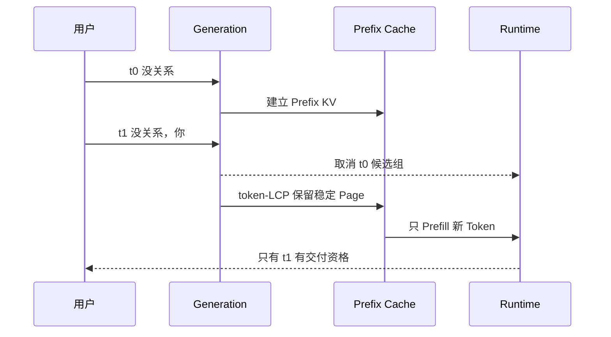

# P03：连续输入、Prefix 复用与旧请求失效

> 源码固定点：`9f53740753de36899aa7694cf7dcb5304e58ea54`
>
> 上一阶段：单次按键的候选池已经可控。
>
> 本课产物：一条连续输入 trace，记录每次按键的 `generation_id`、`reused_prefix_tokens` 和停止原因。
>
> 深入机制：[M06 token-LCP](../../../mechanism/lessons/M06-token-lcp/README.md)、[M07 latest-wins](../../../mechanism/lessons/M07-latest-wins/README.md)。

## 真实需求

用户不会只提交一次 Prefix：

```text
t0：没关系
t1：没关系，你
t2：没关系，你先忙
t3：没关系，你先忙你的，
```

系统需要同时完成两件方向相反的事：

```text
稳定历史 Token 的 KV：尽量保留
旧按键的候选分支与交付资格：尽快失效
```



## 1. 运行连续 Prefix Trace

```bash
python course/aios-ime/scripts/trace_typing.py \
  --model /path/to/minimind-ime-aios
```

默认序列：

```text
没关系
没关系，你
没关系，你先忙
没关系，你先忙你的，
```

也可以重复传入：

```bash
python course/aios-ime/scripts/trace_typing.py \
  --model /path/to/model \
  --prefix "回" \
  --prefix "回头" \
  --prefix "回头我再" \
  --prefix "回头我再确认一下"
```

## 2. 关键代码

```python
engine = ImeCompletionEngine(llm)

for prefix in prefixes:
    result = engine.complete(prefix, config)
    print(
        result.generation_id,
        result.prefix_tokens,
        result.reused_prefix_tokens,
        result.latency_ms,
        [item.text for item in result.candidates],
    )
```

同一个 `engine` 必须跨按键存活，才能保留 `_prefix_token_ids`、`_prefix_pages` 和 `_prefix_logits`。每次重新构造 Engine 会让复用率永远为零。

## 3. 先看四种变化

| 新输入相对旧输入 | 预期行为 |
|---|---|
| Token IDs 完全相同 | 复用全部 Prefix Page 和末位 Logits |
| 只在尾部追加 | 保留 LCP，只 Prefill 新 Token |
| 尾部重切或改写 | 保留稳定 LCP，释放旧尾页，再算新尾部 |
| 严格 Backspace 到旧 Token 前缀 | 当前为精确末位 Logits 重新 Prefill |

字符上看是追加，不代表 Token ID 一定追加。Tokenizer 可能重切尾部，所以验收字段是 `reused_prefix_tokens`，不是复用字符数。

## 4. latest-wins 不能只靠顺序脚本证明

上面的脚本展示 Prefix 复用，但它是串行调用。真正的旧组取消需要在旧生成仍运行时发起新 generation。

仓库已有 GPU 测试：

```bash
AIOS_IME_MODEL=/path/to/model pytest -q \
  tests/test_ime_gpu.py::test_latest_generation_cancels_old_group_and_frees_pages
```

它验证：

```text
旧 token 被 cancel
→ 旧组在 token-step 边界停止
→ 旧 suffix Page 释放
→ 新组能正常运行
→ reset 后全部 Page 归还
```

不要把“最终没显示旧结果”当作完整取消证据；还要证明计算止损和资源回收。

## 5. 为什么稳定 Prefix Page 不随旧组一起清空

旧候选分支已经过时，但旧 Prefix 的前半段很可能仍是新输入的一部分：

```text
旧：没关系，你先忙
新：没关系，你先忙你的，
```

若取消时清空全部 Prefix KV，新按键就失去增量 Prefill。正确边界是：

```text
取消 CandidateGroup 与输出资格
保留候选可能继承的 Prefix Cache
由新 token-LCP 决定哪些 Page 继续存在
```

## 6. 本课的性能观察边界

短 Prefix 上减少几个 Token 的 Prefill，不保证墙钟显著下降。固定开销可能来自：

```text
Python 调度
Page 分配
FlashInfer metadata / plan
Kernel launch
同步
```

因此先证明复用**正确**，再用长短 Prefix A/B 判断是否值得进一步优化。

## 验收

保存一条 trace，并解释每一行：

```text
generation_id 为什么递增？
reused_prefix_tokens 为什么不是字符数？
哪一次发生尾部重切？
严格 Backspace 为什么可能重新 Prefill？
串行 trace 为什么不能单独证明旧 GPU 计算被取消？
```

## 练习题

### 1. 为什么 `new_text.startswith(old_text)` 不是安全复用条件？

<details>
<summary>参考答案</summary>

Tokenizer 可能因更长上下文重切尾部。只有旧、新 Token ID 的最长公共前缀对应完全相同的模型输入语义，才能安全保留对应 KV。
</details>

### 2. 为什么取消旧 generation 时不直接释放全部 Prefix Page？

<details>
<summary>参考答案</summary>

Prefix KV 的生命周期与候选 suffix 不同。新输入通常继承旧输入的大段稳定 Token；应先取消旧候选，再由新 Token LCP 决定 Page 去留。
</details>

### 3. 为什么严格 Backspace 当前需要重新 Prefill？

<details>
<summary>参考答案</summary>

系统保留旧 Prefix 的末位 next-token Logits，但 Backspace 后需要更早位置作为末位时的 Logits。KV 本身不能直接恢复 Final Norm 和 LM Head 的历史输出，所以当前重算以保证精确。
</details>

### 4. latest-wins 的三个验收维度是什么？

<details>
<summary>参考答案</summary>

旧结果失去交付资格；旧计算尽快在可控边界停止；无论正常、取消还是异常路径，临时 suffix Page 都被回收。
</details>
