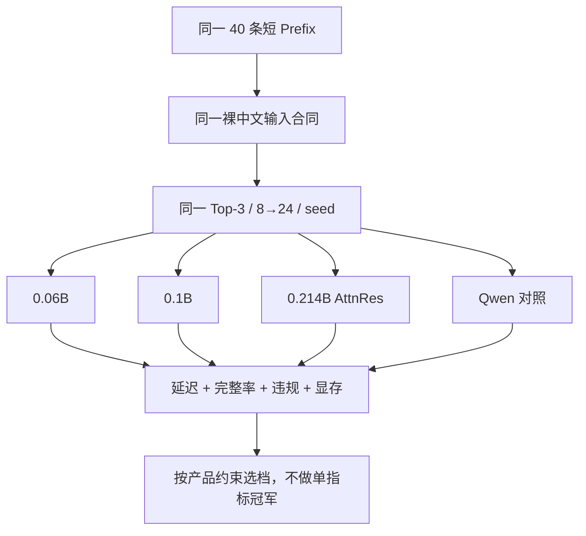

# P04：用同一合同选择 0.06B、0.1B 与 0.214B

> 源码固定点：`9f53740753de36899aa7694cf7dcb5304e58ea54`
>
> 本课产物：一份模型档位决策记录，而不是“参数越大越好”的排名。
>
> 冻结证据：`reports/aios_ime_short_prefix_matrix_20260821.md`
>
> 深入机制：[M02 模型合同](../../../mechanism/lessons/M02-model-contract/README.md)、[M09 Block AttnRes](../../../mechanism/lessons/M09-block-attnres/README.md)、[M11 证据分层](../../../mechanism/lessons/M11-evidence-lanes/README.md)。

## 需求变化

系统已经能工作，现在需要决定：

```text
低延迟默认档
平衡档
更高容量档
通用模型对照
```

不能让每个模型使用不同 Prompt、不同采样、不同数据，再比较一个模糊的“效果”。



## 1. 仓库冻结矩阵

下表是仓库现有报告，不是本课重新跑出的数字：

| 模型 | 架构 | 自适应 Top-3 p50/p95 | 满三条且互异 | 契约违规 | 平均路数 | 峰值 allocated |
|---|---|---:|---:|---:|---:|---:|
| MiniMind-IME 0.06B | 8L Standard | 47.62 / 61.16 ms | 100% | 0/120 | 8.00 | 177.47 MiB |
| MiniMind-IME 0.1B | 14L Standard | 86.34 / 99.06 ms | 100% | 0/120 | 8.00 | 238.60 MiB |
| 0.214B AttnRes | 32L Block AttnRes | 269.80 / 539.95 ms | 100% | 0/120 | 9.10 | 468.19 MiB |
| Qwen3-0.6B | 28L Standard | 171.74 / 331.36 ms | 100% | 85/120 | 9.30 | 1284.00 MiB |
| Qwen3-4B | 36L Standard | 308.07 / 313.11 ms | 100% | 14/120 | 8.00 | 7889.50 MiB |

“契约违规”只覆盖报告中可确定复现的禁词、元文本、重度拉丁字符及日/韩脚本，不等同于完整自然度判断。

## 2. 为什么必须同时看固定 8 路

自适应补采样会把候选栏补满，但会增加困难样本的尾延迟。固定 8 路用于暴露模型自身的有效产出能力：

```text
固定 8 路：模型与首轮候选质量
8→24：更接近产品恢复策略
```

例如冻结报告中 0.214B 固定 8 路满三条且互异为 85%，自适应后为 100%，但 p95 也显著上升。两张表一起看，才能知道完整率是模型首轮能力还是运行时补偿。

## 3. 一个可执行的决策模板

### 低延迟档

优先约束：

```text
p95
显存
候选合同零违规
```

在冻结矩阵中，0.06B 是速度和显存最低的专用模型，但具体自然度仍需人工样本。

### 平衡档

优先约束：

```text
稳定完整 Top-3
较低尾延迟
更高模型容量
```

0.1B 在当前冻结合同下没有触发额外平均补采样，是合理基准档。

### 高容量实验档

0.214B 引入 Block AttnRes，不能只凭参数量宣布质量更高。它需要：

```text
真实人工接受度提升
足以抵消更高 p95 和显存
```

### 通用模型对照

Qwen 对照说明“更大”与“适配裸中文 Prefix”是两件事。通用聊天模型可能生成题目、指令或跨语种元文本。

## 4. 重新跑自己的矩阵

先看参数：

```bash
python benchmark/bench_ime_short_prefix_matrix.py --help
```

也可以逐模型使用统一命令：

```bash
python benchmark/bench_ime.py \
  --model /path/to/model \
  --eval-data /path/to/same_short_prefix_eval.jsonl \
  --warmup 5 \
  --samples 40 \
  --sampling-attempts 8 \
  --max-sampling-attempts 24 \
  --refill-batch-size 8 \
  --max-new-tokens 12 \
  --seed 20260814
```

必须固定：

```text
数据集
顺序与样本数
seed
裸中文 Prefix
显示/采样/补采样合同
GPU 与 dtype
预热与计时边界
违规规则版本
```

## 5. 不能从矩阵直接推出什么

- 0.06B 最快，不等于语义最好。
- 0.214B 参数更多，不等于用户更愿意接受。
- 满三条 100%，不等于三条自然。
- Qwen 契约违规多，不等于它在聊天任务上差。
- 一张 GPU 的数值不能直接外推到所有设备。

## 验收

写一份三档决策：

| 档位 | 模型 | 主要约束 | 采用证据 | 尚缺证据 |
|---|---|---|---|---|
| 低延迟 |  |  |  |  |
| 默认 |  |  |  |  |
| 高容量实验 |  |  |  |  |

至少明确一个“即使更快也不能发布”的条件，以及一个“即使模型更大也不能升级默认档”的条件。

## 练习题

### 1. 为什么固定 8 路和自适应 8→24 要同时报告？

<details>
<summary>参考答案</summary>

固定 8 路暴露模型首轮有效产出；自适应表反映产品恢复后的最终候选栏。只报后者会掩盖额外补采样与尾延迟，只报前者又低估实际产品可恢复性。
</details>

### 2. 为什么 Qwen3-4B p95 比 0.214B 更低也不能直接说它更适合？

<details>
<summary>参考答案</summary>

适合度还包含裸中文 Prefix 合同、违规率、显存、自然度和本地部署约束。延迟只是一个维度。
</details>

### 3. “契约违规为零”为什么仍不等于可发布？

<details>
<summary>参考答案</summary>

规则只覆盖确定禁区，不能判断语义是否贴合上下文、语气是否自然、三条是否真正有用。还需要人工接受度或更强的语义评测。
</details>

### 4. 如何避免模型矩阵被模型加载顺序污染？

<details>
<summary>参考答案</summary>

逐个加载、逐个预热、串行计时；模型结束后释放对象、清空缓存；所有模型采用相同流程。不要让后一个模型继承前一个模型的工作区或显存峰值。
</details>
