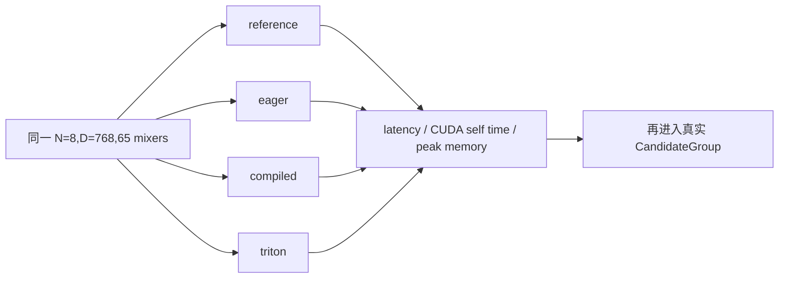

# P05：Profile 65 次 AttnRes Mixer

> 源码固定点：`9f53740753de36899aa7694cf7dcb5304e58ea54`
>
> 本课产物：`reference/eager/compiled/triton` 四后端的 65-Mixer Profile 与一次端到端对照。
>
> 冻结证据：`reports/aios_ime_attnres_refill_20260821.md`
>
> 深入机制：[M09 Block AttnRes](../../../mechanism/lessons/M09-block-attnres/README.md)、[M10 Triton 热路径](../../../mechanism/lessons/M10-triton-attnres/README.md)。

## 为什么不是先改 Kernel

0.214B 每个 Transformer Layer 在 Attention 前、MLP 前各做一次深度混合，32 层共 64 次，最后再做 1 次：

```math
32\times2+1=65
```

先用 Profile 确认这 65 次调用是否值得优化，再讨论 Triton。



## 1. 跑四个后端

```bash
for backend in reference eager compiled triton; do
  python benchmark/profile_attnres.py \
    --backend "$backend" \
    --active-tokens 8 \
    --hidden-size 768 \
    --warmup 5 \
    --iterations 50 \
    --output-json "reports/attnres_${backend}_course.json"
done
```

需要 Chrome Trace 时：

```bash
python benchmark/profile_attnres.py \
  --backend triton \
  --active-tokens 8 \
  --hidden-size 768 \
  --warmup 5 \
  --iterations 50 \
  --trace reports/attnres_triton_trace.json
```

## 2. 冻结报告中的算子结果

以下来自仓库报告，不是本课重新运行：

| Backend | 65-Mixer latency | Active tokens/s | Peak allocated |
|---|---:|---:|---:|
| Materialized reference | 12.67 ms | 631.53 | 9.61 MiB |
| Direct eager | 17.34 ms | 461.47 | 9.48 MiB |
| `torch.compile` | 15.87 ms | 504.12 | 9.27 MiB |
| Triton two-kernel | 4.02 ms | 1,989.46 | 0.94 MiB |

这里“reference 比 eager 快”并不矛盾：两条路径的中间张量、调用形态和编译机会不同。不要用名称猜性能。

## 3. 为什么还要跑端到端

算子 pipeline 只包含 Mixer，不包含：

```text
QKV / Attention
Paged KV
MLP
LM Head
采样
候选治理
补采样
Python 调度
```

冻结报告中，Mixer 提速约 4.31×，完整固定 8 路 Top-3 的 p50 提速约 1.53×。这是 Amdahl 定律的正常结果，不是优化失败。

端到端对照：

```bash
python benchmark/bench_ime.py \
  --model /path/to/minimind-ime-0.214b-aios \
  --attnres-backend eager \
  --eval-data /path/to/eval.jsonl \
  --sampling-attempts 8 \
  --max-sampling-attempts 8

python benchmark/bench_ime.py \
  --model /path/to/minimind-ime-0.214b-aios \
  --attnres-backend triton \
  --eval-data /path/to/eval.jsonl \
  --sampling-attempts 8 \
  --max-sampling-attempts 8
```

固定 8 路可避免补采样差异干扰内核对照。

## 4. 性能之外还要验什么

Triton 改变 reduction 次序，BF16 不保证 bitwise 一致。仓库提供：

```bash
python scripts/check_attnres_runtime_equivalence.py \
  --model /path/to/minimind-ime-0.214b-aios \
  --reference-backend eager \
  --candidate-backend triton
```

至少比较：

```text
logits max / mean absolute diff
cosine similarity
Top-k token 集合
固定 seed 候选文本
停止原因
过滤结果
average logprob 差
```

内核更快但候选离散结果改变，不能只用平均误差掩盖。

## 5. Profile 记录模板

| 后端 | Pipeline ms | Active tok/s | Peak allocated | Kernel 数/形态 | 等价性 |
|---|---:|---:|---:|---|---|
| reference |  |  |  |  | 基准 |
| eager |  |  |  |  |  |
| compiled |  |  |  |  |  |
| triton |  |  |  |  |  |

同时记录 GPU、PyTorch、Triton、FlashInfer、dtype、预热和迭代数。

## 验收

你应能解释：

```text
为什么是 65 次？
为什么只测单 Mixer 不够？
为什么 Triton 两个 Kernel 而不是一个名字叫 fused 的黑盒？
为什么 BF16 不能要求 bitwise 相等？
为什么端到端加速小于算子加速？
```

## 练习题

### 1. 为什么 `torch.compile` 在短序列下可能仍不理想？

<details>
<summary>参考答案</summary>

动态 source depth、active row 数、Python 调用和多个小 Kernel launch 仍可能占主导；编译减少部分图开销，但不自动得到最合适的内存布局和跨调用 Scratch 复用。
</details>

### 2. 为什么 Profile 固定 `active_tokens=8` 有业务意义？

<details>
<summary>参考答案</summary>

首轮 CandidateGroup 默认八路，短 Decode 时常见活跃行规模接近 8。它不是所有情况的代表，因此还应补测 active rows 收缩后的 1、2、4 等规模。
</details>

### 3. 为什么先用固定 8 路做端到端内核 A/B？

<details>
<summary>参考答案</summary>

自适应补采样会因候选细微差异触发不同路数，混入额外 Decode 工作。固定 8 路更容易隔离后端变化。
</details>

### 4. 哪个结果能阻止 Triton 后端上线？

<details>
<summary>参考答案</summary>

候选文本或 Top-k 离散集合出现不可接受漂移、Page 生命周期失败、某些 active row Shape 崩溃，或目标设备上端到端没有收益，都足以阻止上线；只看 pipeline 平均延迟不够。
</details>
