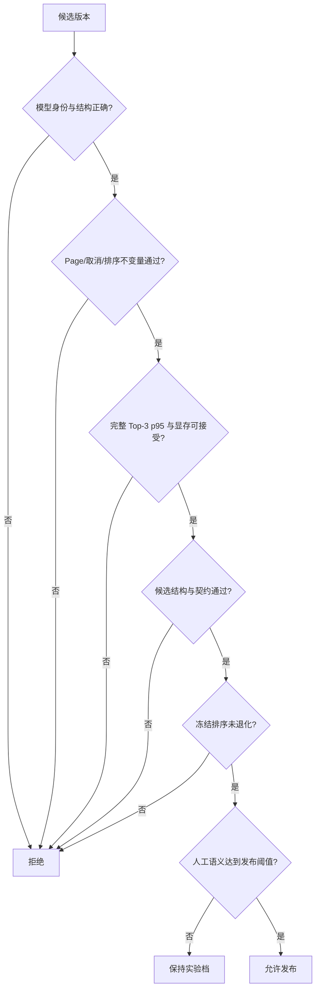

# P06：建立可发布证据门禁

> 源码固定点：`9f53740753de36899aa7694cf7dcb5304e58ea54`
>
> 本课产物：一张任何版本都必须通过的发布决策表。
>
> 深入机制：[M08 候选治理](../../../mechanism/lessons/M08-candidate-governance/README.md)、[M11 证据分层](../../../mechanism/lessons/M11-evidence-lanes/README.md)。

## 最后一个需求

前面已经能跑、能补候选、能复用 Prefix、能选模型、能优化 AttnRes。现在最危险的错误是：

> 某个版本 p50 更快，于是直接宣布它更好。

输入法 Runtime 的发布必须同时满足多条独立证据。



## 1. 六条证据 Lane

| Lane | 典型证据 | 不能替代什么 |
|---|---|---|
| 模型身份 | Manifest、SHA、参数量、Tokenizer | 语义质量 |
| 实现不变量 | CPU/GPU Tests、Page 回收 | 尾延迟 |
| 完整性能 | Top-3 p50/p95、active tokens/s | 候选自然度 |
| 结构质量 | 满三条、互异、invalid/duplicate | 真实语义 |
| 冻结排序 | acceptable Top-1、pairwise、same-pinyin | 开放生成 |
| 人工语义 | accept/reject、偏好与错误分类 | Runtime correctness |

## 2. 当前命令集合

### 结构与 CPU 逻辑

```bash
pytest -q tests/test_ime.py tests/test_ime_export.py tests/test_ime_attnres.py
```

### GPU 生命周期与候选组

```bash
AIOS_IME_MODEL=/path/to/model pytest -q tests/test_ime_gpu.py
```

### 完整 Top-3

```bash
python benchmark/bench_ime.py \
  --model /path/to/model \
  --eval-data /path/to/frozen_eval.jsonl \
  --warmup 5 \
  --samples 40 \
  --output-json reports/candidate.json \
  --output-markdown reports/candidate.md
```

### AttnRes 等价性

```bash
python scripts/check_attnres_runtime_equivalence.py \
  --model /path/to/0.214b-model \
  --reference-backend eager \
  --candidate-backend triton
```

### 模型包导出

```bash
python scripts/export_minimind_ime.py --help
```

使用真实 checkpoint/config/tokenizer 参数导出后，保存 manifest 与所有 Hash。

## 3. 发布表

```text
版本：
源码 SHA：
模型 SHA：
Tokenizer SHA：
设备：
依赖版本：
评测数据 SHA：
配置：
```

| 门禁 | 阈值 | 本次结果 | 证据路径 | 结论 |
|---|---|---|---|---|
| 模型结构 | 无静默兼容 |  |  |  |
| CPU Tests | 全部通过 |  |  |  |
| GPU Page 回收 | reset 后全部归还 |  |  |  |
| latest-wins | 旧组取消且不交付 |  |  |  |
| Top-3 p95 | 产品预算内 |  |  |  |
| 峰值显存 | 目标设备预算内 |  |  |  |
| 满三条/互异 | 目标阈值 |  |  |  |
| 契约违规 | 不超过阈值 |  |  |  |
| 冻结排序 | 不低于基线容差 |  |  |  |
| 人工接受度 | 达到发布阈值 |  |  |  |

## 4. 为什么要保存原始逐样本结果

只有聚合 p95 会隐藏：

```text
哪些 Prefix 触发多轮 refill
哪些候选被什么规则过滤
哪些样本发生契约违规
哪些样本 Page 或 generation 状态异常
```

`bench_ime.py` 会在 JSON 中保存逐 Prefix 行。评审时先看聚合，再钻取尾部样本。

## 5. 何时可以沿用旧数字

只有在下面内容都未变化时，旧数字才可能仍有参考意义：

```text
源码
模型与 Tokenizer
设备与依赖
数据及其顺序
采样与治理配置
计时边界
```

只要改了 Filter、Refill、Kernel、模型包或 Benchmark 代码，就应重新跑受影响 Lane。

## 6. 失败也要形成证据

无法运行某项验证时，不写“应该没问题”，而记录：

```text
not run
原因
缺少什么环境
哪些结论因此不能成立
```

课程构建本身就属于这种情况：它检查文档结构与代码语法，但没有 CUDA 模型，因此没有重新声称性能数字。

## 验收

完成一份发布表，并做出三选一结论：

```text
release
experimental only
reject
```

结论必须能追到具体证据文件，不能只写感受。

## 练习题

### 1. 为什么“29 passed”不能证明模型可发布？

<details>
<summary>参考答案</summary>

测试主要证明实现不变量和已编码边界。真实语义、目标设备覆盖、长时间稳定和用户接受度不可能由这些单元测试全部覆盖。
</details>

### 2. 为什么满三条率和人工接受度必须拆开？

<details>
<summary>参考答案</summary>

满三条只证明结构完整；三条都可能不自然或不贴合上下文。人工接受度判断的是候选是否真的值得显示。
</details>

### 3. 修改候选 Filter 后，为什么需要重跑性能？

<details>
<summary>参考答案</summary>

Filter 会改变有效候选数量，从而改变 adaptive refill 是否触发、实际采样路数和尾延迟。它不是纯 CPU 后处理的孤立改动。
</details>

### 4. 哪些证据必须绑定设备？

<details>
<summary>参考答案</summary>

延迟、吞吐、峰值显存、后端可用性和数值路径都依赖 GPU 与软件栈。模型 Hash 和纯逻辑测试相对稳定，但性能结论不能脱离设备。
</details>
