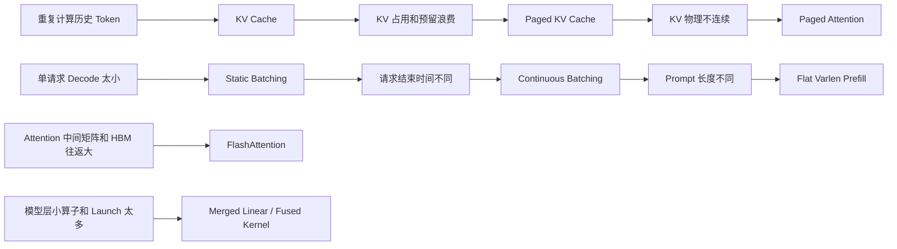

# 推理 Runtime 今日问题串讲：从 KV Cache 到 Fused Layers

> 整理日期：2026-08-24
>
> 对应课程：[Lesson 4～9](../README.md#第一篇通用推理引擎基础)
>
> 对应源码分支：`feat/aios-ime`
>
> 阅读目标：把今天围绕 GPU 并行、Prefill/Decode、Paged KV、Continuous Batching、FlashAttention 和 Fused Layers 的问题连成一套完整知识体系。

这不是把几个名词重新定义一遍，而是从同一个问题出发：

> 一个 LLM 请求进入 GPU 后，怎样避免重复计算、减少显存浪费、保持 GPU 有活干，并尽量少在 HBM 和计算单元之间搬数据？

---

## 0. 先记住整条主线



整套知识可以分成六层：

| 层 | 核心问题 | 典型技术 |
|---|---|---|
| 模型数学 | 在算什么？ | Linear、Attention、RMSNorm、SwiGLU |
| 推理阶段 | 哪些 Token 在本轮参与计算？ | Prefill、Decode、KV Cache |
| 显存管理 | 历史 KV 放在哪里？ | Paged KV、Page Table、Free Page Pool |
| 调度 | 哪些请求进入下一次 Forward？ | Static/Continuous Batching、Varlen Prefill |
| Kernel | 怎么少搬数据、少启动算子？ | Paged Attention、FlashAttention、Fusion |
| GPU 硬件 | 工作怎样落到计算单元？ | Block、Warp、SM、CUDA Core、Tensor Core |

---

# 第一部分：GPU 为什么擅长批量计算

## 1. SM、Warp、CUDA Core、Tensor Core 分别是什么？

GPU 的执行层级不是“一个 CUDA Core 对应一个请求”。更准确的结构是：

```text
GPU
├── SM 0
│   ├── Warp Scheduler
│   ├── CUDA Cores
│   ├── Tensor Cores
│   ├── Registers
│   └── Shared Memory
├── SM 1
├── SM 2
└── ...
```

### SM

`SM`（Streaming Multiprocessor）可以理解为 GPU 上的一个计算工厂。一个 Thread Block 会被调度到某个 SM 上执行。

### Warp

一个 Warp 通常包含 32 个 CUDA Thread。Warp 内线程以 SIMT 方式执行同一条指令，只是操作不同数据。

```text
Warp 0:
Thread 0  → C[0]
Thread 1  → C[1]
...
Thread 31 → C[31]
```

**锁步的是同一个 Warp，不是整个 SM。** 同一个 SM 可以同时驻留多个 Warp：

```text
SM
├── Warp 0：等待 Global Memory
├── Warp 1：执行 FMA
├── Warp 2：读取 Shared Memory
└── Warp 3：执行另一个阶段
```

Warp Scheduler 会在可运行的 Warp 之间切换，从而隐藏访存延迟。

### CUDA Core 与 Tensor Core

- CUDA Core 主要执行标量/向量化 FP、INT 等指令。
- Tensor Core 面向小块矩阵乘加 `D = A × B + C`。
- 高性能 GEMM 通常由一个 Warp 协同发出 MMA 指令，而不是“一个 Tensor Core 独自计算整个矩阵”。

---

## 2. 8×8 矩阵乘法怎样分块？

设：

```text
A: [8, 8]
B: [8, 8]
C = A @ B: [8, 8]
```

把输出 `C` 切成四个 `4×4` Tile：

```text
C =
┌─────────┬─────────┐
│ C00     │ C01     │
│ 4×4     │ 4×4     │
├─────────┼─────────┤
│ C10     │ C11     │
│ 4×4     │ 4×4     │
└─────────┴─────────┘
```

计算左上角 `C00` 时，不是只读取 A/B 左上角一次就结束。因为归约维 `K=8`，需要沿 K 维继续分块：

```text
C00
=
A[0:4, 0:4] @ B[0:4, 0:4]
+
A[0:4, 4:8] @ B[4:8, 0:4]
```

教学版伪代码：

```python
C_tile = zeros([4, 4])

for k_start in (0, 4):
    A_tile = A[0:4, k_start:k_start + 4]
    B_tile = B[k_start:k_start + 4, 0:4]
    C_tile += A_tile @ B_tile
```

### 16 个输出元素怎样前进？

最朴素的 CUDA 教学模型可以令 16 个线程分别累计 16 个输出：

```text
Thread 0  → C00
Thread 1  → C01
...
Thread 15 → C33
```

于是它们不是先完整算完 `C00` 再算 `C01`，而是一起沿 K 维前进：

```text
k=0：所有线程各做一次乘加
k=1：所有线程各做一次乘加
...
k=7：所有线程各做一次乘加
```

高性能 Tensor Core GEMM 会更复杂：一个 Warp 的 32 个线程协同持有 A/B/C fragment，并用 MMA 指令计算一个 Warp Tile。但整体层级仍然是：

```text
大矩阵
→ Block Tile
→ Warp Tile
→ Tensor Core MMA
→ K Tile 循环累计
```

---

## 3. 分块不是增加内存读取吗？

分块不是为了让矩阵本身占用更少存储，而是为了**减少 HBM 的重复读取**。

最朴素的矩阵乘法中，一个 A 元素会被多个输出重复使用。例如 `A[0,0]` 会参与：

```text
C[0,0]
C[0,1]
C[0,2]
C[0,3]
...
```

如果每次都从 HBM 重新读，代价很大。Tiling 会执行：

```text
HBM
 ↓ 读取一次 A/B Tile
Shared Memory / Registers
 ↓ 被多个 Thread/Warp 重复利用
CUDA Core / Tensor Core
```

以 8×8、4×4 Tile 为教学估算：

```text
Naive：约 64 × 8 × 2 = 1024 次标量读取
Tiled：4 个 C Tile × 2 个 K Tile × (16 A + 16 B) = 256 次
```

这个估算忽略硬件 Cache，但足以说明：**分块增加了片上复用，减少了 Global Memory Traffic。**

Tile 也不能无限大：

- Tile 大：复用高，但 Shared Memory/Register 占用高，Occupancy 可能下降。
- Tile 小：Block 更轻，但复用差，HBM 搬运变多。

这就是 Triton 中 `BLOCK_M/BLOCK_N/BLOCK_K/num_warps/num_stages` 需要调优的原因。

---

# 第二部分：为什么高维 Tensor 能批量计算

## 4. 三维 `[B, L, H]` 并不是神秘的三维矩阵乘法

Transformer Hidden State 常见形状：

```text
X: [Batch, Sequence, Hidden]
```

例如：

```text
X: [8, 128, 4096]
W: [4096, 4096]
```

对于 Linear：

```text
[8, 128, 4096]
→ reshape
[1024, 4096]

[1024, 4096] @ [4096, 4096]
→ [1024, 4096]
→ reshape 回 [8, 128, 4096]
```

所以 Linear 中 Batch 和 Sequence 可以合并为 GEMM 的 `M` 维：

```text
M = B × L
K = hidden_size
N = output_size
```

这解释了：

- Prefill 即使 `B=1`，只要 `L` 很长，`M=L`，GPU 也容易吃饱。
- Decode 每个请求只有 `L=1`，单请求 `M=1`，需要靠 Batch 扩大 M。

一句话：

> Prefill 主要靠 Token 维提供并行度；Decode 主要靠 Batch 维补充并行度。

---

## 5. Attention 为什么不能把所有维度无脑展平？

Attention 常见形状：

```text
Q: [B, Heads, Lq, D]
K: [B, Heads, Lk, D]
V: [B, Heads, Lk, D]
```

对每个 `(batch, head)`，计算：

```text
[Lq, D] @ [D, Lk]
→ [Lq, Lk]
```

`B` 和 `Heads` 可以被看作一批相互独立的问题，但 `Lq/Lk/D` 是矩阵乘法本身的结构，不能随意合并。

Attention 的并行工作单元可以来自：

```text
request
× head
× query tile
× KV tile
```

所以不同请求即使历史长度不同，仍然能被同一个 Batched/Ragged Kernel 调度。真实 GPU 不是“固定分 3000 个 CUDA Core 给 A、2000 个给 B”，而是：

```text
A 产生很多 Thread Blocks
B 也产生很多 Thread Blocks
GPU 的 SM 动态领取可运行 Block
```

长请求会自然产生更多 KV Tile 和工作块，因此占用更多工作量。

---

# 第三部分：Prefill、Decode 与 KV Cache

## 6. Prefill 和 Decode 到底区别在哪里？

### Prefill

一次处理整个 Prompt：

```text
输入：[L, H]
Linear：[L,H] @ [H,O]
Attention Scores：[L,L]
```

特点：Token 多、矩阵较大、并行度高。

### Decode

每个请求每轮只处理一个刚生成的 Token：

```text
输入：[1,H]
Linear：[1,H] @ [H,O]
Attention：Q[1,D] 对历史 K/V[L,D]
```

特点：单次计算瘦，但需要反复读取模型权重和历史 KV，常偏向 Memory-Bandwidth Bound。

---

## 7. KV Cache 是省显存还是加速？

KV Cache 的本质是：

> **用显存换计算。**

没有 KV Cache：每生成一个新 Token，都要重新计算全部历史 Token 的 K/V。

有 KV Cache：历史 K/V 保存下来，Decode 只计算新 Token 的 K/V。

因此：

```text
重复计算 ↓
Decode 速度 ↑
显存占用 ↑
```

不要把 KV Cache 说成省显存技术。

---

## 8. Dynamic Cache、请求级预分配和 Paged KV 分别解决什么？

### Dynamic Cache：反复 `cat`

```python
k_cache = torch.cat([k_cache, new_k], dim=seq_dim)
v_cache = torch.cat([v_cache, new_v], dim=seq_dim)
```

扩容时通常要申请新 Tensor、复制旧内容；旧 Tensor 在复制完成前仍存在。因此既有重复拷贝，也有瞬时显存峰值。

### 每请求预分配

```text
每个请求都按 max_seq_len 预留连续空间
```

避免了扩容，但实际长度远小于最大长度时，大量位置闲置。

### Paged KV

```text
Runtime 全局预分配 KV Pool
请求按需领取 Page
请求结束立即归还 Page
```

Paged KV 并没有消灭预分配，而是把：

```text
每请求最大长度预分配
```

改成：

```text
全局共享池预分配 + 请求按需分配
```

当前 AIOS 在模型加载后读取 GPU 的空闲显存，并按 `memory_ratio`（默认约 0.9）估算 KV Page 数：

```python
free_memory = torch.cuda.mem_get_info(self.device)[0]
available_memory = int(memory_ratio * free_memory)
num_pages = available_memory // cache_per_page
```

当前实现固定：

```text
page_size = 1
1 Page = 1 Token 的一层层 K/V 位置
```

---

## 9. `Req`、`page_table`、`token_pool`、`MHAKVCache` 各管什么？

```text
Req
→ 维护逻辑长度与请求身份

page_table
→ 逻辑 Token 位置 → 物理 KV Page

token_pool
→ 逻辑 Token 位置 → Token ID

MHAKVCache
→ 真正保存 K/V Tensor
```

例如：

```text
逻辑位置       0      1      2      3
Token ID       t0     t1     t2     t3
page_table     17     83      5     21
物理 KV       P17    P83     P5    P21
```

Attention 按 `page_table` 恢复逻辑顺序，即使物理 Page 不连续也不影响语义。

当前 `Req` 的三个关键量：

```text
device_len
= 逻辑上已经存在多少 Token

cached_len
= 其中多少 Token 已经跑过 Forward、拥有 KV

extend_len
= device_len - cached_len
= 本轮还要 Forward 的 Token 数
```

---

## 10. 为什么最后生成的 Token 可能没有 KV？

设 Prompt 有 4 个 Token，最多生成 2 个 Token：

```text
Prompt：t0 t1 t2 t3
输出：n0 n1
```

Prefill 后：

```text
KV(t0...t3) 已存在
采样得到 n0，但 n0 还没作为下一轮输入
```

下一轮 Decode：

```text
输入 n0
写入 KV(n0)
采样得到 n1
```

若 `n1` 已经是最后一个输出，就没有下一轮 Attention 会用到 `KV(n1)`，因此不必再为它计算和保存 KV。

所以：

> 生成一个 Token，不等于这个 Token 已经进入 KV Cache；只有它成为下一轮 Forward 的输入，才需要对应 KV。

---

# 第四部分：Paged Attention、FlashInfer 与 FlashAttention

## 11. Paged KV Cache 和 Paged Attention不是一件事

### Paged KV Cache

解决：

```text
KV 怎么分配、保存、回收
```

### Paged Attention

解决：

```text
KV 已经分散在不连续 Page 中，Attention 怎样直接读取并计算
```

最笨的做法是：

```text
离散 Pages
→ gather/copy 为连续 K/V
→ 普通 Attention
```

这会产生额外临时 Tensor 和显存搬运。

Paged Attention Kernel 直接接收：

```text
Q
page indices / indptr
每请求 seq_len
Paged KV Pool
```

然后按 Page Table 读取物理不连续、逻辑连续的历史 K/V。

因此：

> Paged KV 主要提高长期 KV 显存利用率；Paged Attention 主要避免为了计算而重新整理/复制 KV。

---

## 12. “FlashInfer 完成 Paged Attention”是什么意思？

AIOS 负责：

```text
Scheduler
Page 分配与回收
page_table / indices
seq_len / cu_seqlens
KV Pool
```

FlashInfer 负责提供现成的高性能 GPU Kernel：

```text
Batch Prefill with Paged KV
Batch Decode with Paged KV
RMSNorm / SwiGLU 等推理算子
```

调用链可以理解为：

```text
Python / AIOS / PyTorch Tensor
→ FlashInfer Wrapper
→ CUDA Kernel
→ GPU
```

FlashInfer 不是新的 Attention 数学公式，而是一套推理 Kernel 库。

`indices + indptr` 与 Flat Varlen 的 `tokens + cu_seqlens` 是同一种思想：

```text
物理上 flatten
逻辑边界靠 offset metadata 恢复
```

---

## 13. FlashAttention 解决什么？

普通 Attention：

```text
Q @ Kᵀ
→ 完整 Scores [L,L] 写入 HBM
→ Softmax 读写 Scores/Probability
→ P @ V
```

长序列时，`[L,L]` 中间矩阵很大，且会在 HBM 与 SM 之间反复搬运。

FlashAttention 的核心：

```text
Q Tile + K/V Tile
→ 计算 Score Tile
→ Online Softmax
→ 立即乘 V Tile
→ 更新输出累加器
→ 丢弃 Score Tile
```

因此它同时：

- 减少 HBM I/O，通常更快；
- 不 materialize 完整 `[L,L]` Scores/Softmax Matrix，减少临时显存。

它和 Paged Attention 是正交的：

```text
Paged Attention：K/V 在哪里、如何直接读取
FlashAttention：拿到 K/V 后，Attention 内部怎样分块并减少 HBM 往返
```

---

## 14. Online Softmax 为什么只保留 `m、l、O`？

对一条 Query，最终 Attention 输出：

```math
\operatorname{Attn}(q,K,V)
=
\frac{\sum_i e^{s_i-m}V_i}
{\sum_i e^{s_i-m}}
```

其中：

```text
s_i = q · k_i
m   = max_i(s_i)
```

FlashAttention 逐块处理时维护：

```text
m = running max
l = running exp sum
O = running weighted-V numerator
```

处理新 Block：

```math
m_{new} = \max(m_{old}, \max(s_{block}))
```

```math
\alpha = e^{m_{old}-m_{new}}
```

```math
p_{block} = e^{s_{block}-m_{new}}
```

```math
l_{new} = \alpha l_{old} + \sum p_{block}
```

```math
O_{new} = \alpha O_{old} + p_{block}^{T}V_{block}
```

最后：

```math
output = O/l
```

### `O` 到底保存了什么？

不是保存每个 `score`，也不是分别保存每个 `score × V`，而是直接保存它们的加权和：

```text
O = exp(s1-m)V1 + exp(s2-m)V2 + ...
```

因此长度无论是 100、1000 还是 10000，对一条 Query，`O` 的大小始终只是 `head_dim`。

### 为什么 max 更新后不需要回头更新每个 V？

因为所有历史项都乘同一个修正系数：

```math
e^{s_i-m_{new}}
=
e^{s_i-m_{old}}e^{m_{old}-m_{new}}
```

所以：

```math
\sum_i e^{s_i-m_{new}}V_i
=
e^{m_{old}-m_{new}}
\sum_i e^{s_i-m_{old}}V_i
```

右边的历史和就是 `O_old`。只需缩放一个 `head_dim` 向量，不需要重新读取所有历史 V。

### 为什么不再需要 score 与 V 的逐项对应？

对应关系在当前 Tile 计算 `p_blockᵀ V_block` 时已经被消化进加权和。Forward 最终只需要 `O/l`，不需要恢复每个 Softmax Probability。

---

# 第五部分：Static、Continuous 与 Flat Varlen Batching

## 15. 一次 Forward 启动后，能不能中途塞入新请求？

不能。

在 Kernel Launch 前，Scheduler 已经确定：

```text
本轮有哪些请求
每个请求处理哪些 Token
positions
KV out_loc
Attention metadata
Tensor shape
```

GPU Forward 执行期间，这个 Batch 基本冻结。动态插入发生在两次 Forward 之间：

```text
Forward #1 完成
→ Scheduler 更新状态
→ 移除 finished 请求
→ Admit 新请求
→ 构建 Forward #2
```

不是在一个 Kernel 执行到一半时替换某一行。

---

## 16. Static Batching 为什么有浪费？

设一个静态 Batch：

```text
A 生成 2 Token
B 生成 8 Token
C 生成 3 Token
D 生成 6 Token
```

若必须等整组结束，A/C 完成后仍占住 Batch 位置，直到最长的 B 完成。

Static Batching 解决的是：

```text
多个请求一起算，让 Decode GEMM 的 M 维变大
```

但不能解决：

```text
请求长度和结束时间不一致
```

---

## 17. Continuous Batching 怎样补位？

设：

```text
max_running = 2
pending = [A, B, C, D]
```

更完整的当前实现可以这样理解：

```text
iter 0：PREFILL {A,B}
running = {A,B}

iter 1：DECODE {A,B}
A finished，B continues
free A pages/slot

iter 2：PREFILL {C}
B 的 KV 与状态保留，但本 iter 暂时 idle
running = {B,C}

iter 3：DECODE {B,C}
```

关键点：

- 不是暂停正在运行到一半的 Decode Kernel；
- 是上一轮 Decode 完成后，下一轮按 prefill-first 策略选择 Prefill；
- B 不需要重新 Prefill，因为 B 的 KV Cache 和请求状态仍然保留；
- C Prefill 完成后，下一轮再与 B 一起 Decode。

---

## 18. Lesson 7 的旧图为什么 A、B 没一起 Prefill？

Lesson 7 是历史教学快照，当时刻意使用：

```text
bsz=1 prefill
每个 iteration 只 admit 一个 Prompt
```

目的是先教学 Continuous Scheduler，而不同时引入 Varlen Attention。

因此旧图表现为：

```text
Prefill A
→ Prefill B
→ Decode {A,B}
```

当前 `feat/aios-ime` 的 `PrefillManager.schedule_next_batch()` 已经会在 `max_running`、`prefill_token_budget` 和 KV Page 预算允许时选择多个 Pending 请求：

```python
selected = []
for pending in self.pending_list:
    if not self._can_admit(...):
        break
    selected.append(pending)

return Batch(reqs=reqs, phase="prefill")
```

因此当前主线更接近：

```text
Prefill {A,B}
→ Decode {A,B}
```

旧图对当时 Lesson 7 的代码没错，但不能不加说明地代表当前源码。

---

## 19. 为什么不同长度 Prompt 不需要 Padding？

设：

```text
A = 4 Token
B = 2 Token
C = 3 Token
```

直接 Flat：

```text
tokens:
[a0 a1 a2 a3 b0 b1 c0 c1 c2]

positions:
[0  1  2  3  0  1  0  1  2]

cu_seqlens:
[0, 4, 6, 9]
```

Linear/MLP 直接吃：

```text
[total_tokens,H] @ [H,O]
```

Attention 使用 `cu_seqlens` 恢复逻辑边界，避免 A attend 到 B/C。

工程上还要准备：

```text
positions
KV out_loc / page indices
每请求最后一个 Token 的索引
```

所以不是“只多一个变量”就完成全部工程，但核心思想确实是：

> 不 Padding；物理扁平化；通过 Metadata 恢复逻辑边界。

---

## 20. 并行数量由显存还是算力决定？

要区分两个问题。

### 能不能装下：硬约束通常先看显存

当前 Admission 需要检查：

```text
Table Slot 是否足够
running 数是否超过 max_running
新请求及已运行请求未来可能需要的 KV Page 是否足够
```

当前源码中的核心预算类似：

```python
needed = pending.input_len + pending.output_len
reserved = self.decode_manager.inflight_tokens + scheduled_reserved
free_pages = len(self.cache_manager._free_slots)
return (needed + reserved) <= free_pages
```

### 装多少最划算：看算力、带宽和延迟目标

显存允许 `B=256`，不等于 `B=256` 一定最优。

Batch 增大通常会：

```text
GPU 利用率 ↑
权重读取复用 ↑
吞吐 ↑
```

但也会：

```text
KV 占用 ↑
排队和单请求延迟 ↑
中间激活 ↑
```

因此：

```text
显存决定可行上限
算力/带宽/SLA 决定性能最优点
```

当前 AIOS 主要通过 `max_running_reqs + KV Page Capacity + prefill_token_budget` 控制，并没有实时读取 GPU Utilization 后自动选择最优 Batch Size。

---

## 21. Prefill-first 有什么代价？

如果 B 正在 Decode，新来 C 的 Prompt 有 8000 Token：

```text
Decode B
→ Prefill C 8000 Token
→ B 很久没有下一个 Token
```

这会恶化 B 的 Inter-Token Latency。

更高级的方案是 Chunked Prefill：

```text
Decode B
→ Prefill C[0:512]
→ Decode B
→ Prefill C[512:1024]
→ ...
```

甚至可以构建 Mixed Prefill/Decode Batch。当前课程阶段为了保持 Scheduler 清晰，不混合两种 Batch，也还没有完整 Chunked Prefill。

---

# 第六部分：Fused Layers 怎样减少读取和写回

## 22. Fused Layers 有两类完全不同的融合

```text
横向合并：多个分支共享同一输入
→ Q/K/V Merge、Gate/Up Merge

纵向融合：前一个算子的输出立即进入下一个算子
→ Add+RMSNorm、SiLU+Multiply
```

---

## 23. Q/K/V 为什么能合成一个 GEMM？

原来：

```text
Q = x @ Wqᵀ
K = x @ Wkᵀ
V = x @ Wvᵀ
```

沿输出维拼权重：

```text
Wqkv = concat([Wq, Wk, Wv], dim=0)
qkv  = x @ Wqkvᵀ
Q,K,V = split(qkv)
```

当前代码：

```python
qkv = self.qkv_proj.forward(hidden_states)
q, k, v = qkv.split(
    [self.q_size, self.kv_size, self.kv_size],
    dim=-1,
)
```

收益：

```text
3 次小 GEMM → 1 次更宽 GEMM
3 次 Kernel Launch → 1 次
共享输入 x 的重复读取减少
更大的 GEMM 更容易填满 GPU
```

但必须说准：

> Wq、Wk、Wv 的总权重字节数没有消失，仍然需要读取；减少的是共享输入的重复加载、Launch 和小 GEMM 低利用率。

`split()` 通常只是输出 Buffer 上的 View，不需要复制 Q/K/V 数据。

---

## 24. Gate/Up Merge 与 SwiGLU Fusion

原来：

```text
gate = x @ Wgateᵀ
up   = x @ Wupᵀ
hidden = SiLU(gate) * up
```

先横向合并：

```text
gate_up = x @ [Wgate | Wup]ᵀ
```

再由一个 Fused Kernel 完成：

```text
load gate/up
→ SiLU(gate)
→ multiply up
→ store hidden
```

避免：

```text
SiLU 输出写 HBM
→ 下一个 Multiply Kernel 再读回来
```

---

## 25. Add + RMSNorm 为什么能减少 HBM 往返？

未融合：

```text
Kernel A:
load x/residual
→ sum = x + residual
→ store sum 到 HBM

Kernel B:
load sum
→ RMSNorm
→ store output
```

融合：

```text
一个 Kernel：
load x/residual
→ Register/Shared Memory 中计算 sum
→ 直接 RMSNorm
→ 只 store 最终 output
```

关键原因：

- Kernel A 结束后，它的 Register/Shared Memory 生命周期结束；
- Kernel B 无法直接继承 Kernel A 的 Register；
- 两个普通 Kernel 之间的完整中间结果通常必须落到 Global Memory；
- 合成一个 Kernel 后，中间 Tile 可以一直留在片上。

所以 Operator Fusion 的本质：

```text
少 Kernel Launch
+
少中间 Tensor 的 HBM 写回/重读
```

它通常不改变模型数学，也不一定减少主 FLOPs。

---

# 第七部分：把所有技术放回正确位置

## 26. 最终分类表

| 技术 | 主要解决的问题 | 主要收益 | 代价/边界 |
|---|---|---|---|
| KV Cache | 历史 K/V 重复计算 | Decode 加速 | 增加长期显存占用 |
| Paged KV Cache | 每请求预留、碎片、回收困难 | 提高 KV 显存利用率 | 需要 Page Table 与分配器 |
| Paged Attention | 分页 KV 怎样直接计算 | 避免 gather/copy | Kernel 与 Metadata 更复杂 |
| Static Batching | 单请求 Decode 太瘦 | 提高吞吐/GPU 利用率 | 请求结束时间不一致会浪费 Slot |
| Continuous Batching | Static Wave 中空 Slot | 动态补位，提高吞吐 | Prefill 可能打断 Decode |
| Flat Varlen Prefill | Prompt Padding | 少无效计算和部分临时内存 | 需要 cu_seqlens/positions 等 Metadata |
| FlashAttention | Attention 中间矩阵与 HBM I/O | 加速 + 减少临时显存 | 算法/Kernel 更复杂 |
| Merged Linear | 多个共享输入的小 GEMM | 少 Launch、少输入重复读取 | 权重总字节不变 |
| Fused Kernel | 相邻算子中间 Tensor 往返 HBM | 少搬运、少 Launch | Fusion 过大可能增加寄存器压力 |

---

## 27. 最容易说错的五句话

### 错误 1

```text
KV Cache 省显存。
```

正确：

```text
KV Cache 用显存换重复计算；Paged KV 才提高这些显存的利用率。
```

### 错误 2

```text
Paged Attention 进一步压缩 KV。
```

正确：

```text
Paged Attention 让 Attention 能直接读取分页 KV，避免先 gather 成连续 Tensor。
```

### 错误 3

```text
FlashAttention 只是把 Softmax 三遍变一遍。
```

正确：

```text
FlashAttention 重排 QKᵀ→Softmax→PV 的整个数据流，使用 Tiling + Online Softmax，避免完整 L×L 中间矩阵和 HBM 往返。
```

### 错误 4

```text
Continuous Batching 会在一个 Kernel 中途替换请求。
```

正确：

```text
替换发生在两次 Forward 之间；本轮 Kernel 的 Batch 在 Launch 前已经冻结。
```

### 错误 5

```text
QKV Merge 把三份权重减少成一份。
```

正确：

```text
三份权重字节仍在；它把三次共享输入的小 GEMM 合成一次宽 GEMM。
```

---

# 第八部分：源码阅读路线

按今天的问题，推荐顺序：

```text
Lesson 4 KV Cache
→ Lesson 5 Paged KV Cache
→ Lesson 6 Static Batching
→ Lesson 7 Continuous Batching
→ Lesson 8 Flat Varlen Prefill
→ Lesson 9 Fused Layers
→ Lesson 32 FlashInfer Paged Attention
→ Lesson 37 SM/Warp/Occupancy
→ Lesson 39 GEMM/Tensor Core
→ Lesson 41 FlashAttention Online Softmax
```

对应源码入口：

```text
python/aios/core.py
python/aios/llm/llm.py
python/aios/scheduler/cache.py
python/aios/scheduler/table.py
python/aios/scheduler/prefill.py
python/aios/scheduler/decode.py
python/aios/scheduler/scheduler.py
python/aios/attention/flashinfer.py
python/aios/kvcache/mha_pool.py
python/aios/layers/linear.py
python/aios/models/qwen3.py
```

阅读每个函数时固定回答：

```text
它解决什么性能问题？
输入 Shape 是什么？
逻辑状态由谁拥有？
物理显存由谁拥有？
本轮数据从 HBM 读了几次？
中间 Tensor 是否写回 HBM？
请求何时可以进入/退出 Batch？
异常或结束时资源由谁回收？
```

---

# 第九部分：练习题

## 1. KV Cache 为什么是“用显存换计算”？

<details>
<summary>参考答案</summary>

保存历史 K/V 后，Decode 无需重新计算所有历史 Token 的 K/V，但每个历史 Token 都需要长期占据 K/V 显存。
</details>

## 2. Paged KV 与每请求预分配的最根本区别是什么？

<details>
<summary>参考答案</summary>

每请求预分配让每个请求提前独占最大长度空间；Paged KV 只预分配全局共享池，请求按实际需要领取和归还 Page。
</details>

## 3. 为什么 Paged Attention 不能被 Paged KV Cache 替代？

<details>
<summary>参考答案</summary>

Paged KV 只定义存储布局。Attention Kernel 仍需根据 Page Table 读取物理不连续的 K/V；Paged Attention 提供这条计算路径。
</details>

## 4. 为什么 Prefill 的 Linear 可以把不同请求直接 Flat？

<details>
<summary>参考答案</summary>

Linear 对每个 Token 行独立，前导的 Batch/Sequence 维可以合并成 `total_tokens`；Attention 需要额外 Metadata 防止不同请求跨序列互相注意。
</details>

## 5. 为什么 Decode Batching 能提高权重读取复用？

<details>
<summary>参考答案</summary>

单请求读取一遍权重只服务一个 Token；批量 Decode 将多条 Token 行堆成 `[B,H]`，同一份权重 Tile 可参与多个输出行的计算，提高算术强度。
</details>

## 6. 为什么一个请求结束后，不能在当前 Decode Kernel 中途塞入新请求？

<details>
<summary>参考答案</summary>

Kernel Launch 前 Tensor Shape、请求集合、KV Metadata 已固定。请求补位必须等本轮 Forward 返回 Scheduler 后，在下一次 Forward 前完成。
</details>

## 7. 为什么 `O_old` 不需要保存每个 V 的身份？

<details>
<summary>参考答案</summary>

score 与 V 的对应关系已经在当前 Tile 的加权乘法中进入 `O_old`。以后 max 改变时所有历史项使用相同缩放系数，因此只需整体缩放加权和。
</details>

## 8. FlashAttention 最后还需要做什么除法？

<details>
<summary>参考答案</summary>

只需用最终的标量分母 `l` 归一化 `head_dim` 大小的输出累加器 `O`，不需要回头读取全部 Attention Scores 或 Softmax Probability。
</details>

## 9. QKV Merge 主要省了什么，没有省什么？

<details>
<summary>参考答案</summary>

省了共享输入的重复加载、Kernel Launch 和小 GEMM 低利用率；没有消除 Wq/Wk/Wv 的总权重字节。
</details>

## 10. Add+RMSNorm Fusion 为什么能省 HBM 流量？

<details>
<summary>参考答案</summary>

未融合时 Add 的完整中间 Tensor 要写回 HBM，再被 RMSNorm 读取；融合后中间 Tile 留在同一 Kernel 的寄存器/Shared Memory 中，只写最终结果。
</details>

---

# 结课检查

不看文档，能够按下面顺序独立讲清，才算真正串起来：

```text
Prefill 为什么天然有并行度
→ Decode 为什么需要 Batch
→ KV Cache 为什么加速但占显存
→ Paged KV 怎样管理共享池
→ Paged Attention 怎样直接读取离散 Page
→ Continuous Batching 怎样在 Forward 间补位
→ Flat Varlen 怎样消除 Padding
→ FlashAttention 为什么只保留 m/l/O
→ QKV Merge 与 Add+RMSNorm Fusion 有何不同
→ 所有优化最终怎样减少重复计算、显存浪费、HBM 搬运或 GPU 空转
```
