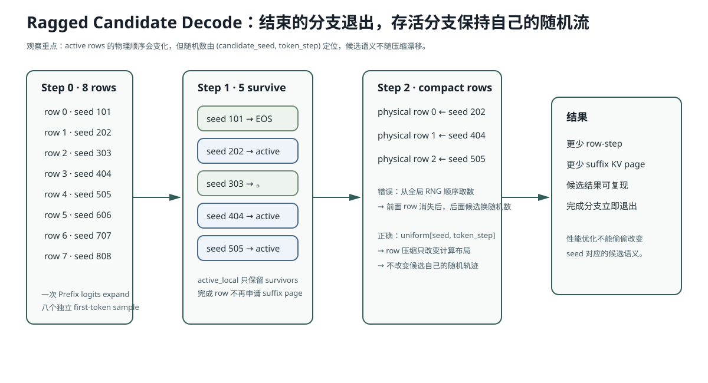

# Lesson 13：Ragged Decode、独立随机流与按需补采样

> 源码基线：`bfc72896bbadab5c897672506d237c070900412e`
>
> CandidateGroup 建好后，八条分支不会同时结束。本课解释三件紧密相关的事：**怎样让完成分支退出计算、为什么压缩行会破坏普通随机数流、以及为什么 refill 必须在候选治理之后按需触发。**



这张图要观察两件事：完成分支退出后，物理 row 会重新排列；但随机流必须继续绑定候选自己的 `seed + token_step`，不能绑定当前 row 序号。

## 1. 固定 Batch 为什么浪费

假设 4 条候选需要的生成长度：

```text
row 0：2 token 后 EOS
row 1：5 token 后句号
row 2：8 token 后 EOS
row 3：12 token 达上限
```

如果 12 步始终保持 Batch=4：

\[
4\times12=48\text{ row-steps}
\]

真实需要：

\[
2+5+8+12=27\text{ row-steps}
\]

浪费：

\[
48-27=21\text{ row-steps}
\]

Ragged Decode 的做法：

```text
step 0: active rows [0,1,2,3]
step 2: row 0 结束 → [1,2,3]
step 5: row 1 结束 → [2,3]
step 8: row 2 结束 → [3]
```

后续 Q/K/V、Attention 和 MLP 都只处理幸存行。

## 2. `active_local` 是什么

在 `_generate_branch_batch` 中：

```python
active_local = torch.arange(attempts)
```

它保存“当前 GPU Batch 每一行对应原始哪个候选”。

每步采样后：

```python
branch_finished = is_eos | terminal
survivors = ~branch_finished
active_local = active_local[survivors]
```

同时 Page Table 使用全局 row：

```text
row_indices = [row_offset, ..., row_offset + attempts - 1]
row_indices[active_local]
```

因此即使当前 Dense Tensor 从 8 行压成 5 行，每条候选仍能找到自己原始 Page Table Row。

## 3. 为什么普通全局随机数会让结果漂移

假设使用一个全局 RNG，每步按当前行顺序抽随机数：

```text
step 0:
row0 ← u0
row1 ← u1
row2 ← u2

row0 结束

step 1 压缩后：
row1 ← u3
row2 ← u4
```

如果不做压缩：

```text
step 1:
row0 ← u3（虽已结束）
row1 ← u4
row2 ← u5
```

于是 row1 后续从 `u3` 变成 `u4`。候选内容会因为“别的行是否提前结束”而改变。

这会破坏：

- 相同 seed 的可复现性；
- Active-row 优化前后的 A/B；
- 单条候选调试；
- 并行顺序变化后的稳定性。

## 4. Stateless Random Stream 怎样解决

当前实现把随机数身份绑定到：

```text
(candidate_seed, token_step)
```

而不是当前 Batch Row。

```python
candidate_uniforms = stateless_uniforms(
    [seed + index for index in range(attempts)],
    max_new_tokens,
    device,
)
```

Shape：

```text
[attempts, max_new_tokens]
```

采样时：

```python
uniforms = candidate_uniforms[active_local, step]
```

所以候选 5 的第 7 个 token 永远使用：

```text
U(seed_for_candidate_5, step=6)
```

与它此时位于压缩 Batch 的第几行无关。

## 5. 为什么采样分布与排序分数要分开

采样需要探索：

```text
temperature
Top-k
Top-p
min_new_tokens 前屏蔽 EOS/句末 token
```

但最终排序希望衡量原模型本身：

\[
\log P_{raw}(token\mid context)
\]

当前 `Sampler.sample_with_logprobs` 先保存：

```python
raw_log_probs = log_softmax(original_logits)
```

然后在另一个 `sampling_logits` 上执行：

```text
stop mask
÷ temperature
Top-k
Top-p
```

最后：

```text
用修改后分布决定“抽到谁”
用原始分布报告“模型本来给它多少概率”
```

这避免候选只因为更高 temperature 被重新缩放，就获得不可比的排序优势。

### 面试陷阱

> `min_new_tokens` 前禁止 EOS，那 EOS 的 raw logprob 是否也要被改成 `-inf`？

不需要。Stop Mask 只约束探索动作；最终被选中的非 EOS token 的分数仍从原始分布读取。这样 Sampling Policy 不污染 Model Score。

## 6. 为什么用 EOS 与句末标点共同停止

输入法候选短，且中文模型可能在完整句号后仍继续生成下一句。

当前单 token 可识别的终止标点：

```text
。！？；!?;
```

分支遇到：

```text
EOS 或 terminal punctuation
```

就退出 active rows。

这不是说句号一定语义正确；它只是生成边界。后面还要过滤与排序。

## 7. 为什么不足三条才补采样

首轮 8 路完成后，先：

```text
Decode 文本
→ 过滤
→ 显示去重
→ MMR
```

若已经选出 3 条：立即返回。

若不足：

```text
再生成 refill_batch_size=4
temperature: 0.35 → 0.55
top_k:       50   → 80
```

这相当于：

> 第一轮偏稳定；只有覆盖不足时才扩大探索范围。

补采样 seed 还加上 `actual_attempts * 100003`，避免重复首轮随机流。

## 8. 为什么更长输出反而更差

A/B 中把上限从 12 提到 16 token：

```text
p50 / p95：81.98 / 109.97
→ 115.55 / 225.71 ms
满三条：100%
→ 86.67%
```

原因不是“多算 4 token”这么简单：

- 小模型更容易把短补全拖成长句；
- 过长候选触发字符上限过滤；
- 截断在不自然位置；
- 活跃分支存活更久，尾延迟扩大。

所以候选质量不是生成长度的单调函数。

## 9. 常见错误解释

### 错误：Batch 行压缩只影响性能，不影响结果

若使用顺序 RNG，它会改变幸存行后续随机数，因此影响结果。需要 request-local/stateless stream。

### 错误：Top-k/Top-p 后的概率就是模型原始分数

错。那是探索策略分布。当前实现单独保留 raw logprob。

### 错误：不足三条就应一开始固定生成 12 路

错。会让所有请求承担极端情况成本。当前是结果驱动的 adaptive refill。

## 10. 运行实验

```bash
python resources/lesson-13-ragged-candidate-decode/run_lesson13.py
```

它会演示：顺序 RNG 在行压缩后如何使候选漂移，以及 `(candidate, step)` stateless stream 如何保持结果不变。

单元测试：

```bash
pytest -q tests/test_ime.py::test_candidate_random_stream_survives_active_row_compaction
pytest -q tests/test_ime.py::test_sampler_returns_raw_logprob_before_temperature
```

## 11. 面试追问

1. 为什么 active rows 压缩后 Page Table 不需要整体复制？
2. Stateless sampling 与为每个 row 保存一个 `torch.Generator` 相比有什么取舍？
3. 为什么句末标点停止不能替代候选合法性过滤？
4. `average_logprob` 为什么比 `sum_logprob` 更不偏向短候选？它仍有什么长度偏差？
5. 如果 refill 与首轮同时保留所有 suffix KV，会怎样影响峰值显存？

## 12. 一句话复述

Ragged Decode 让结束分支立即退出后续计算；为了使这项优化不改变其他候选，随机数必须绑定候选身份与 token step，而不是当前行位置；候选不足时才以新随机流和更探索的分布补 4 路，避免所有请求支付最坏成本。
