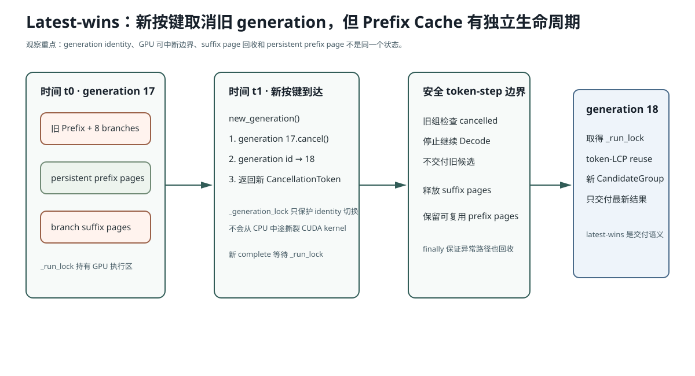

# Lesson 15：Latest-wins——取消、锁与 KV 生命周期

> 源码基线：`bfc72896bbadab5c897672506d237c070900412e`
>
> 输入法中“旧请求最终也算完”不是公平，而是错误。用户一旦继续输入，旧候选失去展示资格。本课把取消拆成三个问题：**谁宣布旧 generation 失效、GPU 工作在哪个边界停止、无论怎样退出都由谁回收 KV Page。**



图中要区分三件事：旧 generation 失去交付资格、旧 suffix page 必须释放、而仍与新 Prefix 相同的 persistent prefix page 可以继续复用。

## 1. 为什么 FIFO 对输入法是错误语义

连续按键：

```text
t0: “没关系”
t1: “没关系，你”
t2: “没关系，你先忙”
```

若按普通队列逐个完成：

```text
t0 候选返回
→ t1 候选返回
→ t2 候选返回
```

用户会看到过期结果闪回。

所以正确语义不是“每个请求都得到结果”，而是：

```math
\boxed{\text{只有当前最大 generation\_id 可以交付}}
```

旧请求可以做过一些 GPU 工作，但它的结果必须被标记为 cancelled，并尽快释放不再需要的 suffix KV。

## 2. `new_generation()` 做了什么

```python
def new_generation(self):
    with self._generation_lock:
        if self._active_token is not None:
            self._active_token.cancel()
        self._generation_id += 1
        self._active_token = CancellationToken(self._generation_id)
        return self._active_token
```

这里有两个状态：

```text
_generation_id     当前世代编号
_active_token      当前世代的取消句柄
```

`threading.Event` 提供线程安全的单向状态：

```text
not cancelled → cancelled
```

一旦取消不会恢复。

## 3. 为什么需要两个 Lock

### `_generation_lock`

保护：

- 取消旧 token；
- generation id 递增；
- 安装新 active token。

它持有时间很短，所以用户新按键能快速声明“旧组作废”。

### `_run_lock`

保护：

- 当前 CUDA CandidateGroup 执行；
- 单用户持久 Prefix Cache；
- Page Table / Context 的进程级可变状态。

当前系统选择：

```text
同一时刻只让一个 CandidateGroup 操作 GPU Runtime State
```

新按键可以先通过 `_generation_lock` 取消旧 token，然后新的 `complete()` 等旧组在下一个检查点退出 `_run_lock`。

这不是并行 serving，而是单用户状态收敛。

## 4. 取消为什么不能随时打断 GPU Kernel

`CancellationToken` 在 `_generate_branch_batch` 每个 token step 开头检查：

```python
for step in range(max_new_tokens):
    if cancellation.cancelled:
        cancelled = True
        break
```

它不能在一个已经发射的 CUDA Kernel 中间把线程切断。

所以取消粒度是：

```text
当前 token step 的 kernel/同步边界完成
→ Python 重新获得控制
→ 检查 cancelled
→ 不再发射下一 token step
```

这解释了测试中旧组可能已经生成若干 token 才停止。

更细粒度的 kernel preemption 通常成本高、复杂且不一定受当前栈支持。

## 5. 取消与“丢弃结果”不是一回事

最弱实现：

```text
旧请求仍完整生成 12 token
最后发现 generation_id 过期
→ 不展示
```

它保证 UI 不显示旧结果，但浪费所有 GPU 工作和 suffix KV。

当前实现：

```text
每个 token step 检查 Event
→ 尽早停止后续 Decode
→ 返回 cancelled=True
→ finally 回收当前分配的 Page
```

所以兼顾：

- 结果正确性；
- 计算止损；
- 资源回收。

## 6. KV 生命周期为什么必须画清楚

一次请求中的 Page 分三类：

### 持久 Prefix Page

```text
属于当前用户最新 Prefix
跨 CandidateGroup / 相邻按键保留
reset_prefix_cache() 才全部释放
```

### 当前候选批次 Suffix Page

```text
属于当前 `_generate_branch_batch`
文本与分数物化后立即释放
```

### 异常/取消路径中的临时 Page

```text
任何中途异常或 cancellation
→ finally 中释放
```

核心模式：

```python
allocated_pages = []
try:
    ... allocate ...
finally:
    if allocated_pages:
        free(cat(allocated_pages))
```

这体现资源管理原则：

> 分配者必须在正常、取消和异常三条路径上都能证明所有权终结。

## 7. 为什么 Prefix Page 不在旧请求取消时全部释放

新 Prefix 通常与旧 Prefix 有 token-LCP。若旧组被取消就清空 Prefix Cache，下一按键失去增量 Prefill 收益。

所以取消的是：

```text
旧候选分支与旧输出资格
```

不是自动取消：

```text
仍可能属于新 Prefix 的稳定 Prefix KV
```

后续 `_prepare_prefix(new_ids)` 决定旧 Prefix 哪些 Page 保留、哪些尾页释放。

这是生命周期所有权的关键区别。

## 8. GPU 测试怎样验证行为

测试做法：

1. 创建旧 generation token；
2. 在线程中启动一个强制生成 64 token 的旧请求；
3. 等 15ms；
4. `new_generation()` 取消旧组；
5. 等线程退出；
6. 断言旧结果 `cancelled=True`；
7. 用新 token 运行新 Prefix，必须成功；
8. `reset_prefix_cache()`；
9. 断言 `available_size == num_pages`。

最后一步证明的不只是“功能成功”，还证明 Page 没泄漏。

## 9. 为什么不把旧、新组一起 Continuous Batch

理论上可以让旧组和新组短暂共存，但对当前产品没有价值：

- 旧组已经没有展示资格；
- 它占用 Decode 带宽与 Page；
- 增加新组尾延迟；
- 让共享 Prefix/Context 所有权更复杂。

因此当前目标是：

```text
旧组尽快退出
→ 新组独占当前 GPU 运行时
```

## 10. 常见错误解释

### 错误：有 generation id，最后比较一下就完成取消了

只保证结果不展示，不能停止计算，也不能证明 KV 及时回收。

### 错误：取消旧请求必须立即清空全部 Cache

错。稳定 Prefix Page 可能被新按键复用；应由新 Prefix 的 token-LCP 决定。

### 错误：加了线程就代表两个 GPU 请求并发执行

当前 `_run_lock` 明确串行化 CandidateGroup。线程主要用于模拟新按键在旧组运行时到来。

## 11. 运行实验

```bash
python resources/lesson-15-latest-wins/run_lesson15.py
```

该实验用线程、Event 和小型 Page Allocator 模拟 token-step cancellation，验证 suffix 回收而 Prefix 保留。

GPU 测试：

```bash
AIOS_IME_MODEL=/path/to/model pytest -q \
  tests/test_ime_gpu.py::test_latest_generation_cancels_old_group_and_frees_pages
```

## 12. 检验问题与参考答案

### 问题 1：为什么 cancellation check 放在 token step 边界，而不是候选完成后？

**参考答案：** 如果只在候选全部生成完成后检查，旧 generation 虽然不会展示，但仍会继续做所有 Decode 工作。放在 token step 边界可以在当前已发射 GPU 工作结束后尽快停止下一步，既符合 CUDA 的可控边界，又能及时止损计算和 suffix KV。

### 问题 2：`_generation_lock` 与 `_run_lock` 合并成一个锁会怎样？

**参考答案：** 新按键如果必须先等旧 GPU 运行结束才能拿到同一个锁，就无法立即把旧 generation 标成 cancelled，取消延迟会接近旧请求剩余运行时间。拆锁后，短锁只负责世代身份切换，长锁继续保护 GPU/Prefix 可变状态。

### 问题 3：如果 `finally` 忘记释放 suffix Page，为什么短测试可能仍通过？

**参考答案：** 单次请求可能还有足够空闲 Page，功能输出照样正常；泄漏会在多轮请求后逐渐耗尽 Cache，最终才表现为分配失败或显存异常。因此资源生命周期必须有显式不变量，例如 reset 后 `available_size == num_pages`。

### 问题 4：latest-wins 与普通请求超时有什么共同点和区别？

**参考答案：** 两者都需要让已无价值的工作尽快停止并回收资源。区别在于 latest-wins 的触发条件是“出现了更新的用户输入”，旧请求即使没超时也立刻失效；普通超时则通常由绝对时间预算触发，而且没有天然的新请求可以继承 Prefix 状态。

### 问题 5：为什么取消旧组时不直接释放全部 Prefix Page？

**参考答案：** 因为 Prefix KV 的生命周期与候选分支不同。新按键往往与旧 Prefix 有长 token-LCP，稳定部分仍属于新输入。正确做法是先取消旧分支和输出资格，再由新 Prefix 的 `_prepare_prefix` 判断哪些 Prefix Page 继续保留、哪些尾页释放。

## 13. 一句话复述

Latest-wins 用短持有的 generation lock 原子取消旧世代，用 run lock 保护单用户 GPU/Prefix 状态，在每个 token step 边界停止旧分支，并通过 finally 回收 suffix Page；稳定 Prefix Page 不盲目清空，而交给新 Prefix 的 token-LCP 决定去留。
