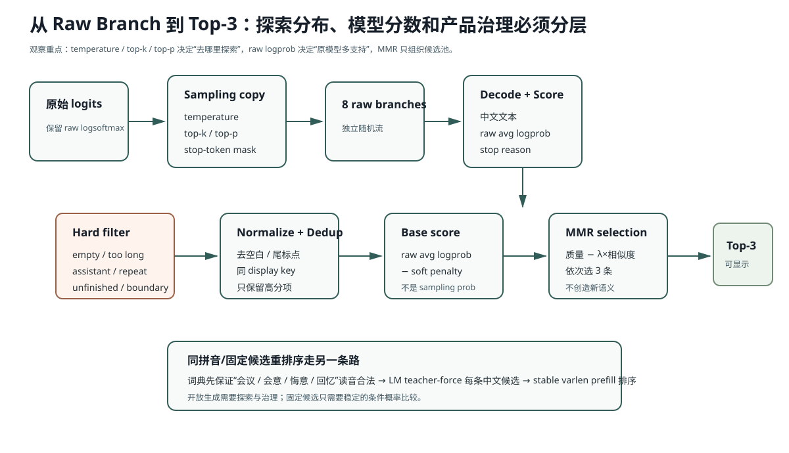

# Lesson 16：候选治理与稳定重排序

> 源码基线：`bfc72896bbadab5c897672506d237c070900412e`
>
> 模型产生的是若干 Token 序列和概率，不是“最终候选栏”。本课解释为什么 Sampling、Model Score、合法性、显示等价、语义多样性和同拼音重排序必须分层处理。



这张图最重要的边界是：Sampling Policy 只负责扩大探索范围，排序保存原始模型 logprob；过滤、去重和 MMR 属于产品治理，不是模型能力本身。

## 1. 从 Raw Branch 到 Top-3 的完整链

```text
原始 logits
→ Sampling Policy（temperature / Top-k / Top-p / stop mask）
→ 多路 token 序列
→ raw average logprob
→ Decode 中文
→ normalize
→ hard invalid reasons
→ soft penalty
→ display-key dedup
→ MMR diversity selection
→ Top-3
```

每一层回答不同问题：

| 层 | 问题 |
|---|---|
| Sampling | 怎样探索不同续写？ |
| Raw logprob | 模型本身多相信这条序列？ |
| Hard filter | 能否进入候选栏？ |
| Dedup | 显示上是否其实同一条？ |
| Soft penalty | 没有绝对非法，但是否不自然？ |
| MMR | 已选候选旁边，再选谁更有新增价值？ |

## 2. 为什么排序不能直接使用 Sampling 概率

Temperature 会改变概率尖锐程度；Top-k/Top-p 会删除尾部；Stop Mask 会临时禁止 EOS。

若用修改后的分布排序：

```text
同一候选的分数会随探索参数改变
```

当前实现：

```python
raw_log_probs = log_softmax(original_logits)
# 另一份 sampling_logits 才做 temperature/top-k/top-p/mask
```

采到 token 后，返回：

```text
raw_log_probs[token]
```

因此：

```text
Sampling 决定“看哪些候选”
Raw model score 决定“模型原本多支持它”
```

## 3. 为什么使用平均 Token Logprob

候选：

```text
A：晚点说            3 token
B：我晚点再联系你    6 token
```

Sum Logprob 随长度通常越来越负，天然偏向短句。

当前基础分：

```math
\operatorname{avglogp}(c)
=
\frac{1}{|c|}
\sum_t \log P(c_t\mid prefix,c_{<t})
```

再减：

```text
soft_penalty(c)
```

平均值减少长度偏差，但不完美：长句可以用许多高频 token 稀释一个关键错误，所以仍需字符上限与人工评测。

## 4. Hard Filter 具体拒绝什么

当前规则包括：

```text
empty
长度 < 2
too_long
助手模板：“以下是”“作为AI”……
重复字符或 n-gram
以功能词结尾：“的、和、如果、然后……”
Prefix 末字与候选首字边界重复
```

Hard Filter 的含义：

```text
invalid_reasons 非空
→ base_score = -∞
→ 无论模型多高概率都不显示
```

这是产品合法性，不是模型语言概率。

## 5. 显示去重为什么不能只比较原字符串

以下候选：

```text
我晚点回复。
 我晚点回复
我 晚点 回复！
```

显示意义接近。

`candidate_key`：

```text
去空白
去尾部常见标点
casefold
```

每个 key 只保留 base score 最高者。

注意：这不是语义去重，只是显示归一化。两个不同措辞还需要 MMR 处理相似性。

## 6. MMR 怎样在质量与多样性之间选择

先选最高 base score。

之后每个候选计算：

```math
\operatorname{selection}(c)
=
\operatorname{base}(c)
-
\lambda
\max_{s\in selected}
\operatorname{similarity}(c,s)
```

当前 similarity 是字符 bigram Jaccard。

例子：

```text
A：我晚点给你发消息      score -0.10
B：我晚一点给你发消息    score -0.11，与 A 很像
C：等我回来再联系你      score -0.16，与 A 较不同
```

若 `lambda` 足够大，第二名可能选 C 而不是 B。

这不是说 C 的模型分数更高，而是候选栏整体的信息覆盖更好。

## 7. 为什么同拼音候选不走开放生成

上游词典已经给出：

```text
上下文：这本小说写尽了
候选：世间 / 时间 / 实践 / 事件
```

语言模型只需计算：

```math
\frac1{|c|}\sum_t\log P(c_t\mid context,c_{<t})
```

拼音字符串不直接输入模型。词典负责发音约束，LM 负责中文语境。

## 8. `stable` 与 `shared_decode` 为什么分流

### shared_decode

```text
Prefix Prefill 一次
→ 多个候选逐 token teacher-forced Decode
→ 共享 Prefix KV
```

更省 Prefix 工作，适合诊断。

### stable

```text
每个完整 prefix+candidate 拼成序列
→ 一次 Flat Varlen Prefill
→ 返回所有位置 logits
→ 对 candidate token gather logprob
```

更耗 KV，但避免不同 Prefill/Decode Kernel 的 BF16 近似误差改变近平局排序。

报告中“世间/时间”分差约 0.004 nat，shared decode 出现过 kernel 数值翻转，因此最终同拼音排序默认 stable。

这说明：

> 数学公式相同，不同 kernel 的低精度舍入仍可能在极近分候选上改变离散排序。

## 9. 为什么稳定重排不能只看速度

最终选择 stable 的依据：

```text
冻结上下文/同拼音排序指标恢复到原 0.1B 水平
```

而不是“理论上应该一样”。

当输出是 Top-1 排序时，0.004 nat 的变化可能造成 0/1 指标翻转，所以需要按最终离散任务验收。

## 10. 常见错误解释

### 错误：模型概率最高的三条直接显示即可

错。空串、助手模板、显示重复、未完句和高度同质都可能高概率。

### 错误：MMR 提高了模型语义能力

错。它只重新组织候选池；若池中没有好答案，MMR 无法创造答案。

### 错误：Prefill 与 Decode 数学等价，所以 BF16 排序必定完全一致

错。不同 kernel/归约顺序会有舍入差，近平局的离散名次可能翻转。

## 11. 运行实验

```bash
python resources/lesson-16-candidate-governance/run_lesson16.py
```

它会构造重复、助手模板和近似候选，逐步打印 hard filter、dedup 与 MMR 选择结果。

CPU 单元测试：

```bash
pytest -q tests/test_ime.py
```

GPU 稳定评分：

```bash
AIOS_IME_MODEL=/path/to/model pytest -q \
  tests/test_ime_gpu.py::test_stable_same_pinyin_scoring_avoids_decode_near_tie_flip
```

## 12. 检验问题与参考答案

### 问题 1：为什么 `average_logprob` 仍可能偏好某些长度？

**参考答案：** 平均分只消除了“Token 越多总和越负”的直接惩罚，却没有消除语言模型对常见短语、标点和高频 Token 的结构性偏好。长候选还可能用多个容易 Token 稀释一个关键低概率位置，因此仍需要长度边界、产品治理和真实样本评测。

### 问题 2：MMR 的 `lambda` 太大或太小分别会怎样？

**参考答案：** 太小几乎只按 base score 排序，Top-3 容易是同一句话的小改写；太大会过度奖励差异，即使某条候选模型质量明显更差，也可能因为“不像已选项”被选中。`lambda` 控制的是候选栏整体的质量—多样性权衡，而不是模型本身。

### 问题 3：Hard Rule 与模型 Reranker 的所有权应该如何划分？

**参考答案：** Hard Rule 更适合处理确定的产品禁区，例如空串、助手模板、重复 n-gram、明显未完成片段；Reranker 更适合连续质量判断。若把绝对非法规则交给学习模型，可能出现高分漏过；若把所有风格偏好都写成硬规则，又会过度僵化。

### 问题 4：为什么 stable scoring 使用 `return_all_logits=True`？

**参考答案：** Teacher-forced 评分需要 candidate 每个 Token 对应的条件概率，而不仅是整条序列最后一个位置的 next-token Logits。`return_all_logits=True` 才能取出 Prefix 后每个 candidate 位置的 Logits，再 gather 对应 target Token 的 logprob。

### 问题 5：如何证明排序变化来自数值路径，而不是 Tokenizer 或输入差异？

**参考答案：** 必须固定模型权重、Tokenizer、prefix、candidate token IDs 与评分公式，只改变 Prefill/Decode kernel 路径，然后比较逐 Token Logprob 和最终排序。如果输入 Token 本身不同，就不能把差异归因于 BF16 kernel 舍入。

## 13. 一句话复述

AIOS-IME 把探索分布与原始模型分数分开，先过滤绝对不可显示候选，再按显示 key 去重，用软惩罚和字符 bigram MMR 组成互异 Top-3；对于 BF16 近平局的固定中文候选，使用完整序列 Varlen Prefill 稳定复评分，而不是假设 shared decode 排名必然一致。
