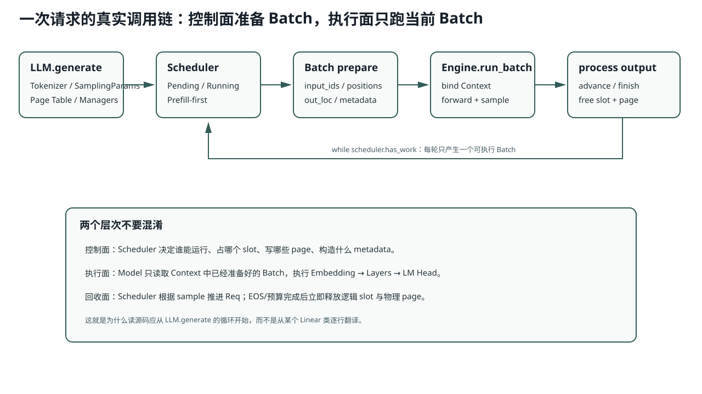

# Lesson 18：一次请求怎样穿过整个 AIOS

> 源码基线：`db343cbe07075c619d2519cb499c401f9edf895a`
>
> 目标：不从 `Linear` 或 `Attention` 开始，而是先掌握整个程序的“骨架函数”。学完后，你能从 `LLM.generate()` 一直追到结果返回，并说清 Scheduler、Engine、Model 各自拥有什么决定权。



## 1. 先看外部 API

```python
results = llm.generate(
    prompts=["你好", "请解释 KV Cache"],
    sampling_params=params,
)
```

表面上只有一行。内部却要完成：

```text
字符串 → Token IDs
→ 为所有可能位置准备 Page Table
→ PendingReq
→ Prefill Batch
→ Model Forward
→ First Token
→ Running Decode
→ EOS / Token Budget
→ 回收 Slot 与 Page
→ Decode 成字符串
```

这就是为什么源码带读应先找“谁控制循环”，而不是先钻某个算子。

## 2. `LLM.__init__` 建立哪些长期对象

一次 `LLM` 实例长期持有：

| 对象 | 职责 |
|---|---|
| `ModelConfig` | 固定层数、Head、Hidden、Context 等结构 |
| `model` | 真正执行 Forward 的算子图 |
| `tokenizer` | 文本与 Token ID 映射 |
| `MHAKVCache` | GPU 上的物理 K/V 存储池 |
| `CacheManager` | 分配/归还物理 Page ID |
| `Context` | 当前 Forward 的 Batch、KV Cache、Attention Backend |

注意 Scheduler 不是永久对象；通用 `generate()` 每次调用都会按本次请求数创建自己的：

```text
page_table
TableManager
Scheduler
Engine
```

## 3. Page Table 的 Shape 为什么这样算

对第 `i` 个请求：

- Prompt 长度记为 `T_i`；
- 最多生成 `O_i` 个 Token。

本批次可能出现的最长逻辑序列：

```math
L_{max} = \max_i (T_i + O_i)
```

因此 Page Table：

```text
[max_running_reqs, L_max]
```

每一行代表一个当前可运行请求，每一列代表该请求的逻辑 Token 位置，值是物理 KV Page ID。

### 小例子

```text
请求 A：T=3，O=4 → 最大长度 7
请求 B：T=5，O=2 → 最大长度 7
```

所以 `L_max=7`。若最多同时运行 2 条：

```text
page_table.shape = [2,7]
```

## 4. `generate()` 的主循环

核心结构：

```python
while scheduler.has_work:
    batch = scheduler.schedule_next_batch()
    if batch is None:
        break
    next_tokens = engine.run_batch(batch)
    scheduler.process_batch_output(batch, next_tokens)
```

四行分别意味着：

1. **Scheduler 决定谁运行**；
2. **Engine 执行已经准备好的 Batch**；
3. **Sampler 产生每请求下一个 Token**；
4. **Scheduler 推进 Req 并释放完成资源**。

Model 不决定某请求何时加入 Batch，也不决定 Page 分配；这些属于控制面。

## 5. 为什么 Scheduler 与 Engine 分开

如果 Model 自己管理请求队列、Page 和 EOS：

- 算子层会知道过多 serving 状态；
- 换 Attention Backend 更困难；
- Batch 策略与模型结构耦合；
- 单元测试难以隔离。

当前分层：

```text
Scheduler：Who / When / Where
Engine：Execute / Sample
Model：Tensor Transform
Attention Backend：Metadata + Kernel Dispatch
```

## 6. Prompt 是怎样编码的

`prompt_mode="chat"`：

```text
字符串 → Chat Template → Token IDs
```

`prompt_mode="raw"`：

```text
字符串 → 直接 Tokenize → 可选 BOS
```

AIOS-IME 使用裸中文 Prefix，所以主路径是：

```text
raw + add_bos=True
```

若误用 Chat Template，模型会看到系统/用户标记，输入契约发生变化，即使代码仍能运行。

## 7. 结果为什么按 UID 排序

请求在 Running Set 中的执行顺序可能变化，完成时间也不同。`collect_results()` 最后：

```python
results.sort(key=lambda r: r["uid"])
```

所以 API 返回顺序恢复为提交顺序，而不是完成顺序。

这说明：

```text
Runtime order ≠ API result order
```

## 8. 运行示例

```bash
python resources/lesson-18-request-lifecycle/run_lesson18.py
```

实验模拟两条请求在 Prefill/Decode 中交错推进，打印每轮“谁被调度、谁完成、谁释放”。

## 9. 常见错误解释

### 错误：`LLM.generate()` 就是不断调用 `model.forward()`

不完整。真正复杂的是请求接纳、Batch 重组、Page 生命周期和完成回收。

### 错误：Scheduler 做模型计算

错。Scheduler 只准备 Tensor/Metadata 和运行集合；Engine/Model 执行计算。

### 错误：Page Table 的行数等于输入请求总数

不一定。它等于 `max_running_reqs`；总请求可以更多，完成后 Slot 被后续请求复用。

## 10. 检验问题与参考答案

### 问题 1：为什么 `Engine` 不直接接收 Prompt 字符串？

**参考答案：** 文本解析、Tokenizer、请求接纳和 Slot/Page 分配都属于 Engine 之前的控制面。Engine 的输入应该已经是一个可执行 Batch：有哪些请求、Flat Token、Position、写入 Page 和 Attention Metadata 都已确定。这样 Engine 才能只负责执行与采样，而不与输入格式和调度策略耦合。

### 问题 2：若 `max_running_reqs < len(prompts)`，剩余请求在哪里等待？

**参考答案：** 它们先进入 `PrefillManager.pending_list`，只有当 Table Slot、Running Set 容量和 KV Page 预算允许时才被选入 Prefill Batch。已完成请求释放 Slot/Page 后，后续 Pending Request 才能进入。

### 问题 3：为什么 API 结果按 UID 排序，而不是依赖 Runtime Set 的顺序？

**参考答案：** Decode Running Set 的集合顺序和请求完成先后都不等于用户提交顺序。UID 是稳定的请求身份，最终按 UID 排序才能恢复 API 输入顺序，避免调度优化改变调用方观察到的结果排列。

### 问题 4：如果 `schedule_next_batch()` 返回 `None` 但 `has_work=True`，说明了什么？

**参考答案：** 说明系统声称还有 Pending/Running 工作，却在当前资源或策略下无法构造一个可运行 Batch。这可能是容量估算、调度策略或资源状态不一致。当前 `generate()` 直接退出是一个保守边界；长生命周期服务通常需要区分“暂时不可调度”和“永久无进展”，否则可能过早结束或形成死循环。

### 问题 5：通用 `generate()` 每次新建 Scheduler，与长生命周期服务 Scheduler 有什么差异？

**参考答案：** 每次新建 Scheduler 的生命周期等于一次 API 调用，状态简单，调用之间不共享队列；长生命周期 Scheduler 则持续接收新请求，需要 IPC/线程安全、取消、优先级、公平性、长期 Cache Eviction 和恢复等额外机制。二者核心调度概念相同，但所有权边界不同。

## 11. 一句话复述

AIOS 的主循环由 Scheduler 控制请求与资源状态，Engine 只执行当前 Batch，Model 只完成 Tensor 变换；理解这条控制面—执行面边界，是后面读 Prefill、Decode 和 IME 专项代码的入口。
