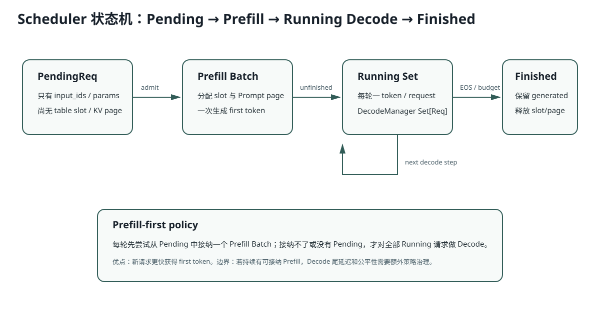

# Lesson 20：Scheduler 状态机——Pending、Running、Finished

> 源码基线：`db343cbe07075c619d2519cb499c401f9edf895a`
>
> 目标：把 Scheduler 看成状态机，而不是一个“循环工具类”。你要能解释每一次状态迁移、资源何时分配，以及 Prefill-first 的收益和边界。



## 1. 三个集合分别拥有什么

### Pending

`PendingReq` 只有：

```text
uid
input_ids
sampling_params
```

尚未获得：

```text
table slot
physical KV page
Req runtime object
```

### Running

`DecodeManager.running_reqs` 持有已经 Prefill、还可继续 Decode 的 `Req`。

### Finished

`Scheduler.finished` 保存已完成 `Req`。它们的 Slot/Page 已释放，但 `generated` 仍在。

## 2. Prefill-first 的真实代码

```python
batch = (
    prefill_manager.schedule_next_batch(...)
    or decode_manager.schedule_next_batch()
)
```

顺序意味着：

1. 只要 Pending 中能接纳请求，优先产生 Prefill Batch；
2. 没有可接纳 Prefill 时，才对整个 Running Set Decode。

收益：新请求更快获得 first token。

边界：若持续到来且总能接纳 Prefill，请求间公平性和已有请求的 decode 尾延迟可能需要更复杂策略。当前实现没有 chunked prefill 或显式 starvation 控制。

## 3. 接纳不只是“还有一个 Slot”

PrefillManager 依次检查：

```text
Table Slot 容量
Running Set 容量
KV Page 容量
Prefill Token Budget
```

其中 Page 容量是保守预留：

```math
N + I \le F
```

- `N`：当前候选请求的 `input_len + output_len`；
- `I`：现有 Running 请求与本轮已选请求的未来保留量；
- `F`：当前 Free Pages。

这样接纳后，理论上可保证这些请求生成到上限时不会中途 OOM。

代价：预留较保守，实际很多请求会提前 EOS，但被预留的潜在容量阻止了更多请求提前进入。

## 4. 为什么 Pending 只从队首连续选择

```python
for pending in pending_list:
    ...
    if cannot_admit:
        break
```

它不跳过一个超长请求去接纳后面的短请求。这保持 FIFO 倾向与实现简单，但会产生 Head-of-line Blocking：

```text
队首长请求暂时放不下
→ 后面的短请求也不接纳
```

这是当前边界，不应把它描述成最优调度器。

## 5. Prefill 后怎样进入 Running

一次 Prefill 也会采样 first token。`process_batch_output()`：

1. `_advance(req, tok)`；
2. 若 EOS/预算完成，直接释放并进入 Finished；
3. 否则把 Prefill Batch 中未完成请求交给 `decode_manager.filter_reqs()`。

因此：

```text
Pending → Prefill → Finished
```

也是合法路径，不一定都经过 Running。

## 6. Decode 怎样循环

`DecodeManager.schedule_next_batch()`：

```python
return Batch(reqs=list(running_reqs), phase="decode")
```

当前每轮包含所有 Live 请求，没有 token budget 或部分选择。完成请求立即从 Set 移除并释放资源，下一轮 Batch 自然变小。

## 7. `_advance` 是状态迁移的唯一入口

```python
req.complete_one()
token_pool[slot, device_len - 1] = tok
req.generated.append(tok)
hit_eos = ...
return hit_eos or not req.can_decode
```

顺序很重要：

- 先把刚才 Forward 的输入标记为 Cached；
- 再为新 Token 扩展 Device Length；
- 把新 Token 写入 Pool；
- 保存到 `generated`；
- 再判断是否结束。

即使新 Token 是 EOS，也会进入 `generated`；结果 Decode 时 `skip_special_tokens=True` 会忽略它。

## 8. 完成时为什么先读取 Page，再释放 Slot

```python
used_pages = page_table[slot, :cached_len]
table_manager.free(slot)
cache_manager._free(used_pages)
```

如果先让新请求复用 Slot 并覆写 Page Table，再读取 used pages，旧请求的物理 Page 身份可能丢失。当前代码在同一同步流程内先取 View/索引，再归还 Slot；更强并发下还需明确是否 clone/同步。

## 9. 运行实验

```bash
python resources/lesson-20-scheduler-state-machine/run_lesson20.py
```

实验模拟一个队首长请求造成的 Head-of-line Blocking，以及 Prefill-first 对已有 Decode 请求的影响。

## 10. 常见错误解释

### 错误：Continuous Batching 就是每轮把所有请求放一起

不完整。关键是请求可以在 token-step 边界进入/退出 Running Set，并即时复用 Slot/Page。

### 错误：Prefill-first 永远降低延迟

它降低新请求 TTFT，但可能增加已有请求的 ITL/p95，需要 workload 下权衡。

### 错误：Page 不足时 Scheduler 会自动 Evict

当前 CacheManager 明确没有 eviction；接纳必须避免触发不足。

## 11. 面试追问

1. 如何避免队首长 Prompt 阻塞后面的短 Prompt？
2. Prefill Token Budget 与 Chunked Prefill 有什么区别？
3. 为什么保留完整未来 Output Page 会降低并发，却提升运行中安全性？
4. 若 Running Set 是 Set，Decode Batch 顺序是否稳定？会影响什么？
5. 怎样设计兼顾 TTFT 与 ITL 的调度策略？

## 12. 一句话复述

Scheduler 把请求从无资源的 Pending 接纳为 Prefill Batch，再把未完成请求送入 Running Set，每个 Token Step 后完成即释放；当前 Prefill-first、FIFO 连续选择和保守 Page 预留简单可靠，但存在公平性、Head-of-line Blocking 与并发利用率边界。
