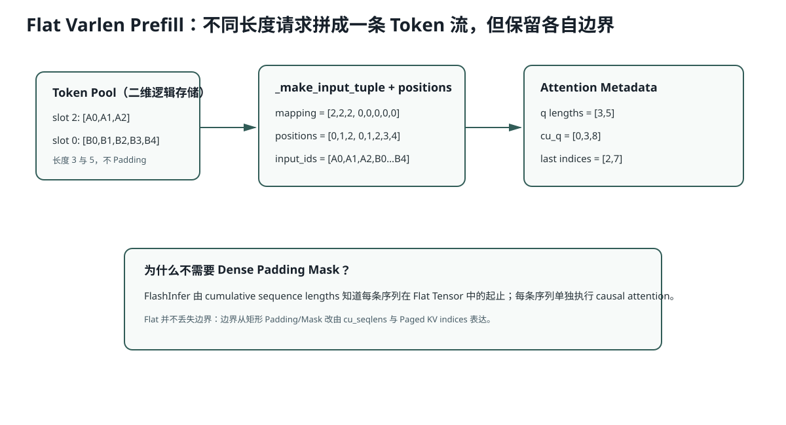

# Lesson 21：`PrefillManager` 与 Flat Varlen Batch

> 源码基线：`db343cbe07075c619d2519cb499c401f9edf895a`
>
> 目标：逐步追踪两条不同长度 Prompt 如何获得 Slot/Page，怎样从二维 Token Pool 抽取成一条 Flat Tensor，以及 `positions/out_loc` 如何保持各自语义。



## 1. `PendingReq` 为什么还不是 `Req`

Pending 阶段不应提前占：

```text
Table Slot
Token Pool Row
Page Table Row
KV Page
```

所以只保存输入与策略。直到真正被本轮接纳，才构造 `Req`。

## 2. 接纳后先分配 Table Slot

```python
table_idx = table_manager.allocate()
token_pool[table_idx, :prompt_len] = input_ids
```

假设自由 Slot 以栈方式返回 `2` 和 `0`：

```text
slot 2 ← [A0,A1,A2]
slot 0 ← [B0,B1,B2,B3,B4]
```

请求顺序与 Slot 数字没有关系；`table_idx` 是后续所有映射的主键。

## 3. KV Page 为什么稍后才分配

PrefillManager 只构造 Batch。统一在 `Scheduler._prepare_batch()`：

```python
cache_manager.allocate_paged(batch.reqs, page_table)
```

这样 Prefill/Decode 都使用同一套 Page 分配入口，并保证：

```text
req.cached_len : req.device_len
```

这一段所有未缓存 Token 都得到 Page。

## 4. `_make_positions` 怎样生成绝对位置

对每个 Req：

```python
arange(cached_len, device_len)
```

首次 Prefill：

```text
A: [0,1,2]
B: [0,1,2,3,4]
```

增量 Prefill（若 A 已缓存 3，当前长度 5）：

```text
A extension positions: [3,4]
```

绝对位置不能从 0 重启，否则 RoPE 位置错误。

## 5. `_make_input_tuple` 为什么返回二维索引

它生成：

```text
row mapping + positions
```

例子：

```text
mapping   = [2,2,2, 0,0,0,0,0]
positions = [0,1,2, 0,1,2,3,4]
```

PyTorch 高级索引：

```python
input_ids = token_pool[mapping, positions]
```

得到 Flat：

```text
[A0,A1,A2,B0,B1,B2,B3,B4]
```

同样：

```python
out_loc = page_table[mapping, positions]
```

得到每个 Flat Token 写入的物理 Page ID。

## 6. 为什么 Flat Batch 不需要 Padding

传统 Dense：

```text
[A0,A1,A2,PAD,PAD]
[B0,B1,B2,B3,B4]
```

Flat：

```text
[A0,A1,A2,B0,B1,B2,B3,B4]
```

总 Token 数：

```math
N_{flat} = \sum_i T_i
```

Dense 分配：

```math
N_{dense} = B \times \max_i T_i
```

本例：

```text
Flat = 3 + 5 = 8
Dense = 2 × 5 = 10
```

Attention 边界由后续 `cu_seqlens` 恢复，而不是由 Padding Mask 表达。

## 7. LM Head 为什么只投影每条 Prompt 最后位置

Prefill 的 Flat Hidden 有 8 行，但 serving 只需：

```text
A 的 position 2
B 的 position 4
```

`cu_seqlens_q=[0,3,8]`，最后位置：

```math
[3,8] - 1 = [2,7]
```

`LMHead.forward()` 只选择 `x[[2,7]]`，将 `[8,H]` 缩为 `[2,H]` 后再投影词表，避免为历史位置计算无用 Logits。

## 8. Pinned Memory 的意义

`positions` 和 mapping 先在 CPU Pinned Memory 构建，再：

```python
.to(device, non_blocking=True)
```

Pinned Host Memory 允许更高效的异步 H2D 拷贝。当前单 CUDA Stream 未真正做复杂 overlap，但接口为后续异步调度保留可能。

## 9. 运行实验

```bash
python resources/lesson-21-prefill-code-reading/run_lesson21.py
```

它会打印 Token Pool、Mapping、Positions、Flat Input、Out Loc 和 Last Indices。

## 10. 常见错误解释

### 错误：Flat Batch 把两句话拼成一条长句

错。Tensor 物理连续，但 `cu_seqlens` 保留逻辑边界，Attention 不跨请求连接。

### 错误：`positions` 是 Flat Tensor 下标

错。它是每条原序列中的绝对 Token Position；Flat 下标由 Offset 隐含表示。

### 错误：`out_loc` 是输出 Logits 的位置

错。它是当前 K/V 写入物理 Cache 的 Page 位置。

## 11. 检验问题与参考答案

### 问题 1：Flat Prefill 怎样避免请求 A Attention 到请求 B？

**参考答案：** Flat Tensor 只改变物理存储布局，不改变逻辑序列边界。Attention Backend 根据 `cu_seqlens_q/cu_seqlens_k` 知道每个请求在 Flat Tensor 中的起止区间，Kernel 分别对每段执行因果 Attention，因此 A 的 Query 不会把 B 的 K/V 当成同一序列历史。

### 问题 2：为什么 `input_mapping` 使用 Slot，而不是 UID？

**参考答案：** Token Pool 与 Page Table 的第一维就是可复用的 Table Slot；真正读取 Tensor 时需要的是“去哪一行取数据”。UID 是长期请求身份，不一定连续，也不等于当前物理行号。调度器通过 `Req.table_idx` 把稳定身份映射到当前 Slot。

### 问题 3：若 `return_all_logits=True`，LM Head 为什么不能只取 Last Indices？

**参考答案：** Last Indices 只适合 Serving Prefill，因为生成下一个 Token 只需要每条 Prompt 的最后位置。Teacher-forced 评分或诊断可能需要序列中每个位置的 Logits，此时提前丢掉历史 Hidden 就无法计算逐 Token 条件概率。

### 问题 4：Chunked Prefill 时 `cached_len/extend_len` 如何变化？

**参考答案：** 第一个 Chunk 前 `cached_len=0`，`extend_len` 是首段长度；执行后该段进入 KV，`cached_len` 前进到 Chunk 末尾。下一轮 `device_len` 可以已经包含更多 Prompt Token，而 `extend_len=device_len-cached_len` 只表示当前 Chunk 尚未缓存的部分。核心不变量仍是只为 `[cached_len, device_len)` 分配 Page 和执行 Forward。

### 问题 5：Pinned Memory 与真正的 CPU/GPU overlap 之间还缺什么？

**参考答案：** Pinned Memory 和 `non_blocking=True` 只是允许异步拷贝。要真正与 GPU 计算重叠，还需要独立 CUDA Stream、合理的事件依赖，以及 CPU 提前准备下一 Batch，使 H2D 拷贝能与当前 Kernel 同时进行；当前单 Stream 流程不自动获得这些收益。

## 12. 一句话复述

PrefillManager 在接纳时为请求分配逻辑 Slot 并写 Token Pool，Scheduler 再为未缓存区间分配物理 Page，用 `(slot, absolute_position)` 抽取 Flat Input 和 Out Loc；序列边界由累计长度保存，因此无需 Padding。
