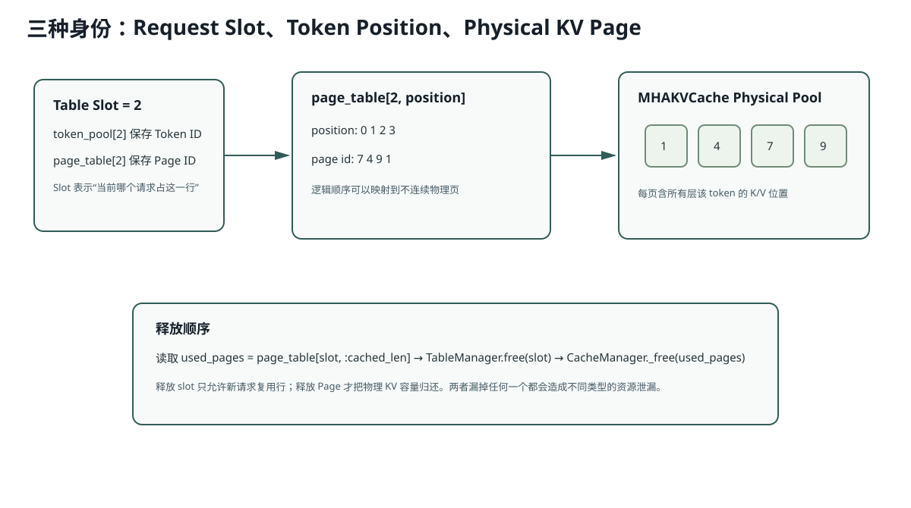

# Lesson 23：`TableManager`、`CacheManager` 与 Page 所有权

> 源码基线：`db343cbe07075c619d2519cb499c401f9edf895a`
>
> 目标：彻底区分 Request Slot、Token Position 与 Physical KV Page。很多 Paged KV 解释只说“像操作系统分页”，但没有说明 AIOS 中每个数组究竟保存什么。



## 1. `TableManager` 管理逻辑行

初始化：

```python
_free_slots = list(range(max_running_reqs))
page_table = [max_running_reqs, max_seq_len]
token_pool = zeros_like(page_table)
```

同一个 Slot 的两个二维数组：

```text
token_pool[slot, pos] = Token ID
page_table[slot, pos] = Physical Page ID
```

Slot 表示“当前哪条请求占用这一行”，不是 UID，也不是 Page。

## 2. `CacheManager` 管理物理 Page ID

```python
_free_slots = arange(num_pages, device=cuda)
```

`allocate(n)` 从前部取 n 个 ID；`_free(indices)` 把 ID 拼回自由池。

当前没有 Eviction：

```python
raise NotImplementedError("CacheManager eviction is not implemented.")
```

所以 Scheduler 必须在接纳前保证未来容量。

## 3. `MHAKVCache` 才保存真正 Tensor

存储 Shape：

```text
[2, layers, pages, page_size, kv_heads, head_dim]
```

第一维 `2`：K 与 V。

MiniMind-IME：

```text
[2,14,num_pages,1,4,64]
```

BF16 单 Page 字节：

```math
B_{page} = 2 \times 14 \times 1 \times 4 \times 64 \times 2 = 14336
```

即 14 KiB。

Page ID 只是这个大 Tensor 第三个维度的索引。

## 4. `allocate_paged` 怎样填 Page Table

对每个 Req：

```python
extend_len = device_len - cached_len
indices = allocate(extend_len)
page_table[slot, cached_len:device_len] = indices
```

如果已有 3 个 Cached Token，新增长度 1：

```text
page_table[slot,3] = new_page
```

因此 Page Table 按逻辑 Token 顺序连续，物理 Page ID 可以完全不连续。

## 5. 为什么要同时释放 Slot 与 Page

请求完成：

```text
TableManager.free(slot)
→ 新请求可以复用逻辑行

CacheManager._free(pages)
→ 新 Token 可以复用物理 KV 容量
```

只释放 Slot：物理 Page 泄漏。

只释放 Page：逻辑行永远减少，最终无法接纳请求。

两类资源有不同的耗尽症状。

## 6. `_free_slots = torch.cat(...)` 的边界

当前 `_free()` 每次创建一个新 Tensor：

```python
self._free_slots = torch.cat([self._free_slots, indices])
```

优点：简单。

边界：

- 频繁分配/释放可能产生额外 GPU Tensor 操作；
- Page 顺序不整理；
- 没有 Double-free 检查；
- 没有所有权 Bitmap 或引用计数；
- 通用 Prefix Cache/Eviction 尚禁用。

课程不能把这个 Naive Manager 描述为成熟生产级 allocator。

## 7. Page Sharing 为什么需要更强所有权

通用 Scheduler 每个 Page 通常只属于一条 Req；完成可直接 Free。

IME CandidateGroup 的 Prefix Page 被多行引用，但由组级 Engine 统一持有，分支只释放 Suffix。若把这种共享放进通用 CacheManager，就需要：

- 引用计数；或
- 显式 Cache Handle/Lock；或
- 清晰的 group owner。

否则某一分支完成时可能提前释放共享 Prefix。

## 8. 运行实验

```bash
python resources/lesson-23-page-table-cache-manager/run_lesson23.py
```

实验分别模拟 Slot 泄漏、Page 泄漏和正常双回收，并打印最终容量。

## 9. 常见错误解释

### 错误：Page Table 就是 KV Cache

错。Page Table 只保存映射；真正 K/V 在 MHAKVCache Tensor。

### 错误：Slot ID 可以直接当 Page ID

错。Slot 表示请求行，Page 表示某层某 Token 的物理缓存位置，生命周期和数量不同。

### 错误：Free Page 后必须清零 K/V Tensor

通常不需要。只要 Page 未重新分配就不可读；新写入会覆盖。安全性依赖映射所有权，而不是数据清零。

## 10. 检验问题与参考答案

### 问题 1：为什么当前 Page Size=1 使分配简单，却增加 Metadata？

**参考答案：** Page Size=1 时每个 Token 都恰好对应一个 Page，不存在半满 Block、Block 内偏移和跨 Block 追加问题，所以 token-LCP 和逐 Token Decode 都非常直接。但代价是一个长序列需要更多 Page ID，Page Table、索引 Tensor 和 allocator 操作数量都会增加。

### 问题 2：怎样检测 Double-free 与 Page 泄漏？

**参考答案：** 最直接的是维护 Page 所有权 Bitmap/状态表，分配时要求状态从 free→owned，释放时要求 owned→free，重复释放立即报错；同时维护总量不变量，例如 `free + owned == num_pages`。测试还应在多轮请求和异常/取消后检查所有 Page 是否能恢复到初始数量。

### 问题 3：Prefix Cache Eviction 需要哪些额外数据结构？

**参考答案：** 至少需要 Cache Entry/Handle、Prefix Key 或 Token Hash、Page 列表、引用计数/锁、最近使用时间或优先级，以及全局容量统计。Eviction 还必须只淘汰没有活跃引用的 Entry，否则会释放仍被请求读取的 Page。

### 问题 4：多个 Page Table Row 共享一个 Page 时，谁负责释放？

**参考答案：** 必须有一个高于单 Row 的明确 Owner，或者由 CacheManager 用引用计数决定最后一个引用何时释放。当前 IME CandidateGroup 由组级逻辑持有共享 Prefix，单分支只释放自己的 suffix；如果每个 Row 都按普通请求完成时直接 free Prefix，就会发生 use-after-free。

### 问题 5：Tensor Parallel 后 KV Pool Shape 与 Page 预算怎样变化？

**参考答案：** 每个 TP Rank 通常只保存本地 KV Heads，所以单 Rank 的 `local_kv_heads` 下降，单 Page 的本地字节数按本地 Head 数缩小；但所有 Rank 都要为同一逻辑 Token 保留对应 Page，并保持 Page 身份/调度一致。总集群 KV 容量不会简单等于单卡值，还要考虑分片方式和通信。

## 11. 一句话复述

TableManager 管理请求占用的逻辑行，CacheManager 管理可分配的物理 Page ID，MHAKVCache 保存真正 K/V Tensor；Page Table 把前两者连接起来，完成请求必须分别归还 Slot 与 Page。
