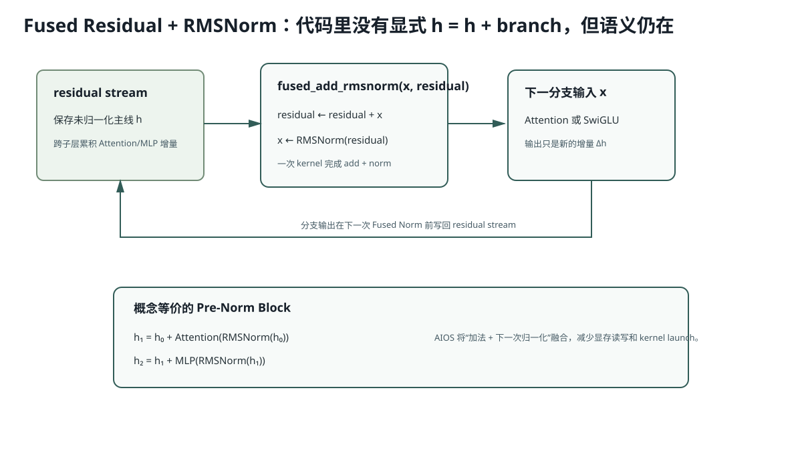

# Lesson 25：Qwen3 / MiniMind Decoder Forward 与 Fused Residual

> 源码基线：`db343cbe07075c619d2519cb499c401f9edf895a`
>
> 目标：沿一层 Decoder 的真实执行顺序读代码，重点看懂 AIOS 为什么没有显式写 `h = h + branch`，却仍实现了 Pre-Norm Residual Block。



## 1. Model Forward 的 Flat Shape

```python
input_ids = ctx.batch.input_ids
hidden_states = embed_tokens(input_ids)
```

若 Prefill Flat Token 总数 8：

```text
input_ids: [8]
hidden:    [8,768]
```

没有显式 Batch/Sequence 维；边界由 Attention Metadata 管理。

## 2. Attention 的真实顺序

```text
hidden [N,768]
→ merged QKV Linear [N,1280]
→ split Q[768], K[256], V[256]
→ reshape Q[N,12,64], K/V[N,4,64]
→ QK RMSNorm
→ RoPE
→ Attention Backend（写 Cache + Kernel）
→ flatten [N,768]
→ o_proj [N,768]
```

Merged QKV 只融合矩阵乘与权重布局，不改变 Q/K/V 数学定义。

## 3. SwiGLU MLP 的真实顺序

`gate_up_proj` 一次输出两份 2048：

```text
[N,768] → [N,4096]
```

拆成 Gate 与 Up 后：

```math
\operatorname{SwiGLU}(x) = \operatorname{SiLU}(xW_g^T) \odot (xW_u^T)
```

再：

```text
[N,2048] → down_proj → [N,768]
```

## 4. 为什么代码没有显式 Residual Add

Decoder Layer：

```python
hidden, residual = input_layernorm.forward(hidden, residual)
hidden = attention.forward(hidden, ...)
hidden, residual = post_attention_layernorm.forward(hidden, residual)
hidden = mlp.forward(hidden)
```

`RMSNormFused.forward(x,residual)` 的概念语义：

当 `residual is None`：

```text
residual = x
x = RMSNorm(x)
```

之后：

```text
residual = residual + x
x = RMSNorm(residual)
```

这里的 `x` 是上一个分支输出增量。

因此概念上仍是：

```math
h_1 = h_0 + \operatorname{Attention}(\operatorname{RMSNorm}(h_0))
```

```math
h_2 = h_1 + \operatorname{MLP}(\operatorname{RMSNorm}(h_1))
```

只不过“Add + 下一次 RMSNorm”融合进一个 Kernel，减少：

- 中间 Tensor 写回显存；
- 再读 Residual；
- 单独 Add Kernel；
- 单独 Norm Kernel Launch。

## 5. 第一层逐值状态

假设 Embedding 结果记为 `e`：

```text
input norm:
residual = e
hidden   = RMSNorm(e)

attention:
hidden   = Δ_attn

post-attention fused norm:
residual = e + Δ_attn
hidden   = RMSNorm(e + Δ_attn)

MLP:
hidden   = Δ_mlp
```

进入下一层 `input_layernorm` 时：

```text
residual = e + Δ_attn + Δ_mlp
hidden   = RMSNorm(residual)
```

最后 Model Final Norm 会把最后一层 MLP 增量写回 Residual 后再归一化。

## 6. 为什么这与训练中的 Pre-Norm 解释一致

AIOS 是 Inference-only，不做 Backward。但模型权重来自按 Pre-Norm Residual 结构训练的模型。融合必须保持前向数值等价，否则权重语义失效。

训练视角的 Jacobian：

```math
\frac{\partial}{\partial h}\left[h + F(N(h))\right]
= I + J_F J_N
```

恒等项解释深层优化；AIOS 的 Fused Kernel 只是改变计算实现，不改变该函数。

## 7. RoPE 与 Position 来源

Model 不自己猜位置：

```python
position_embeddings = rotary_emb.forward(batch.positions)
```

Prefill positions 可是 `[0,1,2,0,1,...]`；Decode 是每请求当前 `cached_len`。RoPE 只作用 Q/K，Attention Backend `pos_encoding_mode="NONE"`，因为位置已经在模型层提前应用。

## 8. 运行实验

```bash
python resources/lesson-25-model-forward/run_lesson25.py
```

实验用纯 Python 数值模拟两层 Fused Residual 状态，验证它与显式 Pre-Norm Add 的结果一致。

## 9. 常见错误解释

### 错误：`residual` 变量只是保存上一个 Layer 输出

不准确。它保存未归一化的长期主线；`hidden_states` 在分支间交替代表归一化输入或分支增量。

### 错误：Fused RMSNorm 改变了模型结构

错。它应保持函数等价，只减少内存往返与 Kernel Launch。

### 错误：Attention Backend 负责 QKV Projection 和 RoPE

当前边界相反：模型层负责 QKV/Norm/RoPE/O-Proj，Backend 负责 Cache 写入、Metadata 和 Attention Kernel。

## 10. 检验问题与参考答案

### 问题 1：为什么 Fused Add+Norm 要原地修改 `x` 与 `residual`？

**参考答案：** 目的不是改变数学公式，而是减少中间 Tensor 的显存读写和额外 Kernel Launch。长期 `residual` 保存未归一化主线，`x` 保存当前分支增量；Fused Kernel 可以在一次读写中完成 `residual += x` 和 `x = RMSNorm(residual)`，避免先写一份 Add 结果再读回来做 Norm。

### 问题 2：如果先 Norm 分支输出再 Add，是否仍等价？

**参考答案：** 不等价。Pre-Norm 的语义是先对主线 `h` 归一化，再让分支计算 `F(N(h))`，最后把分支增量加回未归一化的 `h`。若改成 `h + N(F(...))`，Norm 的位置和输入都变了，模型函数不同，训练好的权重不再对应原结构。

### 问题 3：为什么 Final Norm 还必须把最后 MLP 增量加回 Residual？

**参考答案：** 最后一层 MLP 返回的 `hidden_states` 仍只是 `Δ_mlp`，长期主线还在 `residual`。如果 Final Norm 只归一化 `residual` 而不先加上最后增量，就会漏掉整块最后 MLP 的贡献。Fused Final Norm负责完成最后一次 `residual += hidden_states` 再归一化。

### 问题 4：Merged QKV 权重按哪个维度拼接？

**参考答案：** 独立 `q_proj/k_proj/v_proj` 都对同一个 Hidden 输入做 Linear，区别在输出宽度，因此融合时沿输出维，也就是权重矩阵的第 0 维拼接。MiniMind-IME 中输出宽度是 `768 + 256 + 256 = 1280`，一次 GEMM 后再按这三个区间 split。

### 问题 5：AIOS 无 Backward，为什么仍值得理解 Residual Jacobian？

**参考答案：** 因为推理实现必须保持训练时函数完全等价。理解 Jacobian 能解释为什么模型训练采用 Pre-Norm Residual，也能帮助判断某个“推理融合”到底只是实现优化，还是偷偷改变了模型结构。它还帮助理解为什么不能随意移动 Norm、Add 或 Residual 顺序。

## 11. 一句话复述

AIOS 的 Decoder 以 Flat Token 执行 Merged QKV、QK-Norm、RoPE、Paged Attention 与 SwiGLU；长期 `residual` 保存未归一化主线，Fused Add+RMSNorm 将显式 Pre-Norm Residual 的加法和下一次归一化合成一个 Kernel，语义不变、内存流量更低。
