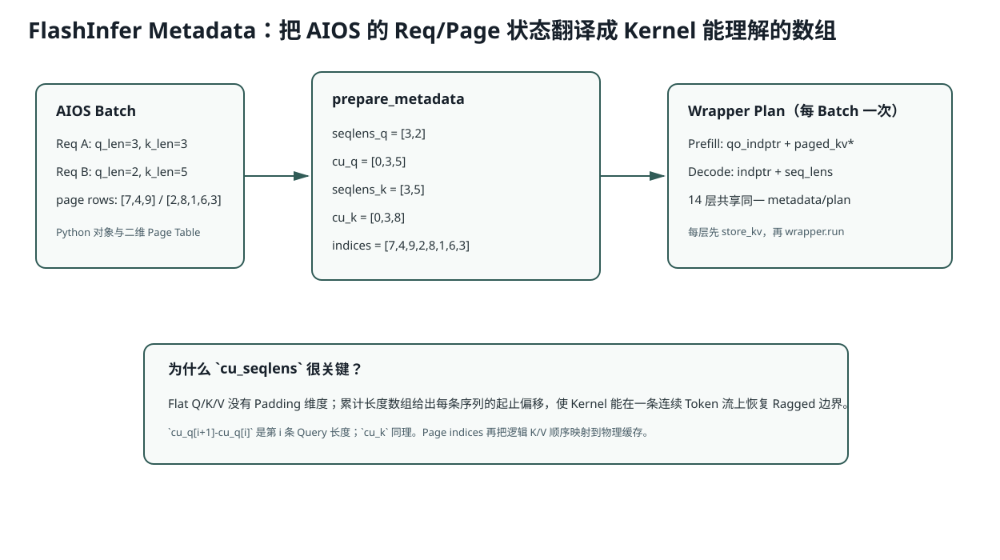

# Lesson 26：FlashInfer Metadata 与 Paged Attention Backend

> 源码基线：`db343cbe07075c619d2519cb499c401f9edf895a`
>
> 目标：理解 Attention Backend 并不是“调用一个快 Kernel”这么简单。它必须把 AIOS 的 Req、Flat QKV 和 Page Table 翻译为 FlashInfer 所需的累计长度、Page 索引和 Wrapper Plan。



## 1. Backend 的职责边界

模型层负责：

```text
QKV Projection
QK-Norm
RoPE
Output Projection
```

Backend 负责：

```text
构造 Batch Metadata
把当前 K/V 写入物理 Cache
选择 Prefill / Decode Wrapper
计划 Kernel
执行 Paged Attention
```

## 2. `seqlens_q` 与 `seqlens_k` 为什么不同

对每个 Req：

```text
q_len = extend_len = 本轮新计算 Token 数
k_len = device_len = 当前完整上下文长度
```

首次 Prefill：`q_len=k_len=prompt_len`。

增量 Prefill：已缓存 3、当前长度 5：

```text
q_len=2
k_len=5
```

Decode：

```text
q_len=1
k_len=完整上下文长度
```

## 3. 累计长度如何恢复 Flat 边界

两个请求：

```text
q lengths = [3,2]
k lengths = [3,5]
```

累计：

```math
\operatorname{cu\_q} = [0,3,5]
```

```math
\operatorname{cu\_k} = [0,3,8]
```

第 `i` 条 Query 在 Flat Tensor 中范围：

```math
[\operatorname{cu\_q}_i,\operatorname{cu\_q}_{i+1})
```

因此 Last Query Index：

```math
\operatorname{last}_i = \operatorname{cu\_q}_{i+1} - 1
```

这也是 Prefill LM Head 取每条 Prompt 最后位置的依据。

## 4. `indices` 怎样连接 Paged KV

```python
indices = cat([
    page_table[req.table_idx, :req.device_len]
    for req in reqs
])
```

例子：

```text
A pages: [7,4,9]
B pages: [2,8,1,6,3]
indices: [7,4,9,2,8,1,6,3]
```

`cu_k=[0,3,8]` 告诉 Kernel：前三个 Page ID 属于 A，后五个属于 B。

## 5. 为什么 Metadata 只 Plan 一次却用于 14 层

`batch.attn_metadata` 对整个 Batch 的序列边界/Page 映射相同；只有每层 K/V Tensor 不同。

`initialized` Guard：

```python
if metadata.initialized:
    return
metadata.initialized = True
wrapper.plan(...)
```

第一层 Plan，后续层直接 `run`。否则 14 层重复规划相同 Batch Layout，会增加固定开销。

## 6. 为什么先 `store_kv` 再运行 Attention

当前 Token 既是 Query，也应作为 Key/Value 参与因果 Attention（可看到自己）。所以：

```text
Q/K/V 已算出
→ K/V 写入 out_loc
→ Paged Attention 读取完整上下文（含当前 Token）
```

Prefill `causal=True` 确保当前位置只看自身及过去。

## 7. Prefill Wrapper 与 Decode Wrapper

### Prefill

```text
Flat Q 有多 Token/Req
causal=True
qo_indptr + paged_kv_indptr
```

### Decode

```text
每 Req 一个 Q Token
读取长 K/V 历史
indptr + seq_lens
```

Decode Wrapper 会在 `Q Heads / KV Heads >= 4` 时启用 Tensor Core 选项。MiniMind：`12/4=3`，因此当前该条件为 false；不能笼统说 Decode 一定走 Tensor Cores。

## 8. Page Layout 转换

AIOS Cache 单层 Shape：

```text
[num_pages, page_size=1, kv_heads, head_dim]
```

Backend View 成 FlashInfer NHD 期望格式。View 不复制数据，只改变解释 Shape；必须保证底层连续布局兼容。

## 9. Workspace 的意义

FlashInfer Wrapper 使用预分配 `uint8` Workspace 存放规划/临时数据。低显存 IME profile 可缩小到 1 MiB，但不是越小越好；不足可能影响支持规模或性能，需要实际测试。

## 10. 运行实验

```bash
python resources/lesson-26-flashinfer-backend/run_lesson26.py
```

实验从两条 Req 生成 `cu_q/cu_k/indices/last_indices`，并验证各区间边界。

## 11. 常见错误解释

### 错误：`cu_seqlens` 是 Padding Mask

不是。它是 Flat Tensor 中每条变长序列的 Prefix Sum 边界。

### 错误：Page Indices 已包含层号

不包含。层号单独传给 `k_cache(layer_id)`；同一 Page ID 在每层对应同逻辑 Token 的 K/V 位置。

### 错误：Backend 负责 RoPE

当前 `pos_encoding_mode="NONE"`，因为 Q/K 已在模型层应用 RoPE。

## 12. 面试追问

1. 增量 Prefill 为什么 `q_len < k_len`？
2. `last_page_len` 当前为什么全是 1？Page Size 改大后怎样？
3. Plan 为什么可以跨层复用，却不能随便跨 Batch 复用？
4. 为什么 Store KV 必须发生在 Attention Run 前？
5. 若 `indices` 顺序与 `cu_k` 不匹配，会出现 Shape Error 还是静默语义错误？

## 13. 一句话复述

FlashInfer Backend 把每请求的 `extend_len/device_len` 转为 Query/Key 累计长度，把 Page Table 行拼成 Paged KV Indices，一次 Plan 后跨层复用布局；每层先把当前 K/V 写入 Page，再按 Prefill 或 Decode Kernel 读取完整因果上下文。
