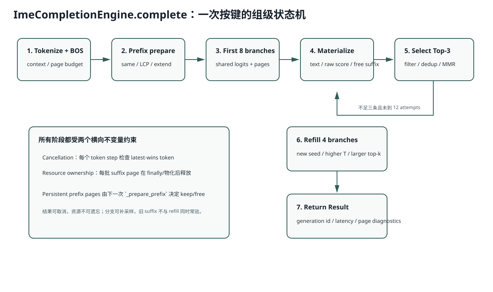

# Lesson 27：`ImeCompletionEngine.complete()` 核心代码带读

> 源码基线：`db343cbe07075c619d2519cb499c401f9edf895a`
>
> 目标：把前面 CandidateGroup、Prefix Reuse、Ragged Decode、Cancellation 和治理重新放回一个真实函数，按执行顺序追踪每个状态和资源所有权。



## 1. 为什么 `complete()` 先取得 `_run_lock`

```python
cancellation = cancellation or new_generation()
with self._run_lock:
    return self._complete_locked(...)
```

当前 Context、Page Table 和 Persistent Prefix Cache 都是单用户可变状态；同一时刻只允许一个组操作。`new_generation()` 可以先在另一把短锁上取消旧组，然后等待旧组安全退出。

## 2. Tokenize 后立刻做两个预算检查

### Context Limit

```math
L_{total} = L_{prefix} + L_{max\_new}
```

必须：

```math
L_{total} \le L_{context}
```

### CandidateGroup Page Budget

首 Token 直接从 Prefix Logits 采样，所以最坏 Suffix Page：

```math
P_{need} = L_{prefix} + A(L_{max\_new}-1)
```

其中 `A=sampling_attempts`。超过 `num_pages` 立即失败，不等运行中途耗尽。

## 3. Page Table 为什么按 `max_attempts` 建

首轮 8 路，但可能补到 12：

```text
page_table.shape = [12, prefix_len + max_new_tokens]
```

Refill 使用 `row_offset=8`，不会覆盖首轮行的逻辑身份。首轮 Suffix Page 已释放，但 Raw Candidate 文本/分数保存在 CPU/Python 对象中。

## 4. `_prepare_prefix` 的三条快慢路径

### 完全相同

```text
Token IDs 完全相同
→ Page 与 prefix_logits 全复用
→ 0 Forward
```

### 有稳定 LCP

```text
保留前 k Page
释放旧尾页
分配新尾页
_extend_prefill(new_ids[k:])
```

### 无法安全复用/严格 Backspace

```text
释放旧尾页或全部页
重新 _prefill
```

返回：

```text
prefix_logits
prefix_pages
reused_prefix_tokens
```

## 5. 首轮与 Refill 共用一个循环

```python
while actual_attempts < max_attempts:
    attempts = 8 if first else min(4, remaining)
    ... generate_branch_batch(...)
    raw_candidates.extend(...)
    free suffix pages
    selected = select_top_candidates(...)
    if cancelled or len(selected) >= 3:
        break
```

注意顺序：

1. 先物化 Candidate；
2. 立即释放该批 Suffix Page；
3. 再决定是否 Refill。

因此峰值显存不是 8+4 路所有 Suffix 的总和。

## 6. `_generate_branch_batch` 的核心状态

GPU Tensor：

```text
output_ids       [attempts,max_new_tokens]
counts           [attempts]
logprob_sums     [attempts]
stop_codes       [attempts]
active_local     当前幸存候选身份
candidate_uniforms [attempts,max_new_tokens]
```

每步：

```text
检查 cancellation
→ 按 active_local 取随机数
→ Sampling（min length 时临时禁止 EOS）
→ 写 output_ids/count/logprob
→ 判 EOS/标点
→ survivors 压缩
→ 只为 survivors Decode 并分配 Page
```

## 7. 为什么 Decode 后立刻把 Page 记录到 `allocated_pages`

`_decode_step` 每个 Survivor 分配一页，并返回 `pages`。调用方负责把它加入本批所有权列表。若中间异常，外层 `finally` 按列表统一释放。

这是显式资源所有权：

```text
allocate 的函数返回 Page
→ 调用者接管生命周期
→ 正常物化后或异常 finally 释放
```

## 8. Raw Candidate 怎样形成

完成后把 GPU `output_ids/counts/logprob_sums` 搬到 CPU：

```text
按 count 截取 Token
→ batch_decode
→ normalize
→ invalid_reasons
→ average = sum_logprob / count
→ base = average - soft_penalty（非法则 -∞）
```

`stop_reason` 只是诊断字段，不直接代表候选合法。

## 9. `stable` 与 `shared_decode` 评分路径

固定候选重排序不需要 Sampling。

### stable

```text
[prefix+c1, prefix+c2, ...]
→ 一次 Varlen Prefill，return_all_logits=True
→ Gather 每个 Candidate Token 的 Raw Logprob
```

### shared_decode

```text
Prefix Prefill 一次
→ Candidate Teacher-forced Decode
```

后者复用更强，但 BF16 近平局可能因 Kernel 数值路径翻转；最终同拼音默认 stable。

## 10. `peak_unique_pages` 是什么，不是什么

它记录本次过程观测到的最大唯一 Page 数，用于诊断 CandidateGroup 预算。它不是 CUDA Peak Memory，也不含模型权重/Workspace/临时 Tensor。

完整显存仍要用 CUDA Memory 统计。

## 11. 运行实验

```bash
python resources/lesson-27-ime-engine-code-reading/run_lesson27.py
```

实验模拟首轮 8 路只有 2 条有效，因此释放首轮 Suffix 后补 4 路，最终选 3 条；同时模拟中途取消。

## 12. 常见错误解释

### 错误：Refill 会保留首轮所有 KV 并继续生成

错。首轮文本/分数物化后 Suffix Page 已释放；Refill 是新分支。

### 错误：`cancelled=True` 就一定没有任何 GPU 工作

错。取消在 Token Step 边界生效，旧组可能已经完成若干步。

### 错误：`unique_kv_pages` 就是峰值显存

错。它只是 Page 数诊断，不包括其他内存。

## 13. 面试追问

1. 为什么 Prefix Page 不是 `allocated_pages` 的一部分？
2. 若 Refill 后仍不足三条，当前返回什么？
3. 为什么 `prefix_logits.expand(attempts,-1)` 安全？后续是否会原地修改？
4. Cancellation 与 `_run_lock` 的组合会造成新请求等待多久？
5. 怎样把单用户 Engine 扩展为多个独立 IME Session？

## 14. 一句话复述

`complete()` 是组级 Saga：先验证 Context/Page 预算并准备持久 Prefix，再分批生成独立候选、逐步压缩 Active Rows、物化后释放 Suffix、治理结果并按需补采样；Cancellation 和 `finally` 横贯所有步骤，确保旧结果失效且资源归还。
