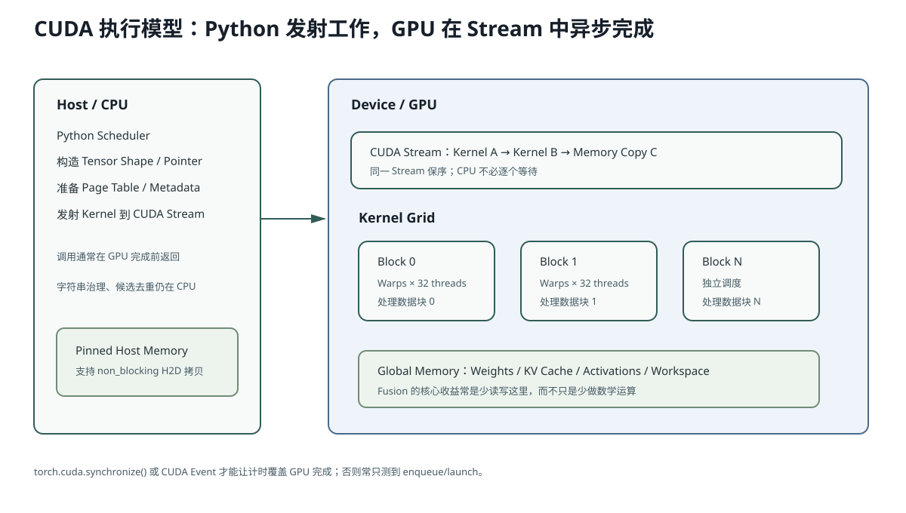

# Lesson 29：CUDA 从零——Host、Device、Kernel、Block、Warp 与显存

> 源码基线：`c335497c6bf67a4dc8cb5ba748ace7b7c1cb77af`
>
> 这一课默认你只会 Python。目标不是先学 CUDA C++ 语法，而是建立一张能读 AIOS 的运行地图：Python 在 CPU 上做什么，Tensor 在 GPU 上放在哪里，Kernel 何时发射，为什么调用返回时 GPU 可能还没算完。



图中要注意：Python/CPU 负责准备参数和发射工作；GPU 把一个 Kernel 的大量数据元素分给 Grid、Block、Warp/Thread 执行；Tensor 数据通常保存在 GPU Global Memory，而不是 Python 对象本身。

## 1. 一行 PyTorch 实际发生了什么

```python
x = torch.randn(1_000_000, device="cuda")
y = x * 2
```

表面只有两行，实际至少包含：

```text
CPU/Python
1. 创建 Tensor 元数据：shape、dtype、device、data pointer
2. 请求 CUDA allocator 提供显存
3. 向 CUDA Stream 排队 random kernel
4. 向同一 Stream 排队 multiply kernel
5. Python 很快拿到 y 这个“未来结果”的 Tensor 句柄

GPU
1. 按 Stream 顺序执行 random kernel
2. 执行 multiply kernel
3. 把结果写入 y 对应的 global memory
```

关键点：

> `y = x * 2` 通常是**异步发射**。Python 得到 `y` 对象时，GPU 可能仍在计算。

只有当 CPU 必须看到 GPU 结果，例如：

```python
print(y[0].item())
torch.cuda.synchronize()
```

CPU 才需要等待。

## 2. Host 与 Device

| 名称 | 在哪里 | AIOS 中做什么 |
|---|---|---|
| Host | CPU + 普通内存 | Python、Scheduler、Page 分配、构造 Metadata、发射 Kernel |
| Device | NVIDIA GPU + 显存 | Linear、Norm、Attention、KV 写入、Sampling Tensor 运算 |

Tensor 的 Python 对象仍在 Host，但：

```python
x.device == torch.device("cuda:0")
```

表示其数据指针指向 Device Memory。

## 3. Kernel 是什么

Kernel 可以理解为：

> 一段被 GPU 上大量并行执行单元同时运行的函数。

例如向量乘法：

```text
输入 1,000,000 个元素
→ 每个 GPU Thread 处理一个或多个元素
→ 所有 Thread 运行同一段乘 2 的代码
```

AIOS 中的 Kernel 来源：

```text
F.linear                 → cuBLAS GEMM kernels
flashinfer.rmsnorm       → FlashInfer normalization kernel
flashinfer.silu_and_mul  → FlashInfer fused activation kernel
FlashInfer attention     → optimized paged-attention kernels
_store_cache_kernel      → AIOS 自己写的 Triton kernel
```

因此“Python 没有 `.cu` 文件”不代表没有 CUDA Kernel；大量 Kernel 来自依赖库。

## 4. Grid、Block、Thread 与 Warp

CUDA 的层级：

```text
一次 Kernel Launch
└─ Grid
   ├─ Block 0
   │  ├─ Thread 0
   │  ├─ Thread 1
   │  └─ ...
   ├─ Block 1
   └─ ...
```

硬件执行时，Thread 通常按 32 个组成 Warp：

```math
\text{warps per block}
=
\left\lceil \frac{\text{threads per block}}{32} \right\rceil
```

Warp 中 32 个 Thread 执行同一条指令。若一半走 `if`，另一半走 `else`，GPU 往往需要分两条路径执行，这叫 Warp Divergence。

### AIOS Triton 的对应关系

Triton 不直接让你写 `threadIdx.x`。它使用更高层的 Program：

```python
token_idx = tl.program_id(axis=0)
offsets = tl.arange(0, block_size)
```

可先这样理解：

```text
一个 Triton Program
≈ 一个处理数据块的 CUDA Thread Block/程序实例

offsets
≈ 该 Program 内并行处理的一组元素 lane
```

这不是硬件一一对应承诺，但足够用于读 `store_cache`。

## 5. GPU 内存层级

| 内存 | 范围 | 特点 |
|---|---|---|
| Register | 每个 Thread/Warp 执行上下文 | 最快，容量小；过多会降低 Occupancy |
| Shared Memory | 一个 Block 内共享 | 片上、低延迟，需显式协作/同步 |
| L1/L2 Cache | 硬件缓存 | 减少 Global Memory 重复访问 |
| Global Memory | 整张 GPU 可访问 | 容量最大，但延迟高；AIOS 权重/KV/Tensor 主要在这里 |
| Host Pinned Memory | CPU 内存但页锁定 | 便于异步 H2D/D2H 拷贝 |

AIOS 性能优化中，很多操作不是减少数学乘法，而是减少：

```text
Global Memory 读取
Global Memory 写回
CPU→GPU Kernel Launch
临时 Tensor 分配
```

## 6. 为什么小模型更容易被 Launch Overhead 限制

假设一个 Kernel 真正 GPU 计算只需 5 微秒，但 CPU/Driver 发射和参数准备需 8 微秒：

```math
T_{total}=T_{launch}+T_{gpu}=8+5=13\ \mu s
```

即使把 GPU 计算加速 2 倍：

```math
8+2.5=10.5\ \mu s
```

总延迟只提升：

```math
\frac{13}{10.5}\approx1.24\times
```

这就是为什么 0.1B、短 Prefix、Decode batch 小时，Fusion 和 CUDA Graph 很重要；GPU 算得不多，CPU Launch 占比反而大。

## 7. CUDA Stream 是什么

Stream 是 GPU 工作队列。同一 Stream 内按顺序执行：

```text
Kernel A
→ Kernel B
→ Memory Copy C
```

不同 Stream 可以在依赖允许时重叠，但不能假设一定并行。

PyTorch 默认把普通 CUDA 操作排入当前 Stream。AIOS 大部分路径使用默认/当前 Stream，没有自己构造复杂多 Stream Pipeline。

## 8. 为什么 Benchmark 必须同步

错误计时：

```python
start = time.perf_counter()
y = x * 2                 # 只是排队
elapsed = time.perf_counter() - start
```

这个值可能主要是 CPU 发射时间。

正确的简单墙钟：

```python
torch.cuda.synchronize()
start = time.perf_counter()
y = x * 2
torch.cuda.synchronize()
elapsed = time.perf_counter() - start
```

或者使用 CUDA Event，让时间在 GPU 时间线上记录。

## 9. README 内置代码：观察异步行为

```python
import time
import torch

if not torch.cuda.is_available():
    raise SystemExit("需要 CUDA GPU")

x = torch.randn(16_000_000, device="cuda")

# 预热，避免第一次 JIT/allocator 初始化污染。
for _ in range(10):
    y = x * 2

torch.cuda.synchronize()
start = time.perf_counter()
y = x * 2
cpu_enqueue_ms = (time.perf_counter() - start) * 1000

torch.cuda.synchronize()
full_ms = (time.perf_counter() - start) * 1000

print("仅发射返回:", cpu_enqueue_ms, "ms")
print("等待 GPU 完成:", full_ms, "ms")
```

逐段解释：

1. `x` 数据在 GPU Global Memory；
2. `y = x * 2` 发射 Elementwise Kernel；
3. 第一个时间只测 Python 返回；
4. `synchronize()` 等待当前设备之前工作完成；
5. 第二个时间才覆盖实际 GPU 完成。

## 10. AIOS 当前 CUDA 边界

当前 `MHAKVCache` 直接断言：

```python
assert device.type == "cuda", "AIOS only supports CUDA execution"
```

原因不是所有控制面都必须在 GPU，而是当前 Attention Backend 和 KV Pool 是按 FlashInfer CUDA 路径设计的。

当前没有：

- CPU Attention Fallback；
- ROCm Backend；
- 手写 CUDA C++ Extension；
- CUDA Graph Capture；
- 多 GPU Tensor Parallel。

## 11. 常见错误理解

### 错误：GPU 有很多核心，所以每行 Python 都自动并行

只有落到 GPU Kernel 的 Tensor 运算并行。Python 循环、字符串处理、候选规则通常仍在 CPU。

### 错误：Kernel 返回就代表 GPU 已经计算完成

通常只是加入 Stream。CPU 读取结果或显式同步时才等待。

### 错误：显存只放模型权重

还包括 KV Cache、Workspace、临时激活、Logits、Page Table 和 allocator reserved memory。

## 12. 运行实验

```bash
python resources/lesson-29-cuda-foundations/run_lesson29.py
```

没有 GPU 时脚本打印执行模型模拟；有 GPU 时额外比较 enqueue 与 synchronize 后的耗时。

## 13. 检验问题与参考答案

### 问题 1：为什么 `time.perf_counter()` 包住一条 CUDA 操作可能测得过小？

**参考答案：** CUDA 操作通常异步加入 Stream，Python 在 Kernel 完成前就返回。若计时结束前没有 CUDA Event 或 `torch.cuda.synchronize()`，测到的主要是 CPU 端参数准备和 Kernel 发射时间，而不是 GPU 完成墙钟。

### 问题 2：Warp Divergence 为什么可能降低效率？

**参考答案：** 一个 Warp 的 32 个 Thread 按 SIMT 执行共同指令。若同一 Warp 中不同 Thread 走不同分支，硬件需要分别执行各分支并屏蔽不参与的 lane，因此有效并行度降低。不同 Warp 走不同路径通常不会产生同样的 Warp 内串行化。

### 问题 3：AIOS 没有 `.cu` 文件，为什么仍是 CUDA 推理引擎？

**参考答案：** `F.linear`、FlashInfer 和 Triton 最终都会编译或调用 CUDA Kernel。AIOS 的 Python 负责图和元数据，底层 GPU 实现由 cuBLAS、FlashInfer 与 Triton 生成的 PTX/CUDA Kernel 承担。

### 问题 4：为什么 0.1B 短 Decode 更可能受 Launch Overhead 影响？

**参考答案：** 每个 Kernel 的矩阵规模较小，GPU 计算时间缩短，但每次 Python/C++/Driver 发射的固定成本不会同比下降。于是总延迟中 CPU Launch 和元数据准备占比上升，Fusion、Graph Replay 等减少发射次数的技术更有价值。

## 14. 一句话复述

AIOS 的 Python 控制面在 Host 上构造 Batch 和 Metadata，再异步把 PyTorch、FlashInfer、Triton Kernel 排入 CUDA Stream；GPU 以 Grid/Block/Warp 并行执行并访问多级内存。理解异步、Launch Overhead 和 Global Memory 流量，是读后续所有优化的基础。

## 15. 一手参考

- NVIDIA CUDA Programming Guide：Thread Hierarchy、Warp、Memory Hierarchy。
- PyTorch CUDA Semantics：Streams、Synchronization、CUDA Graphs。
- Triton 官方 Vector Addition Tutorial：Program Grid、Mask、异步 Kernel Launch。

## 16. 再做一个线程映射手算

假设要处理 1,000 个元素，每个 CUDA Block 设 256 Threads：

```math
\text{num blocks}
=
\left\lceil \frac{1000}{256}\right\rceil
=4
```

理论全局 Thread ID：

```math
\text{global id}
=
\text{blockIdx.x}\times\text{blockDim.x}+\text{threadIdx.x}
```

四个 Block 会覆盖 1,024 个 Thread ID，其中最后 24 个越界，因此 Kernel 需要：

```cpp
if (global_id < 1000) {
    output[global_id] = input[global_id] * 2;
}
```

Triton 的对应写法是：

```python
pid = tl.program_id(0)
offsets = pid * BLOCK_SIZE + tl.arange(0, BLOCK_SIZE)
mask = offsets < n_elements
x = tl.load(x_ptr + offsets, mask=mask)
tl.store(out_ptr + offsets, x * 2, mask=mask)
```

这也是 Lesson 30 `mask` 的来源：并行 Block 通常按规则 Shape 启动，尾部用 Mask 防越界。

## 17. 什么叫合并显存访问（Coalescing）

一个 Warp 的相邻 Thread 若访问相邻地址：

```text
thread 0 → address 0
thread 1 → address 1
...
thread 31 → address 31
```

硬件可以把它们合并为较少的内存事务。

若访问：

```text
thread 0 → address 0
thread 1 → address 1000
thread 2 → address 7
...
```

通常需要更多事务，带宽利用率下降。

`store_cache` 的巧妙处是：

```text
不同 Program 的目标 Page 可以散乱
但一个 Program 内 offsets 始终连续
```

所以行级 Scatter 与行内 Coalescing 可以同时存在。
