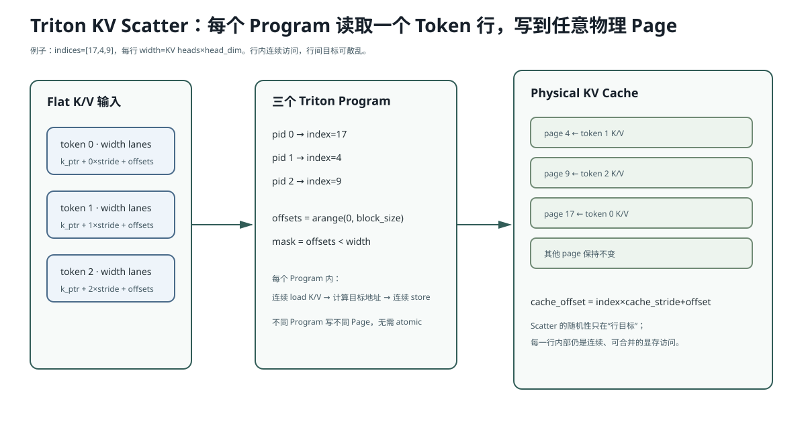

# Lesson 30：逐行读懂 Triton `store_cache`——把 Flat K/V Scatter 到物理 Page

> 源码基线：`c335497c6bf67a4dc8cb5ba748ace7b7c1cb77af`
>
> 这是当前 AIOS 唯一直接写在仓库里的自定义 GPU Kernel。README 会把完整 Kernel 放进来逐行解释，你不需要另外打开 `python/aios/kernel/store.py`。



## 1. 它到底解决什么问题

Model Forward 产生 Flat Batch 的 K/V：

```text
k.shape = [N, num_kv_heads, head_dim]
v.shape = [N, num_kv_heads, head_dim]
```

但 Paged KV Cache 的物理位置不一定连续：

```text
第 0 个新 token → Page 17
第 1 个新 token → Page 4
第 2 个新 token → Page 91
```

因此要执行 Scatter：

```text
k[0] → k_cache[17]
k[1] → k_cache[4]
k[2] → k_cache[91]
```

普通 Python 循环会每个 Token 发一次操作，极慢。Triton Kernel 用 `N` 个 Program 并行完成。

## 2. 完整代码：Kernel 与 Python Wrapper

```python
@triton.jit
def _store_cache_kernel(
    k_cache_ptr,
    v_cache_ptr,
    indices_ptr,
    k_ptr,
    v_ptr,
    k_token_stride,
    v_token_stride,
    cache_token_stride,
    width: tl.constexpr,
    block_size: tl.constexpr,
):
    token_idx = tl.program_id(axis=0)
    offsets = tl.arange(0, block_size)
    index = tl.load(indices_ptr + token_idx).to(tl.int64)
    mask = offsets < width
    k_values = tl.load(
        k_ptr + token_idx * k_token_stride + offsets,
        mask=mask,
    )
    v_values = tl.load(
        v_ptr + token_idx * v_token_stride + offsets,
        mask=mask,
    )
    cache_offsets = index * cache_token_stride + offsets
    tl.store(k_cache_ptr + cache_offsets, k_values, mask=mask)
    tl.store(v_cache_ptr + cache_offsets, v_values, mask=mask)
```

Python Wrapper：

```python
def store_cache(k_cache, v_cache, indices, k, v):
    width = k_cache.shape[1] * k_cache.shape[2]
    block_size = triton.next_power_of_2(width)
    _store_cache_kernel[(k.shape[0],)](
        k_cache,
        v_cache,
        indices.contiguous(),
        k,
        v,
        k.stride(0),
        v.stride(0),
        k_cache.stride(0),
        width=width,
        block_size=block_size,
    )
```

## 3. 先把三维 Tensor 展平成一行

真实 MiniMind-IME：

```text
num_kv_heads = 4
head_dim = 64
```

所以每个 Token 的 K 向量总宽度：

```math
W = 4\times64 = 256
```

虽然逻辑 Shape 是：

```text
[4,64]
```

Kernel 把它视为一段连续的 256 元素：

```text
head 0: offsets 0..63
head 1: offsets 64..127
head 2: offsets 128..191
head 3: offsets 192..255
```

这成立的前提是最后两个维度连续；Wrapper 已验证输入 Shape，`MHAKVCache` 又把每层缓存 view 成：

```text
[num_slots, num_kv_heads, head_dim]
```

## 4. 逐行解释 Kernel

### `@triton.jit`

```python
@triton.jit
```

表示这不是普通 Python 函数。第一次遇到某组 Meta Parameter/Shape 时，Triton 编译为 GPU Kernel；后续相同 specialization 可复用编译结果。

### `width: tl.constexpr`

```python
width: tl.constexpr
block_size: tl.constexpr
```

这两个值编译时已知，可以用于创建固定大小向量和优化分支。

### 一个 Program 对应一个 Token

```python
token_idx = tl.program_id(axis=0)
```

Launch Grid 是：

```python
_store_cache_kernel[(k.shape[0],)](...)
```

若 `N=3`，启动三个 Program：

```text
Program 0 处理 k[0]/v[0]
Program 1 处理 k[1]/v[1]
Program 2 处理 k[2]/v[2]
```

### 创建并行 Offset Lane

```python
offsets = tl.arange(0, block_size)
```

`block_size` 取大于等于 `width` 的最小 2 的幂。

当前 width=256：

```text
block_size = 256
```

若 width=192：

```text
block_size = 256
offsets = [0..255]
mask 只有 [0..191] 为 True
```

Triton 对很多 Block 操作要求 2 的幂大小；Mask 保护多出来的 lane。

### 读取目标物理 Page

```python
index = tl.load(indices_ptr + token_idx).to(tl.int64)
```

例如：

```text
indices = [17,4,91]
```

Program 1 读取 `index=4`。

这里用 `int64` 做地址乘法，避免大地址计算时整数范围问题。

### 计算输入地址

```python
k_ptr + token_idx * k_token_stride + offsets
```

地址拆开：

```text
k_ptr                        Tensor 首地址
token_idx * k_token_stride   跳到第 token_idx 行
offsets                      这一行内第几个元素
```

若连续 Tensor：

```text
k_token_stride = 256
Program 2 的起点 = k_ptr + 2×256
```

### Masked Load

```python
k_values = tl.load(..., mask=mask)
```

只让 `offset < width` 的 lane 访问内存，避免越界。

### 计算 Cache 地址

```python
cache_offsets = index * cache_token_stride + offsets
```

若 `index=4`、`cache_token_stride=256`：

```text
目标起点 = 4×256 = 1024
```

于是把 Program 1 的 K/V 写入第 4 个物理 Slot。

### Masked Store

```python
tl.store(k_cache_ptr + cache_offsets, k_values, mask=mask)
```

一个 Program 内连续 offsets 写连续地址，利于合并显存访问；不同 Program 的目标 Page 可以散乱，这就是 Scatter。

## 5. 为什么不需要 Atomic

如果两个 Token 同时写同一个 `index`，它们会产生 Data Race。

当前 Scheduler/Page Allocator 的不变量是：

```text
同一个 Batch 中，每个新 Token 的 out_loc 唯一
```

所以不同 Program 不会写同一物理 Page，无需 Atomic。

若这个不变量被破坏，Kernel Shape 仍合法，却会静默覆盖。正确性依赖控制面保证地址唯一。

## 6. Wrapper 为什么做 Shape 检查

```python
if k_cache.ndim != 3:
    raise ValueError(...)
if k.shape[1:] != k_cache.shape[1:]:
    raise ValueError(...)
if indices.numel() != k.shape[0]:
    raise ValueError(...)
```

这些检查在发射前把错误变成清晰 Python 异常。GPU Kernel 内部通常不会自动给出“Head 数错了”这种高层错误。

## 7. `indices.contiguous()` 为什么存在

Kernel 按：

```python
indices_ptr + token_idx
```

假设每个 index 紧邻存储。

若 `indices` 是步长不为 1 的 View，直接传指针会读错；`contiguous()` 物化为连续数组，满足 Kernel 地址模型。

## 8. `stride(0)` 为什么比写死 width 更稳

对于普通连续输入：

```text
k.stride(0) = width
```

但若 Tensor 行之间有额外 Padding，Stride 可能更大。传入真实 Stride 能正确跳到下一行。

当前 Cache View 连续，所以：

```text
cache_token_stride = num_kv_heads × head_dim
```

## 9. CPU 参考实现

```python
def store_cache_reference(k_cache, v_cache, indices, k, v):
    for token_idx, physical_index in enumerate(indices):
        k_cache[physical_index] = k[token_idx]
        v_cache[physical_index] = v[token_idx]
```

Triton Kernel 数学上就做这件事；优化是把循环放到 GPU 并让每行内部并行读写。

## 10. 为什么这是 Memory-bound Kernel

每个元素做的数学很少：

```text
load K
load V
store K
store V
```

几乎没有乘加。因此性能主要受：

- Global Memory 带宽；
- 地址是否连续/coalesced；
- Kernel Launch；
- Program 数量；

影响，而不是 Tensor Core 算力。

## 11. 常见错误理解

### 错误：`block_size=256` 表示启动 256 个 Python 循环

错。它是一个 Triton Program 内的向量化 Block 宽度，由编译器映射到 GPU lane/warp 执行。

### 错误：`indices` 是 Token ID

错。它是 KV Cache 的物理写入位置/Page ID，不是词表 Token ID。

### 错误：Triton 自动保证不同 Program 不冲突

错。目标地址唯一性由调用者保证；Triton 只按给定指针执行写入。

## 12. 运行实验

```bash
python resources/lesson-30-triton-kv-store/run_lesson30.py
```

CPU 实验会构造 `[17,4,9]` 的乱序 Scatter，并逐元素验证。若安装 Triton 且有 CUDA，可再运行仓库真实 Kernel 对照。

## 13. 检验问题与参考答案

### 问题 1：为什么 Launch Grid 是 `(N,)`，不是 `(N,width)`？

**参考答案：** 每个 Triton Program 负责一个 Token 行，Program 内通过 `tl.arange(0, block_size)` 同时处理该行的 `width` 个元素。若 Grid 再展开 width，会改变地址划分并需要每个 Program/Thread 只处理单元素，增加调度粒度和索引开销。

### 问题 2：为什么 `block_size` 要向上取 2 的幂并配 Mask？

**参考答案：** Triton 的向量 Block 和许多编译优化偏好/要求静态 2 的幂 Shape。向上取整可生成规则 Block，Mask 则确保超过真实 width 的 lane 不读写越界地址。

### 问题 3：为什么 Kernel 不需要 `tl.atomic_xchg`？

**参考答案：** Scheduler 为本 Batch 每个新 Token 分配唯一 `out_loc`，不同 Program 写不同 Cache 行，因此不存在多个 Writer。若地址可能重复，就必须改变上游不变量或引入 Atomic/冲突策略。

### 问题 4：这个 Kernel 为什么更应关注 GB/s 而不是 FLOPS？

**参考答案：** 它几乎只搬运数据，没有大量浮点运算。瓶颈是 K/V 从 Global Memory 读出并写入 Cache 的字节吞吐与访问合并程度，因此带宽利用率比计算吞吐更有解释力。

## 14. 一句话复述

`store_cache` 为 Flat Batch 的每个 Token 启动一个 Triton Program，用连续 offsets 读出整行 K/V，再根据 `indices[token_idx]` Scatter 到唯一物理 Cache 行。它的核心是地址、Stride、Mask 和显存带宽，而不是复杂数学。

## 15. 一手参考

- Triton `program_id`、`arange`、`load`、`store` 官方 API。
- Triton Vector Addition Tutorial：Grid、Block、Mask 与异步发射。

## 16. 用真实 Cache Shape 再走一遍地址

`MHAKVCache` 物理 Buffer：

```text
[2, num_layers, num_pages, page_size, num_kv_heads, head_dim]
```

当前：

```text
[2,14,256,1,4,64]
```

取第 3 层 K Cache：

```python
self._k_buffer[3]
# [256,1,4,64]
```

再 View：

```python
.view(num_pages * page_size, num_kv_heads, head_dim)
# [256,4,64]
```

因此：

```text
cache_token_stride = 4×64 = 256 elements
```

若 `index=17`，BF16 每元素 2 字节，则该 Token 行相对层 Cache 首地址的字节偏移：

```math
17\times256\times2
=8704\ \text{bytes}
```

K 与 V 是两个独立 Buffer View，Kernel 对两者使用同一个逻辑 index。

## 17. 正确性测试应该测什么

仅测 Shape 不够。至少要覆盖：

```text
1. 连续 indices：[0,1,2]
2. 乱序 indices：[17,4,9]
3. 不同 N
4. width 非 2 的幂，验证 Mask
5. 非连续 indices 输入，wrapper contiguous 后正确
6. 与 torch.index_copy_ / CPU reference 数值一致
7. 重复 index 被上游拒绝或明确测试其未定义行为
8. 多 layer 写入互不污染
```

性能测试则需报告：

```math
\text{effective bandwidth}
=
\frac{\text{K read}+\text{V read}+\text{K write}+\text{V write}}
{\text{elapsed time}}
```

不能用 FLOPS 评价这个纯搬运 Kernel。
