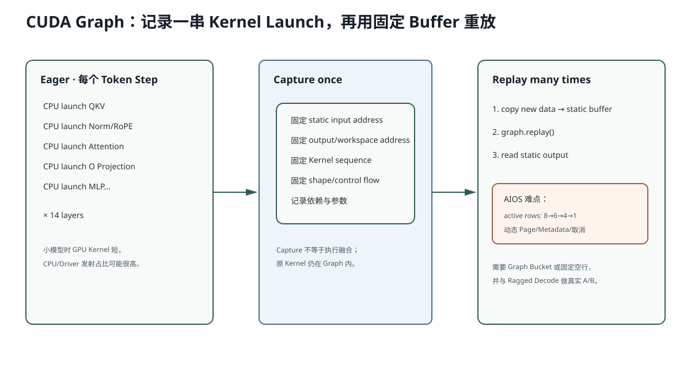

# Lesson 34：CUDA Graph——为什么它适合小模型，又为什么 AIOS 还没接

> 源码基线：`c335497c6bf67a4dc8cb5ba748ace7b7c1cb77af`
>
> 当前 AIOS **没有实现 CUDA Graph**。这一课不会把设计方案写成现成功能，而是从 Eager Launch 的真实成本开始，给出可运行 PyTorch 示例和接入 AIOS 的具体边界。



## 1. Eager 模式的问题

一个 Decoder Layer 可能发射：

```text
QKV GEMM
Q/K RMSNorm
RoPE
KV Scatter
Attention
O Projection
Fused Add+RMSNorm
Gate-Up GEMM
SwiGLU
Down Projection
```

14 层就是大量 Kernel Launch。对于 0.1B、Decode Batch 小的场景，每个 Kernel 很短，CPU/Driver 每次准备参数的固定成本可能占很大比例。

Eager：

```text
每个 Token Step
→ Python/C++ 按顺序重新发射几十/上百个 Kernel
```

CUDA Graph：

```text
先 Capture 一次完整 Kernel 序列
→ 后续一个 cudaGraphLaunch Replay
```

主要收益是减少 CPU Launch/框架开销，不是改变模型数学。

## 2. PyTorch 最小例子

```python
import torch

model = torch.nn.Sequential(
    torch.nn.Linear(768, 2048, bias=False),
    torch.nn.SiLU(),
    torch.nn.Linear(2048, 768, bias=False),
).cuda().half().eval()

static_x = torch.empty(8, 768, device="cuda", dtype=torch.float16)
static_y = None

graph = torch.cuda.CUDAGraph()
stream = torch.cuda.Stream()

# 先在 side stream warmup，初始化 cuBLAS/allocator。
with torch.cuda.stream(stream):
    for _ in range(3):
        static_y = model(static_x)
stream.synchronize()

with torch.cuda.graph(graph):
    static_y = model(static_x)

new_x = torch.randn_like(static_x)
static_x.copy_(new_x)
graph.replay()
result = static_y.clone()
```

关键：Replay 时 Kernel 参数指针必须仍指向 Capture 时的 `static_x/static_y` 地址。新数据不是换 Tensor 对象，而是复制进固定 Buffer。

## 3. Graph 的硬约束

通常需要：

- Kernel 序列相同；
- Shape 相同；
- 控制流相同；
- 内存地址稳定；
- Capture 内不能发生不安全 CPU 同步；
- 动态分配需通过 Graph Memory Pool 管理；
- Host 读取 `.item()` 等同步操作不能放在 Capture 路径。

这就是“牺牲动态灵活性换 Launch 低开销”。

## 4. 为什么 AIOS Decode 很有吸引力

普通通用 Decode Batch：

```text
每请求 1 token
模型 Shape 主要由 batch size 决定
```

可为常见 Batch Size 捕获：

```text
Graph batch=1
Graph batch=2
Graph batch=4
Graph batch=8
```

运行时把请求 Pad/映射到最近 Graph Bucket，再 Replay。

对 AIOS-IME 首轮 8 路 CandidateGroup：

```text
batch=8
每步 1 token/row
模型结构固定
```

看起来非常适合 Graph。

## 5. 为什么 Ragged Active Rows 产生冲突

当前候选：

```text
step 0: batch=8
step 1: batch=6
step 2: batch=4
step 3: batch=1
```

每步 Shape 变化。单一 Graph 无法直接 Replay 不同 Batch Shape。

三种方案：

### 方案 A：保持固定 8 行

完成行继续以 Dummy Token 参与：

```text
Graph 最简单
但浪费已结束分支计算/KV 逻辑
```

可能把 Ragged Decode 已获得的收益抵消。

### 方案 B：Graph Bucket

捕获：

```text
1、2、4、8 行
```

当前 6 行放入 8 行 Graph，2 行 Mask；4 行切换到 4 行 Graph。

平衡 Launch 与空行浪费，但需要静态 Buffer/Page Table/Metadata Bucket 管理。

### 方案 C：只 Capture Model Core

把候选治理、Active-row 选择留在 Eager CPU；每步将固定 Bucket Tensor 填好后 Replay Model Forward。

这是更现实的 AIOS 接入边界。

## 6. FlashInfer `plan()` 能否在 Graph 内

`plan()` 读取动态 CPU Metadata并可能做准备工作，不适合每次放进 Capture Graph。

可能结构：

```text
CPU：构造/更新 Page Table 与 Metadata
→ Graph-safe static GPU buffers copy/update
→ Replay Model Kernels / Attention run
```

但 FlashInfer Wrapper/版本是否 Graph-safe 必须以实际版本测试，不应仅凭理论保证。

## 7. README 内置代码：AIOS 接入骨架

```python
class DecodeGraphRunner:
    def __init__(self, engine, batch_size):
        self.batch_size = batch_size
        self.static_input_ids = torch.empty(
            batch_size,
            dtype=torch.long,
            device="cuda",
        )
        self.static_positions = torch.empty_like(self.static_input_ids)
        self.static_out_loc = torch.empty_like(self.static_input_ids)
        self.graph = torch.cuda.CUDAGraph()
        self.static_output = None

    def capture(self, static_batch):
        # 需要先 Warmup、固定 Context/Metadata Buffer/地址。
        with torch.cuda.graph(self.graph):
            self.static_output = self.engine.run_batch(static_batch)

    def replay(self, input_ids, positions, out_loc):
        self.static_input_ids.copy_(input_ids)
        self.static_positions.copy_(positions)
        self.static_out_loc.copy_(out_loc)
        self.graph.replay()
        return self.static_output
```

这只是架构草图，当前不能直接复制进项目：

- `Batch` 对象如何引用 static Tensor；
- Attention Metadata 地址是否稳定；
- Sampler 是否捕获；
- Page Table `indices` 是否固定容量；
- Cancellation 如何在 Graph Step 间检查；
- 不同 Batch Bucket 如何路由；

都需要设计与测试。

## 8. Graph Capture 的验证顺序

1. 用固定 Batch/固定长度跑 Eager Reference；
2. Capture 同一数学路径；
3. 多组输入 Copy 到 Static Buffer；
4. 比较 Logits/Token 与 Eager；
5. 测 p50/p95，不只微 Kernel；
6. 测 Active-row Bucket 分布；
7. 验证 Cancellation 仍在 Step 边界生效；
8. 验证 Page 无泄漏；
9. 验证 BF16 近平局排序无新增翻转。

## 9. 什么时候不值得做

- Profile 显示一个大 Attention/GEMM 已占绝大多数；
- Batch/Shape 高度动态，Graph Bucket 命中低；
- CPU 候选治理才是瓶颈；
- 首 Token Prefill 比 Decode 更重要且长度变化极大；
- 维护复杂度超过实际毫秒收益。

当前报告明确没有实现/宣称 CUDA Graph；这是一项需要 Profile 证明的后续优化。

## 10. 常见错误理解

### 错误：CUDA Graph 会把多个 Kernel 融成一个 Kernel

错。Graph 仍包含原来的多个 Kernel，只是把整组发射记录并通过一次 Replay 提交，减少 CPU Launch 开销。Kernel Fusion 是另一种优化。

### 错误：Capture 后可以传任意新 Tensor

通常地址需稳定。新数据要 Copy 到 Capture 时使用的 Static Buffer，或使用符合 Graph API 约束的内存管理。

### 错误：Graph 一定适合所有 Batch

动态 Shape/控制流会导致需要多个 Graph Bucket 或回退 Eager；Bucket 太多会增加内存和维护成本。

## 11. 运行实验

```bash
python resources/lesson-34-cuda-graphs/run_lesson34.py
```

无 GPU 时脚本模拟 Eager Launch 与 Graph Replay；有 CUDA 时运行一个固定 Shape PyTorch CUDAGraph correctness demo。

## 12. 检验问题与参考答案

### 问题 1：CUDA Graph 与 Operator Fusion 的区别是什么？

**参考答案：** Fusion 把多个操作编进更少 Kernel，减少中间显存流量和 Launch 数；CUDA Graph 不改 Kernel 内容，而是记录一串 Kernel/依赖并一次 Replay，主要减少 CPU/Driver 发射开销。二者可以叠加。

### 问题 2：为什么 Active-row Compaction 让 Graph 接入变难？

**参考答案：** Compaction 让每个 Token Step 的 Batch Shape 和 Page/Metadata 数量变化，而 Graph Replay 通常要求固定 Kernel 参数、Shape 和地址。需要固定空行、Graph Bucket 或只捕获固定 Model Core。

### 问题 3：为什么不能把 Python 候选过滤放进 CUDA Graph？

**参考答案：** Python 字符串解码、集合去重和动态控制流不是 CUDA Kernel，且依赖 GPU 结果回到 Host。Graph 适合捕获 Device 工作；治理应留在 Graph 外的 Step 边界。

### 问题 4：什么 Profile 证据最支持优先做 CUDA Graph？

**参考答案：** Nsight Systems 显示大量短 Kernel、CPU Launch 间隙明显、GPU 空闲等待 Host、常见 Shape 可归入少量 Bucket，并且端到端 Decode 占主要尾延迟。

## 13. 一句话复述

CUDA Graph 通过 Capture 固定 Kernel 序列和内存地址，再以一次 Replay 降低每 Token Step 的 CPU Launch 开销；AIOS-IME 的小模型固定 8 路很有潜力，但 Ragged Active Rows、动态 Page Metadata 和 Cancellation 要求 Graph Bucket/静态 Buffer 设计，当前尚未实现。

## 14. 一手参考

- PyTorch CUDA Semantics：CUDA Graphs 的 Capture/Replay、固定地址与 Graph-safety。
- NVIDIA CUDA Programming Guide：CUDA Graph API。

## 15. Static Buffer 为什么必须复用而不能重新赋值

Capture 时 Kernel 参数保存了 `static_x` 的 Device Pointer。下面写法错误：

```python
static_x = new_x
# Python 名字换了，但 Graph 仍引用旧地址

graph.replay()
```

正确：

```python
static_x.copy_(new_x)
graph.replay()
```

`copy_` 把新值写入旧地址，Graph 中的 Pointer 保持有效。

同理，AIOS 若捕获：

```text
input_ids buffer
positions buffer
out_loc buffer
page indices buffer
```

运行时必须把新 Batch 写入这些固定容量 Buffer，不能每步创建全新 Tensor 并期待 Graph 自动跟随。

## 16. Graph Bucket 的内存代价

若捕获 Batch 1/2/4/8，每个 Graph 可能拥有独立 Static Input/Output 和 Graph Memory Pool。Graph 数量越多：

```text
Shape 浪费下降
但 Capture 时间、显存和维护复杂度上升
```

需要统计真实 active-row 分布：如果绝大多数 Step 是 8→4→1，捕获 1/4/8 可能足够；不要凭直觉捕获每个整数 Batch。
