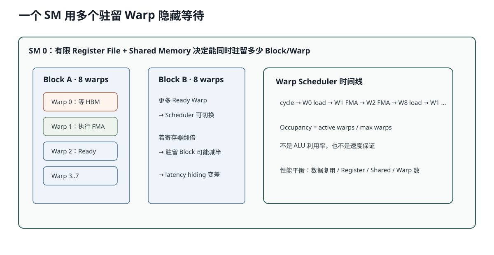

# Lesson 37：SM、Warp Scheduler 与 Occupancy——GPU 怎样用“很多等待中的 Warp”隐藏延迟

> 源码基线：`1d63bca4cf24885a1b15897003e3481db53d8ada`
>
> 前置课程：Lesson 29 的 Grid / Block / Warp。本课继续回答一个更深的问题：**GPU 单次访问显存很慢，为什么整体仍然能很快？为什么寄存器用得太多会让 Kernel 变慢？Occupancy 越高是否一定越快？**



图中要观察：一个 SM 同时驻留多个 Block 和 Warp；某个 Warp 等待 Global Memory 时，Warp Scheduler 可以切换到另一个已经就绪的 Warp。GPU 不是让一次显存访问突然变快，而是用更多可运行工作隐藏等待时间。

## 1. SM 是什么

GPU 不是一大块完全扁平的“核心”。它由多个 Streaming Multiprocessor（SM）组成。每个 SM 拥有一组有限资源：

```text
Warp Scheduler
CUDA Core / Tensor Core 执行管线
Register File
Shared Memory / L1
可驻留 Block 数上限
可驻留 Warp / Thread 数上限
```

Kernel 的 Thread Block 会被调度到某个 SM。一个 Block 一旦落到某个 SM，它的所有 Thread 都在该 SM 上完成；Block 不会执行到一半迁移到另一个 SM。

## 2. Warp Scheduler 真正调度什么

CUDA 编程模型让你写 Thread；硬件通常以 32 个 Thread 组成的 Warp 发射指令。

```text
Block 256 threads
→ 256 / 32 = 8 warps
```

某个 Warp 执行：

```text
load global memory
```

结果可能若干周期后才回来。这个 Warp 暂时不能继续，但 SM 不必空等：

```text
Warp 0 等显存
→ Scheduler 发射 Warp 1 的算术指令
→ Warp 1 等依赖
→ 发射 Warp 2
→ ……
→ Warp 0 数据回来后继续
```

这叫 latency hiding。

## 3. Occupancy 的基本定义

Occupancy 通常指：

```math
\text{occupancy}
=
\frac{\text{active warps on one SM}}
     {\text{maximum warps supported by one SM}}
```

假设某架构每个 SM 最多驻留 64 个 Warp。

一个 Block 有 256 Thread，即 8 Warp。如果资源允许同时驻留 4 个 Block：

```math
\text{active warps}=4\times8=32
```

```math
\text{occupancy}=\frac{32}{64}=50\%
```

它意味着当前有 32 个 Warp 可供 Scheduler 切换，不意味着 ALU 每个周期都达到了 50% 或 100% 利用率。

## 4. 哪些资源限制驻留 Block 数

同一个 Kernel 在每个 SM 上能驻留多少 Block，受多个约束共同限制：

```text
Thread 上限
Warp 上限
Block 上限
Register File 容量
Shared Memory 容量
硬件特定限制
```

最终：

```math
B_{resident}
=
\min(
B_{threads},
B_{warps},
B_{registers},
B_{shared},
B_{hardware}
)
```

### 寄存器约束手算

假设：

```text
每个 SM Register File：65,536 个 32-bit registers
每个 Thread 使用：64 registers
每个 Block：256 threads
```

一个 Block 需要：

```math
64\times256=16,384\text{ registers}
```

所以单看寄存器最多驻留：

```math
\left\lfloor\frac{65,536}{16,384}\right\rfloor=4\text{ blocks}
```

若每 Thread 使用 128 registers：

```math
128\times256=32,768
```

就只剩 2 个 Block，Active Warp 从 32 降到 16。

## 5. 为什么寄存器多有时好、有时坏

寄存器是极快的线程私有存储。更多寄存器可以：

- 保存更多中间值；
- 减少反复访问 Global/Local Memory；
- 让矩阵分块中的累加器留在片上。

但寄存器过多会：

- 降低同一 SM 可驻留的 Warp 数；
- 使 latency hiding 变差；
- 极端时发生 register spilling，把值放到 local memory。

注意 CUDA 的 local memory 并不在 CPU，也不一定在片上；它通常位于 Device Memory，延迟接近 Global Memory。

所以调优不是“寄存器越少越好”，而是：

> 用足够寄存器减少访存，同时保留足够 Warp 隐藏延迟。

## 6. Occupancy 不是越高越好

一个 Kernel 可能在 50% Occupancy 时已经有足够 Warp 隐藏延迟；为了追求 100%，强行缩小 Tile 或减少寄存器，反而可能：

- 重复读取更多 Global Memory；
- 降低 Tensor Core Tile 利用；
- 增加指令和同步次数；
- 让单个 Warp 做更低效的工作。

所以 Occupancy 是诊断指标，不是唯一目标。真正要看：

```text
Kernel duration
SM throughput
Memory throughput
Warp stall reasons
Tensor Core utilization
```

## 7. 与 AIOS `store_cache` 的关系

当前 Triton Kernel：

```python
token_idx = tl.program_id(axis=0)
offsets = tl.arange(0, block_size)
```

一个 Program 处理一个 Token 的全部 K 或 V 宽度。MiniMind-IME：

```text
num_kv_heads = 4
head_dim = 64
width = 256
```

`block_size=256`。Triton 编译器需要把这个向量程序映射到 Warp、寄存器和访存指令。若 Program 保存过多中间张量，寄存器压力会提高；若 Program 太小，GPU 又可能没有足够工作填满所有 SM。

当前 `store_cache` 很短，主要瓶颈更可能是内存写入和 Launch，而不是复杂算术。

## 8. 代码：一个简化 Occupancy 估算器

```python
from math import floor


def estimate(
    threads_per_block,
    registers_per_thread,
    shared_bytes_per_block,
    *,
    max_threads_per_sm=2048,
    max_warps_per_sm=64,
    max_blocks_per_sm=32,
    registers_per_sm=65536,
    shared_bytes_per_sm=100 * 1024,
):
    warps_per_block = (threads_per_block + 31) // 32
    by_threads = max_threads_per_sm // threads_per_block
    by_warps = max_warps_per_sm // warps_per_block
    by_registers = registers_per_sm // (
        threads_per_block * registers_per_thread
    )
    by_shared = (
        max_blocks_per_sm
        if shared_bytes_per_block == 0
        else shared_bytes_per_sm // shared_bytes_per_block
    )
    blocks = min(
        max_blocks_per_sm,
        by_threads,
        by_warps,
        by_registers,
        by_shared,
    )
    active_warps = blocks * warps_per_block
    return blocks, active_warps / max_warps_per_sm
```

它只是教学估算。真实硬件还存在 register allocation granularity、shared-memory allocation granularity、架构限制和编译器行为，应以 Nsight Compute 或 CUDA Occupancy API 为准。

## 9. 如何在 Profiler 中识别问题

### 低 Occupancy + 高 Register Pressure

可能是：

```text
Tile 太大
过多局部中间值
循环展开太多
```

### 高 Occupancy + 仍然很慢

可能是：

```text
Memory Bandwidth 已满
Branch Divergence
指令依赖链长
问题规模太小
Kernel Launch 占主导
```

所以不能看到“Occupancy 98%”就宣布 Kernel 已优化完成。

## 10. 常见错误理解

### 错误：一个 CUDA Core 对应一个长期存在的 Python Thread

错。CUDA Thread 是编程抽象；硬件以 Warp 发射指令，Thread Block 动态驻留到 SM。

### 错误：Occupancy 100% 就是 GPU 利用率 100%

错。Occupancy 只描述驻留 Warp 比例，不直接说明算力、带宽或 Tensor Core 使用率。

### 错误：寄存器溢出后会放到更快的 Shared Memory

通常不会自动放到 Shared Memory，而可能 spill 到位于 Device Memory 的 local memory。

## 11. 运行实验

```bash
python resources/lesson-37-sm-warp-occupancy/run_lesson37.py
```

它会比较不同 Thread/Block 和 Register 数下的简化 Occupancy，并展示“减少寄存器可以增加驻留 Warp，但不自动代表更快”。

## 12. 检验问题与参考答案

### 问题 1：Global Memory 很慢，GPU 为什么不一定一直停住？

**参考答案：** 一个 SM 可以同时驻留多个 Warp。某个 Warp 等待内存或数据依赖时，Warp Scheduler 可以发射另一个已就绪 Warp 的指令，用并发工作隐藏单个 Warp 的等待时间。它隐藏延迟，不是降低该次内存访问本身的延迟。

### 问题 2：为什么寄存器用得越多，Occupancy 可能越低？

**参考答案：** Register File 是每个 SM 的有限资源。每个 Thread 的寄存器数乘以 Block Thread 数决定一个 Block 占用多少寄存器；单 Block 占用越多，同一 SM 能同时驻留的 Block/Warp 越少。

### 问题 3：为什么不能只追求最高 Occupancy？

**参考答案：** 更大的 Tile 和更多寄存器可能减少 Global Memory 流量、提高数据复用或 Tensor Core 效率。强行降低资源使用来提高 Occupancy，可能使每个 Warp 的工作更低效。最终应看 Kernel 时间和 Profiler 指标，而不是单一比例。

### 问题 4：Register Spilling 为什么危险？

**参考答案：** 被 spill 的值通常进入 local memory，而 local memory 位于 Device Memory，具有类似 Global Memory 的高延迟。它可能把原本片上的中间值变成额外 HBM 读写，同时还降低性能可预测性。

## 13. 一句话复述

GPU 用一个 SM 上同时驻留的多个 Warp 隐藏内存和指令等待；Occupancy 由 Thread、Register、Shared Memory 等资源共同决定，但它只是“可供切换的 Warp 数”指标。调优要在片上资源复用、驻留并发和真实 Kernel 时间之间平衡。

## 14. 一手参考

- NVIDIA CUDA Programming Guide：SM、Warp Scheduling、Occupancy。
- NVIDIA GPU Performance Background Guide：Latency、Parallelism 与性能限制。
