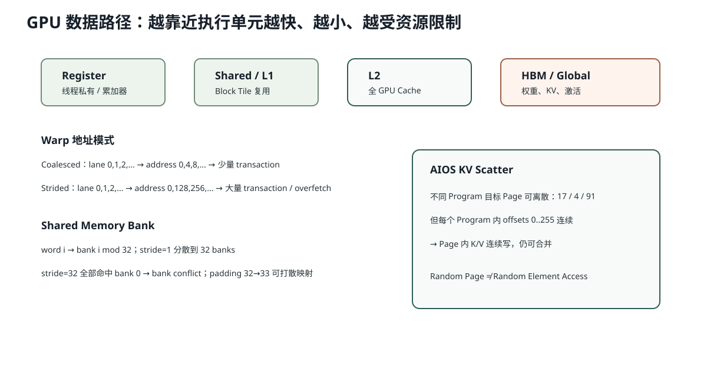

# Lesson 38：显存层级、合并访存与 Shared Memory Bank Conflict

> 源码基线：`1d63bca4cf24885a1b15897003e3481db53d8ada`
>
> 目标：不再笼统说“显存慢”。学完后，你能根据地址模式判断一次 Warp 访问是否容易合并，解释 Shared Memory 为什么快却仍会发生 Bank Conflict，并把这些概念映射到 AIOS 的 KV Scatter、权重读取和 Attention Tile。



## 1. 为什么 GPU 优化经常是在优化“搬数据”

计算通常发生在 SM 的执行单元中，但模型权重、激活和 KV Cache 主要保存在 Global Memory/HBM。一个值要参与计算，通常经历：

```text
HBM / Global Memory
→ L2
→ L1 / Shared Memory
→ Register
→ ALU / Tensor Core
```

若同一份数据每做一次乘法就重新从 HBM 读取，理论 FLOPs 很高也跑不满。

## 2. Register、Shared、L1/L2 与 HBM 的职责

| 层级 | 谁可见 | 典型用途 |
|---|---|---|
| Register | 单 Thread 的执行上下文 | 累加器、地址、临时值 |
| Shared Memory | 同一 Block | Tile 复用、线程协作 |
| L1 | SM 附近 | 硬件缓存、与 Shared 资源相关 |
| L2 | 全 GPU | 跨 SM 的统一缓存 |
| Global/HBM | 全 GPU | 权重、KV、激活大 Tensor |

“越上层越快”只是一般趋势；真实延迟和带宽受架构、访问命中和并发影响。

## 3. 什么叫 Coalesced Global Memory Access

一个 Warp 有 32 个 Lane。若每个 Lane 读取相邻的 4-byte float：

```text
lane 0 → address 0
lane 1 → address 4
lane 2 → address 8
...
lane31 → address124
```

硬件可以把这些访问合并成少量 Memory Transaction。

若访问：

```text
lane 0 → address 0
lane 1 → address128
lane 2 → address256
...
```

同样只需要 128 bytes 有效数据，却可能触发大量分散 Transaction 和无用传输。

合并访存的核心不是“所有线程读同一个地址”，而是：

> 同一 Warp 的地址尽量落在少量连续、对齐的 Memory Segment 中。

## 4. Stride 为什么决定地址模式

二维 Row-major Tensor：

```text
X.shape = [rows, cols]
X.stride = [cols, 1]
```

地址：

```math
\operatorname{addr}(i,j)
=
\operatorname{base}
+i\cdot\operatorname{stride}_0
+j\cdot\operatorname{stride}_1
```

若 32 个 Lane 固定 `i`、让 `j=lane_id`：地址连续。

若固定 `j`、让 `i=lane_id`：每次跨越 `cols` 个元素，可能变成大步长访问。

这就是为什么 Tensor 的 Layout 和 `transpose()` 后是否 contiguous 会影响 Kernel。

## 5. AIOS `store_cache` 为什么仍可合并写入

物理 Page 顺序可能随机：

```text
indices = [17,4,91]
```

但一个 Triton Program 内处理一个 Token 的完整 K 向量：

```python
cache_offsets = index * cache_token_stride + offsets
```

`offsets=[0,1,...,255]` 连续。

因此：

```text
Program 0 写 Page 17 的连续 256 元素
Program 1 写 Page 4 的连续 256 元素
Program 2 写 Page 91 的连续 256 元素
```

不同 Program 的 Page 不连续没有关系；关键是每个 Program 内的 Lane 写一个连续区域，便于合并 Transaction。

## 6. Shared Memory 为什么快

Shared Memory 位于 SM 片上，允许一个 Block 的 Thread 共享 Tile。例如 GEMM：

```text
从 HBM 读取 A Tile 一次到 Shared
从 HBM 读取 B Tile 一次到 Shared
多个 Thread 重复使用这些值做很多 FMA
```

这把：

```text
每次乘法都读 HBM
```

变成：

```text
一批 HBM 读取
→ 片上重复计算
```

提高 Arithmetic Intensity。

## 7. Bank Conflict 是什么

Shared Memory 被划分成多个 Bank。不同 Lane 同时访问不同 Bank，可以并行服务。

若多个 Lane 在同一条指令中访问同一个 Bank 的不同地址，访问可能被串行化，称为 Bank Conflict。

简化假设 32 Banks：

```text
bank = word_index % 32
```

### 无 Conflict

```text
lane i 访问 word i
→ bank i
```

### 32-way Conflict

```text
lane i 访问 word i*32
→ 全部 bank 0
```

例外：多个 Lane 读取完全相同地址，硬件可以 Broadcast，不一定按普通 Conflict 处理。

常见修复是在二维 Shared Tile 上加 Padding：

```text
[32,32] → [32,33]
```

使转置访问时 Bank 映射错开。

## 8. Local Memory 与“本地”这个名字的陷阱

Local Memory 是每个 Thread 私有的地址空间，但物理上通常位于 Device Memory。以下情况可能进入 Local Memory：

- 寄存器 spill；
- 编译器无法放入寄存器的大型线程私有数组；
- 动态索引的局部结构。

所以“local”描述可见范围，不表示像 CPU Cache 一样近。

## 9. Pinned Host Memory 的作用

普通 CPU Memory 可能被操作系统换页；异步 DMA 传输更偏好页锁定的 Pinned Memory。

当前 FlashInfer Metadata 构造：

```python
cpu_kwargs = {
    "device": "cpu",
    "dtype": torch.int32,
    "pin_memory": True,
}
```

随后：

```python
cu_seqlens_q_cpu.to(device, non_blocking=True)
```

Pinned Memory 是 `non_blocking=True` 真正异步 H2D 的重要条件之一。但是否与计算重叠，还取决于不同 Stream、依赖关系和硬件 Copy Engine。

## 10. 代码：观察连续与跨步地址

```python
def touched_segments(stride_words, lanes=32, bytes_per_word=4, segment=32):
    addresses = [lane * stride_words * bytes_per_word for lane in range(lanes)]
    segments = {address // segment for address in addresses}
    return len(segments), addresses

print(touched_segments(1)[0])   # 少量连续 segment
print(touched_segments(32)[0])  # 大量分散 segment
```

它不是完整 GPU Transaction 模型，但能直观看到：Stride 越大，Warp 地址越分散。

## 11. 如何把知识用于当前 AIOS

| 路径 | 主要内存问题 |
|---|---|
| QKV/Gate-Up GEMM | 权重与输入 Tile 复用、Tensor Core Layout |
| RMSNorm/SwiGLU | 低 Arithmetic Intensity，减少中间 HBM 往返 |
| KV Scatter | 目标 Page 离散，但每 Token 内连续写 |
| Paged Attention | 按 Page Table Gather K/V，依赖高效 Kernel 与 Cache 行为 |
| CPU Metadata → GPU | 小 Tensor、Pinned Memory、Launch/Copy 固定成本 |

## 12. 常见错误理解

### 错误：Shared Memory 自动缓存所有 Global Memory

错。Shared Memory 通常需要 Kernel 显式加载和组织；L1/L2 才是硬件管理的 Cache。

### 错误：随机 Page ID 一定意味着每个元素都不能合并写

错。Page 之间离散，但一个 Page 内的 Head/Dim 可以连续写入。

### 错误：`tensor.is_contiguous()` 为真就保证所有 Kernel 访问都合并

错。Contiguous 只描述 Layout；Kernel 如何把 Lane 映射到坐标仍决定访问模式。

## 13. 运行实验

```bash
python resources/lesson-38-memory-hierarchy-coalescing/run_lesson38.py
```

它会打印不同 Stride 的地址、触及 Segment 数，以及 Shared Bank 映射示例。

## 14. 检验问题与参考答案

### 问题 1：为什么离散 Page Table 不一定破坏 `store_cache` 的合并写？

**参考答案：** 每个 Program 先选择一个目标 Page，但 Program 内 256 个 offset 仍写该 Page 的连续 K/V 元素。合并性主要看同一 Warp/Lane 指令中的地址分布，而不是不同 Program 的 Page ID 是否连续。

### 问题 2：Shared Memory 已经在片上，为什么仍可能慢？

**参考答案：** 同一 Warp 的 Lane 若访问同一 Bank 的不同地址，会出现 Bank Conflict 并被分多次服务；此外 Shared Memory 容量过大还会降低每个 SM 可驻留的 Block 数。

### 问题 3：`non_blocking=True` 为什么不保证传输一定与计算重叠？

**参考答案：** 真正异步通常还需要 Pinned Host Memory，并且 Copy 与计算位于可并行的 Stream、没有未满足依赖、硬件有可用 Copy Engine。`non_blocking` 只是允许异步，不是重叠承诺。

### 问题 4：Local Memory 为什么可能比 Register 慢很多？

**参考答案：** Local Memory 是线程私有地址空间，但物理存储通常在 Device Memory，并经 L1/L2 缓存；它常由 Register Spilling 产生，因此会增加类似 Global Memory 的高延迟访问。

## 15. 一句话复述

GPU 性能取决于数据在 HBM、Cache、Shared 和 Register 之间怎样移动。Warp 的相邻 Lane 应尽量访问相邻对齐地址；Shared Memory 能提高 Tile 复用，却要避免 Bank Conflict；AIOS 的 KV Page 虽然离散，但每个 Token 内连续 Scatter 仍可形成高效访问。

## 16. 一手参考

- NVIDIA CUDA Programming Guide：Device Memory Accesses、Shared Memory Banks。
- PyTorch CUDA Semantics：Pinned Memory 与 non_blocking Copy。


## 17. `view`、`transpose`、`contiguous` 为什么会影响内存访问

PyTorch Tensor 除了 Shape，还有 Stride。原始：

```text
x.shape  = [T, heads, dim]
x.stride = [heads×dim, dim, 1]
```

最后一维 `dim` 连续。执行：

```python
y = x.transpose(0, 1)
```

通常只改变 Shape/Stride，不搬数据：

```text
y.shape  = [heads,T,dim]
y.stride = [dim, heads×dim, 1]
```

此时 `y` 逻辑上正确，但某些 Kernel 若假设 Row-major 连续布局，就不能直接把它当成连续 Buffer。调用：

```python
y2 = y.contiguous()
```

会真正分配新 Tensor 并按新逻辑顺序复制数据。

所以 `contiguous()` 的代价不是一个类型转换，而是潜在的完整显存读写。高性能路径会尽量：

- 让权重导出时就符合 Kernel Layout；
- 使用能接受 Stride 的 Kernel；
- 把必要 Layout 转换与其他算子融合；
- 避免每个 Token Step 重复 `contiguous()`。

当前 AIOS Q/K/V 在 fused projection 后通过 `view` 变成 `[tokens,heads,head_dim]`，前提是 Q/K/V 各自切片的最后维布局符合连续 Head×Dim 解释。若 Weight Packing 顺序错了，Shape 仍能 `view`，但 Head 中的数值语义会错位。

## 18. 为什么矩阵转置常是“逻辑转置”，GEMM 仍能高效

cuBLAS/GEMM 接口通常接受 Layout/Transpose 标志和 Leading Dimension，不一定要求事先把 `W[N,K]` 复制成真正连续的 `W^T[K,N]`。库可以按 Stride 解释输入，并选择合适 Kernel。

因此：

```python
F.linear(x, weight)
```

概念上使用 `weight.T`，但不代表每次 Forward 都先物理复制整张权重。理解“逻辑 View”和“物理 Copy”的区别，是分析显存流量的基础。
