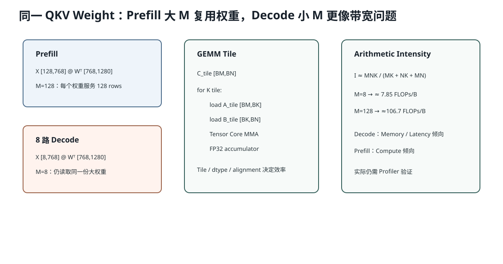

# Lesson 39：GEMM、Tensor Core 与 `F.linear`——为什么 Prefill 和 Decode 的 Linear 性能完全不同

> 源码基线：`1d63bca4cf24885a1b15897003e3481db53d8ada`
>
> 目标：把“Linear 底层是矩阵乘法”展开到 M/N/K、FLOPs、字节流量、Tensor Core Tile 和 AIOS 的真实 QKV/Gate-Up Shape。学完后，你能解释为什么同一组权重在长 Prefix Prefill 时可能 Compute-bound，在单 Token Decode 时却常常 Memory/Latency-bound。



## 1. `F.linear` 到底算什么

PyTorch：

```python
y = torch.nn.functional.linear(x, weight)
```

数学：

```math
y = xW^T
```

若：

```text
x.shape      = [..., K]
weight.shape = [N, K]
```

PyTorch 会把 `x` 前面的维度展平成 M：

```text
x_2d  = [M,K]
W^T   = [K,N]
output= [M,N]
```

GEMM 记作：

```text
M = 一次处理的 Token/Row 数
N = 输出特征数
K = 输入特征数
```

## 2. AIOS QKV Projection 的真实 M/N/K

MiniMind-IME：

```text
hidden_size = 768
q_size      = 12 × 64 = 768
kv_size     = 4 × 64  = 256
fused N     = 768 + 256 + 256 = 1280
```

代码：

```python
self.qkv_proj = LinearQKVMerged(
    config.hidden_size,
    self.q_size,
    self.kv_size,
)
qkv = self.qkv_proj.forward(hidden_states)
```

所以：

```text
W_qkv.shape = [1280,768]
```

### Prefill 128 Token

```text
M=128, N=1280, K=768
```

### 8 路 Decode

```text
M=8, N=1280, K=768
```

权重完全相同，M 相差 16 倍，GPU 可利用的并行 Tile 数和权重复用程度也完全不同。

## 3. GEMM FLOPs 怎样计算

每个输出元素需要 K 次乘和 K-1 次加，通常近似 2K FLOPs：

```math
\operatorname{FLOPs}
\approx2MNK
```

### Prefill QKV

```math
2\times128\times1280\times768
=251,658,240\text{ FLOPs}
```

### 8 路 Decode QKV

```math
2\times8\times1280\times768
=15,728,640\text{ FLOPs}
```

Decode 算术少很多，但仍要读取接近同一份 1280×768 BF16 权重。

## 4. Arithmetic Intensity 为什么随 M 增大

简化假设 A、B、C 都只从 HBM 读写一次，BF16 为 2 bytes：

```math
I
\approx
\frac{2MNK}
{2(MK+NK+MN)}
=
\frac{MNK}{MK+NK+MN}
```

### Decode `M=8`

```math
I\approx\frac{8\times1280\times768}
{8\times768+1280\times768+8\times1280}
\approx7.85\text{ FLOPs/byte}
```

### Prefill `M=128`

```math
I\approx106.7\text{ FLOPs/byte}
```

Prefill 中同一权重 Tile 被更多 Token Row 复用，Arithmetic Intensity 明显提高。

这解释：

```text
小 Batch Decode Linear
→ 更像 repeatedly load weights for few rows
→ 常受权重带宽和 launch/latency 影响

大 Prefix Prefill Linear
→ 每次权重加载服务更多计算
→ 更可能接近 Tensor Core Compute-bound
```

## 5. Tensor Core 做什么

Tensor Core 是专门执行小矩阵 MMA（Matrix Multiply-Accumulate）的硬件单元。高性能 GEMM 会：

```text
把大矩阵切成 Tile
→ Block/Warps 加载 A/B Tile
→ 用 Tensor Core MMA 累加到较高精度 accumulator
→ 写回 C Tile
```

常见混合精度：

```text
输入 BF16/FP16
累加 FP32
输出 BF16/FP16
```

这与“整个模型所有中间值都只有 16 位”不同。

## 6. 为什么维度对齐有帮助

Tensor Core 和内存 Tile 有固定粒度。M/N/K 若是 8、16、64、128 等友好倍数，通常更容易：

- 填满 MMA Tile；
- 减少边界 Mask；
- 使用更高效的 Layout；
- 让 cuBLAS 选择理想 Kernel。

MiniMind 的：

```text
768, 1280, 2048, 256, 64
```

都是较友好的规则维度。

但“是 16 的倍数”不保证高效；M=1 的 GEMV 即使对齐，也很难复用权重。

## 7. QKV Fusion 为什么有价值

分离：

```python
q = F.linear(x, Wq)
k = F.linear(x, Wk)
v = F.linear(x, Wv)
```

融合：

```python
Wqkv = cat([Wq,Wk,Wv], dim=0)
qkv = F.linear(x, Wqkv)
q, k, v = split(qkv)
```

数学 FLOPs 几乎不变，但：

- 3 次 GEMM Launch 变 1 次；
- 输入 `x` 的读取/调度更集中；
- 更大的 N 可能形成更有效率的 GEMM；
- 权重加载器必须保证拼接顺序正确。

## 8. Gate-Up Fusion 的同样原理

SwiGLU：

```math
\operatorname{SwiGLU}(x)
=
\operatorname{SiLU}(xW_g^T)
\odot
(xW_u^T)
```

当前：

```python
self.gate_up_proj = LinearColParallelMerged(
    hidden_size,
    [intermediate_size, intermediate_size],
)
```

真实：

```text
W_gate_up.shape = [4096,768]
```

一次 GEMM 后 split 为两个 `[M,2048]` 分支。

## 9. 代码：计算真实 GEMM 强度

```python
def gemm_stats(M, N, K, bytes_per_element=2):
    flops = 2 * M * N * K
    bytes_moved = bytes_per_element * (M*K + N*K + M*N)
    return flops, bytes_moved, flops / bytes_moved

for M in (1, 8, 128):
    print(M, gemm_stats(M, 1280, 768))
```

注意这是假设每个 Tensor 只访问一次的下界估计。真实 Kernel 还有 Cache 命中、Tile 重载、地址指令和框架开销。

## 10. 如何判断当前 AIOS Linear 瓶颈

- Prefill 长、M 大：看 Tensor Core Utilization、SM Throughput；
- Decode M=1/8：看 HBM Bandwidth、Kernel Duration、Launch Gap；
- 很多短 GEMM：考虑 Fusion、CUDA Graph、Batch Bucket；
- 权重已量化：还要看 Dequant/Scale 与 Quantized GEMM 是否融合。

## 11. 常见错误理解

### 错误：Decode FLOPs 少，所以一定比 Prefill 更高效

它总工作量少，但 GPU 利用率可能更低、每 FLOP 成本更高，且每个 Token Step 反复读取权重。

### 错误：Tensor Core 让所有矩阵乘法都达到峰值

需要足够大的规则 Tile、合适 dtype/layout 和充分并行。小 M、奇怪维度、额外开销都会降低效率。

### 错误：QKV Fusion 减少了模型参数

没有。它只改变权重存储布局和执行方式。

## 12. 运行实验

```bash
python resources/lesson-39-gemm-tensor-cores/run_lesson39.py
```

它会计算 MiniMind QKV、Gate-Up、Down Projection 在不同 M 下的 FLOPs、理论字节与 Arithmetic Intensity。

## 13. 检验问题与参考答案

### 问题 1：为什么 Decode `M=8` 比 Prefill `M=128` 更容易 Memory-bound？

**参考答案：** 两者读取的权重矩阵大小近似相同，但 Prefill 让每个权重元素服务更多 Token Row 和乘加操作，Arithmetic Intensity 更高；Decode 只对少量 Row 计算，权重读取占比更大。

### 问题 2：为什么 `F.linear` 的 Weight Shape 是 `[N,K]`，GEMM 却写成 `[M,K]@[K,N]`？

**参考答案：** PyTorch Linear 存储的是每个输出特征一行的 Weight `[out_features,in_features]=[N,K]`，Forward 使用其转置 `W^T[K,N]` 与展平后的输入 `[M,K]` 相乘。

### 问题 3：QKV 合并为什么通常沿 Weight 的 `dim=0`？

**参考答案：** `dim=0` 是输出特征维。把 Q/K/V 的输出行拼接后，单次 Linear 产生连续的 Q、K、V 输出区间；若沿输入维拼接会改变 K 和输入语义，不能等价。

### 问题 4：维度都是 16 的倍数，为什么 M=1 仍可能低效？

**参考答案：** 对齐有利于 Tensor Core Tile，但 M=1 只有极少输出行，缺乏足够并行与权重复用，Arithmetic Intensity 接近 GEMV，往往受带宽和延迟限制。

## 14. 一句话复述

AIOS 的 Linear 最终是 GEMM：M 是当前 Flat Token/Active Row 数，N 是输出宽度，K 是 Hidden 宽度。Prefill 的大 M 能复用权重并提高 Arithmetic Intensity；小 Batch Decode 即使 FLOPs 少，也常受权重带宽和 Launch 限制。Fusion 改善执行布局，不改变模型数学。

## 15. 一手参考

- NVIDIA Matrix Multiplication Background Guide。
- NVIDIA Linear/Fully-Connected Layers Performance Guide。
- Triton Matrix Multiplication Tutorial。

## 16. 用当前模型比较三个阶段的 M

对同一 QKV Weight `[1280,768]`：

| 场景 | M | 含义 |
|---|---:|---|
| 单请求单 Token Decode | 1 | 最像 GEMV，权重几乎不复用 |
| 8 路 CandidateGroup Decode | 8 | 同一步八条候选共享一次 GEMM Batch |
| 128 Token Prefix Prefill | 128 | 一次对 128 个 Token Row 投影 |

8 路 CandidateGroup 不只减少 Python 循环；它把八个 `M=1` GEMM 合成一个 `M=8` GEMM。虽然 M 仍小，但：

- Kernel Launch 从八次收敛为一次；
- Weight Tile 可服务八行；
- 输出 Tile 更容易填充；
- 后续 Norm/Attention 也获得 Batch 并行。

这就是“组内并行”的算子层意义。

## 17. GEMM 性能为什么会出现维度量化台阶

GPU Kernel 按固定 Tile 处理，例如 `M_tile=64,N_tile=128`。若真实 M=65：

```text
第一个 M Tile：64 行有效
第二个 M Tile：只有 1 行有效，其余 Lane Mask
```

因此从 M=64 到 M=65，理论 FLOPs只增加少量，但可能多启动一组 Tile，耗时出现台阶。这称为 Dimension Quantization Effect。

同理，N/K 不是友好 Tile 倍数时，会出现边界 Mask、Padding 或较差 Kernel 选择。这也是模型结构常选择规则 Hidden/FFN 维度的工程原因之一。

## 18. 为什么不能只用 TFLOPS 比较 Prefill 和 Decode

Decode 的用户指标是每 Token Latency，Prefill 常看 Tokens/s 或 Prompt Latency。一个 Decode GEMM 可能只达到很低 TFLOPS，但绝对耗时仍很短；另一个 Prefill GEMM TFLOPS 很高，却因为工作量巨大耗时更长。

正确比较要同时报告：

```text
问题 Shape M/N/K
Kernel 时间
有效 TFLOPS
内存带宽
端到端阶段占比
```

只看“GPU 只跑了 10% 峰值”不能直接得出有 10 倍优化空间。
