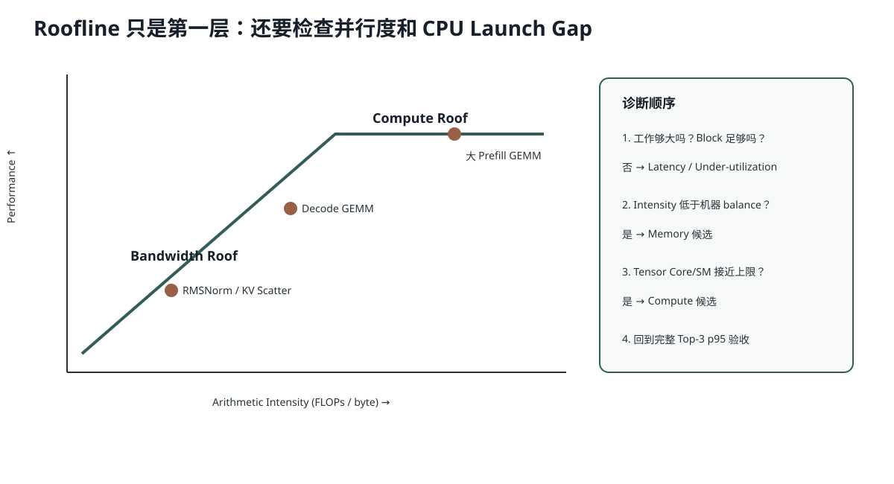

# Lesson 40：Roofline 与瓶颈诊断——Latency-bound、Memory-bound、Compute-bound 怎样区分

> 源码基线：`1d63bca4cf24885a1b15897003e3481db53d8ada`
>
> 目标：把“Profile 后再优化”变成一套可执行判断。你会使用 Arithmetic Intensity 和 GPU 的计算/带宽上限做第一层分类，再用并行度、Kernel Launch、Timeline 与最终 Top-3 墙钟修正结论。



## 1. Roofline 的核心公式

一个 Kernel 的可达性能受两条上限约束：

```math
P_{attainable}
\le
\min(
P_{peak\ compute},
B_{memory}\times I
)
```

其中：

- `P_peak compute`：GPU 峰值算力；
- `B_memory`：显存带宽；
- `I`：Arithmetic Intensity，FLOPs / Byte。

若 `B×I` 低于峰值算力，算法倾向 Memory-bound；反之可能 Compute-bound。

## 2. 还必须加第三类：Latency-bound

Roofline 默认工作足够大，能填满 GPU。小问题可能：

```text
只有几个 Block
Kernel 只运行几微秒
CPU Launch Gap 比 GPU Work 还长
```

即使理论 Arithmetic Intensity 很高，也可能因为并行度不足或 Launch 开销成为 Latency-bound。

所以实际分类：

```text
并行度不足 / Kernel 极短
→ Latency-bound

并行度足够且 Intensity 低
→ Memory-bound

并行度足够且 Intensity 高
→ Compute-bound
```

## 3. AIOS 常见算子第一判断

| 算子 | 第一判断 | 原因 |
|---|---|---|
| Decode 小 M Linear | Memory/Latency | 权重大、Row 少、复用低 |
| 长 Prefix GEMM | Compute 倾向 | M 大、权重 Tile 复用高 |
| RMSNorm | Memory | 每元素少量运算、读写主导 |
| SwiGLU Elementwise | Memory | SiLU/乘法相对字节少 |
| KV Scatter | Memory/Latency | 读 K/V + 写随机 Page，计算极少 |
| 短 CandidateGroup 多层 | Launch/Latency | 大量短 Kernel 重复发射 |
| 长 Attention | IO/Compute 混合 | QK/PV 计算与 K/V 读写共同决定 |

这只是先验，必须用 Profiler 验证。

## 4. 一个具体分类例子

假设某 GPU：

```text
峰值 BF16：100 TFLOPS
HBM 带宽：1 TB/s
```

机器平衡点：

```math
\frac{100\ \text{TFLOPS}}{1\ \text{TB/s}}
=100\ \text{FLOPs/byte}
```

Kernel A Intensity 8 FLOPs/byte：

```math
B\times I=1\ \text{TB/s}\times8=8\ \text{TFLOPS}
```

远低于 100 TFLOPS，倾向 Memory-bound。

Kernel B Intensity 200：带宽屋顶为 200 TFLOPS，高于 Compute Peak，因此 Compute Peak 先限制。

## 5. 为什么“显存带宽没跑满”仍可能是 Memory 问题

可能存在：

- 访问不合并；
- Cache Miss/随机 Page Gather；
- 问题规模小，不能形成足够并发；
- 依赖链和地址计算限制发射；
- Kernel Launch 间有 CPU 空洞。

所以 Memory-bound 不是简单等于 `dram__throughput=100%`。更准确是：减少字节/改善访问模式比增加 FLOPs 单元更可能有效。

## 6. AIOS 的优化应按哪一层做

### Latency-bound

优先考虑：

```text
Fusion
CUDA Graph
减少 Python/Metadata 工作
固定 Buffer
合并小 Batch
```

### Memory-bound

优先考虑：

```text
量化
更少中间 Tensor
Tile / Shared Memory 复用
合并访存
KV 压缩
```

### Compute-bound

优先考虑：

```text
Tensor Core dtype/layout
更好 GEMM Kernel
更少无效 FLOPs
Speculative 接受更多 Token/Target Pass
```

优化方向必须与瓶颈一致。

## 7. 为什么完整 Top-3 是最终 Roofline 之外的指标

单 Kernel Roofline 不能覆盖：

```text
Tokenizer
Python Candidate State
多次 Model Step
CPU Decode
Filter / Dedup / MMR
Refill
```

AIOS-IME 最终 p50/p95 是整个流水线的和与尾部组合。某个 Kernel 快 2 倍，如果它只占 5%，Amdahl 定律上总收益有限：

```math
S_{total}
=
\frac{1}{(1-f)+f/S}
```

若 `f=0.05, S=2`：

```math
S_{total}=\frac1{0.95+0.025}\approx1.026
```

只提升 2.6%。

## 8. 一套可执行诊断流程

```text
1. 明确最终指标：完整 Top-3 p95
2. Warmup 后用 Nsight Systems 看 Timeline
3. 是否存在大段 CPU/Launch Gap？
   是 → Latency/Control Plane
4. 对最重 Kernel 用 Nsight Compute
5. 看问题规模、SM/Memory/Tensor Core、Stall Reason
6. 估算 Arithmetic Intensity
7. 选择只针对瓶颈的改动
8. 单 Kernel 验证 + 端到端 A/B + 质量门禁
```

## 9. 代码：简单 Roofline 分类器

```python
def classify(flops, bytes_moved, peak_flops, bandwidth, parallelism_ok=True):
    intensity = flops / bytes_moved
    balance = peak_flops / bandwidth
    if not parallelism_ok:
        return intensity, balance, "latency-bound candidate"
    if intensity < balance:
        return intensity, balance, "memory-bound candidate"
    return intensity, balance, "compute-bound candidate"
```

它是第一阶模型，不替代 Profiler。

## 10. 当前项目的真实提示

AIOS-IME 0.1B、短 Decode：

- 首步约 8ms，但完整 Top-3 p95 约 110ms；
- 短 Prefix token-LCP 几乎无收益；
- Fusion、Active-row compaction 有价值；
- CUDA Graph 值得实验，但 Ragged Shape 使接入复杂；
- 更长生成反而恶化尾延迟与有效候选率。

这些现象都说明：当前不只是数学 FLOPs，Launch、Metadata、分支长度和候选治理共同决定结果。

## 11. 常见错误理解

### 错误：GPU 利用率低就一定应增大模型算量

低利用率可能来自 CPU Gap、Batch 太小、同步、内存访问或资源限制；增加无效计算只会更慢。

### 错误：Memory-bound 的 Kernel 不值得融合

融合可避免中间 Tensor 的 HBM 写回与重读，正适合 Memory-bound Elementwise/Norm。

### 错误：一个 Kernel 优化 10 倍，端到端也会 10 倍

端到端收益受该 Kernel 时间占比限制。

## 12. 运行实验

```bash
python resources/lesson-40-roofline-bottlenecks/run_lesson40.py
```

它会用几个 AIOS 风格算子计算 Intensity、机器平衡点和 Amdahl 端到端上限。

## 13. 检验问题与参考答案

### 问题 1：Arithmetic Intensity 高，为什么仍可能 Latency-bound？

**参考答案：** Roofline 假设有足够并行工作填满 GPU。如果 Kernel 只有少量 Block、执行数微秒，SM 可能未饱和，CPU Launch 和依赖延迟占主导；高 Intensity 只说明每字节算得多，不保证问题规模足够。

### 问题 2：RMSNorm 为什么适合 Fusion？

**参考答案：** RMSNorm 对每个元素只做少量算术，却需要读输入、写输出，并可能再被 Residual Add 读写。把 Add 与 Norm 融合能减少中间 HBM 往返和 Kernel Launch，正好针对其 Memory/Latency 特征。

### 问题 3：为什么必须同时看单 Kernel 与完整 Top-3？

**参考答案：** 单 Kernel 指标帮助定位机制瓶颈；完整 Top-3 包含多轮 Decode、CPU 治理和 refill，是用户观察指标。局部优化可能占比很小，也可能改变候选行为，因此两层都要验收。

### 问题 4：HBM Throughput 没到峰值，能否断言不是 Memory-bound？

**参考答案：** 不能。非合并访问、并行度不足、随机访问、依赖链和 Cache 行为都可能让 Kernel 受内存延迟/访问效率限制却无法跑满理论带宽。

## 14. 一句话复述

Roofline 用 Arithmetic Intensity 判断计算屋顶与带宽屋顶，但小模型还必须加入并行度和 Launch 延迟。AIOS 优化应先识别 Latency、Memory 或 Compute 瓶颈，再选择 Fusion、Graph、量化、Tile 或算法改动，并最终回到完整 Top-3 p95 与质量门禁。

## 15. 一手参考

- NVIDIA GPU Performance Background Guide。
- NVIDIA Matrix Multiplication Background Guide。

## 16. 把 Nsight 指标放进判断表

不同版本指标名字会变化，但思路稳定：

| 观察 | 可能含义 | 下一步 |
|---|---|---|
| Kernel 之间大片空白 | CPU/Launch/同步 | Nsight Systems 看 Python、Driver、Stream |
| DRAM/L2 吞吐高，SM 算术低 | Memory-bound | 减字节、Fusion、量化、改善访问 |
| Tensor Core/SM 吞吐高 | Compute-bound | 更高效 GEMM、减少 FLOPs、算法改变 |
| Occupancy 低、Register 高 | 资源限制 | 调 Tile、Warp、Stage，查 spill |
| Occupancy 高但 Warp Stall Memory 高 | 延迟/带宽 | 数据复用、合并访存、更多独立工作 |
| Kernel 很短且 Block 少 | Under-utilized | Batch、融合、Graph，或接受固定成本 |

Profiler 的价值是把“我觉得”变成证据，但指标仍需结合算法语义。例如 KV Scatter 本来几乎没有 FLOPs，要求它高 Tensor Core 利用率毫无意义。

## 17. 用层级占比避免优化错对象

假设完整 Top-3 p95=110ms：

```text
Model Kernels       75ms
Metadata/Launch     15ms
CPU Decode/Govern   12ms
Tokenizer/Other      8ms
```

若把 CPU Governance 优化 4 倍：

```math
T_{new}=75+15+12/4+8=101\text{ ms}
```

只提升约 1.09x。

若 CUDA Graph 能把 Metadata/Launch 从 15 降到 5：

```text
110 → 100ms
```

同样不是 3x。要获得大收益，需优化占比大的阶段，或同时改变多轮 Decode 的结构（例如接受多个 Token）。

## 18. 质量门禁为什么也属于性能实验

某优化若：

```text
p95 下降 20%
但同拼音 Top-1 翻转
或候选满三条率下降
```

不能称为可用加速。BF16 Kernel 路径、量化、Speculative、Graph Dummy Row 都可能改变数值或随机流。AIOS 的实验模板应同时固定：

```text
输入/Seed/采样参数
冻结排序 Lane
Candidate Shape
KV Page 回收
完整延迟与显存
```

性能结论只有通过这些约束才成立。
