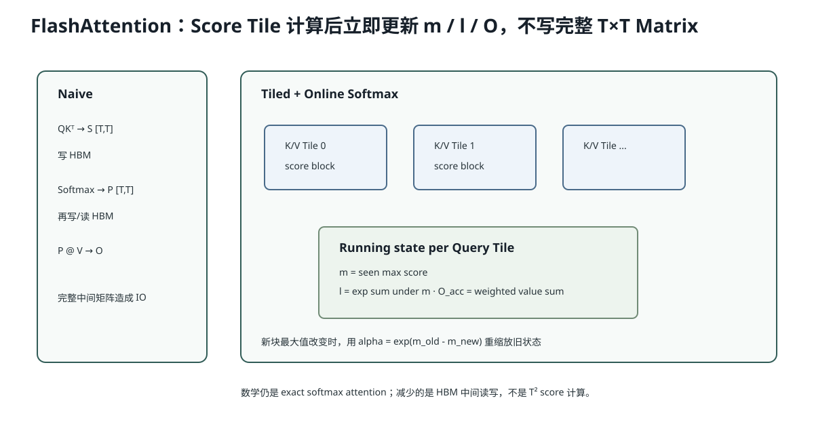

# Lesson 41：FlashAttention 算法——不保存完整 Attention Matrix，Online Softmax 怎样仍得到精确结果

> 源码基线：`1d63bca4cf24885a1b15897003e3481db53d8ada`
>
> 前置课程：Lesson 32 讲 FlashInfer `plan/run` 接口。本课向下补算法原理：**FlashAttention 为什么不是近似注意力？K/V 分块后 Softmax 分母尚未完整，怎样分块累计仍得到与一次性 Softmax 相同的输出？**



## 1. 普通 Attention 为什么占显存

对单 Head：

```math
S=QK^T/\sqrt d
```

```math
P=\operatorname{softmax}(S)
```

```math
O=PV
```

若序列长 T：

```text
S.shape = [T,T]
P.shape = [T,T]
```

T=4096、BF16，单个矩阵约：

```math
4096^2\times2\text{ bytes}\approx32\text{ MiB}
```

多个 Head/Batch 下更大。更关键的是 S/P 写到 HBM 又读回，产生大量 IO。

## 2. FlashAttention 的核心不是减少数学复杂度

FlashAttention 仍计算精确的：

```math
\operatorname{softmax}(QK^T)V
```

主要变化：

```text
Q/K/V 按 Tile 读入片上 SRAM
→ 计算一块 Score
→ 立即更新 Softmax 统计和输出累加器
→ 不把完整 S/P 写到 HBM
```

FLOPs 仍是二次量级；HBM 读写显著减少。

## 3. 为什么普通 Softmax 看起来不能分块

Softmax：

```math
p_i=\frac{e^{s_i}}{\sum_j e^{s_j}}
```

处理第一块时还不知道后面 Score，尤其不知道全局最大值和完整分母。

Online Softmax 维护三个状态：

```text
m：目前见过的最大 score
l：在 m 基准下的 exp 总和
O_acc：未归一化的加权 Value 和
```

## 4. Online Softmax 更新公式

旧状态：`m_old, l_old, O_old`。

新块 Score 为 `s`，对应 Value 为 `V_block`。

新最大值：

```math
m_{new}=\max(m_{old},\max(s))
```

旧累计缩放：

```math
\alpha=e^{m_{old}-m_{new}}
```

新块权重：

```math
p=e^{s-m_{new}}
```

更新分母：

```math
l_{new}=\alpha l_{old}+\sum p
```

更新未归一化输出：

```math
O_{new}=\alpha O_{old}+p^T V_{block}
```

全部 K/V 块处理完：

```math
O=\frac{O_{acc}}{l}
```

## 5. 为什么旧结果必须乘 `alpha`

假设旧最大值 `m_old=2`，新块出现 `m_new=5`。

旧累计原本按 `e^{score-2}` 表示。为了和新基准 `5` 对齐：

```math
e^{score-2}\times e^{2-5}=e^{score-5}
```

所以旧 `l` 和 `O_acc` 都要乘：

```math
\alpha=e^{-3}
```

这保证分块顺序不改变最终数学结果。

## 6. 一个两块手算

Scores：

```text
block A = [1,2]
block B = [5]
```

### 第一块

```text
m=2
p=[e^-1,1]=[0.3679,1]
l=1.3679
```

### 第二块

```text
m_new=5
alpha=e^(2-5)=0.0498
p_new=[1]
```

```math
l_{new}=0.0498\times1.3679+1\approx1.0681
```

等价于直接以全局最大 5 计算：

```math
e^{1-5}+e^{2-5}+e^{5-5}
=0.0183+0.0498+1
=1.0681
```

完全一致。

## 7. Causal Mask 怎样进入 Tile

对于 Query 位置 q，只允许 Key 位置 `k<=q`。

Tile 内若是未来位置：

```text
score = -inf
```

于是：

```math
e^{-\infty}=0
```

它不会贡献 `l` 或输出。FlashAttention 可以在 Tile 中应用 Causal Mask，而不物化完整 `[T,T]` Mask。

## 8. FlashAttention 与 FlashInfer 不是同一个层级

```text
FlashAttention
= IO-aware exact attention algorithm / kernel family

FlashInfer
= 面向 LLM serving 的 kernel/library/runtime wrapper
  支持 prefill、decode、paged KV、plan/run 等
```

AIOS 当前：

```python
BatchPrefillWithPagedKVCacheWrapper(..., backend="fa2")
BatchDecodeWithPagedKVCacheWrapper(..., backend="fa2")
```

FlashInfer 负责把 Varlen Query、Paged K/V Metadata 与底层 Attention Kernel 连接起来。

## 9. Paged KV 为什么增加一个 Gather 问题

普通连续 K/V：

```text
K[0:T] 连续
```

Paged KV：

```text
逻辑位置 0,1,2,3
→ physical pages 17,4,91,8
```

Kernel 需要根据 Page Indices 找到各 Tile 的 K/V。高效 Paged Attention 要同时处理：

- Online Softmax；
- 不连续 Page Gather；
- GQA Head 映射；
- Varlen 请求边界；
- Causal Mask。

这就是 AIOS 不自己用几行 PyTorch 重写 Paged Attention，而接 FlashInfer 的原因。

## 10. 代码：CPU Online Softmax 对照

```python
def online_attention(scores, values, block_size):
    m = float('-inf')
    l = 0.0
    out = [0.0] * len(values[0])
    for start in range(0, len(scores), block_size):
        block_s = scores[start:start+block_size]
        block_v = values[start:start+block_size]
        new_m = max(m, max(block_s))
        alpha = 0.0 if m == float('-inf') else math.exp(m-new_m)
        weights = [math.exp(s-new_m) for s in block_s]
        out = [alpha*x for x in out]
        for w, value in zip(weights, block_v):
            for j, item in enumerate(value):
                out[j] += w * item
        l = alpha*l + sum(weights)
        m = new_m
    return [x/l for x in out]
```

实验会与一次性 Softmax 结果比较。

## 11. FlashAttention 解决什么，不解决什么

解决：

- 减少完整 Score/Probability HBM 物化；
- 提高片上 Tile 复用；
- 长序列 Attention 的 IO 效率。

不自动解决：

- KV Cache 总容量；
- Python Launch；
- 小 Batch Decode 权重带宽；
- Candidate Governance；
- Paged Allocator 生命周期。

## 12. 常见错误理解

### 错误：FlashAttention 是稀疏/近似 Attention

基础 FlashAttention 是精确 Attention，主要改变计算顺序和 IO。

### 错误：不保存 Score Matrix，就不计算 Score

仍然计算 Score Tile，只是不把完整矩阵写入 HBM长期保存。

### 错误：Online Softmax 每块单独做 Softmax 再平均

错。必须维护全局最大值和缩放后的分母/输出累计器；简单平均各块 Softmax 会改变结果。

## 13. 运行实验

```bash
python resources/lesson-41-flashattention-online-softmax/run_lesson41.py
```

它会比较 Naive Softmax 与不同 Block Size 的 Online Softmax 输出，并打印每块的 `m/l/alpha`。

## 14. 检验问题与参考答案

### 问题 1：新块出现更大 Score 时，为什么旧输出累计器要重缩放？

**参考答案：** 旧累计器按旧最大值 `m_old` 的指数基准保存；新最大值变为 `m_new` 后，所有旧权重必须乘 `exp(m_old-m_new)`，才能转换到相同基准并与新块相加。

### 问题 2：FlashAttention 为什么仍是 O(T²) 计算？

**参考答案：** 每个 Query 与所有允许 Key 的点积仍需计算，Score 数量仍随 T² 增长；它主要减少 Score/Probability 在 HBM 的读写和中间存储，不是把全连接 Attention 改成线性计算。

### 问题 3：FlashInfer 比 FlashAttention 多解决什么 serving 问题？

**参考答案：** FlashInfer 提供 Varlen Batch、Paged KV、Prefill/Decode Wrapper、Metadata Plan、GQA 等 serving 接口，将逻辑请求/Page Table 映射到底层 Attention Kernel；FlashAttention 更偏底层 IO-aware Attention 算法。

### 问题 4：每块独立 Softmax 后拼起来为什么错？

**参考答案：** 每块的分母只覆盖局部 Score，不同块概率没有在同一个全局归一化分母下比较。Online Softmax 必须累计全局最大值和分母。

## 15. 一句话复述

FlashAttention 仍计算精确的全注意力，但把 Q/K/V 分块留在片上，并用 Online Softmax 的 `m/l/O_acc` 状态跨块保持全局归一化，因此无需把完整 `[T,T]` Score/Probability 写入 HBM。AIOS 再通过 FlashInfer 将这套算法接到 Varlen、Paged KV serving 路径。

## 16. 一手参考

- FlashAttention: Fast and Memory-Efficient Exact Attention with IO-Awareness。
- Triton Fused Attention Tutorial。

## 17. `logsumexp` 与数值稳定

Softmax 直接计算 `exp(score)` 可能溢出。例如 FP32 中 `exp(1000)` 已无法表示。稳定做法减最大值：

```math
\operatorname{softmax}(s_i)
=
\frac{e^{s_i-m}}
{\sum_j e^{s_j-m}},\quad m=\max_j s_j
```

减同一个常数不会改变比例，却让最大指数变成 `e^0=1`。

Online Softmax 的 `m` 正是把这个技巧扩展到分块场景。最终还可保存 LogSumExp：

```math
\operatorname{LSE}(s)=m+\log l
```

它常用于反向传播或返回归一化统计。

## 18. 为什么 FlashAttention 可以重算而不存 Score

训练反向需要 Softmax 信息。传统实现保存完整 P；FlashAttention 可以保存较小的 LSE/输出等状态，Backward 时按 Tile 重新计算部分 Score。

这是典型取舍：

```text
少保存 HBM 中间 Tensor
↔ Backward 多做一些 FLOPs 重算
```

GPU 常有富余算力但 HBM IO 昂贵，所以重算可能反而更快、更省显存。AIOS 当前是推理引擎，不做 Attention Backward，但理解这一点能解释 FlashAttention 最初为何同时改善训练显存和速度。

## 19. Decode Attention 与长 Prefill 的 Tile 特征不同

Prefill：

```text
多个 Query Token × 多个历史 Key
```

可以形成较大的 Q/K Tile。

Decode：

```text
每请求 Query Length=1
历史 KV 很长
```

更像一行 Query 对长 K/V 的归约，且 KV 来自 Page。高性能 Decode Kernel 会围绕：

- 多请求/多 Head 并行；
- Paged Gather；
- GQA Query/KV Head 映射；
- Softmax Reduction；
- 小 Query 的延迟；

做不同设计。因此 AIOS/FlashInfer 分开 Prefill Wrapper 与 Decode Wrapper，而不是强迫一个 Kernel 覆盖所有 Shape。
