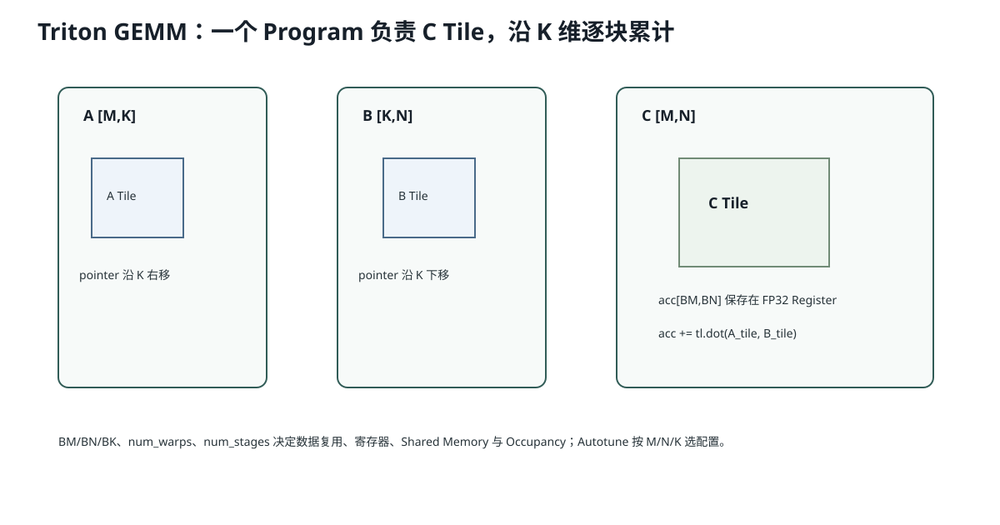

# Lesson 42：Triton Matmul、分块与 Autotune——从 `tl.dot` 到一个可调优 GEMM

> 源码基线：`1d63bca4cf24885a1b15897003e3481db53d8ada`
>
> 当前 AIOS 的 Linear 使用 PyTorch/cuBLAS，只有 KV Scatter 是自定义 Triton。本课不是要求你马上替换 cuBLAS，而是教会你读懂高性能 Triton GEMM：Program 如何负责 C 的一个 Tile、A/B Pointer 怎样沿 K 推进、`num_warps/num_stages` 为什么影响性能，以及 Autotune 为什么必须以真实 Shape 为 Key。



## 1. 大矩阵怎样切成 Tile

```text
A [M,K]
B [K,N]
C [M,N]
```

每个 Triton Program 负责：

```text
C[m0:m0+BM, n0:n0+BN]
```

并沿 K 分块累计：

```text
A_tile [BM,BK]
B_tile [BK,BN]
acc    [BM,BN] FP32
```

伪代码：

```python
for k0 in range(0, K, BK):
    a = A[m_tile, k0:k0+BK]
    b = B[k0:k0+BK, n_tile]
    acc += a @ b
store(acc)
```

## 2. Program ID 怎样映射到 C Tile

```python
pid = tl.program_id(0)
num_pid_n = tl.cdiv(N, BLOCK_N)
pid_m = pid // num_pid_n
pid_n = pid % num_pid_n
```

例如：

```text
M=256, N=384
BM=128, BN=128
num_pid_m=2
num_pid_n=3
总 Program=6
```

```text
pid0 → C tile (0,0)
pid1 → (0,1)
pid2 → (0,2)
pid3 → (1,0)
...
```

## 3. Pointer Block 怎样构造

Row-major：

```math
\operatorname{addr}_A(i,k)
=A+i\cdot stride_{am}+k\cdot stride_{ak}
```

Triton：

```python
offs_m = pid_m * BM + tl.arange(0, BM)
offs_n = pid_n * BN + tl.arange(0, BN)
offs_k = tl.arange(0, BK)

a_ptrs = a_ptr + offs_m[:,None]*stride_am + offs_k[None,:]*stride_ak
b_ptrs = b_ptr + offs_k[:,None]*stride_bk + offs_n[None,:]*stride_bn
```

注意 `a_ptrs` 不是单个地址，而是 `[BM,BK]` 的 Pointer Tensor。

## 4. K 循环为什么只移动 Pointer

```python
for k in range(0, tl.cdiv(K, BK)):
    a = tl.load(a_ptrs, mask=...)
    b = tl.load(b_ptrs, mask=...)
    acc = tl.dot(a, b, acc)
    a_ptrs += BK * stride_ak
    b_ptrs += BK * stride_bk
```

`a_ptrs` 沿 A 的 K 轴右移；`b_ptrs` 沿 B 的 K 轴下移。每轮处理下一个 K Tile。

## 5. 为什么 Accumulator 通常用 FP32

输入可能 BF16/FP16，但 K 维需要大量乘加。直接 16-bit 累加误差更大。

```python
acc = tl.zeros((BM,BN), dtype=tl.float32)
acc = tl.dot(a, b, acc)
```

最终再转输出 dtype。

这和 Tensor Core 混合精度相符：低精度输入、高精度累加。

## 6. BLOCK_M/N/K 如何影响性能

更大 Tile：

- 增加 A/B 复用；
- 降低 Program 数；
- 可能更好利用 Tensor Core；
- 但增加 Register/Shared Memory；
- 降低 Occupancy；
- 对小 Shape 可能浪费。

更小 Tile相反。

所以没有一个 Block Size 对所有 M/N/K 最优。

## 7. `num_warps` 和 `num_stages`

### `num_warps`

控制每个 Triton Program 使用多少 Warp 参与工作。更高可增加并行，但也增加资源占用和同步。

### `num_stages`

常用于软件流水：在计算当前 Tile 时，预取未来 Tile。更多 Stage 可隐藏内存延迟，但需要更多片上存储。

它们都属于编译/Launch 配置，不改变数学结果。

## 8. Autotune 怎样工作

```python
@triton.autotune(
    configs=[
        triton.Config({'BM':64,'BN':64,'BK':32}, num_warps=4),
        triton.Config({'BM':128,'BN':64,'BK':32}, num_warps=8),
    ],
    key=['M','N','K'],
)
```

第一次遇到新 `M/N/K` Key，Triton Benchmark 候选 Config 并缓存最快者。

风险：

- 首次 Autotune 延迟污染用户请求；
- Key 太细导致大量编译/Benchmark；
- Key 太粗可能错误复用；
- 只按 Kernel 时间选，不代表完整系统最优。

生产中通常离线预热常见 Shape，或固定经过验证的 Config。

## 9. Grouped Ordering 为什么改善 L2

简单 Row-major 依次算输出 Tile，可能频繁切换 A/B Tile。Grouped Ordering 让一组相邻 `pid_m` 共享 B Tile 或提高 A/B L2 重用。

它改变 Program 执行顺序，不改变 C 的最终位置。

## 10. 为什么 AIOS 当前不应随意替换 cuBLAS

`F.linear` 的常规 GEMM 已由 cuBLAS/框架长期优化。自写 Triton 更适合：

- 要与 Activation/Quant Dequant 融合；
- 特殊 Layout；
- 很固定的窄 Shape；
- cuBLAS Launch/通用路径不理想；
- Profile 证明存在明确收益空间。

否则可能写出正确但更慢的 Kernel。

## 11. 代码骨架

```python
@triton.autotune(configs=CONFIGS, key=['M','N','K'])
@triton.jit
def matmul_kernel(
    a, b, c,
    M: tl.constexpr, N: tl.constexpr, K: tl.constexpr,
    stride_am, stride_ak,
    stride_bk, stride_bn,
    stride_cm, stride_cn,
    BM: tl.constexpr, BN: tl.constexpr, BK: tl.constexpr,
):
    pid = tl.program_id(0)
    # pid → pid_m / pid_n
    # 构造 A/B Tile Pointer
    acc = tl.zeros((BM, BN), tl.float32)
    for _ in range(0, tl.cdiv(K, BK)):
        a_tile = tl.load(...)
        b_tile = tl.load(...)
        acc = tl.dot(a_tile, b_tile, acc)
        # pointer 沿 K 前进
    tl.store(..., acc, mask=...)
```

README 省略的是重复边界代码，不省略核心运行模型。

## 12. 常见错误理解

### 错误：Block 越大，数据复用越高，所以一定越快

可能因 Register/Shared Memory 过高导致 Occupancy 降低，或小 Shape 浪费大量 Lane。

### 错误：Autotune 找到的配置对所有 GPU 都最优

不同架构、Shared Memory、Tensor Core、频率和 Shape 分布都会改变最优 Config。

### 错误：Triton `tl.dot` 就等于必然使用 Tensor Core 峰值

是否使用高效指令还取决于 dtype、Shape、Layout、版本和编译结果，应以生成代码/Profiler 验证。

## 13. 运行实验

```bash
python resources/lesson-42-triton-matmul-autotune/run_lesson42.py
```

CPU 实验会用 Blocking 算法计算小矩阵，并统计不同 Tile 下 A/B Tile 加载次数；有 Triton 环境时 README 给出可选真实 Benchmark 路径。

## 14. 检验问题与参考答案

### 问题 1：为什么每个 Program 负责一个 C Tile，而不是一个 C 元素？

**参考答案：** 一个 Tile 内多个输出元素可以复用相同 A/B Tile，从 Shared/Register 中完成大量乘加，减少 HBM 重复读取，并适配 Tensor Core 的块状 MMA。

### 问题 2：为什么 K 维需要循环，M/N 常在 Grid 上并行？

**参考答案：** 不同 M/N 输出 Tile 相互独立，可由不同 Program 并行；一个输出 Tile 的每个元素需要对完整 K 做归约，因此同一 Program 沿 K Tile 累加。

### 问题 3：Autotune 为什么不能放任在首个真实输入上随意运行？

**参考答案：** 它会编译并 Benchmark 多个 Config，首次延迟很高，可能污染服务 p95；生产应预热常见 Shape、缓存结果或离线选型。

### 问题 4：为什么 AIOS 的自定义 KV Scatter 比自定义 Linear 更合理？

**参考答案：** KV Scatter 具有 AIOS 特有的随机 Page Layout，通用 `F.linear` 无法表达；Linear 是标准 GEMM，cuBLAS 已高度优化，除非需要特殊融合或 Profile 证明，否则替换风险更高。

## 15. 一句话复述

Triton GEMM 把 C 切为 M×N Tile，每个 Program 沿 K 加载 A/B Tile并用 FP32 累加；Block Size、Warp、Stage 和 Program 顺序共同决定数据复用、Occupancy 和 L2 命中。Autotune 用真实 Shape 选配置，但必须控制首次成本，标准 Linear 不应无证据替换 cuBLAS。

## 16. 一手参考

- Triton Matrix Multiplication Tutorial。
- Triton Persistent Matmul Tutorial。

## 17. 将 Triton Matmul 对应到 AIOS 的真实 Shape Bucket

若未来只为 MiniMind-IME Decode 做专用 Kernel，可以先统计：

```text
QKV:   M∈{1,2,4,8}, N=1280, K=768
GateUp:M∈{1,2,4,8}, N=4096, K=768
Down:  M∈{1,2,4,8}, N=768,  K=2048
```

这比为任意 M/N/K 做无限 Autotune 更可控。可离线为每组常见 Shape 选择 Config，并在启动 Warmup：

```text
compile/cudagraph/autotune
→ 不进入用户第一击 p95
```

但还要与 cuBLAS 实测，因为这些 M 很小，专用 Persistent/GEMV 风格 Kernel可能比通用 GEMM 更合理。

## 18. 为什么 `num_stages` 与 Double Buffering 有关

简化流水：

```text
Stage 0：从 HBM 加载下一个 A/B Tile
Stage 1：Tensor Core 计算当前 Tile
```

若硬件/编译器允许异步 Copy，加载与计算可以重叠。增加 Stage 相当于提前排更多 Tile：

```text
load k+2
load k+1
compute k
```

但每个 Stage 都需要额外 Shared/Register Buffer。Stage 太多会提高资源压力并降低 Occupancy，所以不是越多越好。

## 19. 为什么验证必须包含数值误差

Triton Kernel 可能：

- 输入 BF16/FP16；
- FP32 累加；
- 不同 K Tile 顺序；
- 最终降精度写回。

浮点加法不满足结合律，不同 Tile/归约顺序会产生微小差异。验证应使用：

```python
torch.testing.assert_close(actual, reference, rtol=..., atol=...)
```

而不是逐位相等。同时，对 AIOS 的离散候选排序，还要验证这些误差不会让近平局 Top-1 翻转。
