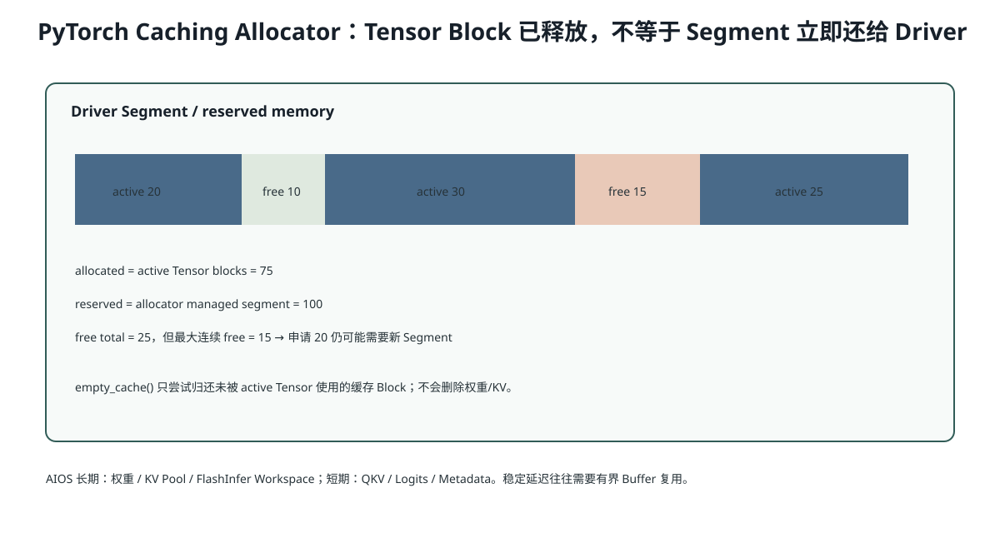

# Lesson 43：CUDA Caching Allocator、碎片与 Peak Memory——`allocated`、`reserved`、`nvidia-smi` 为什么不一样

> 源码基线：`1d63bca4cf24885a1b15897003e3481db53d8ada`
>
> 目标：看懂 AIOS Benchmark 中 `memory_allocated` 与 `memory_reserved`，理解删除 Tensor 后 `nvidia-smi` 为什么不下降、`empty_cache()` 为什么不是“释放当前模型显存”，以及动态 Candidate/Ragged Shape 怎样造成碎片和分配抖动。



## 1. 为什么每次 `torch.empty(..., device='cuda')` 不直接 `cudaMalloc`

`cudaMalloc/cudaFree` 可能带来昂贵同步。PyTorch 使用 Caching Allocator：

```text
第一次申请
→ 向 CUDA Driver 申请较大 Segment
→ 切出 Block 给 Tensor

Tensor 删除
→ Block 回到 PyTorch Free List
→ 通常不立即还给 Driver

下一次相近申请
→ 复用缓存 Block
```

这样避免频繁 Device Synchronization 和 Driver Allocation。

## 2. allocated 与 reserved

### `memory_allocated()`

当前仍被活跃 Tensor 占用的字节。

### `memory_reserved()`

PyTorch Allocator 已从 CUDA Driver 管理的总内存，包括：

```text
活跃 Tensor Block
+ 可复用 Free Block
+ 因切分产生的未使用部分
```

因此通常：

```math
reserved\ge allocated
```

`nvidia-smi` 更接近进程向 Driver 占用的范围，所以常看到 Tensor 已删但数字不下降。

## 3. `empty_cache()` 做什么，不做什么

```python
del tensor
torch.cuda.empty_cache()
```

`empty_cache()` 尝试把未被活跃 Tensor 占用的缓存 Block 还给 Driver，使其他进程可用。

它不能：

- 删除仍被引用的模型权重；
- 释放活跃 KV Cache；
- 增加当前 PyTorch 可用于活跃 Tensor 的“魔法容量”；
- 修复所有碎片；
- 让频繁分配必然更快。

频繁调用反而失去缓存复用优势。

## 4. 什么叫碎片

假设 Allocator 有一个 100 MiB Segment，切成：

```text
20 active | 10 free | 30 active | 15 free | 25 active
```

总 Free=25 MiB，但最大连续块只有 15 MiB；请求 20 MiB 仍不能直接放入，需要新 Segment 或合并相邻 Free。

这就是外部碎片：总空闲足够，但连续块不合适。

还有内部碎片：Allocator 为对齐/Size Class 分配的 Block 大于真实请求。

## 5. AIOS 中哪些内存是长期的

```text
模型 BF16 权重
MHAKVCache._kv_buffer
FlashInfer workspace
RoPE cache
Page Table / Token Pool
持久 Prefix KV Page
```

哪些是短期的：

```text
QKV / MLP 输出
Logits
采样 Tensor
Metadata GPU Tensor
临时候选 Batch
```

高性能 Runtime 通常希望长期 Buffer 初始化一次、短期 Buffer Shape 受控并复用，减少 Allocator 抖动。

## 6. Benchmark 为什么先加载再 reset peak

AIOS `bench_ime.py`：

```python
llm = LLM(...)
torch.cuda.synchronize()
load_allocated = torch.cuda.memory_allocated()
load_reserved = torch.cuda.memory_reserved()

# warmup...
torch.cuda.reset_peak_memory_stats()
# measured runs...
peak_allocated = torch.cuda.max_memory_allocated()
```

这样区分：

```text
模型加载基线
vs
请求阶段额外峰值
```

如果在模型加载前 reset，然后报告总峰值，就无法知道 Runtime 增量来自权重还是候选/KV/Workspace。

## 7. `reserved - allocated` 很大一定是内存泄漏吗

不一定，可能是：

- Caching Allocator 为未来复用保留；
- 不同 Shape 产生 Size Class；
- Graph Memory Pool；
- 已释放 Tensor Block 尚未还给 Driver。

真正泄漏更接近：

```text
同一固定请求反复运行
→ active allocated 持续单调上升
→ reset 后 KV Page 也未回收
→ Python 引用/资源所有权未终结
```

需要结合 `memory_summary()`、`memory_snapshot()`、对象生命周期与 Page Counter。

## 8. PyTorch 看不到所有 GPU 内存

`memory_snapshot()` 只追踪 PyTorch Allocator 管理的分配。以下可能在外部：

```text
NCCL
某些 CUDA Library 内部 Workspace
Driver Context
非 PyTorch 自定义 cudaMalloc
```

所以：

```text
nvidia-smi usage
- torch reserved
```

不一定是泄漏。

## 9. 动态 Shape 为什么会加剧抖动

Ragged Candidate Decode：

```text
8 rows → 6 → 4 → 1
```

若每一步创建不同 Shape 临时 Tensor，Allocator 会维护多个 Size Class。CUDA Graph 又要求固定地址，推动 Runtime 使用静态 Bucket Buffer：

```text
batch 1 buffer
batch 2 buffer
batch 4 buffer
batch 8 buffer
```

这会提高长期 reserved，却减少运行时分配、地址变化和 Launch 抖动。

它是“用可预测常驻内存换稳定延迟”。

## 10. 代码：简化缓存分配模拟

```python
class Pool:
    def __init__(self, size):
        self.blocks = [(0, size, False)]  # start,size,active

    def allocate(self, size):
        # 找第一个足够 Free Block，切分
        ...

    def free(self, start):
        # 标记 free 并合并相邻 block
        ...
```

实验会构造“总 Free 足够但最大连续块不足”的场景。

## 11. 实际排错命令

```python
print(torch.cuda.memory_allocated() / 2**20)
print(torch.cuda.memory_reserved() / 2**20)
print(torch.cuda.memory_summary())

torch.cuda.memory._record_memory_history()
# 运行 workload
torch.cuda.memory._dump_snapshot('snapshot.pickle')
```

Snapshot 只能解释 PyTorch Allocator 可见部分。

## 12. 常见错误理解

### 错误：`del tensor` 后 `nvidia-smi` 不降，所以 Tensor 没释放

Tensor Block 可能已回到 PyTorch Cache，但 Segment 未还给 Driver。

### 错误：每轮请求都 `empty_cache()` 可以防 OOM

可能使 Allocator 失去复用、增加同步和分配成本；应先解决活跃内存、碎片和 Shape 生命周期。

### 错误：`reserved - allocated` 全部是浪费

其中很多是可立即复用的缓存 Block，用于降低后续分配延迟。

## 13. 运行实验

```bash
python resources/lesson-43-cuda-memory-allocator/run_lesson43.py
```

CPU 模拟会展示 Block Split/Merge 和碎片；有 CUDA 时可选分支打印 PyTorch `allocated/reserved/peak`。

## 14. 检验问题与参考答案

### 问题 1：为什么 PyTorch 不在 Tensor 删除时立即 `cudaFree`？

**参考答案：** `cudaFree` 可能触发同步且 Driver 分配昂贵。Caching Allocator 把 Block 留在进程池中供相近的后续请求复用，降低延迟。

### 问题 2：`reserved` 很高但 `allocated` 下降说明什么？

**参考答案：** 活跃 Tensor 已释放一部分，但 PyTorch 仍管理这些 Segment/Free Block，未来可复用；不能仅据此断言泄漏。

### 问题 3：为什么 CUDA Graph 常让 reserved memory 增加？

**参考答案：** Graph Replay 需要固定地址，通常要为不同 Bucket 保留静态输入、输出和 Graph Memory Pool；它牺牲动态内存弹性来减少分配和 Launch 抖动。

### 问题 4：如何更可靠判断 AIOS KV 泄漏？

**参考答案：** 固定输入反复运行，观察 active allocated 是否持续增长，同时检查 CacheManager/Page Counter；`reset_prefix_cache()` 后应恢复全部 Page。Allocator reserved 单独不能证明泄漏。

## 15. 一句话复述

PyTorch Caching Allocator 把 Driver Segment 切成 Tensor Block并缓存复用，因此 `allocated`、`reserved` 和 `nvidia-smi` 本来就不同。AIOS 应区分长期权重/KV/Workspace与短期 Tensor，使用峰值、Snapshot 和 Page 生命周期共同排查，而不是频繁 `empty_cache()`。

## 16. 一手参考

- PyTorch CUDA Semantics：Memory Management。
- PyTorch Understanding CUDA Memory Usage。

## 17. 为什么 `max_memory_allocated` 要在正确位置 Reset

错误做法：

```text
程序启动后 reset peak
→ 加载模型
→ Warmup/JIT
→ Benchmark
→ 报一个混合峰值
```

它无法区分模型常驻和请求增量。

更清晰的报告：

```text
after_model_load_allocated
benchmark_peak_allocated（Warmup 后 reset）
benchmark_peak_reserved
```

还应固定是否保留 Prefix Cache；否则一个版本在结束时保留 Prefix Page、另一个版本 reset，显存口径不一致。

## 18. Python 引用怎样造成真正的 Active Leak

例如把每次 Logits 保存到列表：

```python
history.append(logits)
```

即使函数结束，列表仍持有 Tensor 引用，`allocated` 会持续增长。常见隐式引用：

- Closure；
- 全局 Cache；
- 异常对象保留 Traceback 局部变量；
- Debug 结果列表；
- 未清理的 Future/Callback。

排查时应查看 Python 生命周期，而不仅是 Allocator Block。

## 19. Workspace 为什么不是“浪费显存”

FlashInfer Workspace 是算法的可复用临时存储。预先分配：

- 避免每层/每步重复申请；
- 提供稳定地址；
- 降低 Allocator 和 Graph 复杂度；
- 允许 Kernel 使用高效临时布局。

它增加常驻 reserved/allocated，但可能降低尾延迟。正确问题不是“能否删除所有 Workspace”，而是：

```text
最小安全大小是多少？
不同上下文/Batch Profile 需要多少？
是否在固定门禁下改善 p95？
```
