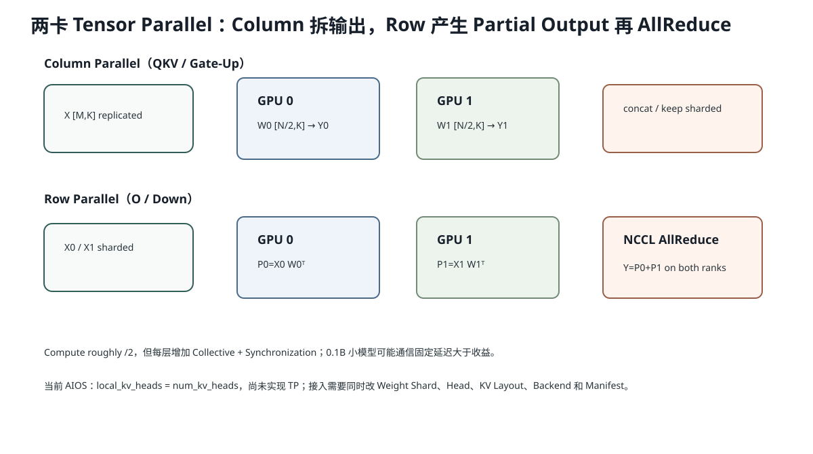

# Lesson 44：Tensor Parallel 与 NCCL——把一个 Transformer Layer 拆到多张 GPU 会发生什么

> 源码基线：`1d63bca4cf24885a1b15897003e3481db53d8ada`
>
> 当前 AIOS **没有实现 Tensor Parallel**；MiniMind-IME 0.1B 单张 4080 Laptop 已能部署，本课是后续扩展教材。目标是理解 Column Parallel、Row Parallel、AllReduce/AllGather、Head 切分与通信成本，而不是宣称多 GPU 会让当前小模型更快。



## 1. 为什么需要 Tensor Parallel

当单层权重或 KV/激活无法放进一张 GPU，或单卡算力不足以满足目标延迟时，可以把一个 Layer 的矩阵乘法拆到多张 GPU 同时执行。

这与 Pipeline Parallel 不同：

```text
Tensor Parallel：同一层内部拆矩阵
Pipeline Parallel：不同层放不同 GPU
```

## 2. Column Parallel Linear

Linear：

```math
Y=XW^T
```

Weight：

```text
W [N,K]
```

沿输出行 N 切两份：

```text
GPU0: W0 [N/2,K]
GPU1: W1 [N/2,K]
```

各自：

```text
Y0 = X @ W0^T [M,N/2]
Y1 = X @ W1^T [M,N/2]
```

完整结果：

```text
Y = concat(Y0,Y1, dim=-1)
```

若后续算子也能按相同分片消费，暂时不必 AllGather。

适合：

```text
QKV Projection
Gate-Up Projection
```

因为它们输出可以按 Head/Intermediate Channel 分片继续计算。

## 3. Row Parallel Linear

沿输入列 K 切：

```text
W0 [N,K/2]
W1 [N,K/2]
X0 [M,K/2]
X1 [M,K/2]
```

各 GPU 得到 Partial Output：

```math
P_0=X_0W_0^T
```

```math
P_1=X_1W_1^T
```

完整：

```math
Y=P_0+P_1
```

需要跨 GPU Sum，也就是 AllReduce（或 ReduceScatter，取决于后续 Layout）。

适合：

```text
Attention O Projection
MLP Down Projection
```

这正好与前面的 Column Parallel 成对：

```text
Column QKV → local Attention heads → Row O → AllReduce
Column GateUp → local SwiGLU → Row Down → AllReduce
```

## 4. MiniMind 两卡 Shape 手算

当前：

```text
Q heads = 12
KV heads = 4
head_dim = 64
```

两卡均分：

```text
每卡 Q heads = 6
每卡 KV heads = 2
```

本地 Q/K/V 输出：

```text
Q local width = 6×64 = 384
K local width = 2×64 = 128
V local width = 128
```

每卡 fused QKV Weight：

```text
[384+128+128, 768] = [640,768]
```

Head 数必须能被 TP Degree 整除，或者实现更复杂的不均匀布局。

## 5. NCCL Collective 是什么

NCCL 为多 GPU 提供 Collective：

- AllReduce：所有 Rank 输入做 Sum/Max 等，每个 Rank 得到完整结果；
- AllGather：每个 Rank 提供一段，所有 Rank 得到拼接结果；
- ReduceScatter：先 Reduce，再把结果分片给各 Rank；
- AllToAll：各 Rank 互相发送不同 Chunk。

所有 Rank 必须以匹配的 Count、dtype 和调用顺序参与；某个 Rank 少调用一次可能导致 Hang、Crash 或数据错误。

## 6. 为什么 TP 不会线性加速

两卡每卡只算约一半 GEMM，但每层增加通信：

```text
O Projection 后 AllReduce
Down Projection 后 AllReduce
可能的 Logits/Embedding Gather
```

总时间：

```math
T_{tp}
\approx
T_{compute}/p
+T_{communication}
+T_{sync}
```

对 0.1B、小 Batch Decode：

- 单卡 GEMM 已很短；
- 通信固定延迟可能高于省下的计算；
- 两卡还增加调度、内存和故障复杂度。

所以当前项目不实现 TP 是合理边界。

## 7. 通信量怎样估算

假设 Row Parallel 输出：

```text
[M,N] BF16
```

每层需要对整个输出做 AllReduce。数据体积：

```math
B=M\times N\times2\text{ bytes}
```

Decode `M=8,N=768`：

```math
8\times768\times2=12,288\text{ bytes}=12\text{ KiB}
```

数据不大，但小 Collective 的固定延迟可能占主导。

Prefill M=128：

```math
128\times768\times2=192\text{ KiB}
```

体积增加，但计算也显著增加，更可能摊薄通信。

## 8. 为什么可以重叠通信与计算

若后续没有立即依赖完整结果，可以在独立 CUDA Stream 发起 NCCL Collective，同时执行其他本地工作。

但 Transformer 的 O/Down 输出通常是下一 Residual 的直接输入，依赖紧密，重叠空间有限。更高级方案会使用：

- ReduceScatter + Sequence Parallel；
- Async Collective；
- 通信分块；
- 与下一层部分计算重叠。

这需要精确 Stream/Event 依赖，否则可能读到未完成数据。

## 9. 当前 AIOS 源码留下的边界

`MHAKVCache`：

```python
local_kv_heads = num_kv_heads  # Tensor parallelism is introduced later.
```

这说明当前每张 GPU 假设拥有全部 KV Heads。未来 TP 需要修改：

```text
ModelConfig 的 global/local head
权重加载 shard
QKV fused layout
KV Cache local head shape
Attention backend local heads
LM Head/Embedding shard
NCCL communicator 与 stream
Checkpoint Manifest
```

不是只把 `local_kv_heads //= 2`。

## 10. 代码：两卡数学模拟

```python
# Column parallel
W0, W1 = split_rows(W)
Y0 = X @ W0.T
Y1 = X @ W1.T
Y = concatenate([Y0, Y1], axis=-1)

# Row parallel
X0, X1 = split_cols(X)
W0, W1 = split_cols(W)
P0 = X0 @ W0.T
P1 = X1 @ W1.T
Y = P0 + P1  # AllReduce(sum)
```

CPU 实验会验证与完整 Linear 数值一致。

## 11. Tensor Parallel 与 CandidateGroup 的关系

CandidateGroup 是同一 GPU 上 Batch 维并行：

```text
8 个候选 Row
```

Tensor Parallel 是每个 Row 的 Hidden/Head/Intermediate 维跨 GPU 分片。

二者可以组合：

```text
Batch 8 CandidateGroup
×
TP 2 GPUs
```

但当前 0.1B 场景很可能通信成本大于收益。

## 12. 常见错误理解

### 错误：两张 GPU 就把模型速度提高 2 倍

每层都增加 Collective 和同步，尤其小模型/小 Batch 时固定通信延迟突出。

### 错误：Column Parallel 每层都必须立刻 AllGather

若后续 Attention/Activation 能直接消费本地分片，可以延迟 Gather；布局设计正是 TP 性能核心。

### 错误：NCCL AllReduce 只是 CPU 把两个 Tensor 相加

它是 GPU 间 Collective，通常在 CUDA Stream 上执行，并根据互联拓扑使用 Ring/Tree 等算法。

## 13. 运行实验

```bash
python resources/lesson-44-tensor-parallel-nccl/run_lesson44.py
```

它会用 NumPy 模拟 Column/Row Parallel，验证与完整 Linear 一致，并用带宽+延迟模型估算何时通信超过本地计算。

## 14. 检验问题与参考答案

### 问题 1：为什么 QKV 更适合 Column Parallel，O Projection 更适合 Row Parallel？

**参考答案：** QKV 的输出 Head 可以按输出维分片，各 GPU 独立完成本地 Head Attention；O Projection 的输入已按 Head 分片，沿输入维计算 Partial Output 后需要 Sum，正对应 Row Parallel + AllReduce。

### 问题 2：为什么 TP Degree 必须考虑 KV Head 数？

**参考答案：** KV Cache 和 Attention Backend 按本地 KV Head 布局存储/计算。若 4 个 KV Head 分到 3 卡无法均匀切分，就需要复制或不均匀布局，增加实现和通信复杂度。

### 问题 3：为什么 0.1B AIOS-IME 当前不适合优先做 TP？

**参考答案：** 模型单卡可放下，Decode GEMM 很短；TP 增加每层 Collective 和同步固定延迟，可能比减半计算更昂贵。应先 Profile 并优先做单卡 Launch、Memory、Graph 等优化。

### 问题 4：AllReduce 的 Rank 调用不匹配为什么会 Hang？

**参考答案：** Collective 是所有 Rank 共同组成的一次通信协议；每个 Rank 必须对同一 Count/dtype 按一致顺序参与。若某个 Rank 进入另一个 Collective 或未调用，其他 Rank 会等待不存在的伙伴。

## 15. 一句话复述

Tensor Parallel 在同一层内切矩阵：Column Parallel 拆输出并保留本地分片，Row Parallel 产生 Partial Output并用 NCCL AllReduce 求和。它能突破单卡容量和算力，但每层通信使小模型不一定更快；AIOS 当前没有实现 TP，未来需要同时改权重、Head、KV、Backend、Collective 和 Manifest。

## 16. 一手参考

- NVIDIA NCCL Collective Operations。
- PyTorch Tensor Parallel / DTensor 文档（当前 API 仍标为实验性）。

## 17. AllReduce、ReduceScatter 与 AllGather 的布局关系

一个完整 AllReduce 可以概念拆成：

```text
ReduceScatter
→ 每个 Rank 得到求和结果的一段
→ AllGather
→ 每个 Rank 得到完整结果
```

若下一算子能够继续消费分片结果，就可以只做 ReduceScatter，避免立刻 AllGather；这正是 Sequence Parallel 等布局优化的来源。

例如 Norm 可在 Sequence 维分片上局部处理部分操作，但涉及全 Hidden 统计的算子还需匹配通信设计。布局一旦改变，Residual、Dropout、Position 和 KV 所有权都需同步推导。

## 18. Ring AllReduce 的粗略直觉

P 个 Rank 的 Ring AllReduce 通常分为：

```text
ReduceScatter：P-1 步
AllGather：P-1 步
```

每步只发送一个 Chunk。大消息时能较好利用链路带宽；小消息时每一步固定延迟突出。

这解释为什么 Decode 的 12 KiB Collective 可能很不划算：数据很小，通信协议和同步的固定延迟占比高。

## 19. 多 GPU 还会改变故障与取消语义

单 GPU latest-wins 只需取消一个 CandidateGroup。TP 后一次 Generation 同时占用多个 Rank：

```text
所有 Rank 必须观察同一 generation identity
所有 Rank 必须以一致顺序退出 Collective
任何 Rank 异常都可能让其他 Rank 等待
KV Page/Slot 必须跨 Rank 对齐释放
```

所以 TP 不只是 Linear Shard，还需要分布式控制面、错误传播、Communicator Abort 与恢复策略。当前本地 0.1B 产品没有理由提前承担这套复杂度。
