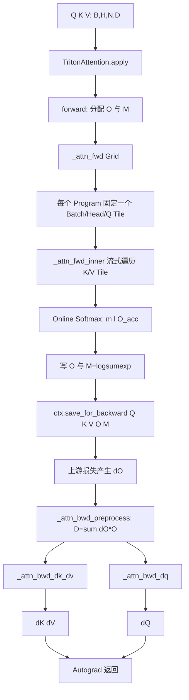
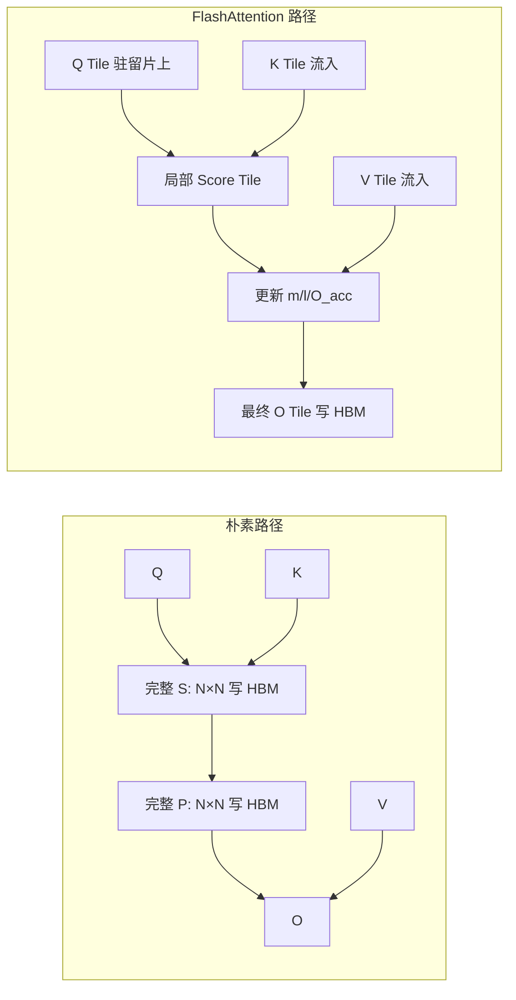

# Lesson 45：Triton FlashAttention 源码总览——一个文件怎样串起前向、反向与 Autograd

> 上游仓库：[`hkproj/triton-flash-attention`](https://github.com/hkproj/triton-flash-attention)
>
> 固定上游源码基线：`296ee44c8a238cd2192d13e22e9082251f1c1289`
>
> 上游声明环境：`torch==2.4.0`、`triton==3.0.0`。本专题按这个历史环境解释代码；当前 Triton/PyTorch API 可能已经演进，不能把“今天能安装的最新版”与“这份源码的可复现环境”混成一件事。
>
> AIOS 接入前基线：`c98217df12eaf6a4f6428ff709b5d5dce69429e7`（`main`）。前置课程：Lesson 41 Online Softmax、Lesson 42 Triton Matmul。

这套源码的价值不在于“又一个可直接替换生产库的 FlashAttention 包”，而在于它把 FlashAttention 2 的关键机制压缩进一个约七百行的 Python 文件：前向 Tile、Online Softmax、因果掩码、反向重算、`dQ/dK/dV` 两种工作划分，以及 `torch.autograd.Function` 封装都能沿同一条调用链读完。

本课先建立全局地图。后续五课分别下钻前向、布局与因果阶段、反向数学、反向 Kernel、验证与 AIOS 边界。

---

## 1. 学完本课应该能回答什么

1. 上游仓库里的每个文件解决什么问题？
2. `TritonAttention.apply()` 到底会启动哪些 Kernel？
3. 为什么朴素 Attention 会物化 `[B,H,N,N]`，而 FlashAttention 不需要？
4. 一个 Triton Program 负责哪一片 Query？
5. 为什么这份代码适合学习，却不能不经审计直接替换 AIOS 的 FlashInfer Paged Attention？

---

## 2. 仓库不是“大型框架”，而是一条紧凑教学链

固定提交的核心树如下：

```text
triton-flash-attention/
├── README.md
├── triton/
│   ├── requirements.txt       # torch 2.4.0 / triton 3.0.0
│   └── flash_attention.py     # 前向、反向、Autograd、正确性对照
├── cuda/
│   ├── vector_add*.cu         # CUDA 入门示例
│   └── matrix_add.cu
└── notes/
    ├── Multi Head Attention
    ├── Safe / Online Softmax
    ├── Block Matrix Multiplication
    ├── GPU & CUDA / Tensor Layouts / Pipeline
    └── Autograd 与梯度
```

真正实现 FlashAttention 的代码集中在：

```text
triton/flash_attention.py
```

它的主要符号是：

| 符号 | 责任 | 主要输出 |
|---|---|---|
| `_attn_fwd_inner` | 固定一个 Q Tile，流式遍历 K/V Tile | 更新 `O_block / l_i / m_i` |
| `_attn_fwd` | 建立 Grid、Block Pointer、Causal Stage | `O` 与 `M=LSE` |
| `_attn_bwd_preprocess` | 计算每行 `D = sum(dO * O)` | `[B,H,N]` 的 `D` |
| `_attn_bwd_dq` | 固定 Q Tile，遍历 K/V | `dQ` |
| `_attn_bwd_dk_dv` | 固定 K/V Tile，遍历 Q | `dK`、`dV` |
| `TritonAttention.forward` | 分配输出、Launch 前向、保存反向状态 | `O` |
| `TritonAttention.backward` | Launch 三个反向阶段 | `dQ,dK,dV` |
| `test_op` | 朴素 PyTorch 对照 + 梯度比对 | 断言正确性 |

源码阅读时不要从第一行一路机械往下抄。更好的顺序是：

```text
TritonAttention.forward
→ _attn_fwd
→ _attn_fwd_inner
→ TritonAttention.backward
→ _attn_bwd_preprocess
→ _attn_bwd_dq / _attn_bwd_dk_dv
→ test_op
```

这是“调用因果链”，比文件中的物理顺序更接近运行时。

---

## 3. 一次调用的完整执行图



这里有两个必须先建立的判断：

- 前向不保存完整概率矩阵 `P`；只保存输出 `O` 和逐 Query 的 `M=LSE`。
- 反向会重新计算局部 `QK^T` 与 `P`，用额外 FLOPs 换取大幅减少 HBM 中间 Tensor。

这不是“忘记缓存”，而是 FlashAttention 的核心取舍。

---

## 4. 输入合同：四维 Tensor 的每一维都不能含糊

源码采用：

```text
Q.shape = K.shape = V.shape = [BATCH_SIZE, NUM_HEADS, SEQ_LEN, HEAD_DIM]
```

记作：

```text
B：Batch 数
H：Head 数
N：序列长度
D：每个 Head 的维度
```

单个 Batch、单个 Head 的注意力是：

```math
S = QK^T \cdot s,
\qquad s=\frac{1}{\sqrt D}
```

```math
P = \operatorname{softmax}(S)
```

```math
O = PV
```

Shape 变化：

```text
Q [N,D]
K [N,D] → K^T [D,N]
S [N,N]
P [N,N]
V [N,D]
O [N,D]
```

多 Batch、多 Head 只是把这套计算复制到 `[B,H]` 的每个索引上。

### 4.1 Stride 不是“实现细节”

连续 `[B,H,N,D]` 的元素 Stride 是：

```text
stride_D = 1
stride_N = D
stride_H = N*D
stride_B = H*N*D
```

地址公式：

```math
\operatorname{offset}(b,h,n,d)
=b\cdot stride_B+h\cdot stride_H+n\cdot stride_N+d\cdot stride_D
```

后续 Lesson 47 会看到，上游前向代码虽然接收 Q/K/V 各自的 Stride，却使用 Q 的 Batch/Head Stride 计算三者共同的 `qvk_offset`。因此它隐含要求三者拥有相同 Batch/Head 布局。测试数据都是连续同形 Tensor，所以没有暴露这个约束。

这类“代码能跑，但合同没有显式断言”的地方，正是源码带读最应该指出的内容。

---

## 5. 朴素 Attention 为什么会突然吃掉数 GiB

朴素实现通常写成：

```python
scores = Q @ K.transpose(-2, -1) * scale   # [B,H,N,N]
prob = torch.softmax(scores.float(), -1)   # [B,H,N,N]
out = prob.to(Q.dtype) @ V                 # [B,H,N,D]
```

上游默认测试参数是：

```text
B=8, H=16, N=4096, D=64
```

一个 `[B,H,N,N]` Tensor 的元素数：

```math
8\times16\times4096^2
=2,147,483,648
```

只算一个 Tensor：

```text
FP16：2,147,483,648 × 2 bytes = 4 GiB
FP32：2,147,483,648 × 4 bytes = 8 GiB
```

实际执行还可能同时存在：

```text
score
float32 softmax 临时量
probability
mask / backward graph saved tensors
```

所以仓库 README 才提醒，朴素实现可能成为瓶颈。这里不能把“脚本默认参数”误解为“适合任何显卡的冒烟测试”。

### 5.1 FlashAttention 改变的是中间结果的驻留位置



FlashAttention 仍然计算允许区域内的 `QK^T`，所以标准全注意力的 FLOPs 仍是二次量级。它主要避免把完整 `S/P` 长期物化到 HBM。

---

## 6. 一个 Triton Program 到底负责什么

前向 Grid 的教学化表达是：

```python
grid = (
    ceil_div(SEQ_LEN, BLOCK_SIZE_Q),
    BATCH_SIZE * NUM_HEADS,
    1,
)
```

两个主要 Program ID：

```text
program_id(0) → 第几个 Query Tile
program_id(1) → 展平后的 Batch×Head
```

展开 Batch/Head：

```python
index_batch = index_batch_head // NUM_HEADS
index_head = index_batch_head % NUM_HEADS
```

例如：

```text
B=1, H=2, N=16, BLOCK_Q=4
```

Grid 前两维是：

```text
(4, 2)
```

Program 分工：

```text
(pid_q=0, pid_bh=0) → batch0/head0/query0:4
(pid_q=0, pid_bh=1) → batch0/head1/query0:4
(pid_q=1, pid_bh=0) → batch0/head0/query4:8
...
```

一个 Program：

- 把一个 `Q_block [BLOCK_Q,D]` 留在片上；
- 顺序读取若干 `K_block [D,BLOCK_KV]`；
- 顺序读取对应 `V_block [BLOCK_KV,D]`；
- 维护该 Q Tile 每一行的 `m_i / l_i / O_block`；
- 最后只写 `O_block` 和逐行 `M`。

这就是源码的主抽象：**固定 Query Tile，流式扫描 Key/Value Tile。**

---

## 7. 教学化代码骨架：先看职责，不先陷入指针细节

下面不是对上游源码的逐字复制，而是保持机制一致的教学化骨架：

```python
class TeachingAttention(torch.autograd.Function):
    @staticmethod
    def forward(ctx, q, k, v, causal, scale):
        out = empty_like(q)
        lse = empty([B, H, N], fp32)

        launch_forward_kernel(
            q=q,
            k=k,
            v=v,
            out=out,
            lse=lse,
            causal=causal,
            scale=scale,
        )

        ctx.save_for_backward(q, k, v, out, lse)
        ctx.causal = causal
        ctx.scale = scale
        return out

    @staticmethod
    def backward(ctx, d_out):
        q, k, v, out, lse = ctx.saved_tensors
        delta = preprocess_delta(out, d_out)
        d_k, d_v = backward_kv(q, k, v, d_out, lse, delta)
        d_q = backward_q(q, k, v, d_out, lse, delta)
        return d_q, d_k, d_v, None, None
```

需要读懂的不是类语法，而是资源生命周期：

```text
Forward 产生 O/LSE
→ 保存到 ctx
→ Backward 收到 dO
→ 用 Q/K/V/O/LSE 重算局部 P
→ 返回与 forward 输入一一对应的梯度
```

`causal` 与 `scale` 不是 Tensor，因此反向返回 `None`。

---

## 8. 为什么前向只保存 `O` 与 `LSE` 就够了

对一行 Score `s_i`：

```math
\operatorname{LSE}(s_i)
=\log\sum_j e^{s_{ij}}
```

若前向保存：

```text
M_i = LSE(s_i)
```

反向重算局部 Score 后，可以恢复概率：

```math
P_{ij}=e^{S_{ij}-M_i}
```

因果 Mask 位置仍设为零。

这意味着不需要保存 `[N,N]` 的 `P`，只需保存 `[N]` 的 `M`。对于所有 Batch/Head：

```text
P: [B,H,N,N]
M: [B,H,N]
```

存储量从关于 `N²` 的中间矩阵降到关于 `N` 的统计量，再配合反向 Tile 重算。

---

## 9. 这份实现明确支持什么

从固定提交可以确认：

- Q/K/V 都采用 `[B,H,N,D]`；
- 支持 `causal=True/False`；
- 前向有基于 `N` 与 `D` 的 Triton Autotune；
- 反向计算 `dQ/dK/dV`；
- 用 PyTorch 朴素 Attention 做输出与梯度对照；
- 默认测试使用 FP16、`D=64`、`N=4096`。

## 10. 不能从这份代码自动推断什么

没有证据表明固定提交已经完整支持：

- Ragged/Varlen Batch；
- Paged KV Cache；
- Decode 时 `Q_LEN=1` 的专用路径；
- GQA/MQA 的 Query Head 与 KV Head 映射；
- Dropout、ALiBi、Sliding Window；
- 任意非连续 Q/K/V 布局；
- 任意 `SEQ_LEN` 尾块；
- 任意 `HEAD_DIM`；
- AMD 路径；
- 生产级错误处理、版本矩阵与持续 Benchmark。

另外，固定树没有提供明确 License 文件。本课程因此只嵌入必要的小片段和教学化伪代码，不复制分发完整上游源码；需要运行时应直接固定上游提交。

---

## 11. 它与 AIOS 当前 Attention 路径是什么关系

AIOS 当前面向本地输入法推理，真实困难是：

```text
Varlen 请求
Paged KV
短 Query / 长历史
Continuous Batching
GQA/Head 映射
取消、Page 生命周期、latest-wins
```

AIOS 通过 FlashInfer Wrapper 接入 Paged Prefill/Decode Kernel。上游这个教学实现面向连续 `[B,H,N,D]` 的训练型前向与反向，没有 Page Table。

所以正确结论是：

```text
这套教材用于理解 Attention Kernel 的底层机制
≠ 现在就把 AIOS 的 FlashInfer 替换掉
```

它对 AIOS 的直接价值有三层：

1. 读懂 FlashInfer/FA2 Backend 背后的 Online Softmax 与 Tile 思维；
2. 学会审计 Stride、Grid、Mask、Autotune、Backward 的代码合同；
3. 为未来连续 Prefill 实验或自定义融合 Kernel 建立可验证模板。

---

## 12. 安全运行顺序

不要第一步就运行上游默认的 `8×16×4096×64` 朴素对照。建议：

```text
第一步：运行本课 CPU 实验，确认显存估算与 Grid 映射
第二步：在固定 torch/triton 环境中改成 B=1,H=2,N=128,D=64
第三步：分别验证 causal=False / True
第四步：再增加 N，记录朴素参考与 Triton 路径的峰值显存
第五步：关闭朴素参考后，单独探索 FlashAttention 可承受的长 N
```

GPU 冒烟参数示意：

```python
test_op(
    BATCH_SIZE=1,
    NUM_HEADS=2,
    SEQ_LEN=128,
    HEAD_DIM=64,
    causal=True,
)
```

注意：这只是降低 OOM 风险，不代表当前机器与当前 Triton 版本一定兼容固定提交。

---

## 13. 运行本课代码实验

```bash
python resources/lesson-45-triton-flash-attention-overview/run_lesson45.py
```

实验不需要 CUDA，会完成三件事：

1. 算出上游默认朴素 `[B,H,N,N]` 的 FP16/FP32 存储；
2. 给出较安全的教学冒烟 Shape；
3. 展示 `grid=(ceil(N/BQ),B*H,1)` 的前几个 Program 分工。

它验证的是机制与数量级，不冒充真实 GPU 性能结果。

---

## 14. 常见错误理解

### 错误 1：仓库只有一个 Python 文件，所以实现很简单

文件少不等于机制少。它同时编码了数值稳定、片上 Tile、指针布局、因果区域拆分、工作划分、反向重算和 Autograd 合同。真正难点是这些约束彼此一致。

### 错误 2：FlashAttention 把计算复杂度从 `O(N²)` 变成了 `O(N)`

标准精确全注意力仍需计算允许区域的成对 Score，FLOPs 仍是二次量级。线性下降主要发生在不再物化完整 `S/P` 的额外存储与 HBM IO。

### 错误 3：默认测试参数就是推荐冒烟参数

上游默认朴素参考单个 FP32 `[B,H,N,N]` 就是 8 GiB，还不含其他临时量。它更像高配机器上的最终检查，不是普遍安全的第一步。

### 错误 4：能通过连续 Tensor 测试，就说明任意 Stride 都支持

不成立。前向 Batch/Head Base Offset 隐含 Q/K/V 同布局，且尾块没有通用边界 Mask。测试只覆盖了合同的一部分。

### 错误 5：理解这份 Kernel 后就应该替换 AIOS 的 FlashInfer

AIOS 需要 Paged KV、Varlen、Decode、GQA 等 Serving 能力。这份连续训练 Attention 教学实现没有提供这些合同，直接替换会丢失系统能力。

---

## 15. 练习题：检验问题与参考答案

### 问题 1：为什么源码阅读应从 `TritonAttention.forward` 开始，而不是 `_attn_fwd_inner`？

**参考答案：** `forward` 先给出输入合同、输出分配、Grid Launch、保存哪些反向状态以及 `causal/scale` 的生命周期。知道主调用链后，再读 inner 才能判断每个局部变量服务于哪个全局目标；直接从 inner 开始容易把公式看懂，却不知道它何时被调用、结果写到哪里。

### 问题 2：上游默认 Shape 下，一个 FP16 `[B,H,N,N]` 为什么是 4 GiB？

**参考答案：** 元素数为 `8×16×4096×4096=2,147,483,648`，FP16 每元素 2 字节，共 `4,294,967,296` 字节，即 4 GiB。若转 FP32 则单个 Tensor 为 8 GiB。

### 问题 3：前向保存 `M=LSE` 而不保存 `P`，反向怎样恢复概率？

**参考答案：** 反向按 Tile 重算 `S=scale·QK^T`，再用 `P=exp(S-M[:,None])` 恢复归一化概率；Mask 区域置零。`M` 每个 Query 只需一个标量，而完整 `P` 每个 Query 需要 N 个值。

### 问题 4：一个前向 Triton Program 的稳定所有权是什么？

**参考答案：** 它固定一个 Batch、一个 Head、一个 Query Tile。Q Tile 与 `m/l/O_acc` 留在片上，Program 流式遍历这个 Head 的 K/V Tile，最终只写该 Query Tile 对应的 O 与 LSE。

### 问题 5：为什么该实现不能直接视作 AIOS Paged Decode Backend？

**参考答案：** 它假设连续 `[B,H,N,D]`，没有 Page Table、Varlen Metadata、GQA 映射和 `Q_LEN=1` 专用调度；AIOS 当前 Attention 还必须与 Page 生命周期、Continuous Batching 和取消语义协作。算法思想相通，运行时合同不同。

### 问题 6：固定版本为什么是课程事实的一部分？

**参考答案：** Triton 编译器、API、生成代码和硬件支持会演进。同一源文件在不同 Triton/PyTorch 版本上可能编译失败、性能不同或数值路径改变。课程必须把“上游代码提交”和“声明依赖版本”一起固定，避免把版本漂移误判为算法错误。

---

## 16. 一句话复述

`hkproj/triton-flash-attention` 用一个紧凑文件把 FlashAttention 2 的前向 Tile、Online Softmax、LSE 保存、反向重算与 `dQ/dK/dV` 工作划分串成完整 Autograd 路径；它是极好的 Kernel 教材，但连续训练 Attention 的合同与 AIOS 的 Paged Serving Attention 不能混为一谈。

---

## 17. 一手参考

- [固定上游提交](https://github.com/hkproj/triton-flash-attention/tree/296ee44c8a238cd2192d13e22e9082251f1c1289)
- [固定提交中的核心源码](https://github.com/hkproj/triton-flash-attention/blob/296ee44c8a238cd2192d13e22e9082251f1c1289/triton/flash_attention.py)
- [Triton Fused Attention 官方教程](https://triton-lang.org/main/getting-started/tutorials/06-fused-attention.html)
- [FlashAttention 原论文](https://arxiv.org/abs/2205.14135)
- [FlashAttention-2 论文](https://arxiv.org/abs/2307.08691)
- [PyTorch `torch.autograd.Function.forward` 文档](https://docs.pytorch.org/docs/stable/generated/torch.autograd.Function.forward.html)
