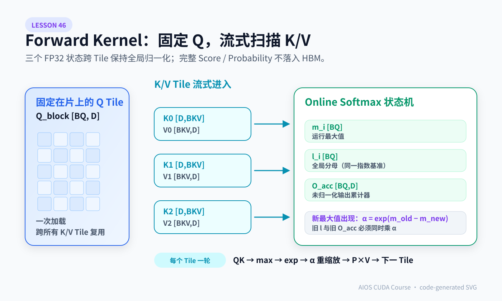
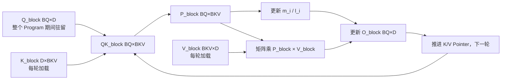
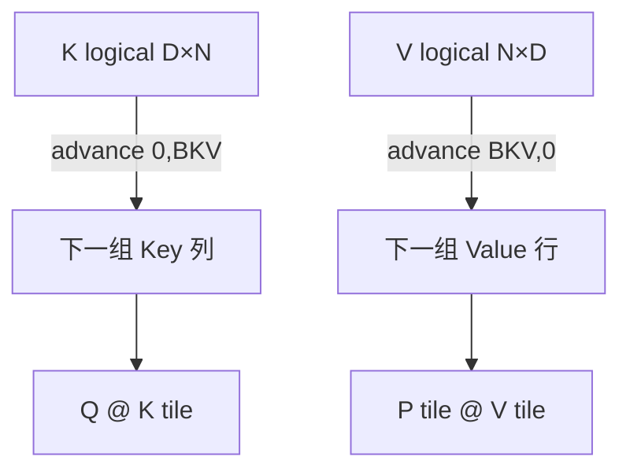

# Lesson 46：前向 Kernel 源码带读——`m/l/O_acc` 怎样在 K/V Tile 之间保持精确 Softmax

> 上游固定基线：`hkproj/triton-flash-attention@296ee44c8a238cd2192d13e22e9082251f1c1289`
>
> 核心入口：`_attn_fwd_inner`、`_attn_fwd`。
>
> 前置课程：Lesson 41 已证明 Online Softmax 的公式；本课不再停留在抽象算法，而是把公式逐项对应到 Triton 变量、Shape、精度与 Pointer 推进。

本课的主问题只有一个：

> 一个 Program 固定 `Q_block [BQ,D]` 后，怎样一块一块读 `K/V`，既不保存完整 `[BQ,N]` Score，又得到与一次性 Softmax 完全相同的 `O_block`？

答案是维护三类逐 Query 状态：

```text
m_i     [BQ]    当前见过的最大 Score
l_i     [BQ]    以 m_i 为指数基准的分母
O_block [BQ,D]  以 m_i 为指数基准的未归一化输出
```



> 图中的蓝色 Q Tile 在整个 Program 生命周期内复用，K/V Tile 逐块流入；右侧 `m_i / l_i / O_acc` 是跨 Tile 保持全局 Softmax 精确性的三个 FP32 状态。SVG 由代码生成，Shape 与正文变量一一对应。

---

## 1. 先看一轮循环的 Shape

固定：

```text
Q_block  [BQ,D]
K_block  [D,BKV]
V_block  [BKV,D]
```

局部计算：

```text
QK_block = Q_block @ K_block   → [BQ,BKV]
P_block  = exp(...)            → [BQ,BKV]
P_block @ V_block              → [BQ,D]
```

每一行对应一个 Query；每一列对应当前 K/V Tile 中的一个 Key。



注意 `Q_block` 不随 K/V 循环变化，因此可在片上复用；K/V 每轮向序列方向推进。

---

## 2. 普通稳定 Softmax 仍然需要整行

对某一 Query 行：

```math
p_j=\frac{e^{s_j-m}}{\sum_k e^{s_k-m}},
\qquad m=\max_k s_k
```

若一次只看到一块 Score，就不知道未来会不会出现更大的 `m`。不能简单地：

```text
每块独立 softmax
→ 每块各自归一化
→ 再把结果相加或平均
```

因为不同块的概率没有共享同一个分母。

Online Softmax 的关键不是“局部 Softmax”，而是**当最大值变化时，把旧统计换算到新指数基准**。

---

## 3. 三个状态的数学不变量

假设已经处理过若干 Key，状态为：

```math
m_i=\max_{j\in seen} S_{ij}
```

```math
l_i=\sum_{j\in seen}e^{S_{ij}-m_i}
```

```math
O_i^{acc}=\sum_{j\in seen}e^{S_{ij}-m_i}V_j
```

最终输出是：

```math
O_i=\frac{O_i^{acc}}{l_i}
```

这三个式子就是循环每结束一次必须继续成立的“不变量”。读 Kernel 时不要只跟变量名，要反复检查每条更新后不变量是否仍成立。

---

## 4. 新 Tile 到来时如何更新

当前 Tile 的局部 Score 为 `S_tile`。

新最大值：

```math
m_i^{new}
=\max\left(m_i^{old},\max_j S_{ij}^{tile}\right)
```

旧基准到新基准的换算因子：

```math
\alpha_i=e^{m_i^{old}-m_i^{new}}
```

当前 Tile 在新基准下的未归一化权重：

```math
P_{ij}^{tile}=e^{S_{ij}^{tile}-m_i^{new}}
```

更新分母：

```math
l_i^{new}
=\alpha_i l_i^{old}
+\sum_jP_{ij}^{tile}
```

更新输出累计器：

```math
O_i^{acc,new}
=\alpha_i O_i^{acc,old}
+\sum_jP_{ij}^{tile}V_j
```

全部 Tile 结束：

```math
O_i=O_i^{acc}/l_i
```

---

## 5. 源码变量逐项对应

上游 `_attn_fwd_inner` 中的关键对应关系：

| 数学对象 | 源码变量 | Shape | 推荐精度 |
|---|---|---:|---|
| 当前 Q Tile | `Q_block` | `[BQ,D]` | 输入 dtype |
| 局部 K | `K_block` | `[D,BKV]` | 输入 dtype |
| 局部 Score | `QK_block` | `[BQ,BKV]` | `tl.dot` 累加通常为 FP32 路径 |
| 运行最大值 | `m_i` | `[BQ]` | FP32 |
| 新最大值 | `m_ij` | `[BQ]` | FP32 |
| 分母 | `l_i` | `[BQ]` | FP32 |
| 换算因子 | `alpha` | `[BQ]` | FP32 |
| 局部权重 | `P_block` | `[BQ,BKV]` | 先计算，乘 V 前转 FP16 |
| 输出累计器 | `O_block` | `[BQ,D]` | FP32 |

源码核心逻辑的教学化精简版：

```python
score = dot(q_block, k_block) * scale        # [BQ,BKV]
new_max = maximum(old_max, row_max(score))   # [BQ]
score = score - new_max[:, None]

p = exp(score)                               # [BQ,BKV]
alpha = exp(old_max - new_max)               # [BQ]

new_l = old_l * alpha + row_sum(p)            # [BQ]
new_o = old_o * alpha[:, None] + p @ v_block # [BQ,D]

old_max = new_max
old_l = new_l
old_o = new_o
```

源码为了让 Tensor Core 路径高效，会把 `P_block` 转为 `tl.float16` 后再与 `V_block` 做 `tl.dot`，但 `O_block` 本身维持 FP32 累加。

---

## 6. 为什么旧 `l_i` 和旧 `O_block` 必须一起乘 `alpha`

假设旧最大值是 2，新 Tile 出现最大值 5。

旧累计中的某个权重按旧基准表示为：

```math
e^{s-2}
```

要转换到新基准 5：

```math
e^{s-2}\cdot e^{2-5}=e^{s-5}
```

所以：

```math
\alpha=e^{2-5}=e^{-3}
```

分母 `l_i` 是一组旧权重之和，必须乘 `alpha`；输出累计 `O_acc` 是同一组旧权重乘 Value 的和，也必须乘同一个 `alpha`。

若只缩放分母、不缩放输出：

```text
分子仍在旧基准
分母已经换到新基准
→ 二者不再匹配
→ 最终输出错误
```

---

## 7. 两个 Tile 的完整手算

单个 Query 的 Score：

```text
Tile A = [1, 2]
Tile B = [5, -1]
```

对应 Value：

```text
V1=[1,0]
V2=[0,1]
V3=[2,-1]
V4=[3,2]
```

### 7.1 初始化

源码使用：

```text
m=-inf
l=1
O_acc=[0,0]
```

为什么 `l` 可以初始化为 1 而不是 0？第一轮：

```math
\alpha=e^{-\infty-m_{new}}=0
```

所以旧 `l` 会被乘零，初始化值不会进入结果。这个写法与官方 Triton 教程的历史实现一致；理解时应看不变量，而不是死记“分母从 1 开始”。

### 7.2 Tile A

```text
m_new=2
alpha=0
p=[e^-1,1]=[0.367879,1]
l=1.367879
```

```text
O_acc
=0×[0,0]
+0.367879×[1,0]
+1×[0,1]
=[0.367879,1]
```

### 7.3 Tile B

```text
m_new=5
alpha=e^(2-5)=0.049787
p=[1,e^-6]=[1,0.002479]
```

新分母：

```math
l=0.049787\times1.367879+1+0.002479
\approx1.070581
```

新输出累计：

```text
old scaled = [0.018316,0.049787]
new value  = 1×[2,-1] + 0.002479×[3,2]
O_acc      ≈ [2.025752,-0.945255]
```

最终：

```text
O=O_acc/l
```

直接对四个 Score 一次性 Softmax，会得到同一结果。

---

## 8. `M` 实际保存的不是“最大值”，而是 LogSumExp

循环结束时状态有：

```text
m_i = 全局最大值
l_i = sum(exp(score-m_i))
```

源码尾部执行：

```python
m_i = m_i + log(l_i)
```

于是：

```math
M_i=m_i+\log l_i
=\log\sum_j e^{S_{ij}}
=\operatorname{LSE}(S_i)
```

随后：

```python
O_block = O_block / l_i[:, None]
store(M, m_i)
store(O, O_block)
```

变量名仍叫 `m_i`，但语义已经从“运行最大值”变为“LogSumExp”。这是源码阅读中的典型危险：**同一变量在 Epilogue 后语义改变。**

反向用：

```math
P_{ij}=e^{S_{ij}-M_i}
```

因此保存 LSE 比只保存最大值更直接。

---

## 9. Pointer 为什么一个沿 `(0,BKV)`，另一个沿 `(BKV,0)`

Block Pointer 逻辑 Shape：

```text
K_block_ptr: [D,N]
V_block_ptr: [N,D]
```

K 被视作转置布局，以便：

```text
Q [BQ,D] @ K^T [D,BKV]
```

每处理一个 Key Tile：

```python
K_block_ptr = advance(K_block_ptr, (0, BLOCK_KV))
V_block_ptr = advance(V_block_ptr, (BLOCK_KV, 0))
```

它们都向序列轴前进，只是 K 的逻辑矩阵把序列轴放在第二维，V 的序列轴在第一维。



若只看 `advance` 参数，不先确认 Pointer 的逻辑 Shape，就很容易误以为二者移动方向不一致。

---

## 10. `softmax_scale` 应该在哪一步乘

标准 Scale：

```math
s=1/\sqrt D
```

源码的两条路径略有写法差异：

- 对角 Causal Tile：先把 `QK_block` 乘 Scale，再加 Mask；
- 其他 Tile：在求运行最大值与减最大值时结合 Scale。

无论写法如何，必须保证：

```text
运行最大值基于“已经 Scale 且已经 Mask”的 Score
P_block = exp(scaled_masked_score - same_basis_max)
```

错误组合示例：

```text
m 从未 Scale 的 Score 求
但 exp 使用 Scale 后的 Score
```

这会让指数基准不一致。

---

## 11. Causal 对角 Tile 为什么单独处理

对 Query Tile：

```text
q ∈ [q_start, q_start+BQ)
```

Key 区域可以分成：

```text
左侧 Tile：所有 k < q_start，对整块所有 Query 都合法
对角 Tile：部分 k <= q，部分 k > q，需要逐元素 Mask
右侧 Tile：所有 Key 都是未来位置，完全不应访问
```

所以前向将 Causal 计算拆成：

```text
Stage 1：无逐元素 Mask 的左侧完整区域
Stage 2：需要逐元素 Mask 的对角区域
```

非 Causal 则直接扫描整个 `[0,N)`。

这种拆分的性能意义是：大部分 Causal 区域不必每个 Score 都做 Mask 判断；只有对角过渡 Tile 需要。

Lesson 47 会完整解释上游 `STAGE=1/2/3` 的命名映射。

---

## 12. 精度链路：不是所有东西都应该同一种 dtype

教学上可以把精度分三层：

```text
输入 Q/K/V：FP16
Score / m / l / O_acc：FP32 统计或累加
P×V 的 Tensor Core 输入：P 转 FP16
最终 O：转回 O 的元素 dtype
```

为什么 `m/l` 必须更稳：

- `m` 控制指数平移；
- `l` 跨很多 Tile 累加；
- 数值误差会直接影响全行归一化。

为什么 `O_acc` 用 FP32：

- 它跨全部 K/V Tile 累加；
- 每个输出元素是很多概率×Value 的和。

为什么 `P_block` 可以在 Matmul 前转 FP16：

- 便于使用高吞吐低精度 Matmul；
- 误差由 FP32 累加和最终容差控制；
- 但这也意味着结果通常不是逐位等于 FP32 参考。

正确性测试应使用合理 `atol/rtol`，不能要求 bitwise identical。

---

## 13. 前向循环的资源生命周期

```text
Program 开始
├─ load Q_block 一次
├─ init m_i/l_i/O_block
├─ K/V 循环
│  ├─ load K_block
│  ├─ score + Online Softmax update
│  ├─ load V_block
│  ├─ update O_block
│  └─ advance pointers
└─ epilogue: LSE + normalize + store
```

对性能最关键的复用：

```text
Q_block：跨全部 K/V Tile 复用
m/l/O_acc：跨全部 K/V Tile 驻留
K/V：每轮加载后立即消费
完整 Score/Probability：不写 HBM
```

这就是“IO-aware”的具体代码形态，而不是一句抽象口号。

---

## 14. 教学化完整前向伪代码

```python
def flash_forward_one_q_tile(q_tile, k_tiles, v_tiles, scale, mask_fn):
    # q_tile: [BQ,D]
    row_max = [-inf] * BQ
    row_sum = [1.0] * BQ
    out_acc = zeros([BQ,D], fp32)

    for k_tile, v_tile, positions in zip(k_tiles, v_tiles, key_ranges):
        score = q_tile @ transpose(k_tile) * scale  # [BQ,BKV]
        score = apply_mask(score, mask_fn, positions)

        next_max = maximum(row_max, row_maximum(score))
        alpha = exp(row_max - next_max)
        prob = exp(score - next_max[:,None])

        row_sum = row_sum * alpha + row_sum_of(prob)
        out_acc = out_acc * alpha[:,None] + prob @ v_tile
        row_max = next_max

    lse = row_max + log(row_sum)
    out = out_acc / row_sum[:,None]
    return out, lse
```

它保留了所有关键机制：

- Q Tile 固定；
- K/V Tile 流式；
- 全局 Softmax 状态；
- Mask 在 Score 进入 `max/exp` 前生效；
- 最终保存 LSE。

省略的只是 Triton Pointer 和编译元参数，不是核心算法。

---

## 15. 为什么不应该直接把 `P_block` 写入 HBM 调试

初学者可能想：

```text
把每个 P Tile 写到完整 P 矩阵
→ 方便检查
```

这样当然能帮助一次性调试，但会破坏想测的对象：

- 恢复 `O(N²)` 中间存储；
- 增加巨大 HBM 写流量；
- 改变 Kernel 资源与调度；
- 得到的性能不再代表 FlashAttention。

更好的调试方法：

```text
小 N 下与 PyTorch 参考比 O/LSE
→ 必要时只采样少量 Tile/行
→ 使用独立 Debug Kernel 或编译开关
→ 性能 Benchmark 时关闭所有观测写回
```

---

## 16. 运行本课代码实验

```bash
python resources/lesson-46-triton-flash-attention-forward/run_lesson46.py
```

实验使用纯 Python：

- 对固定 Scores/Values 计算一次性 Softmax Attention；
- 用不同 Block Size 计算 Online Attention；
- 打印 `m/alpha/l/O_acc` 变化；
- 验证所有 Block Size 的结果都与一次性结果一致；
- 验证 `sum(exp(score-LSE))=1`。

它验证数学不变量，不模拟 GPU 并行与真实精度吞吐。

---

## 17. 常见错误理解

### 错误 1：`P_block` 是当前 Tile 独立归一化后的概率

不是。它只是以当前全局最大值为基准的未归一化指数。真正的概率要等所有 Tile 结束后除以全局 `l_i`。

### 错误 2：只要最后除一次 `l_i`，旧 `O_acc` 就不需要乘 `alpha`

错误。`O_acc` 和 `l_i` 必须始终在同一指数基准下。最大值变化时，旧分子与旧分母都要乘 `alpha`。

### 错误 3：源码最后存到 `M` 的仍是最大值

Epilogue 执行 `m_i += log(l_i)` 后，语义已经是 LSE。反向依赖这个语义恢复 `P`。

### 错误 4：Mask 可以在 `exp` 以后随便乘零，运行最大值不受影响

若被 Mask 的未来 Score 参与了 `max`，它可能改变指数基准，虽然最终乘零仍可能在某些实现中恢复数值，但会带来无谓缩放甚至数值问题。正确做法是让 Mask 在最大值和指数归一化逻辑中一致生效。

### 错误 5：`P_block.to(float16)` 说明整个 Softmax 都是 FP16

不是。运行最大值、分母和输出累计器使用 FP32；只是在 Matmul 输入处将局部概率降精度，以利用低精度矩阵乘路径。

---

## 18. 练习题：检验问题与参考答案

### 问题 1：`m_i/l_i/O_acc` 分别满足什么不变量？

**参考答案：** `m_i` 是已见 Score 的行最大值；`l_i=sum(exp(score-m_i))`；`O_acc=sum(exp(score-m_i)·V)`。最终 `O=O_acc/l_i`。三者必须使用同一 `m_i` 基准。

### 问题 2：新 Tile 最大值没有超过旧最大值时，`alpha` 是多少？

**参考答案：** 此时 `m_new=m_old`，所以 `alpha=exp(0)=1`。旧分母和旧输出累计器不需要缩放，只需加上新 Tile 在同一基准下的贡献。

### 问题 3：为什么初始化 `l_i=1` 仍然正确？

**参考答案：** 初始 `m_i=-inf`，第一轮有限 `m_new` 使 `alpha=exp(-inf-m_new)=0`，旧 `l_i` 被完全消去。初始化为 1 是一个不会进入结果的哨兵；关键是第一轮换算因子为零。

### 问题 4：为什么 `M=LSE` 可以在反向恢复概率？

**参考答案：** `M_i=log(sum_j exp(S_ij))`，所以 `exp(S_ij-M_i)=exp(S_ij)/sum_k exp(S_ik)=P_ij`。Causal Mask 位置再置零即可。

### 问题 5：K Pointer 与 V Pointer 为什么用不同方向的 `tl.advance`？

**参考答案：** K 的 Block Pointer 逻辑 Shape 是 `[D,N]`，序列轴在第二维；V 是 `[N,D]`，序列轴在第一维。二者都沿 Key 序列前进，只是逻辑坐标不同。

### 问题 6：为什么完整 Score Tile 可以只存在于片上临时状态？

**参考答案：** 每个 Score Tile 计算后立即用于更新 `m/l/O_acc`，之后不再需要。反向需要时会按 Tile 重算，因此无需把完整 `[N,N]` Score 或 Probability 写入 HBM。

### 问题 7：如果把每个 Tile 单独 Softmax 后再把 `P_tile @ V_tile` 相加，错在哪里？

**参考答案：** 每个 Tile 使用自己的局部分母，各 Tile 贡献没有在全局分母下比较。高分 Tile 与低分 Tile 会被错误地给予相近总权重；Online Softmax 必须跨 Tile 维护共享最大值与分母。

---

## 19. 一句话复述

`_attn_fwd_inner` 固定一个 Q Tile，流式读取 K/V Tile，并用 FP32 的 `m_i/l_i/O_acc` 在最大值变化时同步重缩放旧分子和分母；最终写出归一化 O 与 LSE，因此无需把完整 Score/Probability 矩阵写回 HBM，仍保持精确全局 Softmax。

---

## 20. 一手参考

- [固定提交中的 `flash_attention.py`](https://github.com/hkproj/triton-flash-attention/blob/296ee44c8a238cd2192d13e22e9082251f1c1289/triton/flash_attention.py)
- [Triton Fused Attention 官方教程](https://triton-lang.org/main/getting-started/tutorials/06-fused-attention.html)
- [FlashAttention：IO-aware exact attention](https://arxiv.org/abs/2205.14135)
- [FlashAttention-2：work partitioning](https://arxiv.org/abs/2307.08691)
