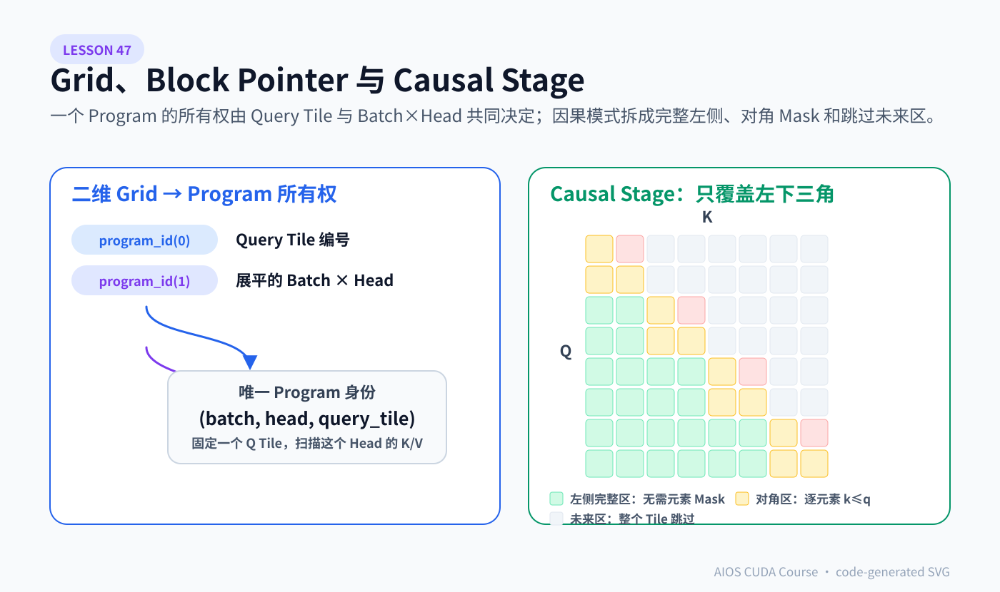
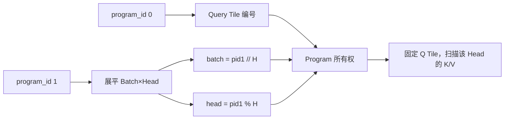
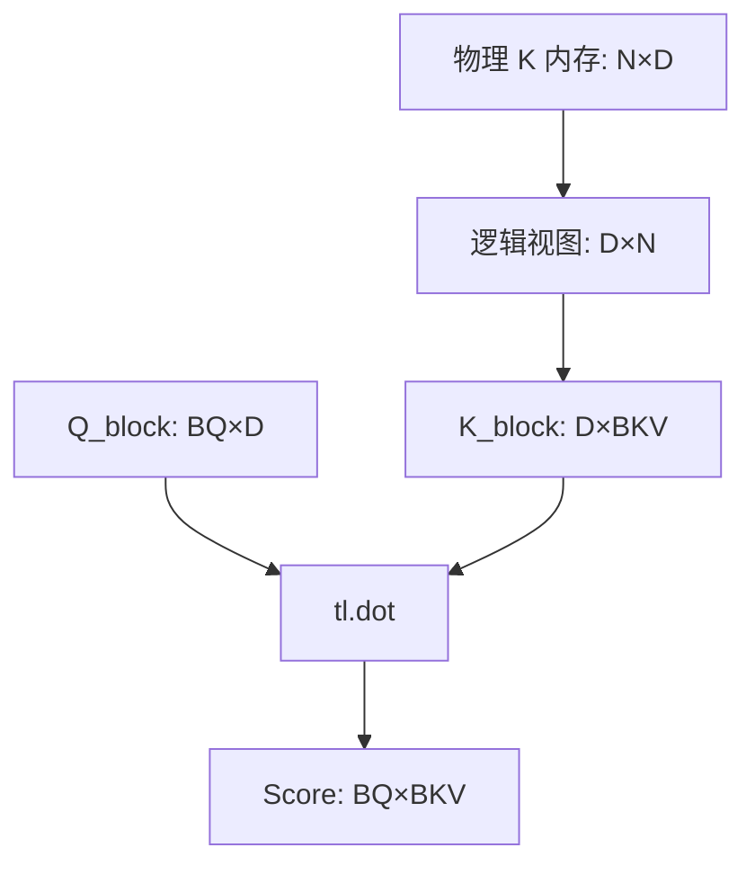

# Lesson 47：Grid、Block Pointer 与 Causal Stage——Triton Program 怎样找到正确的 Q/K/V Tile

> 上游固定基线：`hkproj/triton-flash-attention@296ee44c8a238cd2192d13e22e9082251f1c1289`
>
> 核心入口：`_attn_fwd` 与它对 `_attn_fwd_inner` 的两阶段调用。
>
> 本课主抽象：**算法公式只有在 Program 所有权、Stride、Pointer Shape、Mask 区域和 Tile 边界全部一致时才是正确 Kernel。**

Lesson 46 已经解释“一个 Q Tile 内怎样流式更新 Online Softmax”。本课回答更底层的问题：

- 这个 Q Tile 属于哪个 Batch、哪个 Head、哪一段 Query？
- K 为什么被当成 `[D,N]` 的转置视图？
- `STAGE=1/2/3` 到底分别表示什么？
- 为什么 Causal 只扫描左下三角，而不是先算完整矩阵再全局 Mask？
- 这份教学实现对 Stride、`SEQ_LEN`、`HEAD_DIM` 有哪些隐藏合同？
- 24 个前向 Autotune 配置究竟在选择什么？



> 左半图把二维 Grid 映射为唯一的 `(batch, head, query_tile)` Program 身份；右半图将 Causal Score 平面拆成“整块合法、对角逐元素 Mask、整块未来跳过”三类区域。该 SVG 由代码生成，颜色只编码执行语义，不代替后文的地址与集合证明。

---

## 1. 前向 Grid：两个维度承载两种所有权

源码的 Grid 可写成：

```python
grid = lambda meta: (
    triton.cdiv(SEQ_LEN, meta["BLOCK_SIZE_Q"]),
    BATCH_SIZE * NUM_HEADS,
    1,
)
```

第一维：

```text
program_id(0) = block_index_q
```

决定 Query 序列上的 Tile：

```text
q_start = block_index_q * BLOCK_SIZE_Q
q_end   = q_start + BLOCK_SIZE_Q
```

第二维：

```text
program_id(1) = index_batch_head
```

把 Batch 与 Head 展平：

```python
index_batch = index_batch_head // NUM_HEADS
index_head = index_batch_head % NUM_HEADS
```

因此一个 Program 的稳定身份是：

```text
(batch_index, head_index, query_tile_index)
```



### 1.1 一个具体例子

```text
B=2, H=3, N=16, BQ=4
```

Grid：

```text
(ceil(16/4), 2×3, 1) = (4,6,1)
```

总 Program 数：

```text
4×6=24
```

部分映射：

```text
pid0=0,pid1=0 → batch0/head0/query0:4
pid0=0,pid1=1 → batch0/head1/query0:4
pid0=0,pid1=3 → batch1/head0/query0:4
pid0=2,pid1=5 → batch1/head2/query8:12
```

Grid 并不是“线程总数”；每个 Triton Program 内部还会由 `num_warps` 决定协作线程规模。

---

## 2. Batch/Head Base Offset 的地址公式

连续 `[B,H,N,D]`：

```math
base(b,h)=b\cdot stride_B+h\cdot stride_H
```

进入某个 Batch/Head 后，Query/Dim 地址：

```math
addr_Q(n,d)=Q+base(b,h)+n\cdot stride_{Q,N}+d\cdot stride_{Q,D}
```

源码计算：

```python
qvk_offset = (
    index_batch * stride_Q_batch
    + index_head * stride_Q_head
)
```

然后把同一个 `qvk_offset` 作为 Q/K/V Block Pointer 的 Base Offset。

### 2.1 这里有一个重要的隐含合同

函数参数明明传入：

```text
stride_Q_batch / stride_Q_head
stride_K_batch / stride_K_head
stride_V_batch / stride_V_head
```

但上游固定提交的 Base Offset 使用 Q 的 Batch/Head Stride，K/V 自己的 Batch/Head Stride 没有参与 Base 计算。

因此实际合同是：

```text
Q/K/V 的 Batch 与 Head 布局必须一致
```

典型连续同形 Tensor 满足该合同；任意 View、Permute 或独立 Layout 不一定满足。

更稳妥的生产实现应二选一：

```python
# 方案 A：显式断言布局一致
assert Q.stride(0) == K.stride(0) == V.stride(0)
assert Q.stride(1) == K.stride(1) == V.stride(1)

# 方案 B：分别计算 base offset
q_offset = b * stride_Q_batch + h * stride_Q_head
k_offset = b * stride_K_batch + h * stride_K_head
v_offset = b * stride_V_batch + h * stride_V_head
```

源码带读的目的不是挑错，而是把“测试数据碰巧满足的前提”提升为可审计合同。

---

## 3. `tl.make_block_ptr` 不是普通指针，而是带 Shape 的 Tile 视图

普通地址是一个标量；Block Pointer 描述：

```text
base
逻辑矩阵 shape
逻辑 strides
tile 起始 offsets
tile block_shape
内存访问 order
```

### 3.1 Q Pointer

逻辑矩阵：

```text
Q_view [N,D]
```

当前 Tile：

```text
offsets=(block_index_q*BQ, 0)
block_shape=(BQ,D)
```

因此加载：

```text
Q_block [BQ,D]
```

### 3.2 V Pointer

逻辑矩阵：

```text
V_view [N,D]
```

初始 Tile：

```text
offsets=(0,0)
block_shape=(BKV,D)
```

每轮沿序列轴前进：

```python
tl.advance(V_block_ptr, (BKV, 0))
```

### 3.3 K Pointer 为什么逻辑 Shape 是 `[D,N]`

原始 K 是：

```text
K [N,D]
```

Score 需要：

```text
Q [BQ,D] @ K_tile^T [D,BKV]
```

源码不先物化 `K.transpose()`，而是通过交换逻辑 Shape 与 Stride，把同一内存解释为：

```text
K_view [D,N]
strides=(stride_K_dim, stride_K_seq)
```

当前 Tile：

```text
K_block [D,BKV]
```

每轮沿逻辑第二维，也就是 Key 序列前进：

```python
tl.advance(K_block_ptr, (0, BKV))
```



这是一种零拷贝转置视图思维：改变地址解释，不生成完整转置 Tensor。

---

## 4. `order` 不是输出排列顺序

Block Pointer 的 `order` 提示维度的连续性/遍历优先关系，帮助编译器生成合适访问。

上游大致采用：

```text
Q/V/O [N,D]：order=(1,0)
K [D,N]：order=(0,1)
```

不要把它理解为 NumPy 的 `transpose` 参数，也不要认为改变 `order` 会自动改变数学 Shape。数学 Shape 由 `shape/strides/offsets/block_shape` 共同定义；`order` 主要参与布局与编译优化约束。

读任何 Block Pointer 时建议按固定顺序：

```text
1. base 指向哪个 Batch/Head？
2. 逻辑 shape 是什么？
3. 哪一维对应序列、哪一维对应 Head Dim？
4. offsets 落在哪个 Tile？
5. block_shape 加载多大？
6. 每轮 advance 沿哪一维？
7. 尾部有没有 boundary_check/mask？
```

---

## 5. Causal Attention 的几何区域

Causal 条件：

```math
k\le q
```

Score 矩阵只允许左下三角：

```text
q=0:  ✓ · · ·
q=1:  ✓ ✓ · ·
q=2:  ✓ ✓ ✓ ·
q=3:  ✓ ✓ ✓ ✓
```

对一个 Q Tile `[q_start,q_end)`，Key 区域分三段：

```text
A. [0,q_start)       全部合法
B. [q_start,q_end)   对角过渡，需要逐元素 k<=q
C. [q_end,N)         全部非法，不应遍历
```


这比“遍历全部 K，再把右上角乘零”更省工作。

---

## 6. 上游 `STAGE` 命名为什么容易看晕

Host 侧传入：

```python
stage = 3 if causal else 1
```

但 `_attn_fwd_inner` 内部又解释：

```text
inner STAGE=1 → 左侧 Causal 区域
inner STAGE=2 → 对角 Causal 区域
inner 其他值 → Non-causal 全区间
```

主 Kernel 的调用映射：

```python
if outer_stage in (1, 3):
    inner_stage = 4 - outer_stage

if outer_stage == 3:
    再调用 inner_stage = 2
```

展开后：

| Host/Outer `STAGE` | 语义 | 第一次 Inner | 第二次 Inner |
|---:|---|---:|---:|
| 1 | Non-causal | `4-1=3` → 全 `[0,N)` | 无 |
| 3 | Causal | `4-3=1` → 左侧 `[0,q_start)` | 2 → 对角 `[q_start,q_end)` |

所以：

```text
outer STAGE=3 不是 inner STAGE=3 的同一语义
```

它是一种历史编码技巧。课程中建议把它翻译为更可读的枚举：

```text
MODE_NON_CAUSAL
MODE_CAUSAL_LEFT
MODE_CAUSAL_DIAGONAL
```

生产重构时可以减少数字复用，避免维护者把 Outer/Inner Stage 搞混。

---

## 7. 对角 Mask 的坐标从哪里来

当前 Query 绝对位置：

```python
offs_q = block_index_q * BQ + arange(0, BQ)
```

当前 Key Tile 绝对位置：

```python
start_kv + offs_kv
```

Mask：

```python
mask = offs_q[:, None] >= (start_kv + offs_kv[None, :])
```

Shape：

```text
offs_q[:,None]                [BQ,1]
start_kv+offs_kv[None,:]      [1,BKV]
mask                          [BQ,BKV]
```

Broadcast 后，每个 Score `(q,k)` 都得到一个布尔值。

源码把非法位置加上大负数：

```text
-1e6
```

然后参与 `max/exp`。数学上常写 `-inf`；大负数在常见 Score 范围内近似得到指数零。教学上要知道二者的边界不同：若 Score 范围异常巨大，有限哨兵不等价于真正负无穷。

---

## 8. 左侧区域为什么不需要 Mask

若当前 Q Tile 从 `q_start` 开始：

```text
所有 q >= q_start
左侧所有 k < q_start
```

所以必有：

```text
k < q_start <= q
→ k <= q
```

整块都合法。把左侧区间作为无 Mask 路径，可以避免重复比较与选择。

对角区域中：

```text
q,k 都落在 [q_start,q_end)
```

有的 `k<=q`，有的 `k>q`，必须逐元素判断。

右侧区域：

```text
k >= q_end > q
```

全部非法，因此根本不启动循环。

---

## 9. 当前实现的尾块合同

Grid 使用：

```text
ceil_div(N,BQ)
```

看上去似乎支持任意 N；但固定提交的 Q/K/V `tl.load` 与 `tl.store` 没有展示通用尾块 `boundary_check` 或显式 Mask，反向也大量使用：

```text
N // 128
N // 32
```

因此更安全的课程合同是：

```text
SEQ_LEN 必须能被实际选中的 Q/KV Tile 整除
Backward 还要求能被 128/32 的固定块整除
```

前向 Autotune 候选：

```text
BQ ∈ {64,128}
BKV ∈ {32,64}
```

若要让所有候选都安全，常见测试选择 `N` 为 128 的倍数。

不要因为 Grid 用了 `cdiv` 就自动宣布“尾块已支持”。是否安全必须沿 Load/Store 的 Mask 继续审计。

---

## 10. `HEAD_DIM` 也有编译与布局约束

上游只显式断言：

```text
BLOCK_SIZE_KV <= HEAD_DIM
```

但代码还使用：

```text
block_shape=(BQ,HEAD_DIM)
tl.arange(0,HEAD_DIM)
tl.dot(...)
```

Triton 的静态 Shape、Tensor Core 可用性和版本规则都会限制可行 `HEAD_DIM`。固定测试只覆盖 `D=64`；官方教程常覆盖 64/128 等常见 Head Dim。

课程验证应分层：

```text
已在上游默认测试出现：64
可作为扩展测试：128
未经验证：80、96、任意值
```

“代码没有 assert”不等于“所有值都受支持”。

---

## 11. 前向 Autotune 搜索空间

固定提交构造：

```text
BLOCK_SIZE_Q  ∈ {64,128}
BLOCK_SIZE_KV ∈ {32,64}
num_stages    ∈ {3,4,7}
num_warps     ∈ {2,4}
```

候选数：

```math
2\times2\times3\times2=24
```

Key：

```text
SEQ_LEN, HEAD_DIM
```

意味着第一次遇到新的 `(N,D)`，Triton 会试跑多个配置并缓存选择。

### 11.1 每个参数在权衡什么

`BQ` 更大：

- 一个 Program 处理更多 Query；
- Q/K Tile Matmul 更大；
- `O_acc [BQ,D]`、`m/l [BQ]` 资源增加；
- Program 数减少；
- 可能提高复用，也可能降低 Occupancy。

`BKV` 更大：

- 每轮 K/V 工作更多；
- 循环次数减少；
- Score Tile 更大；
- 片上资源与对角 Mask 浪费可能增加。

`num_warps`：

- 每 Program 协作 Warp 数；
- 更多并行不必然更快，可能增加资源压力。

`num_stages`：

- 软件流水深度；
- 可提前加载未来 Tile 隐藏延迟；
- 也消耗更多片上 Buffer。

---

## 12. 为什么 Autotune Key 只用 `N,D` 仍是一种假设

性能还可能受：

```text
causal / non-causal
Batch×Head 总 Program 数
dtype
GPU 架构
Stride/Layout
```

固定实现的 Key 只包含 `N,D`，意味着它假设其他因素不会要求不同配置，或由 Kernel 参数/编译缓存另行区分。

在生产 Benchmark 中应检查：

```text
causal 与 non-causal 是否共享错误缓存？
不同 dtype 是否产生独立编译？
B×H 极小时，最优 BQ 是否变化？
同一 N/D 在不同 GPU 上是否重新 Tune？
```

不能只看到 `@triton.autotune` 就认定搜索空间与缓存合同已经完美。

---

## 13. Autotune 的首次成本不能混进用户延迟

官方 Triton 文档明确说明，Autotune 会对候选配置多次运行 Kernel。固定实现前向会反复写 `O` 与 `M`；由于每次都是完整覆盖，最终值可用，但首次编译与试跑非常昂贵。

服务侧应分离：

```text
启动/离线阶段：compile + autotune + warmup
用户请求阶段：只走缓存后的 steady-state config
```

否则测到的：

```text
首次 p95 = 编译 + 24 个候选 Benchmark + 真正执行
```

而不是 Kernel 的稳定延迟。

AIOS 的低延迟输入法场景尤其不能把首次 Autotune 放在第一次按键请求中。

---

## 14. 一个更显式的教学化 Launcher

```python
def launch(q, k, v, causal):
    assert q.shape == k.shape == v.shape
    assert q.stride(0) == k.stride(0) == v.stride(0)
    assert q.stride(1) == k.stride(1) == v.stride(1)

    B, H, N, D = q.shape
    assert N % 128 == 0
    assert D in (64, 128)

    mode = CAUSAL if causal else NON_CAUSAL
    grid = lambda meta: (ceil_div(N, meta.BQ), B * H, 1)

    forward_kernel[grid](
        q, k, v, out, lse,
        N=N,
        D=D,
        MODE=mode,
        # Strides 显式传入
    )
```

教学版的价值是把隐藏合同显式写出。之后再决定哪些约束要通过边界 Mask 放宽，而不是一开始就假装“任意 Shape 都支持”。

---

## 15. Causal Tile 覆盖的正确性证明思路

设所有合法 Score 单元集合：

```math
C=\{(q,k)\mid0\le q<N,0\le k\le q\}
```

对每个 Q Tile：

```text
左侧集合 L：k<q_start
对角集合 D：q_start<=k<q_end 且 k<=q
```

要验证：

```text
1. L∪D 没有非法单元
2. L∪D 覆盖该 Q Tile 的全部合法单元
3. 不访问 k>=q_end 的右侧单元
4. 所有 Q Tile 并集恰好等于 C
```

本课 CPU 脚本就是把这个集合证明转成可执行断言，而不是只画一个三角形就算完成。

---

## 16. 运行本课代码实验

```bash
python resources/lesson-47-triton-flash-attention-layout-causal/run_lesson47.py
```

实验会：

1. 计算连续 `[B,H,N,D]` Stride 与 Batch/Head Base Offset；
2. 构造 K 的不同 Layout，展示使用 Q Offset 会得到错误地址；
3. 枚举 Non-causal 与 Causal Stage 覆盖的 `(q,k)`；
4. 断言 Causal 覆盖恰好等于 `k<=q`；
5. 计算前向 Autotune 恰有 24 个候选。

这是地址与区域合同实验，不代表 Triton 编译器真实资源分配。

---

## 17. 常见错误理解

### 错误 1：`program_id(1)` 就是 Head ID

它是展平后的 Batch×Head ID，必须通过整除/取模恢复 Batch 和 Head。

### 错误 2：K 的 `[D,N]` Shape 表明上游真的存了一份转置 K

没有。源码通过交换逻辑 Shape 与 Stride 创建转置视图，物理内存仍是原始 K。

### 错误 3：Outer `STAGE=3` 表示 Non-causal，因为 Inner 的其他值走全区间

Outer 与 Inner 复用了数字但语义不同。Outer 3 表示 Causal；它先映射到 Inner 1 处理左侧，再调用 Inner 2 处理对角。

### 错误 4：用了 `cdiv(N,BQ)` 就自然支持任意 N

尾 Program 是否安全取决于 Load/Store 是否有边界检查。固定提交没有通用尾块保护，反向还直接整除，因此应按整 Tile Shape 使用。

### 错误 5：Autotune 总能提高生产性能

若首次 Tune 落到用户请求、Key 设计不合理、测试噪声大或配置对某些 Shape 非法，Autotune 反而会增加延迟和风险。必须预热、缓存并验证。

### 错误 6：Mask 只影响输出，不影响 Softmax 统计

Mask 必须与运行最大值、分母和概率恢复保持一致。非法 Score 若参与最大值，会改变指数基准并可能导致数值问题。

---

## 18. 练习题：检验问题与参考答案

### 问题 1：`grid=(ceil(N/BQ),B*H,1)` 中，为什么不把 Batch 与 Head 分成两个 Grid 维度？

**参考答案：** 展平后只需一个 Program ID，再通过 `//H` 与 `%H` 恢复索引，便于把第一个 Grid 维留给 Query Tile。两种方案都可能实现，当前方案简洁且每个 `(batch,head,q_tile)` 仍有唯一所有者。

### 问题 2：为什么 K Block Pointer 的 Stride 顺序是 `(stride_dim,stride_seq)`？

**参考答案：** 它把物理 `[N,D]` K 解释为逻辑 `[D,N]`，使加载 Tile 直接得到 `[D,BKV]`，可与 `[BQ,D]` 的 Q 做矩阵乘而不物化转置。

### 问题 3：Causal 左侧区域为什么可以完全省略逐元素 Mask？

**参考答案：** 对 Q Tile 内任意 `q>=q_start`，左侧任意 `k<q_start`，恒有 `k<q_start<=q`，所以全部满足 `k<=q`。

### 问题 4：上游使用同一个 `qvk_offset` 的风险是什么？

**参考答案：** 若 K/V 的 Batch/Head Stride 与 Q 不同，Base Offset 会落到错误位置。应断言同布局或分别使用各自 Stride 计算 Base。

### 问题 5：为什么 `N=192` 对该固定实现不是稳妥测试？

**参考答案：** 前向候选可能用 BQ=128，尾部不足整 Tile且无通用边界保护；反向固定 Macro Tile=128 并用整除 Grid，余下 64 个 Token 可能未覆盖或越界。课程应选择 128 的倍数，除非先补齐边界逻辑。

### 问题 6：24 个 Autotune 配置从哪里来？

**参考答案：** `2` 个 BQ × `2` 个 BKV × `3` 个 num_stages × `2` 个 num_warps，共 `24`。

### 问题 7：为什么 Non-causal Host `STAGE=1` 最终会让 Inner 扫全序列？

**参考答案：** 主 Kernel 传给 Inner 的值是 `4-STAGE`，所以 Outer 1 映射为 Inner 3；Inner 只有 1/2 是 Causal 特殊区间，其他值走 `lo=0,hi=N`。

---

## 19. 一句话复述

前向 Kernel 通过二维 Grid 为每个 Batch/Head/Q Tile 建立唯一 Program，借助带 Shape/Stride 的 Block Pointer 零拷贝读取 Q、转置视图 K 与 V；Causal 模式把 Key 区域拆成无 Mask 左侧和逐元素 Mask 对角，跳过整个右侧未来区域，而正确性还依赖 Q/K/V 同布局、整 Tile 序列长度和受控 Autotune 首次成本。

---

## 20. 一手参考

- [固定提交核心源码](https://github.com/hkproj/triton-flash-attention/blob/296ee44c8a238cd2192d13e22e9082251f1c1289/triton/flash_attention.py)
- [Triton Fused Attention 官方教程](https://triton-lang.org/main/getting-started/tutorials/06-fused-attention.html)
- [Triton `Config` 官方文档](https://triton-lang.org/main/python-api/generated/triton.Config.html)
- [Triton `autotune` 官方文档](https://triton-lang.org/main/python-api/generated/triton.autotune.html)
