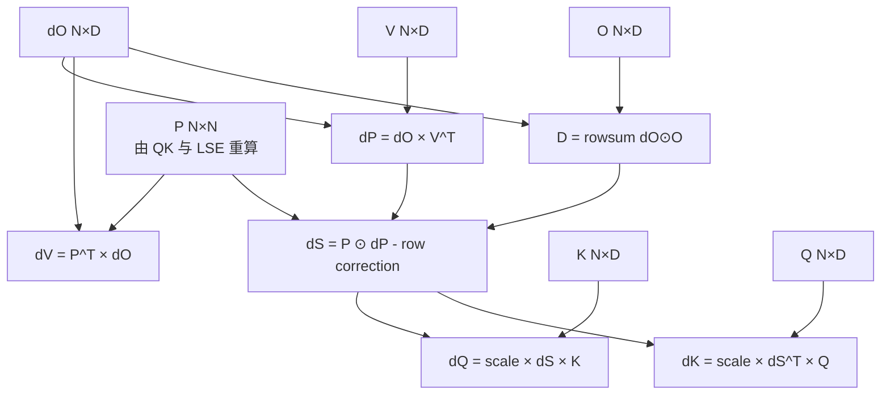

# Lesson 48：FlashAttention 反向数学——为什么只保存 `O/LSE` 也能得到正确的 `dQ/dK/dV`

> 上游固定基线：`hkproj/triton-flash-attention@296ee44c8a238cd2192d13e22e9082251f1c1289`
>
> 核心入口：`_attn_bwd_preprocess`、`TritonAttention.backward`，以及后续两个反向 Kernel 使用的公式。
>
> 本课先把梯度推导清楚；Lesson 49 再讲怎样把公式拆成两个无全局 Atomic 的 Triton 工作划分。

FlashAttention 训练路径最容易被误解的一点是：

```text
前向不保存完整 P
≠ 反向不需要 P
```

正确说法是：

```text
前向不把完整 P 写入 HBM
→ 保存较小的 O 与 LSE
→ 反向按 Tile 重算局部 Score 与 P
→ 用标准 Attention 梯度公式得到 dQ/dK/dV
```

本课目标是让每一个反向变量都能从公式推出来，而不是把上游 Kernel 当成神秘模板。

---

## 1. 前向公式与 Shape

单 Batch、单 Head：

```text
Q [N,D]
K [N,D]
V [N,D]
```

Scale：

```math
s=1/\sqrt D
```

Score：

```math
S=sQK^T
```

概率：

```math
P=\operatorname{softmax}(S)
```

输出：

```math
O=PV
```

Shape：

```text
S [N,N]
P [N,N]
O [N,D]
```

上游损失 `L` 通过 Autograd 给自定义算子：

```text
dO = ∂L/∂O [N,D]
```

目标：

```text
dQ [N,D]
dK [N,D]
dV [N,D]
```

---

## 2. 反向总图



其中最关键的压缩量是逐行标量：

```text
D_i = sum_d dO_i,d * O_i,d
```

上游变量名就叫 `D`。

---

## 3. 先推最容易的 `dV`

前向：

```math
O=PV
```

把 P 当常量，对 V 求导：

```math
dV=P^TdO
```

Shape：

```text
P^T [N,N]
dO  [N,D]
dV  [N,D]
```

逐元素：

```math
\frac{\partial L}{\partial V_{jd}}
=\sum_i P_{ij}\frac{\partial L}{\partial O_{id}}
```

含义：每个 Value 位置 j 收集所有 Query i 对它的 Attention 权重乘上对应输出梯度。

Causal 情况无需额外推一套公式；未来位置的 `P_ij=0`，自然没有贡献。

---

## 4. 从 `O=PV` 得到 `dP`

对 P 求导：

```math
dP=dOV^T
```

Shape：

```text
dO [N,D]
V^T[D,N]
dP [N,N]
```

逐元素：

```math
dP_{ij}
=\sum_d dO_{id}V_{jd}
```

但 `P` 不是独立变量，它来自逐行 Softmax，所以还要继续把 `dP` 传到 `dS`。

---

## 5. Softmax 梯度为什么不是逐元素 `P(1-P)`

标量 Sigmoid 常见：

```math
\sigma'(x)=\sigma(x)(1-\sigma(x))
```

Softmax 一行内各元素彼此耦合：

```math
\frac{\partial P_j}{\partial S_k}
=P_j(\delta_{jk}-P_k)
```

因此：

```math
dS_j
=\sum_k dP_k\frac{\partial P_k}{\partial S_j}
```

化简：

```math
dS_j
=P_j\left(dP_j-\sum_kP_kdP_k\right)
```

对每一行 i：

```math
dS_{ij}
=P_{ij}\left(dP_{ij}-\Delta_i\right)
```

其中：

```math
\Delta_i=\sum_jP_{ij}dP_{ij}
```

这就是源码中逐 Query 的修正量。

---

## 6. 为什么 `Δ_i` 等于 `sum(dO_i * O_i)`

从定义：

```math
\Delta_i=\sum_jP_{ij}dP_{ij}
```

代入：

```math
dP_{ij}=\sum_d dO_{id}V_{jd}
```

得到：

```math
\Delta_i
=\sum_jP_{ij}\sum_ddO_{id}V_{jd}
```

交换求和顺序：

```math
\Delta_i
=\sum_ddO_{id}\sum_jP_{ij}V_{jd}
```

而：

```math
O_{id}=\sum_jP_{ij}V_{jd}
```

所以：

```math
\Delta_i
=\sum_ddO_{id}O_{id}
```

即：

```math
\boxed{\Delta_i=\operatorname{rowsum}(dO_i\odot O_i)}
```

这就是 `_attn_bwd_preprocess` 只需要加载 `O` 和 `dO`，就能为每个 Query 生成一个标量 `D_i` 的原因。

---

## 7. `_attn_bwd_preprocess` 的职责非常单一

教学化代码：

```python
# O_block, dO_block: [BQ,D]
D_block = row_sum(dO_block * O_block)  # [BQ]
store(D, D_block)
```

上游实际为每个 Batch/Head、每个 128 Query Tile 启动 Program。

为什么单独做一个 Kernel，而不是在 `dQ` 或 `dK/dV` 里重复计算？

- `D_i` 会同时被两个反向 Kernel 使用；
- 单独预处理一次可避免两边重复 `rowsum(dO*O)`；
- `[B,H,N]` 的 D 很小；
- 计算模式是简单逐行归约，适合独立 Kernel。

代价是多一次 Kernel Launch 与 D 的 HBM 写读。是否值得需结合整体性能；在这个教学实现中，它让公式与工作划分更清晰。

---

## 8. 用 LSE 重算 `P`

前向保存：

```math
M_i=\operatorname{LSE}(S_i)
=\log\sum_j e^{S_{ij}}
```

反向局部重算 Score：

```math
S_{ij}=sQ_iK_j^T
```

概率：

```math
P_{ij}=e^{S_{ij}-M_i}
```

验证归一化：

```math
\sum_j e^{S_{ij}-M_i}
=\frac{\sum_je^{S_{ij}}}{e^{M_i}}
=1
```

Causal Mask：

```text
若 k>q，则 P_ij=0
```

因此反向不需要保存完整 P，只需：

```text
Q/K/V：前向输入
O：前向输出
M：逐 Query LSE
dO：上游梯度
D：预处理得到
```

---

## 9. 从 `S=sQK^T` 得到 `dQ/dK`

Score：

```math
S=sQK^T
```

已知 `dS`：

```math
dQ=s\,dS\,K
```

```math
dK=s\,dS^TQ
```

Shape：

```text
dS [N,N] × K [N,D]     → dQ [N,D]
dS^T [N,N] × Q [N,D]   → dK [N,D]
```

最终完整公式：

```math
dV=P^TdO
```

```math
dP=dOV^T
```

```math
D_i=\sum_d dO_{id}O_{id}
```

```math
dS=P\odot(dP-D[:,None])
```

```math
dQ=s\,dS K
```

```math
dK=s\,dS^TQ
```

这是 Lesson 49 两个 Kernel 的全部数学来源。

---

## 10. 一个小矩阵手算结构

设：

```text
N=3, D=2
```

```text
Q [3,2]
K [3,2]
V [3,2]
dO[3,2]
```

执行顺序：

```text
1. S = scale * Q @ K^T        [3,3]
2. P = softmax_rows(S)        [3,3]
3. O = P @ V                  [3,2]
4. D = rowsum(dO * O)         [3]
5. dP = dO @ V^T              [3,3]
6. dS = P * (dP-D[:,None])    [3,3]
7. dQ = scale * dS @ K        [3,2]
8. dK = scale * dS^T @ Q      [3,2]
9. dV = P^T @ dO              [3,2]
```

检查 Softmax 梯度的一个重要不变量：

```math
\sum_jdS_{ij}=0
```

因为一行 Score 全部加同一个常数不会改变 Softmax。代入公式：

```math
\sum_jP_{ij}(dP_{ij}-D_i)
=\sum_jP_{ij}dP_{ij}-D_i\sum_jP_{ij}
=D_i-D_i=0
```

若实现得到某行 `dS` 和明显不为零，通常表示 D、P 或 Mask 有错误。

---

## 11. Causal 反向为什么仍用同一公式

Causal Forward 可以看成：

```text
非法 Score = -inf
非法 P = 0
```

反向时：

```text
P_ij=0 for k>q
```

于是：

```text
dV 的非法项为 0
dS 的非法项为 0
dQ/dK 不接收未来位置贡献
```

关键是重算 `P` 时必须应用与前向完全相同的 Mask。若前向 Causal、反向 Non-causal：

- LSE 只归一化合法区域；
- 反向却为非法区域计算指数；
- 概率和梯度都会错误。

因此 `ctx.causal` 是反向必须保存的非 Tensor 元数据。

---

## 12. 为什么反向可以多算 FLOPs 反而更快

传统 Autograd 若保存 P：

```text
Forward 写完整 P 到 HBM
Backward 读完整 P
```

FlashAttention：

```text
Forward 不写完整 P
Backward 从 Q/K/LSE 重算局部 P
```

取舍：

```text
增加局部 QK Matmul 与 exp FLOPs
减少 O(N²) HBM 写入、保存和读取
```

GPU 上 Matmul 吞吐通常远高于 HBM 往返中间矩阵的有效吞吐。FlashAttention 的 IO-aware 思路就是：宁愿利用计算单元重算，也不要让大中间 Tensor 在慢层级来回搬运。

但不能把这个原则无限泛化：

- 若重算量过大；
- Tile 复用差；
- Kernel Occupancy 低；
- 序列很短；
- Launch 开销占主导；

重算不一定更快。最终仍需 Profile。

---

## 13. `torch.autograd.Function` 的输入输出合同

上游：

```python
TritonAttention.apply(Q, K, V, causal, softmax_scale)
```

Forward 有五个输入，所以 Backward 必须返回五个位置：

```python
return dQ, dK, dV, None, None
```

原因：

```text
Q/K/V 是 Tensor，需要梯度
ausal 是 bool，无梯度
softmax_scale 在该接口中作为常量使用，无梯度
```

Forward 保存 Tensor：

```python
ctx.save_for_backward(Q, K, V, O, M)
```

保存普通元数据：

```python
ctx.softmax_scale = softmax_scale
ctx.causal = causal
ctx.HEAD_DIM = HEAD_DIM
```

PyTorch 官方建议需要用于 Backward 的 Tensor 通过 `save_for_backward` 保存，以支持 Saved Tensor Hook、生命周期检查与更正确的内存语义。

---

## 14. 不要自动假设支持二阶梯度

固定实现把中间 Tensor `O/M` 保存给 Backward，并手写一阶梯度，但没有提供二阶梯度验证，也没有明确声明 `once_differentiable`。

因此课程事实边界是：

```text
已实现并测试：一阶 dQ/dK/dV
未证明：double backward / higher-order grad
```

生产自定义 Autograd 应明确选择：

- 实现并测试 double backward；或
- 用 `@once_differentiable` 明确拒绝；或
- 将可重算中间量设计为输出/可追踪操作。

“PyTorch 没立刻报错”不等于高阶梯度数学正确。

---

## 15. 精度：反向为什么也要容差验证

反向包含：

```text
重算 QK
exp
P×dO / dO×V^T
多个 Tile 不同顺序累加
FP16/BF16 输入与 FP32 累加混合
```

浮点加法不满足结合律，所以 Triton Tile 顺序与 PyTorch 参考的归约顺序不同，允许小误差。

上游使用：

```text
rtol=0
atol=1e-2
```

课程不把这个值宣布为所有 Shape/硬件的通用标准。合理做法是：

```text
1. 按 dtype、D、N、causal 分桶
2. 统计 max abs / relative error
3. 与业务敏感性一起决定门槛
4. 检查是否有系统性偏差、NaN/Inf
5. 低精度边界额外做极端 Score 测试
```

---

## 16. 有限差分怎样验证推导

定义标量损失：

```math
L=\sum_{i,d}O_{id}\,dO_{id}
```

对 Q 的某元素：

```math
\frac{\partial L}{\partial Q_{ab}}
\approx
\frac{L(Q_{ab}+\epsilon)-L(Q_{ab}-\epsilon)}{2\epsilon}
```

同理验证 K/V。

有限差分很慢，但对 `N=3,D=2` 的小矩阵非常有价值：

- 不依赖同一套解析梯度实现；
- 能同时验证 Causal/Non-causal；
- 能暴露 Scale、转置、D 修正项、Mask 方向错误。

它不是替代 GPU 大规模测试，而是最小可信机制证据。

---

## 17. 教学化反向代码

```python
def attention_backward(q, k, v, out, lse, d_out, scale, causal):
    # 1. 逐 Query 修正项
    delta = row_sum(d_out * out)                 # [N]

    # 2. 教学版完整重算；真实 Kernel 按 Tile 做
    score = scale * (q @ transpose(k))           # [N,N]
    p = exp(score - lse[:, None])                # [N,N]
    p = apply_causal_zero_mask(p, causal)

    # 3. 梯度
    d_v = transpose(p) @ d_out                   # [N,D]
    d_p = d_out @ transpose(v)                   # [N,N]
    d_s = p * (d_p - delta[:, None])             # [N,N]
    d_q = scale * (d_s @ k)                      # [N,D]
    d_k = scale * (transpose(d_s) @ q)           # [N,D]
    return d_q, d_k, d_v
```

真实 FlashAttention 不会创建完整 `score/p/dp/ds [N,N]`；它在不同输出所有权的 Kernel 内按 Tile 重算和消费这些中间量。

---

## 18. 为什么 `D` 不是 Softmax 分母

前向已经有：

```text
l_i：Online Softmax 的指数和
M_i：最终 LSE
```

反向 `D_i` 是：

```math
D_i=\sum_d dO_{id}O_{id}
```

它来自 Softmax Jacobian 的行修正项，与前向分母不是同一个对象。

名字都像“逐行标量”很容易混淆：

| 变量 | 阶段 | 含义 |
|---|---|---|
| `l_i` | Forward 内部 | `sum(exp(score-m))` |
| `M_i` | Forward 输出给 Backward | `m+log(l)=LSE` |
| `D_i` | Backward preprocess | `sum(dO*O)` |

源码阅读必须给变量贴上数学语义，而不是只记字母。

---

## 19. Mask 与 LSE 一致性测试

Causal 行 q 只允许 `k<=q`：

```math
M_q=\log\sum_{k\le q}e^{S_{qk}}
```

反向恢复：

```math
P_{qk}=\begin{cases}
e^{S_{qk}-M_q},& k\le q\\
0,& k>q
\end{cases}
```

应验证：

```math
\sum_kP_{qk}=1
```

若忘记把未来位置置零：

```text
M 只包含合法分母
未来 score 却被 exp(score-M)
→ 行和大于 1
→ 所有梯度污染
```

这是比“最终 dQ 差一点”更直接的中间不变量。

---

## 20. 运行本课代码实验

```bash
python resources/lesson-48-triton-flash-attention-backward-math/run_lesson48.py
```

纯 Python 实验会：

1. 对 `N=3,D=2` 计算 Attention；
2. 用公式计算 `D/dS/dQ/dK/dV`；
3. 分别对 Q/K/V 每个元素做中心有限差分；
4. 同时验证 Non-causal 与 Causal；
5. 断言解析梯度与有限差分误差极小。

实验使用双精度 Python Float 的小矩阵，只证明公式实现，不代表 FP16 Triton 的允许误差。

---

## 21. 常见错误理解

### 错误 1：`dS = P * (1-P) * dP`

这是把 Softmax 错当成逐元素 Sigmoid。Softmax 一行内元素耦合，必须减去行内 `sum(P*dP)`，即 `D/Delta` 修正项。

### 错误 2：`D` 是前向 Softmax 分母

不是。前向分母相关状态是 `l/M`；反向 D 是 `rowsum(dO*O)`。

### 错误 3：不保存 P 就无法精确反向

只要保存 LSE，并保留 Q/K，就能按 Tile 精确重算 P。这里的“精确”指同一数学 Attention，不是浮点逐位相同。

### 错误 4：Causal 只需在 Forward Mask，Backward 不用

Backward 重算 P，必须使用同一 Mask；否则未来位置会产生非零概率和梯度。

### 错误 5：`dK` 与 `dQ` 公式只差变量名

二者都来自 `S=QK^T`，但转置方向不同：`dQ=dS K`，`dK=dS^T Q`。这直接决定两个 Kernel 的 Tile 所有权和访问方向。

### 错误 6：Custom Autograd 返回三个梯度就够了

Forward 有五个输入，Backward 必须返回五个位置；非 Tensor/不求导输入返回 `None`。

---

## 22. 练习题：检验问题与参考答案

### 问题 1：从 `O=PV` 推导 `dV` 与 `dP`。

**参考答案：** 矩阵微分得到 `dV=P^T dO`，`dP=dO V^T`。Shape 分别为 `[N,D]` 与 `[N,N]`。

### 问题 2：为什么 Softmax 梯度需要逐行修正量？

**参考答案：** Softmax Jacobian 为 `P_j(δ_jk-P_k)`，每个 Score 会影响整行概率。化简后 `dS=P*(dP-sum(P*dP))`，不能逐元素独立求导。

### 问题 3：证明 `sum_j P_ij dP_ij = sum_d dO_id O_id`。

**参考答案：** 代入 `dP_ij=sum_d dO_id V_jd`，交换 j/d 求和，再使用 `O_id=sum_j P_ij V_jd`，即可得到 `sum_d dO_id O_id`。

### 问题 4：为什么 `sum_j dS_ij=0`？

**参考答案：** `sum_j P_ij(dP_ij-D_i)=D_i-D_i*sum_jP_ij=D_i-D_i=0`。这对应 Softmax 对整行加常数不敏感。

### 问题 5：LSE 怎样替代完整 P 的保存？

**参考答案：** 反向重算局部 `S` 后用 `P=exp(S-LSE)` 恢复概率，Mask 位置置零。LSE 只需每 Query 一个标量，P 需要每 Query N 个值。

### 问题 6：为什么 FlashAttention 的反向重算可能更快？

**参考答案：** 它增加片上 Matmul/exp FLOPs，但避免完整 P 的 HBM 写入、保存与读取。在 GPU 算力相对富余、HBM IO 昂贵时，减少数据搬运可超过重算成本；仍需真实 Profile。

### 问题 7：固定实现是否已经证明支持 double backward？

**参考答案：** 没有。它手写并测试一阶梯度，但未给出高阶梯度实现与验证。生产代码应明确实现、测试或显式拒绝。

### 问题 8：Causal 反向最直接的中间不变量是什么？

**参考答案：** 对每行 q，未来位置 P 必须为零，合法位置 `sum_k P_qk=1`。若用 Forward LSE 却忘记 Backward Mask，行和会大于 1。

---

## 23. 一句话复述

FlashAttention 反向用前向保存的 `M=LSE` 按 Tile 重算 `P`，先由 `D=rowsum(dO*O)` 得到 Softmax 行修正，再计算 `dS=P*(dO·V^T-D)`，最终通过 `dQ=scale·dS·K`、`dK=scale·dS^T·Q`、`dV=P^T·dO` 得到标准精确 Attention 的一阶梯度，而无需保存完整概率矩阵。

---

## 24. 一手参考

- [固定提交核心源码](https://github.com/hkproj/triton-flash-attention/blob/296ee44c8a238cd2192d13e22e9082251f1c1289/triton/flash_attention.py)
- [FlashAttention 原论文](https://arxiv.org/abs/2205.14135)
- [FlashAttention-2 论文](https://arxiv.org/abs/2307.08691)
- [PyTorch `Function.forward`](https://docs.pytorch.org/docs/stable/generated/torch.autograd.Function.forward.html)
- [PyTorch `Function.backward`](https://docs.pytorch.org/docs/stable/generated/torch.autograd.Function.backward.html)
- [PyTorch `save_for_backward`](https://docs.pytorch.org/docs/stable/generated/torch.autograd.function.FunctionCtx.save_for_backward.html)
